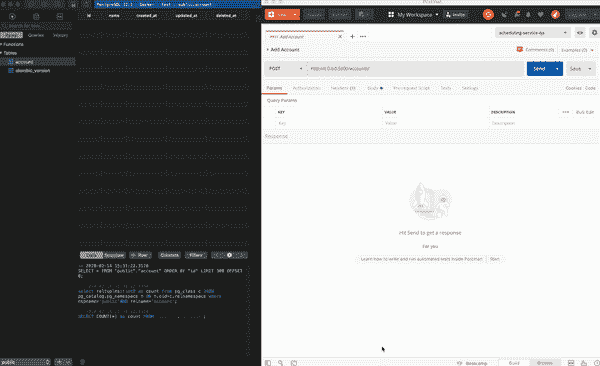

# 用 Postgres 数据库对接 Flask 应用程序

> 原文：<https://levelup.gitconnected.com/dockerizing-a-flask-application-with-a-postgres-database-b5e5bfc24848>

在本教程中，我们将构建一个包含 Postgres 数据库的 Flask 服务器，并对应用程序进行 dockerize。本文分为三个部分:

1.  创建 Hello World！应用
2.  服务容器化
3.  数据库和迁移

希望你喜欢阅读！


烧瓶(贴有标签以便重复使用的图片)

# 你好世界！

每当我在做一个新项目时，我做的第一件事就是尝试创建尽可能少的应用程序。通过创建最小的应用程序，您——在某种程度上——已经准备好了项目结构。对于 flask hello world 应用程序，您可以遵循这里的说明:【https://flask.palletsprojects.com/en/1.1.x/quickstart/】T2。这正是我开始从事这个项目时所做的。

对于想要跟随的人来说，步骤是这样的:

1.创建一个 python 新项目(这将为您创建所有必要的目录，包括虚拟环境)

2.安装 flask 并将其添加到 requirements.txt:

```
pip install Flask
pip freeze > requirements.txt
```

3.创建 app.py 文件并添加以下代码:

```
from flask import Flask
app = Flask(__name__)@app.route('/', methods=['GET'])
def hello_world():
    return {
        'hello': 'world'
    }
```

4.要运行该应用程序，您可以运行以下命令:

```
export FLASK_APP=src/app.py
flask run
```

5.然后你会在 [http://127.0.0.1:5000/](http://127.0.0.1:5000/) 中看到这个字符串

我希望你能坚持到现在！如果是这样，恭喜你！

# 将服务和数据库容器化

我发现这一步非常重要，因为应用程序容器使开发变得更快更容易。您不必处理大量的配置，相反，您只需几行配置代码就可以启动并运行您的应用程序和所有相关服务。

首先，我想简单回顾一下 **docker-compose** 。正如 docker 文档中所说，“compose 是一个定义和运行多容器 Docker 应用程序的工具”([https://docs.docker.com/compose/](https://docs.docker.com/compose/))。如果您有多个运行的服务来组成一个更大系统的不同部分，您可以使用 docker-compose，用一个简单的配置文件来创建和启动所有这些服务。

我们的 docker-compose 将有两个服务:服务器和数据库。代码如下:

docker-compose.yml

第一个服务是主服务本身，它现在是“hello world”服务器，第二个服务是 Postgres 数据库的配置。当您运行“docker-compose up”时，您会看到这两个服务都将被创建，并且它们可以使用 docker-compose 文件中的名称找到彼此并与之通信。正如您在这个示例中看到的，您可以通过使用“db”名称从服务访问数据库。

docker-compose 之后，另一个重要的文件是 **Dockerfile** 。当“docker build”运行时，它会将该文件作为创建必要服务的手册。在我们的例子中，当我们运行 docker-compose up 时，服务部分中的 build 命令(参见上面 docker-compose.yml 的第 5 行)告诉 compose 运行 Dockerfile。关于 Dockerfile 的更多信息，可以参考官方文档:【https://docs.docker.com/engine/reference/builder/

现在我们的 docker 文件看起来像这样:

```
# pull official base image
FROM python:3.8.0-alpine# set work directory
WORKDIR /usr/src/app# set environment variables
ENV *PYTHONDONTWRITEBYTECODE* 1
ENV *PYTHONUNBUFFERED* 1RUN apk update && apk add postgresql-dev gcc python3-dev musl-dev# install dependencies
RUN pip install --upgrade pip
COPY ./requirements.txt /usr/src/app/requirements.txt
RUN export LDFLAGS="-L/usr/local/opt/openssl/lib"
RUN pip install -r requirements.txt# copy project
COPY . /usr/src/app/EXPOSE 5000RUN ls -la app/ENTRYPOINT ["app/docker-entrypoint.sh"]
```

我不会深入这个文件的细节，但最重要的是最后一个命令，它定义了 Docker 映像的入口点。

我认为现在是时候谈谈**入口点**了。“入口点”使您能够将容器作为可执行文件运行。你可以在这里阅读更多关于 Entrypoint 的内容:[https://docs . docker . com/engine/reference/builder/# entry point](https://docs.docker.com/engine/reference/builder/#entrypoint)

到目前为止，我们的架构是这样的:

> docker-compose-> API-> docker file-> docker-entry point . sh
> 
> docker-撰写->数据库

docker-entrypoint.sh 非常简单，看起来像这样:

```
**#!/bin/sh**set -eflask db upgradegunicorn -c gunicorn.config.py wsgi:app
```

这个 **sh** 文件执行的两个非常重要且实际上唯一的操作是运行命令来升级数据库，方法是检查是否有新的迁移，然后使用 **gunicorn** 运行 flask 应用程序。

在下一节中，我们将讨论数据库设置，然后您将更好地理解“flask db upgrade”命令。

如果想了解 gunicorn，可以在这里阅读:[https://flask . pallets projects . com/en/1.1 . x/deploying/wsgi-standalone/](https://flask.palletsprojects.com/en/1.1.x/deploying/wsgi-standalone/)


你友好的邻居数据库:Postgres

# 数据库和迁移

服务器中最重要的东西之一是保存数据的地方，也就是数据库。为此，我们将使用 Postgres，但在此之前，我们必须实现一种方法来处理数据库相关工作的所有配置。跟踪迁移是该配置中最重要的部分之一。为此，我们将使用 Flask-Migrate:

```
pip install Flask-Migrate
pip freeze > requirements.txt
```

完成上述步骤后，要进行初始化，我们只需运行以下命令:

```
flask db init
```

此命令将在应用程序的根目录下创建一个迁移文件夹。我们可以把这个文件夹看作是跟踪数据库版本的一种方式。

要添加新的迁移，我们只需运行以下命令:

```
flask db revision -m "create accounts table"
```

您将会看到，在“迁移/版本”下，有一个针对此迁移的新文件。如你所见，这里有两个功能:升级和降级。顾名思义，其中一个是升级数据库并在该文件中添加已定义的数据库对象，另一个是删除这些对象并返回到数据库的先前状态。以下是迁移文件:

首次迁移

*注意:如果您想将其复制并粘贴到您的项目中，只需勾选升级和降级两个功能。*

这是一个简单的表添加，有 5 列，正如您在定义中看到的。

关于数据库代码的更多细节，你可以查看 GitHub 上的代码:【https://github.com/ytimocin/flask-postgres-server

最后一部分是添加将在数据库中创建帐户对象的端点:

```
@app.route('/accounts/', methods=['POST'])
def create_user():
    *"""Create an account."""* data = request.get_json()
    name = data['name']
    if name:
        new_account = Account(name=name,
                              created_at=dt.now())
        db.session.add(new_account)  # Adds new User record to database
        db.session.commit()  # Commits all changes
        return make_response(f"{new_account} successfully created!")
    else:
        return make_response(f"Name can't be null!")
```

这将获取请求，读取参数，然后在 DB 中创建一个 Account 对象。下面是调用端点并检查数据库中新数据的(低质量)gif:



通过调用端点创建帐户对象

*特别感谢 TablePlus(一个了不起的 DB 编辑器)和 Postman。*

我将增加这个项目的其他功能，但现在，这是这篇文章的结尾。如上所述，这个项目的链接是[https://github.com/ytimocin/flask-postgres-server](https://github.com/ytimocin/flask-postgres-server)。我很感激你的任何反馈，所以请随时在这里发表你的反馈，或者发邮件给我，地址是 ytimocin@gmail.com。

感谢您的阅读！