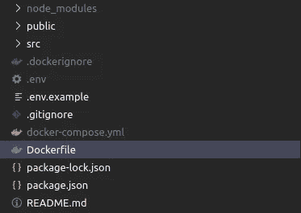
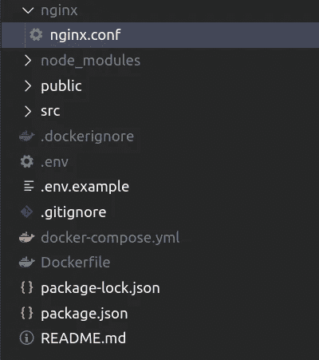

# 使用 NGINX 和 React-Router 对接 React 应用程序

> 原文：<https://levelup.gitconnected.com/dockerizing-a-react-application-using-nginx-and-react-router-43154cc8e58c>

Docker 是一个强大的工具，允许开发人员在一致的环境中工作，并使部署过程更加顺畅。随着 React 用户群的增长，越来越多的应用程序使用 Docker 部署，最常见的是使用 NGINX 作为负载平衡器。如果您的应用程序使用非常流行的 react: `react-router`或`react-router-dom`路由包，这种配置可能会导致问题。当部署一个应用程序时，你会发现从根目录进入网站很好，而从任何子路径进入都会导致错误。这是因为 NGINX 不能告诉您想要将哪些文件提供给该路由。

为了解决这个问题，我们需要在应用程序的`Dockerfile`中使用一个特殊的配置。这将告诉 NGINX 在哪里寻找服务于任何给定路由的文件。让我们深入了解一下配置。

# Dockerfile 文件

docker 文件是 docker 在为您的应用程序构建容器时用作指令的文件。这个文件应该创建在应用程序的根目录下，没有文件扩展名。



这个配置要利用 Docker 的[多级建筑](https://docs.docker.com/develop/develop-images/multistage-build/)。在第一阶段，我们将构建 React 应用程序，第二步我们将配置 NGINX 并给它适当的配置。

我们构建的第一阶段将如下所示:

```
# Stage 0, "build-stage", based on Node.js to build the frontend
FROM node:alpine as build
WORKDIR /app
COPY package*.json /app/
RUN npm install
COPY ./app/
RUN npm run build
```

这个阶段将 node 的最新稳定版本作为初始映像，我们将使用它来构建我们的应用程序。然后，它继续设置一个工作目录，并将我们的文件复制到环境中，然后安装依赖项并创建一个编译后的构建文件夹。我们将在下一个构建阶段配置 NGINX 时使用它。

# NGINX 配置

现在我们已经有了 React 应用程序的初始构建，我们可以创建一个配置来告诉 NGINX 在哪里查找文件。我们需要做的第一件事是在应用程序的根目录下创建一个新的`nginx`目录来保存我们的 NGINX 配置(以及以后可能需要的任何其他 NGINX 相关文件)。在这个文件夹中，我们将创建一个新文件`nginx.conf`。



现在，这是重要的一步，我们告诉 NGINX，对于应用程序的任何给定子路径，从哪里提取文件。将以下代码添加到配置文件中:

```
server {
  listen 80;
  location / {
    root   /usr/share/nginx/html;
    index  index.html index.htm;
    try_files $uri $uri/ /index.html; }
  error_page 500 502 503 504 /50x.html;
  location = /50x.html {
    root  /usr/share/nginx/html;
  }
}
```

这个配置的重要一行是`try_files ...`,它告诉 NGINX 查看各种目录，找到要服务的正确文件。

# 回到文档中

现在我们有了 NGINX 的配置，我们可以返回 Docker 文件，告诉 Docker 我们想要如何构建 NGINX。我们将在第二阶段执行 NGINX 构建，并引用第一阶段生成的 React 应用程序的构建文件夹。NGINX 构建阶段应该如下所示:

```
# Stage 1, based on NGINX to provide a configuration to be used with react-routerFROM nginx:alpine
COPY --from=build /app/build /usr/share/nginx.html
RUN rm /etc/nginx/conf.d/default.conf
COPY nginx/nginx.conf /etc/nginx/conf.d
EXPOSE 80
CMD ["nginx", "-g", "daemon off;"]
```

这为我们提供了一个新的 NGINX 映像，然后我们删除默认配置，用我们刚刚创建的配置替换它。

# 建造它

现在，我们可以尝试构建我们的应用程序，并在本地进行测试。要建立 Docker 形象，请使用:

```
docker build --tag example-name .
```

您将看到 Docker 运行您的 Docker 文件中定义的两个阶段。完成后，您可以使用以下命令运行容器:

```
docker run --publish 80:80 example-name
```

在这里，您应该能够通过导航到 [http://localhost](http://localhost) 来查看 React 应用程序。

您的 React 应用程序现在配置为在一个稳定的 Docker 容器中运行，带有 NGINX 和 react-router！