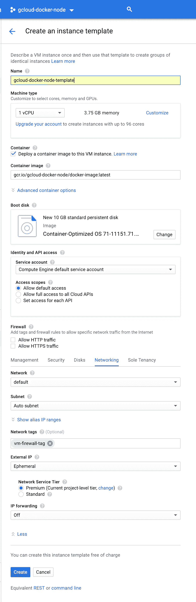

# Google Cloud 上的 Dockerizing 和 autoscaling Node.js

> 原文：<https://levelup.gitconnected.com/dockerizing-and-autoscaling-node-js-on-google-cloud-ef8db3b99486>


## 目录

*   [简介](https://medium.com/p/ef8db3b99486#bc78)
*   [设置 Node.js 服务器](https://medium.com/p/ef8db3b99486#42e5)
*   [建立谷歌云](https://medium.com/p/ef8db3b99486#9cfa)
*   [Dockerize Node.js](https://medium.com/p/ef8db3b99486#4525)
*   [将您的 Docker 映像部署到 Google 容器注册表](https://medium.com/p/ef8db3b99486#18c8)
*   [配置防火墙](https://medium.com/p/ef8db3b99486#6aa8)
*   [定义实例模板](https://medium.com/p/ef8db3b99486#6387)
*   [创建托管实例组](https://medium.com/p/ef8db3b99486#aa61)
*   [添加负载平衡器](https://medium.com/p/ef8db3b99486#ca35)
*   [限制交通](https://medium.com/p/ef8db3b99486#72f3)
*   [部署新版本](https://medium.com/p/ef8db3b99486#c48f)

# 介绍

这篇文章将介绍如何将 Node.js 服务器停靠在 Google Cloud(特别是 Google Computer Engine)中，并配置您的 VM 实例以根据流量自动缩放。第 2 部分将介绍如何将您的服务器连接到一个安全的 MongoDB 部署。

我们将建立一个 Node.js 服务器，创建一个 Docker 文件，并将服务器的 Docker 映像部署到 Google 容器注册中心。之后，我们将创建一个实例模板，它定义了我们的虚拟机的规范。然后，我们将设置一个托管实例组，它将根据我们的实例模板启动和扩展一组虚拟机。我们将配置托管实例组，以便在流量增加超过某个阈值时创建新实例。最后，我们将设置一个负载平衡器来重定向和平衡我们的虚拟机实例之间的传入流量。

请随意使用您现有的 Node.js 应用程序，尽管用一个简单的应用程序来完成本教程可能更容易，以避免任何不必要的错误。出于本教程的目的，我将使用我编写的节点样板脚本-[https://github.com/francescov1/node-boilerplate-script](https://github.com/francescov1/node-boilerplate-script)。

*注意:如果你正在使用你自己的 Node.js 代码，确保它被设置为在* ***端口 3000*** *上运行，因为我将为所有 Docker 和 Google Cloud 配置使用那个端口。*

# 设置 Node.js 服务器

如果您正在使用自己的 Node.js 应用程序，请跳过这一步。我们将克隆节点样板脚本 repo，创建一个新文件夹并运行脚本。

```
git clone [https://github.com/francescov1/node-boilerplate-script.git](https://github.com/francescov1/node-boilerplate-script.git)mkdir gcloud-docker-node
cp node-boilerplate-script/node-init.sh gcloud-docker-node/
cd gcloud-docker-node/
bash node-init.sh
```

几分钟后，它应该是完整的。运行`npm start`并导航到[http://localhost:3000/API/examples/hello](http://localhost:3000/api/examples/hello)，在这里你应该会看到“hello world”。

# 设置 Google 云

接下来，我们将设置谷歌计算引擎。如果您没有谷歌云帐户，请访问[https://cloud.google.com/free](https://cloud.google.com/free/)了解更多信息，并获取创建帐户的说明。注册后，您将获得 300 美元的免费积分，因此不必担心需要为您在本教程中创建的资源付费。

在 Google Cloud 控制台中创建新项目。如果你以前从未这样做过，请参见[https://cloud . Google . com/resource-manager/docs/creating-managing-projects](https://cloud.google.com/resource-manager/docs/creating-managing-projects)。我们将把我们的项目称为 *gcloud-docker-node* 。

接下来前往[https://Cloud . Google . com/SDK/docs/# install _ the _ latest _ Cloud _ tools _ version _ Cloud SDK _ current _ version](https://cloud.google.com/sdk/docs/#install_the_latest_cloud_tools_version_cloudsdk_current_version)下载 Google Cloud CLI(如果您尚未下载),我们将使用它将新的代码更改部署到我们的虚拟机。

一旦安装完毕，运行`gcloud init`。这将引导您完成对 CLI 的身份验证和选择项目。

# Dockerize Node.js

我们现在可以在部署 Node.js 服务器之前为它设置 Docker。Docker 允许我们以一种易于移植和可伸缩的格式来封装我们的应用程序。我不会详细介绍 Docker 或它的好处，所以如果你有兴趣，可以去看看 https://dzone.com/articles/top-10-benefits-of-using-docker。

我将使用 Atom，但也可以随意使用任何其他文本编辑器。创建 Dockerfile 文件并。在你的文本编辑器中打开工作目录。

```
touch Dockerfile .dockerignore
```

将以下代码添加到您的`.dockerignore`中:

```
node_modules
npm-debug.log
```

上面定义了构建 Docker 映像时要忽略的文件和文件夹。将以下代码添加到 docker 文件中:

```
# version of node to use
FROM node:8# define working directory for docker
WORKDIR /usr/src/app# copy all our source code into the working directory
COPY . .# install npm dependencies and pm2
RUN npm install --only=production && npm install -g pm2# expose port 3000 for our server to run on
EXPOSE 3000# command to start our server
CMD [ "pm2-runtime", "start", "index.js", "-i", "max" ]
```

Pm2 是一个进程管理器，我们将使用它来启动我们的服务器。它捆绑了大量很酷的功能，如集群和负载平衡。点击这里了解更多信息[https://pm2.io/runtime](https://pm2.io/runtime)。`CMD [ “pm2-runtime", “start", “index.js", “-i", “max ]`行启动尽可能多的 Node.js 服务器实例。Node.js 每个 CPU 内核只能运行一个进程，所以在我们的例子中，每个 VM 实例只能运行一个 Node.js 进程，因为我们定义的实例模板使用一个单核 CPU。如果您要升级虚拟机实例以运行更多内核，这将确保它们都被使用。

我们还需要从*中移除线`**/.env`。gitignore* 文件，因为 Google Cloud Container Registry 将在*之上使用这个文件。确定要忽略哪些文件(这对于第 2 部分尤其重要，因为第 2 部分将把 MongoDB 连接字符串放在。env)。确保如果您最终将这些代码放入 git 存储库，您使用类似于 [git-crypt](https://github.com/AGWA/git-crypt) 的工具来确保任何秘密都不会直接提交到 git 中。*

# 将您的 Docker 映像部署到 Google 容器注册中心

现在找到我们之前创建的 Google Cloud 项目的项目 ID。为此，只需点击谷歌云控制台左上角的项目名称。项目名称的右边是 ID，格式为 gcloud-docker-node-XXXXXX。*注意:您的项目 ID 可能包含也可能不包含项目名称后的随机数字。*

要构建 Docker 映像并将其部署到 Google 容器注册中心，请运行:

```
gcloud builds submit --tag gcr.io/<project-id>/docker-image .
```

用您自己的项目 id 替换<project-id>。别忘了`.`的最后命令！如果它问你是否愿意启用云 API，请说是。</project-id>

该流程将经历我们在 docker 文件中定义的每一步。如果一切顺利，您应该以 ID、创建时间、持续时间、来源、图像和*成功*状态的信息结束。

前往谷歌容器注册中心-[https://console.cloud.google.com/gcr](https://console.cloud.google.com/gcr)查看您新部署的映像。

# 配置防火墙

我们现在将添加一个简单的防火墙规则，以允许所有流量进入我们的虚拟机。一旦我们设置了负载平衡器，我们将关闭此流量，以确保它只来自负载平衡器。前往[https://console.cloud.google.com/networking/firewalls](https://console.cloud.google.com/networking/firewalls)并点击*创建防火墙规则*。

命名为 **vm-firewall-rule** 。在*目标标签*下，键入 **vm-firewall-tag** 并点击 tab。我们将在设置虚拟机时指定相同的标记，以便将它们链接到该规则。在*源 IP 范围*下，输入 **0.0.0.0/0** 并点击 tab，从而允许所有传入流量。在*协议和端口*下，勾选 *tcp* 并在旁边的字段中输入 **3000** 。点击*创建*。

# 定义实例模板



现在，我们将设置实例模板。前往计算引擎—[https://console.cloud.google.com/compute](https://console.cloud.google.com/compute)并点击左侧菜单栏中的*实例模板*，然后点击*创建实例模板*。

我们将我们的模板命名为**g cloud-docker-node-template***。*选中*将容器映像部署到该虚拟机实例*选项，并在表单中输入[**【gcr.io/】<**](https://console.cloud.google.com/gcr/images/gcloud-docker-node/GLOBAL?project=gcloud-docker-node&folder&organizationId=327994105725)**项目 id>/docker-image:latest**。这是我们刚刚上传的 Docker 图像的路径。

单击[管理、安全性、磁盘、网络、单独租赁](https://console.cloud.google.com/)下拉菜单，导航至网络选项卡。在网络标签表单中，输入 **vm-firewall-tag** 并点击 tab。这就建立了我前面提到的与防火墙规则的联系。

保持所有其他设置不变，点击*创建*。

# 创建托管实例组

导航到 https://console.cloud.google.com/compute/instanceGroups 的[并点击*创建实例组*。](https://console.cloud.google.com/compute/instanceGroups)

命名为 **gcloud-docker-node-group。**在*实例模板*下，选择**g cloud-node-docker-template**。在*目标 CPU 使用率*下输入 75，在*最大实例数*下输入 5。此配置将自动添加或删除虚拟机实例，以尝试将每个实例的 CPU 使用率保持在 75%。将其他一切保留为默认值，然后点击 *Create。*

如果您转到*虚拟机实例*选项卡，您现在应该看到至少一个虚拟机实例正在加速运行。一旦它完成引导，我们将 SSH 到该实例，以确保它与我们的 Docker 映像一起正常运行。


一旦您看到实例名称旁边有一个绿色的复选标记，单击 *SSH* 按钮旁边的箭头，然后单击*查看 gcloud 命令*。复制显示的命令，并将其输入到您的终端中。

如果 SSH 成功，您应该会看到以下消息；

```
########################[ Welcome ]########################
#  You have logged in to the guest OS.                    #
#  To access your containers use 'docker attach' command  #
###########################################################
```

输入`docker ps`查看当前活动的容器。将有两个容器，第一个是我们的 Node.js 服务器，第二个将有一个形式为*gcr.io/stackdriver-agents/stackdriver-logging-agent:XXXXX.*的图像名称

要查看我们容器的日志，运行`docker logs <container-id>`，其中< container-id >是我们服务器容器的 id(指定前几个字符即可)。

日志的最后一行应该是:

```
server listening on port 3000...
```

如果您使用了我的节点样板脚本，您可以通过从计算引擎页面(见上图)获取虚拟机的*外部 IP* 值并在浏览器中导航到[http://<External-IP>:3000/API/examples/hello](http://35.227.58.115:3000/api/examples/hello)来查看它的运行情况，您应该会看到“hello world”。

恭喜你。现在，您已经将 Node.js 服务器对接并运行在 Google VM 上了！

# 添加负载平衡器

现在，我们需要添加一个负载平衡器，将传入流量重定向到最不忙的虚拟机。导航到[https://console.cloud.google.com/net-services/loadbalancing](https://console.cloud.google.com/net-services/loadbalancing/)，点击*创建负载平衡器*并选择 *HTTP(S)负载平衡*。对于我们的负载平衡器，我们需要配置其前端和后端，前者将接收所有传入流量，后者将把传入流量重定向到我们的虚拟机。

输入 **gcloud-docker-node-lb** 作为名称，点击*后端配置。S* 选择*创建或选择后端服务&后端桶*、*后端服务*，最后*创建后端服务*。

将其命名为 **lb-backend。**在*新后端*下，打开*实例组*下拉菜单，选择您的托管实例组。在*端口号*下输入 **3000** ，点击*完成*(不是*创建*)。点击*健康检查*下拉菜单，然后点击*创建健康检查*。将其命名为 **lb-health-check，**将协议设置为 **HTTP** ，将端口设置为 **3000** 。点击*保存并继续*，然后点击*创建。*

现在我们剩下要做的就是设置负载平衡器的前端。我们可以使用 Google 的托管 SSL 证书在面向用户的前端非常容易地设置 HTTPS，但这需要我们获得一个域，因此出于本教程的目的，我们将使用 HTTP。点击*前端配置*，命名为**l b-前端**。点击 *IP 地址*下拉菜单，选择*创建 IP 地址*。将其命名为 **lb-ip** ，点击*储备*。最后，点击*完成*。

点击*查看并最终确定*，确保所有值正确，然后点击*创建*。

就是这样！在*实例组*部分下(仍在负载平衡器页面上)，几分钟后，*健康*下应显示 **1/1** ，表示健康检查通过。


一旦我们的健康检查通过，在负载平衡器页面的*前端*部分中获取 *IP:PORT* 下的值，并导航到 http://<IP:PORT>/API/examples/hello，在这里您将再次看到“hello world”消息，尽管这次您已经通过负载平衡器访问了您的服务器！

# 限制交通

既然我们的负载均衡器已经连接好了，我们可以关闭所有传入虚拟机的流量，除了负载均衡器和运行状况检查之外。导航回到防火墙规则页面，单击我们之前制定的规则 *vm-firewall-rule* 。点击*编辑*，在*源 IP 范围*中，将 **0.0.0.0/0** 替换为 **130.211.0.0/22** 和 **35.191.0.0/16** (输入每个 IP 后点击 tab)。点击*保存*。现在，如果您尝试通过虚拟机的外部 IP 地址访问服务器，浏览器将会挂起。所有流量都需要通过我们的负载均衡器进入。

# 部署新版本

那么，如果您需要对代码进行更改，该怎么办呢？尽管我们还没有用 git 设置构建服务器或自动化，但是我们可以编写一个简单的脚本来用新的部署更新我们的 VM 实例。这包括两个步骤，第一步是构建和部署我们的 Docker 映像，如前所述。之后，我们需要在托管实例组上执行滚动重启，以重启虚拟机。在启动时，他们将在容器注册表中提取最新的 Docker 映像，这将用我们最新更新的代码构建。*注意:滚动重启功能仍处于测试阶段，但我从未遇到过这方面的问题。*

要执行滚动重启，我们首先需要安装 gcloud beta CLI 工具。运行`gcloud components install beta`并按照提示进行操作。

完成后，我们可以使用以下命令开始滚动重启:

```
gcloud beta compute instance-groups managed rolling-action restart gcloud-docker-node-group --zone us-east1-b
```

*注意:如果你使用了不同的时区，那么你需要在上面进行调整。*

该命令将启动滚动重启过程。要检查其状态，请使用:

```
gcloud beta compute instance-groups managed list-instances gcloud-docker-node-group --zone us-east1-b
```

我们不需要在每次更新代码时都记住并打出这两个步骤，我们将编写一个简单的`deploy.sh`脚本来自动完成。

使用`touch deploy.sh` 创建文件，并将两个命令复制到其中:

```
#!/bin/bash# build docker image
gcloud builds submit --tag gcr.io/<project-id>/docker-image . --project <project-id># restart instances (this loads new images)
gcloud beta compute instance-groups managed rolling-action restart gcloud-docker-node-group --zone us-east1-b --project <project-id>
```

确保用您自己的项目 ID 替换<project-id>,如果您没有使用默认的，请更改区域。虽然我们的项目是由我们的 CLI 自动设置的，但我添加了`--project`标志，以防您需要一次为多个项目配置部署。</project-id>

运行`chmod +x deploy.sh`启用权限。现在，如果您对代码做了任何更改，只需运行:

```
./deploy.sh
```

部署新代码。

就是这样！🤙我希望本教程对你有所帮助。我很想得到你的反馈，所以如果你喜欢或遇到任何问题，请在下面留下评论。请务必查看[第 2 部分](https://medium.com/@francescovirga_50717/part-2-deploy-and-secure-mongodb-on-atlas-4820d539a1dc)！如果你有兴趣用 Kubernetes 做类似的事情，可以在这里查看我的帖子。

[](https://gitconnected.com/learn/node-js) [## 学习 Node.js -最佳 Node.js 教程(2019) | gitconnected

### 前 33 个 Node.js 教程-免费学习 Node.js。课程由开发人员提交和投票，使您能够…

gitconnected.com](https://gitconnected.com/learn/node-js)