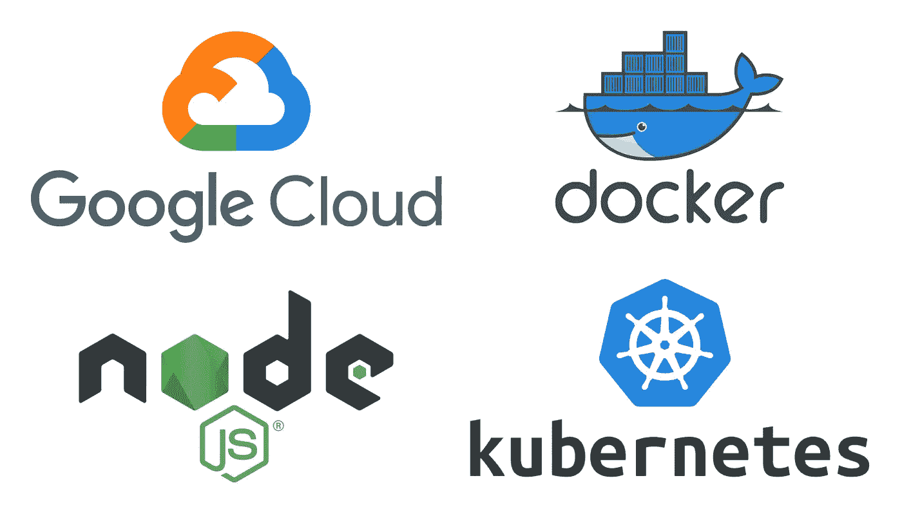
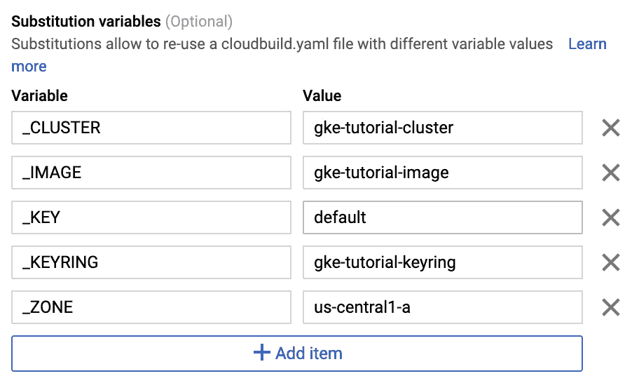

# 通过持续集成在 Google Kubernetes 引擎上部署和扩展 Node.js

> 原文：<https://levelup.gitconnected.com/dockerizing-deploying-and-scaling-node-js-on-google-kubernetes-engine-with-continuous-integration-f895a98bf6e3>



## 目录

*   [简介](https://medium.com/p/f895a98bf6e3#b767)
*   [设置 Node.js 服务器](https://medium.com/p/f895a98bf6e3#9331)
*   [建立谷歌云](https://medium.com/p/f895a98bf6e3#46f7)
*   [Dockerize Node.js](https://medium.com/p/f895a98bf6e3#4591)
*   [将映像部署到容器注册表](https://medium.com/p/f895a98bf6e3#3065)
*   [创建 Kubernetes 集群](https://medium.com/p/f895a98bf6e3#f4b0)
*   [保留静态 IP 地址](https://medium.com/p/f895a98bf6e3#d2ed)
*   [创建 Kubernetes 服务](https://medium.com/p/f895a98bf6e3#290b)
*   [Kubernetes 自动缩放](https://medium.com/p/f895a98bf6e3#8407)
*   [设置谷歌密钥管理服务](https://medium.com/p/f895a98bf6e3#9eb6)
*   [设置云构建](https://medium.com/p/f895a98bf6e3#29be)

# 介绍

这篇文章将介绍如何使用 Google Kubernetes 引擎(GKE)将 Node.js 服务器部署在 Kubernetes 集群上。我们将设置一个 Node.js 服务器，创建一个 docker 文件来定义容器配置，创建 Kubernetes 服务文件来定义我们所需的 Kubernetes 资源，并设置 Google Cloud Build 来实现自动持续集成(CI)。我上传了我自己的代码到 GitHub [这里](https://github.com/francescov1/gke-tutorial)以防你在这个过程中遇到任何问题，所以一定要把它放在手边！

如果你已经完成了我关于使用谷歌计算引擎 dockerizing 和部署 Node.js 的教程，或者你已经有了 dockerized Node.js 应用，你可以浏览本教程的前几个步骤，因为它们大部分是重复的。

如果您有自己想要使用的 Node.js 应用程序，这也很好，尽管用一个简单的应用程序来完成本教程可能更容易，以避免任何不必要的错误。出于本教程的目的，我将使用我编写的节点样板脚本—[https://github.com/francescov1/node-boilerplate-script](https://github.com/francescov1/node-boilerplate-script)。

*注意:如果你正在使用你自己的 Node.js 代码，确保它被设置为在* ***端口 3000*** *上运行，因为我将为所有 Docker 和 Google Cloud 配置使用该端口。*

# 设置 Node.js 服务器

如果您正在使用自己的 Node.js 应用程序，请跳过这一步。我们将克隆节点样板脚本 repo，创建一个新文件夹并运行脚本。

```
git clone [https://github.com/francescov1/node-boilerplate-script.git](https://github.com/francescov1/node-boilerplate-script.git)mkdir gke-tutorial
cp node-boilerplate-script/node-init.sh gke-tutorial/
cd gke-tutorial/
bash node-init.sh
```

几分钟后，它应该是完整的。运行`npm start`并导航到[http://localhost:3000/API/examples/hello](http://localhost:3000/api/examples/hello)，在这里你应该会看到“hello world”。

# 设置 Google 云

接下来，我们将设置谷歌云。如果你没有谷歌云账户，请访问 https://cloud.google.com/free[网站](https://cloud.google.com/free/)了解更多信息，并获得创建账户的指导。注册后，您将获得 300 美元的免费积分，因此不必担心需要为您在本教程中创建的资源付费。

在 Google Cloud 控制台中创建新项目。如果你以前从未这样做过，请参见[https://cloud . Google . com/resource-manager/docs/creating-managing-projects](https://cloud.google.com/resource-manager/docs/creating-managing-projects)。我们将把我们的项目叫做 *gke-tutorial* 。

接下来前往[https://Cloud . Google . com/SDK/docs/# install _ the _ latest _ Cloud _ tools _ version _ Cloud SDK _ current _ version](https://cloud.google.com/sdk/docs/#install_the_latest_cloud_tools_version_cloudsdk_current_version)下载 Google Cloud CLI(如果您尚未下载)，我们将使用它来部署 Kubernetes 资源。

一旦安装完毕，运行`gcloud init`。这将引导您完成对 CLI 的身份验证和选择项目。

# Dockerize Node.js

我们现在可以在部署 Node.js 服务器之前为它设置 Docker。Docker 允许我们以一种易于移植和可伸缩的格式来封装我们的应用程序。我不会详细介绍 Docker 或它的好处，所以如果你有兴趣，可以去看看 https://dzone.com/articles/top-10-benefits-of-using-docker。

我将使用 Atom，但也可以随意使用任何其他文本编辑器。创建 Dockerfile 文件并。在你的文本编辑器中打开工作目录。

```
touch Dockerfile .dockerignore
```

将以下代码添加到您的*中。dockerignore* :

```
node_modules
npm-debug.log
```

上面定义了构建 Docker 映像时要忽略的文件和文件夹。将以下代码添加到您的*docker 文件*中:

```
# version of node to use
FROM node:8# define working directory for docker
WORKDIR /usr/src/app# copy all our source code into the working directory
COPY . .# install npm dependencies and pm2
RUN npm install --only=production && npm install -g pm2# expose port 3000 for our server to run on
EXPOSE 3000# command to start our server
CMD [ "pm2-runtime", "start", "index.js" ]
```

Pm2 是一个进程管理器，我们将使用它来启动我们的服务器。它捆绑了大量很酷的功能，如集群和负载平衡。点击这里了解更多信息[https://pm2.io/runtime](https://pm2.io/runtime)。`CMD [ “pm2-runtime", “start", “index.js" ]`行启动我们的 Node.js 服务器。

# 将映像部署到容器注册中心

我们现在可以将 Docker 映像部署到 Google 容器注册中心，在那里它可以被 Google Cloud 上的其他服务访问。在根目录下运行以下命令:

```
gcloud builds submit --tag gcr.io/<project-id>/gke-tutorial-image .
```

如果提示您启用 cloudbuild API，请输入 yes。

# 创建 Kubernetes 集群

我们现在将在 Google Cloud 中创建一个 Kubernetes 集群。乍看之下，Kubernetes 可能令人望而生畏，因此这里有几篇文章可供查阅，以获得可靠的总体概述: [Kubernetes 概述](https://kubernetes.io/docs/concepts/overview/what-is-kubernetes)、[Google Cloud 中的 Kubernetes](https://cloud.google.com/kubernetes-engine/docs/concepts/kubernetes-engine-overview)

在终端中输入以下命令:

```
gcloud container clusters create gke-tutorial-cluster --disk-size 10 --num-nodes 1 --enable-autoscaling --min-nodes 1 --max-nodes 5 --zone us-central1-a
```

这将创建一个名为 *gke-tutorial-cluster* 的 Kubernetes 集群，磁盘大小为 10GB，只有一个节点。它还启用自动缩放，并设置最小和最大节点数。自动缩放功能将在本文后面详细讨论。

群集将需要几分钟的时间来启动。完成后，前往[https://console.cloud.google.com/kubernetes/list](https://console.cloud.google.com/kubernetes/list)查看您刚刚部署的集群。

# 保留静态 IP 地址

我们现在将保留一个静态 IP 地址，用于访问我们的应用程序。输入以下命令:

```
gcloud compute addresses create gke-tutorial-ip
```

当提示输入区域时，输入 **1** (表示全局)并按回车键。

# 创建 Kubernetes 服务

接下来，我们需要定义一些 Kubernetes 服务的规范。我们要做的第一件事是安装 Kubernetes CLI (kubectl)。运行:

```
gcloud components install kubectl
```

我们将创建 4 个文件；`ingress.yaml`将通过创建 HTTP 负载平衡器为外部流量创建一个进入我们应用程序的入口，`deployment.yaml`将为我们的 pod 和 Docker 映像提供规范，`service.yaml`将创建一个节点端口，该端口将从 HTTP 负载平衡器接收流量并将其发送到我们的 Node.js 服务器，`podscaler.yaml`将定义水平 pod 扩展配置(稍后将再次详细介绍自动扩展)。

创建以下文件夹和文件:

```
mkdir k8s
cd k8s
touch deployment.yaml ingress.yaml service.yaml podscaler.yaml
```

现在打开`deployment.yaml`并添加以下代码(确保用您自己的代码替换图像定义中的<项目 id >:

```
apiVersion: extensions/v1beta1
kind: Deployment
metadata:
  name: gke-tutorial-deployment
  namespace: default
  labels:
    app: gke-tutorial-deployment
spec:
  replicas: 1 # number of pods
  template:
    metadata:
      labels:
        app: gke-tutorial-deployment
    spec:
      containers:
        - name: gke-tutorial-image
          image: gcr.io/<project-id>/gke-tutorial-image
          imagePullPolicy: Always
          ports:
            - containerPort: 3000
              protocol: TCP
```

对于`service.yaml`，输入:

```
apiVersion: v1
kind: Service
metadata:
  name: gke-tutorial-deployment
spec:
  selector:
    app: gke-tutorial-deployment
  type: NodePort
  ports:
    - protocol: TCP
      port: 3000
      targetPort: 3000
```

这为我们的 Docker 容器创建了一个入口。对于`ingress.yaml`，输入:

```
apiVersion: extensions/v1beta1
kind: Ingress
metadata:
  name: gke-tutorial-ingress
  annotations:
    kubernetes.io/ingress.global-static-ip-name: "gke-tutorial-ip"
spec:
  backend:
    serviceName: gke-tutorial-deployment
    servicePort: 3000
```

这将创建 HTTP 负载平衡器，并将其指向节点端口服务。最后，为`podscaler.yaml`输入:

```
apiVersion: autoscaling/v2beta1
kind: HorizontalPodAutoscaler
metadata:
  name: gke-tutorial-hpa
  namespace: default
  labels:
    app: gke-tutorial-deployment
spec:
  scaleTargetRef:
    kind: Deployment
    name: gke-tutorial-deployment
    apiVersion: apps/v1beta1
  minReplicas: 1
  maxReplicas: 5
  metrics:
    - type: Resource
      resource:
        name: cpu
        targetAverageUtilization: 80
```

现在，我们可以使用 Kubernetes CLI 将这些服务部署到我们的 Kubernetes 集群中。在此之前，我们需要用部署在 Google Cloud 中的集群配置 kubectl。运行:

```
gcloud container clusters get-credentials gke-tutorial-cluster --zone us-central1-a
```

现在运行以下命令来部署服务:

```
kubectl apply -f k8s/
```

所有的服务都将部署！如果您在谷歌云控制台(【https://console.cloud.google.com/kubernetes】T4)中导航到 Kubernetes 引擎，您可以通过单击左侧栏中的*服务*来查看它，在这里您应该会看到正在创建一个节点端口服务和一个入口服务。在*工作负载*下，您将看到您的部署。

启动并运行一切需要几分钟时间(入口服务通常需要最长时间才能运行)，因此，一旦入口服务的状态从“正在创建入口”变为“正常”，请输入以下命令以获取我们之前创建的外部 IP 地址:

```
gcloud compute addresses list
```

这是附加到入口服务创建的负载平衡器的地址。在浏览器中输入这个地址，您应该会看到 *My Node.js API* 。

恭喜你。我们现在已经在 Kubernetes 中设置了 Node.js 服务器。接下来，我们将使用 Google Cloud Build 实现持续集成(CI)。这将使我们的部署过程自动化，这样每次我们对应用程序进行新的更改时，它们都会自动部署。

# Kubernetes 自动缩放

在我们继续之前，我将简要概述一下我们配置的自动缩放是如何工作的，因为一开始可能会有点混乱。您可能已经注意到，我们定义了两个自动伸缩配置(创建 Kubernetes 集群时的自动伸缩标志和 *podscaler.yaml* 服务)。如果你不理解这些术语，请查看我在 Kubernetes 部分开始时提到的 Kubernetes 概述文章。

我先来解释一下 *podscaler.yaml* 。这就建立了我们所说的*水平机架扩展(HPA)* 。pod 本质上是共享相同硬件的一组紧密耦合的容器。根据可用的资源，每个节点(或机器)可以运行多个 pod。如果当前单元被过度利用，HPA 将调度更多单元，如果单元未被充分利用，HPA 将删除单元，但它不会扩展节点的数量。这些节点只是由 Google Cloud 控制的虚拟机，因此需要通过 Google Cloud 进行配置，而不是通过 Kubernetes(现在您可以看到集群自动缩放器的作用了)。

现在，如果我们实际上没有向我们的集群分配更多的虚拟机，添加更多的 pod 不会对我们有太大帮助。这也是我们使用集群自动缩放器(CA)的原因。这个配置是我们在创建集群时定义的，它根据需要自动扩展集群中的节点数量。

所以这两个服务一起工作如下:当需要更多的资源时，将会调度额外的 pods。一旦计划的 pod 数量需要更多节点，CA 将分配这些额外的节点。pod scaler 还将在节点之间移动 pod，以最大限度地利用资源并限制所需的节点数量。如果不再需要某个节点，CA 会将其从集群中删除。

如果你还是不明白或者想了解更多，可以看看这篇很棒的文章:[https://medium . com/maga lix/kubernetes-auto scaling-101-cluster-auto scaler-horizontal-pod-auto scaler-and-vertical-pod-2a 441d 9 ad 231](https://medium.com/magalix/kubernetes-autoscaling-101-cluster-autoscaler-horizontal-pod-autoscaler-and-vertical-pod-2a441d9ad231)。

# 设置 Google 密钥管理服务

在我们配置云构建之前，我们希望设置谷歌密钥管理服务(KMS)，以便我们可以加密我们存储库中的敏感密钥或值，然后在部署过程中解密它们(查看[https://cloud.google.com/kms](https://cloud.google.com/kms/)了解更多信息)。

进入[https://console . developers . Google . com/APIs/library/cloud kms . Google APIs . com](https://console.developers.google.com/apis/library/cloudkms.googleapis.com)，点击 *Enable* 启用 API。稍等片刻，然后输入以下命令(如果出现错误，请稍等几分钟，然后重试):

```
gcloud kms keyrings create gke-tutorial-keyring --location global
```

这将创建一个名为 *gke-tutorial-keyring* 的密匙环。密匙环本质上是一组密钥，每个密钥都可以用来加密和解密文件。现在我们创建一个名为 *default* 的键:

```
gcloud kms keys create default --location global --keyring gke-tutorial-keyring --purpose encryption
```

最后，我们可以加密我们的`.env`文件(现在这里没有敏感值，但是如果我们想连接到任何 API，我们会在这里存储我们的凭证。

```
gcloud kms encrypt --location global \
  --keyring gke-tutorial-keyring --key default \
  --plaintext-file .env \
  --ciphertext-file .env.enc
```

现在，您的存储库中应该有一个`.env.enc`文件。这个文件可以安全地签入版本控制，因为它是加密的(试着打开它，它看起来完全像是胡言乱语)。

# 设置云构建

为了自动化我们的代码部署，我们需要创建一个 GitHub 存储库。登录你的 GitHub(或者创建一个账户)并创建一个空的资源库(随便叫它什么，我的是 *gke-tutorial* )。复制 HTTPS 回购链接，然后返回命令行并输入以下命令(确保替换<回购 url >):

```
git init
git add .
git commit -m "Initial commit"
git remote add origin <repo-url>
git push -u origin master
```

现在转到谷歌云控制台的云构建部分(【https://console.cloud.google.com/cloud-build】T4，在左侧菜单栏选择*触发器*，点击*创建触发器*。

选择 *GitHub* ，点击同意复选框，点击*继续*。现在应该会提示您登录 GitHub 帐户。完成后，您将看到一个存储库列表。选择我们刚刚创建的存储库，然后单击*继续*。在*分支(regex)* 下，输入*主*，在*构建配置*下，选择*云构建配置文件(yaml 或 json)* 。



我们还将添加一些替代变量，这样，如果我们将来想要更新配置，就不必更改我们的构建文件。在替代变量下，点击*添加项目* 5 次，输入旁边显示的变量。最后，点击*创建触发器*。

最后一步是创建我们的`cloudbuild.yaml`文件，它将告诉 Cloud Build 如何构建和部署我们的应用程序。创建文件:

```
touch cloudbuild.yaml
```

并添加以下代码:

```
steps:
  # decrypt .env
  - name: gcr.io/cloud-builders/gcloud
    id: "Decrypt environment variables"
    args:
      - kms
      - decrypt
      - --ciphertext-file=.env.enc
      - --plaintext-file=.env
      - --location=global
      - --keyring=$_KEYRING
      - --key=$_KEY # pull previous image to speed up docker build
  - name: "gcr.io/cloud-builders/docker"
    id: "Pull"
    entrypoint: "bash"
    args:
      - "-c"
      - |
        docker pull gcr.io/$PROJECT_ID/$_IMAGE:latest || exit 0 # build docker image
  - name: "gcr.io/cloud-builders/docker"
    id: "Build"
    args:
      [
        "build",
        "-t",
        "gcr.io/$PROJECT_ID/$_IMAGE:$SHORT_SHA",
        "--cache-from",
        "gcr.io/$PROJECT_ID/$_IMAGE:latest",
        ".",
      ] # push image to container registry
  - name: "gcr.io/cloud-builders/docker"
    id: "Push"
    args:
      - "push"
      - "gcr.io/$PROJECT_ID/$_IMAGE:$SHORT_SHA" # set image in deployment.yaml
  - name: "gcr.io/cloud-builders/gcloud"
    id: "Set image name"
    entrypoint: /bin/sh
    args:
      - "-c"
      - |
        sed -i "s/image: IMAGE/image: gcr.io\/$PROJECT_ID\/$_IMAGE:$SHORT_SHA/g" k8s/deployment.yaml # get kubernetes credentials
  - name: "gcr.io/cloud-builders/gcloud"
    id: "Authenticate kubernetes"
    args:
      [
        "container",
        "clusters",
        "get-credentials",
        "$_CLUSTER",
        "--zone",
        "$_ZONE",
      ] # deploy changes to kubernetes config files
  - name: "gcr.io/cloud-builders/kubectl"
    id: "Deploy"
    args: ["apply", "-f", "k8s/"] # add latest tag to new image
  - name: "gcr.io/cloud-builders/gcloud"
    id: "Tag"
    args:
      [
        "container",
        "images",
        "add-tag",
        "gcr.io/$PROJECT_ID/$_IMAGE:$SHORT_SHA",
        gcr.io/$PROJECT_ID/$_IMAGE:latest,
      ]
```

上面的文件中有很多内容，所以让我们遍历定义的每个步骤。在每一步中， *name* 参数定义了用于运行命令的 CLI。gcr.io/cloud-builders/…的名字指的是谷歌预装的软件包(见[https://cloud.google.com/cloud-build/docs/cloud-builders](https://cloud.google.com/cloud-build/docs/cloud-builders))。如果您需要在构建期间使用任何其他软件包，您将需要添加一个步骤来安装它们(大多数情况下使用 apt-get install)。另一件需要注意的事情是，Google Cloud 默认提供的任何变量都可以在变量名前面使用 *$* 来访问。我们在构建触发器中定义的任何替代变量也必须在变量名前包含一个下划线。可以在这里了解更多:[https://cloud . Google . com/cloud-build/docs/configuring-builds/substitute-variable-values](https://cloud.google.com/cloud-build/docs/configuring-builds/substitute-variable-values)。

第一步只是使用与我们用来加密我们的`.env`相反的命令来解密它。执行构建的服务帐户将需要额外的权限，所以在解释完 *cloudbuild.yaml* 之后，我们将添加这些权限。接下来，我们从容器注册表中提取最新的 Docker 映像。由于 Docker 映像是按层构建的，因此 Docker 在构建时可以使用以前映像中未更改的层。这可以大大加快我们的构建速度，尤其是在安装依赖项或进行小的更新时。

下一步是构建我们的 Docker 映像并命名它。 *SHORT_SHA* 是我们提交 SHA 的前 7 个字符，它将区分我们的每个构建。之后，我们将 Docker 映像推送到容器注册中心。下一步在我们的 *k8s/deployment.yaml* 文件中搜索字符串“image: IMAGE”，并将其替换为“IMAGE:gcr.io/<项目 id > / <图像> : < short-sha >”。这就是我们将如何告诉我们的 Kubernetes 部署使用我们刚刚推出的新 Docker 映像。这也意味着我们必须修改我们的 *k8s/deployment.yaml* 文件中的那一行来匹配它。

现在我们配置 Kubernetes 凭证，就像我们在本文开始时手动做的那样。这将需要另一个许可，我们将在后面添加。接下来，我们部署我们的 Kubernetes 服务(同样是我们如何手动完成的)，最后我们用标签 *latest* 标记我们刚刚推送的图像，这确保我们可以在下一个构建中正确地提取它。

让我们进行上面的演练中提到的一些更改(给我们的服务帐户 KMS 和 Kubernetes 权限，并填写一个在构建期间要切换的通用映像名称)。

进入控制台(【https://console.cloud.google.com/iam-admin/iam】T2)的 IAM 部分，找到角色为*云构建服务账号*的成员。单击该成员旁边的编辑图标，然后单击*添加另一个角色*。搜索 *kms* 并选择*云 kms 密钥解密器*然后搜索 *kubernetes* 并点击 *Kubernetes 引擎开发者*。

现在转到 *k8s/deployment.yaml* 并替换映像名称，以便 Cloud Build 每次都可以填充它。它现在应该是这样的:

```
apiVersion: extensions/v1beta1
kind: Deployment
metadata:
  name: gke-tutorial-deployment
  namespace: default
  labels:
    app: gke-tutorial-deployment
spec:
  replicas: 1 # number of pods
  template:
    metadata:
      labels:
        app: gke-tutorial-deployment
    spec:
      containers:
        - name: gke-tutorial-image
          # this value is replaced during cloud build
          image: IMAGE
          imagePullPolicy: Always
          ports:
            - containerPort: 3000
              protocol: TCP
```

我们终于可以尝试新的 CI 系统了。我们将对我们的代码做一个小的改动，这样我们就可以在部署后看到变化的反映。进入 *index.js* ，将行`app.all("*", (req, res) => res.status(200).send(“My Node.js API"));`改为`app.all("*", (req, res) => res.status(200).send("My updated Node.js API”));`。

现在导航到云构建历史([https://console.cloud.google.com/cloud-build/builds](https://console.cloud.google.com/cloud-build/builds))。这里是您将看到您的构建的地方。保持此页面打开，然后返回到您的命令行并提交我们的新更改:

```
git add .
git commit -m "Cloud build setup"
git push
```

在云构建历史页面点击*刷新*，点击新构建(旁边应该有一个加载图标)。然后，您可以向下滚动并查看构建的日志。如果您的构建失败了，您可以在这里找到导致失败的错误。构建成功后，等待几秒钟，然后在浏览器中输入外部 IP 地址。您现在应该看到“我的更新的 Node.js API”。

完成了。🙌请随时让我知道下面的任何反馈或问题，我很乐意帮忙。如果你有任何问题，记得查看 GitHub repo。