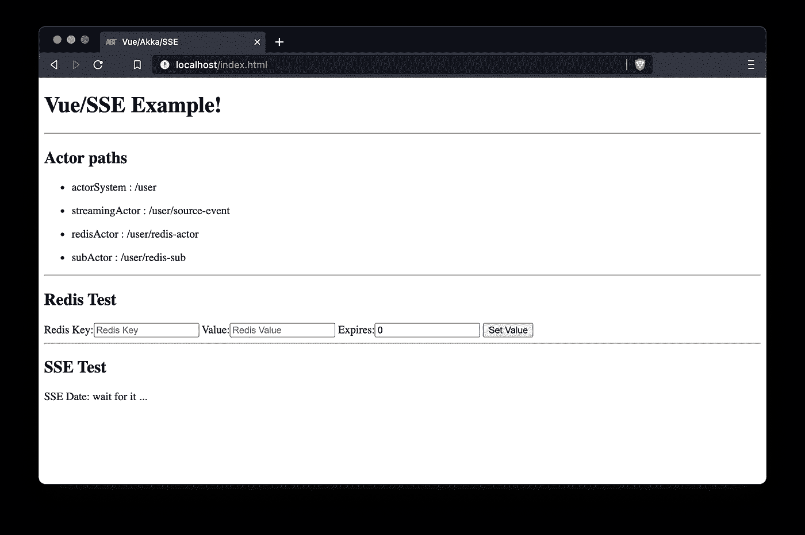

# dockering Scala/Redis/NGINX

> 原文：<https://levelup.gitconnected.com/dockerizing-scala-redis-nginx-c97d067244d9>


图片来自[迈克尔·盖达](https://pixabay.com/users/michaelgaida-652234/?utm_source=link-attribution&utm_medium=referral&utm_campaign=image&utm_content=3859710)来自 [Pixabay](https://pixabay.com/?utm_source=link-attribution&utm_medium=referral&utm_campaign=image&utm_content=3859710)

随着我们的初创公司发展成为一家成熟的公司，我们的客户群也在增长，是时候改变我们目前基于脚本的部署实践了。考虑到这一点，我决定看看 Kubernetes 到底是什么，这促使我考虑使用 docker 作为容器。

由于在研究和评估新技术时，我的手指在键盘上工作得最好，所以我决定创建一个环境，在这个环境中，NGINX、Akka-Http 和 Redis 作为我的数据存储都是容器化的，并且可以相互双向通信。我想添加 akka-http 服务器，将事件发送到客户端浏览器，并让 Redis 将密钥和事件更改发布到我的 RESTful akka-http 服务器——我的想法是，让我们测试一下容器之间的联网情况:-)。

> 我在 Github 上发布了两个项目，欢迎大家来看看和使用: [akka-http server](https://github.com/colinbes/server-akka) 和 [docker-compose setup](https://github.com/colinbes/dockerized-akka-app)

我决定先从最简单的组件开始，创建/设置一个 Redis 容器。

# Redis 容器

网上有很多关于设置和运行 Redis 容器的信息。

在我的例子中，我想为 Redis 添加发布密钥空间和事件通知的能力，这是弄清楚如何配置 Redis' `notify-keyspace-events`,而不必依赖应用程序来执行这个操作所必需的。事实证明，这可以通过 docker-compose 提供的 redis.conf 文件轻松完成。

创建父文件夹`dockerized-akka-app`后，我添加了一个`redis-config`子文件夹，包含以下 *redis.conf* 文件。注意该文件夹可以从 [docker-compose 设置](https://github.com/colinbes/dockerized-akka-app)项目中提取。

redis.conf 文件

然后，在父文件夹`dockerized-akka-http,` 下创建了一个 *docker-compose.yml* 文件。

> 在这篇文章中，我们将在这个文件的基础上最终管理我们的三个容器。
> 
> 在继续之前，您需要创建一个对接网络，这可以使用*对接网络*命令:`*docker network create external-example*`来完成

创建 redis *服务，绑定内部和外部卷以允许容器的外部配置。*

初始只重新编辑 docker-compose 文件。

*   `volumes`指示容器将 redis-config 文件夹下的内容绑定到 docker 文件夹`/usr/local/etc/redis`
*   `ports`将标准 redis 内部端口 6379 暴露给外部端口 12345。严格来说，这不是必须的，但在开发周期中是一种便利。
*   `command`运行 redis 服务器，传递 redis.conf 文件的位置。
*   `networks`允许在 docker-compose 文件中的容器之间建立一个 docker 网络——稍后将详细介绍。

导航到父文件夹，确保 docker 在您的系统上运行后，在命令提示符下执行`docker-compose up -d`来创建 redis 容器。

如果您的机器上本地安装了 redis，您可以使用`redis-cli -p 12345`连接并验证连接。如果没有，那么可以通过执行`docker exec -it <container-name> sh`连接到容器并运行 shell

要确定容器名，您可以查看运行`docker ps`的输出，它将在最后一列显示容器名——在我的例子中，显示的名称是`akka-app_redis_1`。

一旦连接到 docker 容器并且 shell 可用，您就可以从 docker 容器中运行 *redis-cli* 并进行测试——例如:

```
**❯** docker exec -it akka-app_redis_1 sh
/data #redis-cli
127.0.0.1:6379> ping
PONG
```

> 现在，您已经成功地创建并部署了一个带有外部配置的 Redis 容器。

# Akka-Http 后端服务器

继续我们的探索，创建我们的 Akka-Http RESTful 后端服务。在这篇文章中，我不会去创建 scala akka-http 项目，并且对编码标准进行了诗意的许可，但是我想把重点放在这篇文章的细节上。完整的可用源代码可以在 [akka-http server](https://github.com/colinbes/server-akka) 存储库中找到。

> 如果你有兴趣了解更多关于 EventSource 和 SSE 的信息，可以看看 [medium](https://medium.com/@bester.colin/vuejs-akka-http-and-sse-a301ca13eae5) post。

scala 应用程序提供了一个基本的 VUE 页面，显示部署的参与者列表，能够在 Redis 中设置一个键/值对，并显示通过 Redis 的发布功能接收到的通知更改，为了好玩，添加了一个计时器标记，通过 SSE 将日期时间发送到前端。对于一个简单的例子来说有点过分，但我关心的是网络方面，所以想在评估中涵盖我的基础。

为了方便向 redis 事件提供订阅资源，我决定使用订阅者角色，在 Akka 代码中，我可以发送订阅消息和回调函数。更多细节，我建议参考 [akka-http server](https://github.com/colinbes/server-akka) 项目。

Redis 订阅演员。

幸运的是，创建 docker 映像相对简单，我最终使用了 [sbt-native-packager](https://github.com/sbt/sbt-native-packager) 。遵从他们的指示对我来说很有帮助。下面是与创建 docker 映像相关的 build.sbt 行。

> 注意，在第 12 行，dockerCommands 允许向 Dockerfile 添加命令行。当我使用 alpine image 来减少内存占用时，我需要添加不属于标准图像的`bash`。这允许我在容器内部运行 bash shell 进行调试。

docker build . SBT 中的相关行

在运行 sbt docker:publishLocal 时，下载了必要的图像，并且在`target`文件夹下创建了 Dockerfile，并且创建了一个图像并可以使用。

现在开始有趣的部分，设置 docker 的网络，允许 akka 应用程序直接与 redis 通信。

更新`docker-compose.yml`文件的时间到了。

我在父文件夹下添加了一个新文件夹，将其命名为`akka-config`，并创建了用于配置 Akka 应用程序的 *logback.xml* 和 *application.conf* 文件。

Akka-Http 后端的配置文件。

要设置 scala 应用程序来访问容器化的 Redis 应用程序，打开`docker-compose`文件并将新的`akka-server`服务添加到服务中。

> 请注意，服务名称将自动创建网络别名，您将使用这些别名来配置网络。

在这种情况下，在`application.conf`中创建条目来配置 redis Url，注意 Redis 的服务名是用于从 Akka 容器访问 Redis 的别名。

```
redis-server {
  uri = "**redis**://redis:6379"
}
```

组合 redis 和 akka 服务 docker-compose 文件。

一切都很顺利，但我确实努力让我的 EventSource 注册和响应正常工作。在 docker 环境之外，一切都像预期的那样工作，但是当我添加 docker 容器时，我无法再让它处理 CORS 问题等等。

我花了一些时间研究 EventSource 的 Javascript，直到我意识到在注册到端点时可以将选项传递给 EventSource。

在我的 *setupStream* 函数中，我必须包含对象`{withCredentials: true}`。来自 Mozilla 的开发者网站:

> **xmlhttprequest . with credentials**属性是一个布尔值，它指示是否应该使用 cookies、授权头或 TLS 客户端证书等凭据来发出跨站点访问控制请求。withCredentials 设置对同一站点请求没有影响。

```
let evtSource = new EventSource("api/events",
    {withCredentials: true})evtSource.addEventListener('myEvent', event => {
  let data = JSON.parse(event.data)
  if (data.event === 'date') {
      this.now = data.value
      this.value = data.value
  } else if (data.event="userchange") {
      this.username = data.value.name
      this.online = data.value.online
  }
}, false)
```

要重新运行 docker-compose 并启动 Redis 和 Akka 应用程序，请导航回父目录并关闭服务，然后使用 docker-compose down/up 将它们重新启动。

```
❯ docker-compose down
Stopping akka-app_akka-server_1 ... done
Stopping akka-app_redis_1       ... done
Removing akka-app_akka-server_1 ... done
Removing akka-app_redis_1       ... done
Network external-example is external, skippingakka-app on  main took 2s 
❯ docker-compose up -d
Creating akka-app_redis_1       ... done
Creating akka-app_akka-server_1 ... doneakka-app on  main 
❯
```

打开你最喜欢的浏览器(我用 Chrome 和 Brave 做开发工作),导航到`[http://localhost:8082](http://localhost:8082)`查看客户端屏幕。启动时，将显示各种参与者路径，SSE 将显示大约 5 秒钟的等待状态，然后更新，如下所示:



初始视图


推送数据延迟 5 秒后

# NGINX

现在进入我们实验的最后一部分，创建一个 NGINX 服务来重定向/代理调用。

在这个 Akka 示例中，VueJs 前端应用程序由一个简化的*index.html*和 *myScript.js* 文件提供服务。在真实的应用程序中，前端应用程序会更多地通过 vue-cli 或 Vites 模块捆绑器进行打包。NGINX 非常适合服务这些文件，将流量导向网页和 restful 端点(通常通过一些`api`路径)。目前我们停留在一条简单的路线上。

> 如果有兴趣，我会在完整的 Vite-vue 应用程序上发布帖子，通过 NGINX 与后端处理 SSL/TLS 证书等进行通信。

这些年来，设置 NGINX 变得越来越容易。现在最大的问题是弄清楚你实际上想用它做什么——下面也是配置 NGINX 的基本模板。

首先导航到 docker-compose 父文件夹，创建两个目录 *nginx-config* 和 *Nginx-certs* 。现在，我们将证书目录留空。

在 *nginx-config* 中，我们将创建我们的 nginx 配置文件。作为这个文件的引用，从 github 中复制 *mime.types* 文件并放入文件夹。然后编辑 *nginx.conf* ，如下所示:

nginx.conf 文件

现在更新 docker-compose 文件以添加 NGINX 服务，注意 NGINX 是列表中的最后一个服务，顺序很重要。如果 NGINX 服务是在 akka-server 之前定义的，那么 docker-compose 会抱怨网络 *akka-server* 无法解析。

完成 docker-compose 文件。

重新启动 docker 容器:

```
❯ docker-compose down
Stopping akka-app_akka-server_1 ... done
Stopping akka-app_redis_1       ... done
Removing akka-app_akka-server_1 ... done
Removing akka-app_redis_1       ... done
Network external-example is external, skippingakka-app on  main took 2s 
❯ docker-compose up -d
Creating reverse                ... done
Creating akka-app_redis_1       ... done
Creating akka-app_akka-server_1 ... doneakka-app on  main 
❯
```

在添加 nginx 和重启服务后，我确实遇到了缓存问题，简单地清除浏览器缓存并导航到 [http://localhost](http://localhost) 就可以了！