# Spring Boot + MySQL 应用程序的文档化

> 原文：<https://levelup.gitconnected.com/dockerizing-spring-boot-mysql-application-73e09a485c0a>


照片由[张秀坤·吕克曼](https://unsplash.com/@exdigy?utm_source=unsplash&utm_medium=referral&utm_content=creditCopyText)在 [Unsplash](https://unsplash.com/s/photos/docker?utm_source=unsplash&utm_medium=referral&utm_content=creditCopyText) 上拍摄

在这篇文章中，我们将讨论用 MySQL 数据库对接 Spring Boot 应用程序的两种方法。那些是；

1.  通过创建码头网络
2.  使用 docker-compose

这是我们打算部署到 docker 的应用程序。

[](https://github.com/Kanchana46/spring-boot-backend.git) [## GitHub-kanchana 46/spring-boot-back end

### 此时您不能执行该操作。您已使用另一个标签页或窗口登录。您已在另一个选项卡中注销，或者…

github.com](https://github.com/Kanchana46/spring-boot-backend.git) 

这个应用程序包含员工管理系统的 CRUD 操作，比如添加员工、获取员工、更新员工等等。

## 项目结构

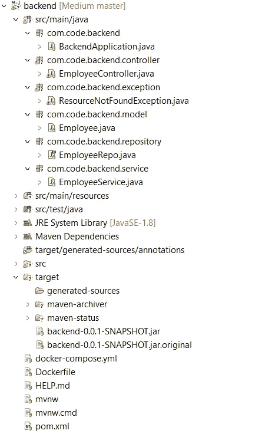

项目结构

其中一个重要的文件是我们提供数据库配置的 **application.properties** 。

**应用程序.属性**

我们还需要一罐春装应用程序。要构建 jar 文件，请执行以下操作。

***右键点击 POM . XML→Run As→Maven build***

它将在 ***目标*** 文件夹中创建 jar ***后端-0.0.1-SNAPSHOT.jar*** 文件，正如我们在项目结构中看到的。

我们需要创建 Dockerfile，其中包含构建 spring-boot 应用程序映像的指令。

现在我们可以开始整理申请了。

## 将应用程序部署到 Docker

*   **使用码头工人网络**

1.  我们需要使用以下命令从 docker hub 中提取 MySQL 映像。这里我们将使用 5.7 版本。

```
**docker pull mysql:5.7**
```

2.使用 spring-boot 应用程序创建 docker 映像。打开项目文件夹中的命令终端，并执行以下命令。

```
**docker build -t backend .**
```

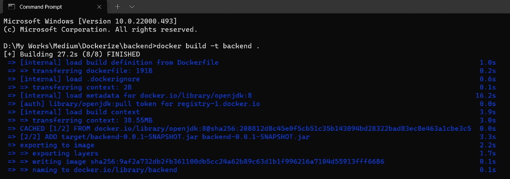

码头工人建造

我们可以使用下面的命令来验证是否正确创建了图像。

```
**docker images**
```

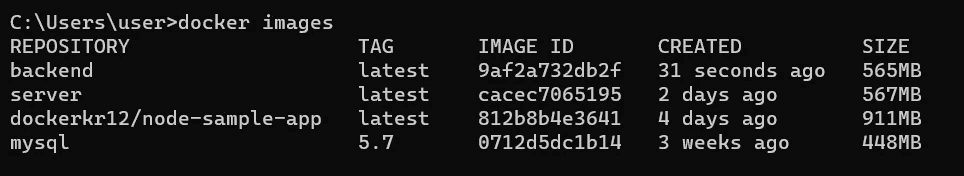

形象

3.我们将拥有一个包含 Spring-boot 和 MySQL 容器的 docker 网络，这些容器将相互通信。所以我们要做的第一件事就是创建一个 docker 网络。让我们创建一个 docker 网络作为 **springmysql-net。**

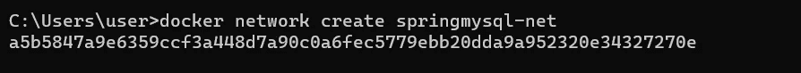

网络

我们也可以用下面的命令来验证它。

```
**docker network ls**
```

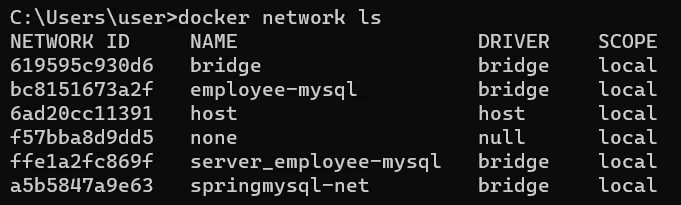

网络

4.使用以下命令在网络中运行 MySQL 容器。

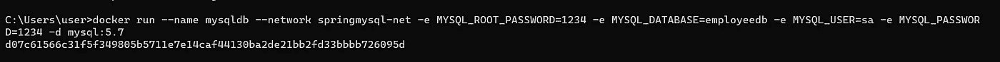

运行 MySQL 容器

```
**docker run --name mysqldb --network springmysql-net -e MYSQL_ROOT_PASSWORD=1234 -e MYSQL_DATABASE=employeedb -e MYSQL_USER=sa -e MYSQL_PASSWORD=1234 -d mysql:5.7**
```

*   容器名为 mysqldb。请注意，我们已经在 application.properties 文件的连接 URL 中给出了这一点。
*   网络是 springmysql-net。
*   -e 代表环境变量。这些值在 application.properties 文件中也有提及。
*   -d 指示在分离模式下运行。

为了验证一切正常，我们可以使用下面的命令查看日志。

```
**docker logs -f <container_name>**
```

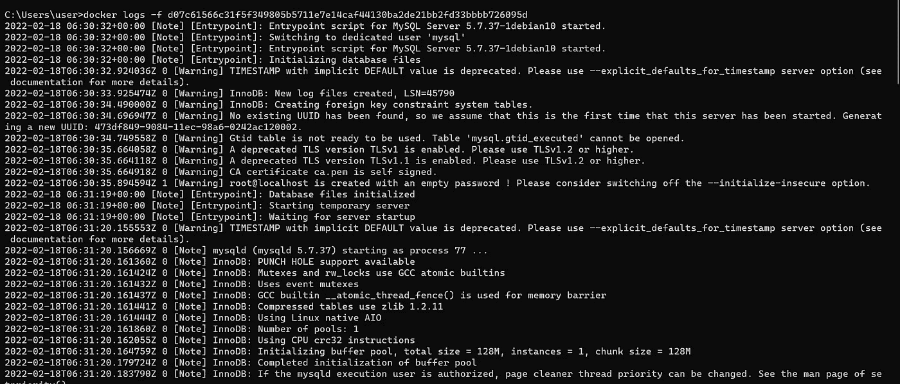

MySQL 日志

如果需要，我们可以检查数据库 **employeedb** 是否已经正确创建。

我们可以执行以下命令。

```
**- docker exec -it <container_id> bash
- mysql -u<username> -p<password>
- show databases;**
```

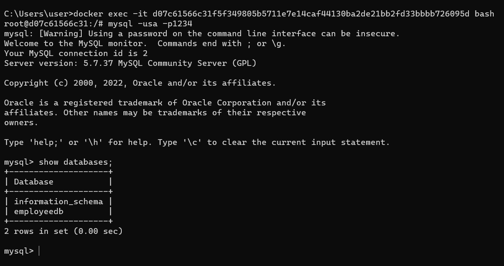

如果数据库已经成功创建，我们可以看到它如上。

5.用这个命令在同一个网络中运行 Spring-boot 容器。

```
**docker run --network springmysql-net --name backend-container -p 8080:8080 -d backend**
```

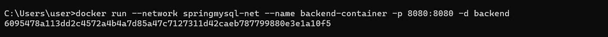

运行弹簧靴容器

如果这些容器运行正常，您可以使用下面的命令。

```
**docker ps**
```

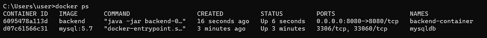

运行容器

6.让我们看看 Spring-boot 容器的日志，以确认一切正常。

```
**docker logs -f <container_id>** 
```

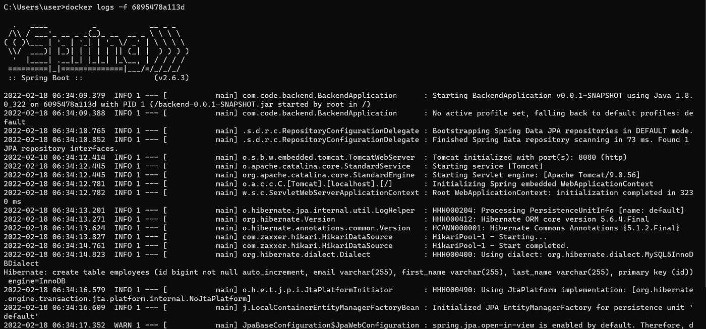

春季启动应用程序日志

这就是我们需要做的！。

让我们通过 POST 和 GET 请求来检查我们的应用程序是否如预期的那样工作。

**帖子:**

端点→*[***http://localhost:8080/API/employees/add employee***](http://localhost:8080/api/addEmployee)*

*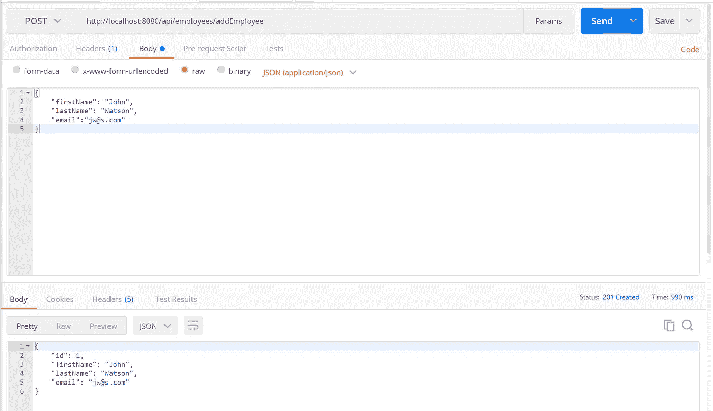*

*添加员工*

***获取:***

*端点→*[***http://localhost:8080/API/employees***](http://localhost:8080/api/addEmployee)**

**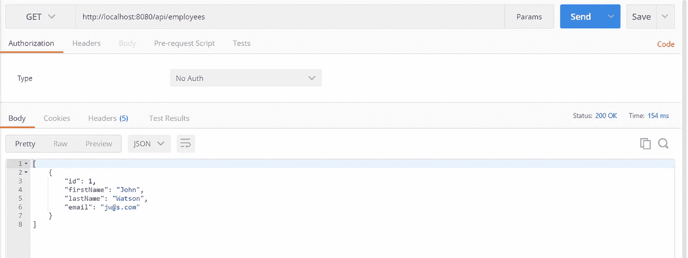**

**获取员工**

*   ****使用 docker-compose****

**不用经过这么多步骤，我们可以用一个命令 docker-compose 做同样的事情。**

**为此，我们需要创建 docker-compose.yml 文件，它包括以下内容。**

**然后打开项目文件夹中的命令终端，执行以下命令。**

```
****docker-compose up****
```

**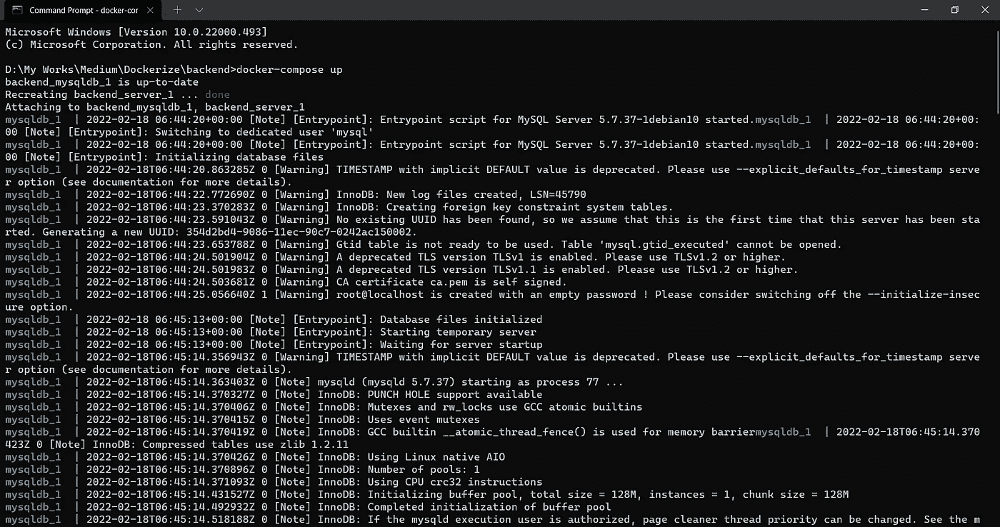****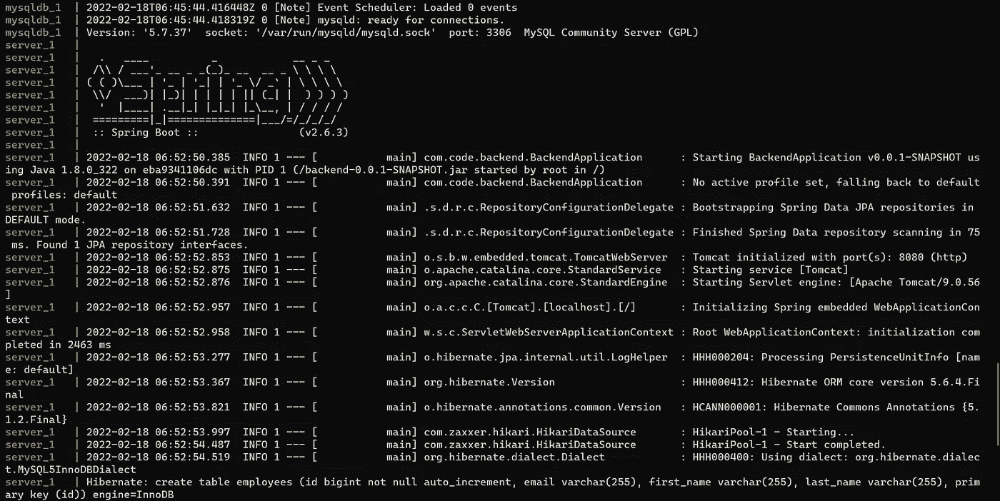**

**让我们也通过创建 POST 和 GET 请求来验证这一点。**

****帖子:****

**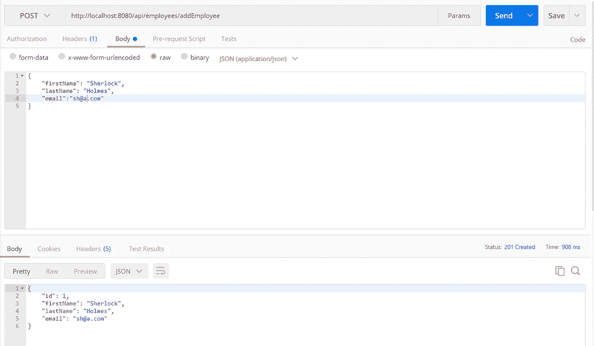**

**添加员工**

****得到:****

**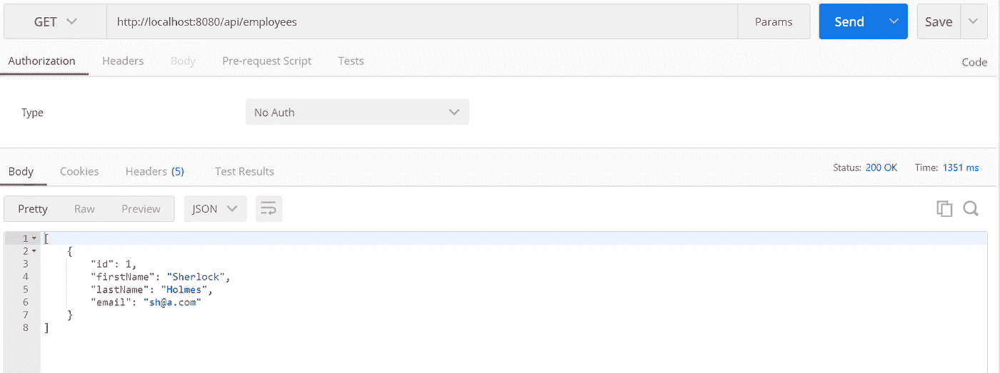**

**获取员工**

**所以这些是你可以用 MySQL 来 dockerize 一个 Spring boot 应用程序的方法。即使你使用不同的编程语言，数据库的概念是相同的。**

**希望这对您有所帮助。**

**感谢您阅读本文！。**