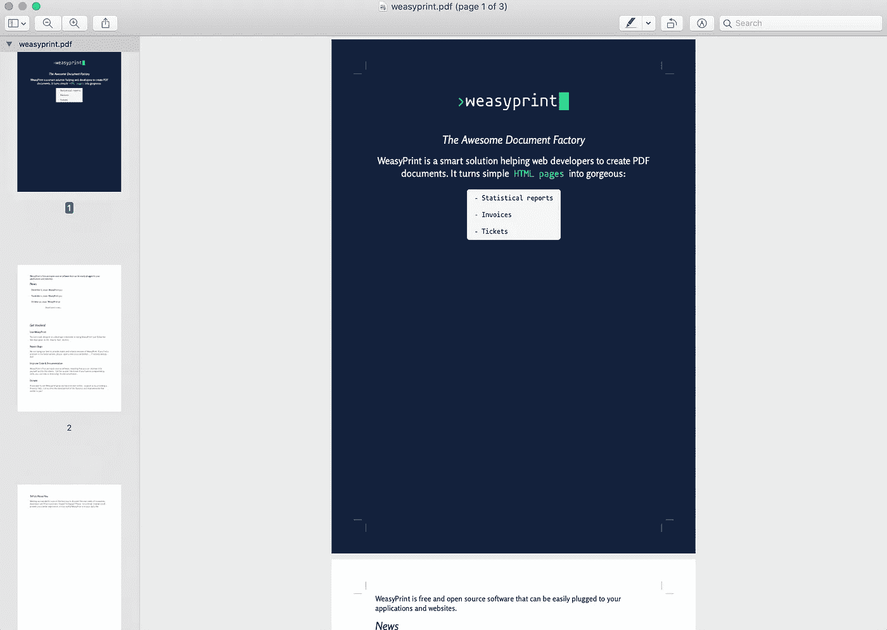
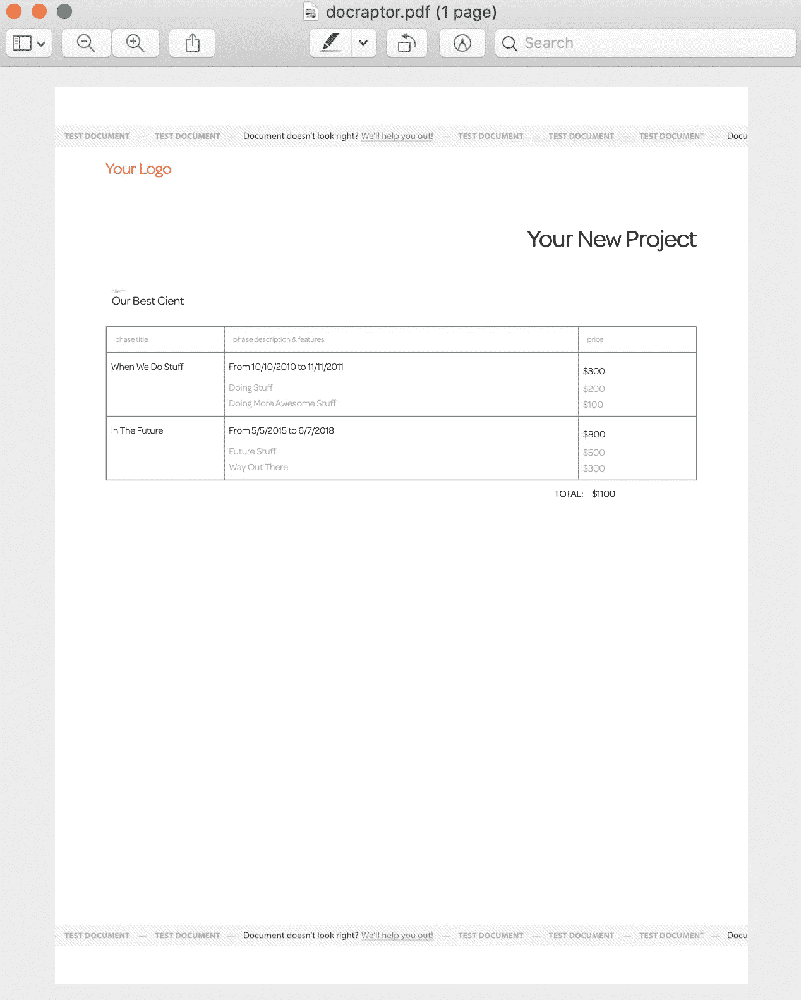
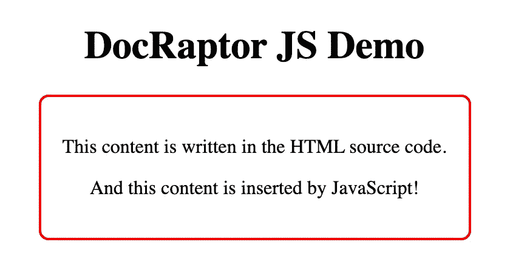
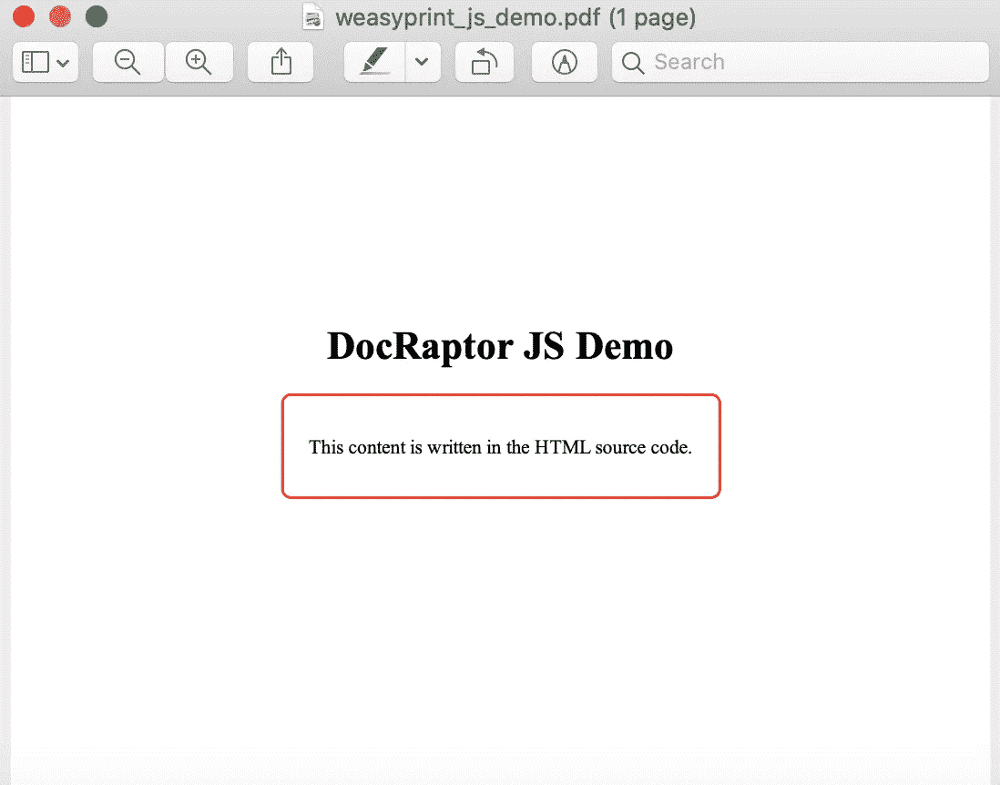
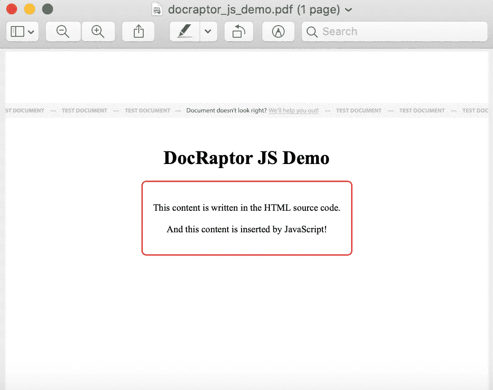
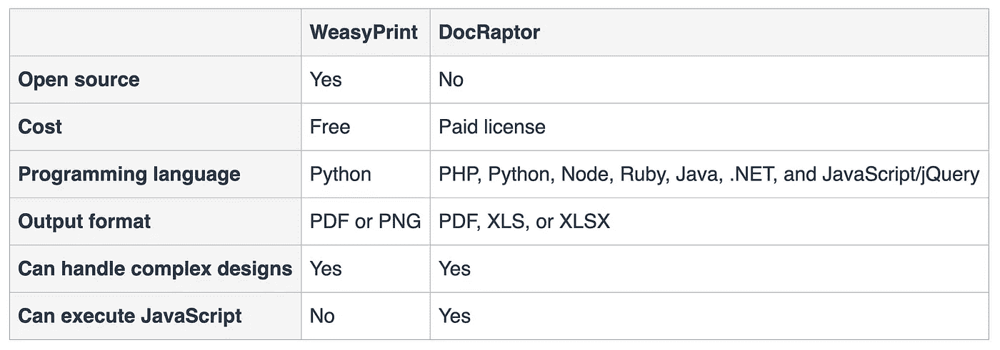

# DocRaptor 对 WeasyPrint

> 原文：<https://levelup.gitconnected.com/docraptor-vs-weasyprint-dd28b8ef6e51>

## PDF 导出摊牌


[周隼](https://unsplash.com/@chris_chow?utm_source=medium&utm_medium=referral)在 [Unsplash](https://unsplash.com?utm_source=medium&utm_medium=referral) 上拍照

我最近发表了一篇[文章，比较 HTML 到 PDF 的导出库](/how-to-convert-html-tables-into-beautiful-pdfs-eac2ce4c77de)。在这篇文章中，我探索了一些选项，比如原生的[浏览器打印](https://developer.mozilla.org/en-US/docs/Web/API/Window/print)功能、开源库 [jsPDF](https://github.com/MrRio/jsPDF) 和 [pdfmake](http://pdfmake.org/) ，以及付费服务 [DocRaptor](https://docraptor.com/) 。以下是我的发现的简要回顾:

> *如果您想要最简单的解决方案，并且不需要专业外观的文档，本机浏览器打印功能应该就可以了。如果您需要对 PDF 输出进行更多的控制，那么您将需要使用一个库。*
> 
> *jsPDF 在 UI 中显示基于 HTML 生成的单页内容时大放异彩。当从数据而不是从 HTML 生成 PDF 内容时，pdfmake 效果最好。DocRaptor 是其中最强大的，它有简单的 API 和漂亮的 PDF 输出。但是，与其他服务不同的是，这是一项有偿服务。但是，如果您的业务依赖于优雅、专业的文档生成，DocRaptor 是非常值得的。*

在我关于 Dev.to 的文章的评论部分，[有人建议](https://dev.to/thawkin3/how-to-convert-html-tables-into-beautiful-pdfs-1k08/comments)我看看 [Paged.js](https://www.pagedjs.org/) 和 [WeasyPrint](https://weasyprint.org/) 作为额外的选择。(顺便说一句，这个人是 Andreas Zettl，他有一个非常棒的演示站点，里面全是[打印 CSS 示例](https://printcss.live/)。)

因此，今天我们将探讨 DocRaptor 和 WeasyPrint 的相对优势和劣势。

# WeasyPrint 概述

让我们从 WeasyPrint 开始，这是一个由 [Kozea](https://kozea.fr/) 开发并由 [Court Bouillon](https://www.courtbouillon.org/) 支持的开源库。首先，**它是免费的**，这是一个优点。它是在 BSD 3 条款许可下许可的，这是一个相对宽松和简单的许可。WeasyPrint 允许您生成 PDF 或 PNG 格式的内容，这应该足以涵盖大多数用例。它是为 Python 3.6+构建的，如果您是 Python 开发人员，这是非常好的。如果 Python 不是你的强项，或者不是你公司技术体系的一部分，那么这对你来说可能是一个失败。

需要注意的一个最大的警告是 [WeasyPrint 不支持 JavaScript 生成的内容](https://github.com/Kozea/WeasyPrint/issues/454)！因此，当使用这个库时，您需要导出服务器端生成的内容。如果您依赖由 JavaScript 支持的动态生成的内容或图表，那么这个库不适合您。

# 安装 WeasyPrint

使用 WeasyPrint 启动和运行相当容易。他们在其网站上提供了[安装说明](https://weasyprint.readthedocs.io/en/latest/install.html)，但是我使用`pyenv`来[安装和管理 Python](https://opensource.com/article/19/5/python-3-default-mac) 而不是 Homebrew，所以我的安装步骤看起来更像这样:

安装`pyenv`和 Python:

```
# install pyenv using Homebrew
brew install pyenv# install Python 3.7.3 using pyenv
pyenv install 3.7.3# specify that I'd like to use version 3.7.3 when I use Python
pyenv global 3.7.3# quick sanity check
pyenv version# add `pyenv init` to my shell to enable shims and autocompletion
echo -e 'if command -v pyenv 1>/dev/null 2>&1; then\n  eval "$(pyenv init -)"\nfi' >> ~/.zshrc
```

安装 WeasyPrint 并在 WeasyPrint 网站上运行:

```
pip install WeasyPrintweasyprint https://weasyprint.org/ weasyprint.pdf
```

如您所见，从终端使用 WeasyPrint 的最简单方法是运行带有两个参数的`weasyprint`命令:URL 输入和文件名输出。这将在您运行命令的目录中创建一个名为`weasyprint.pdf`的文件。以下是在 Mac 上的预览应用程序中查看 PDF 输出的屏幕截图:



WeasyPrint 的 PDF 输出示例

看起来棒极了！WeasyPrint 还有一整页[的例子](https://weasyprint.org/samples/)，你可以查看哪些展示了[报告](https://weasyprint.org/samples/report/report.pdf)、[发票](https://weasyprint.org/samples/invoice/invoice.pdf)，甚至还有[带有条形码的活动门票](https://weasyprint.org/samples/ticket/ticket.pdf)。

# DocRaptor 概述

现在让我们考虑 DocRaptor。 [DocRaptor](https://docraptor.com/) 是闭源的，可以通过付费许可订阅获得(尽管您可以免费生成测试文档)。它使用 PrinceXML HTML-to-PDF 引擎，并且是唯一由该技术支持的 API。

与 WeasyPrint 仅使用 Python 不同，DocRaptor 拥有 PHP、Python、Node、Ruby、Java、.NET，以及 JavaScript/jQuery。它也可以通过 HTTP 请求直接使用，因此您可以使用 cURL 从您的终端生成 PDF。如果你像我一样没有 Python，这是个好消息。

DocRaptor 可以将内容导出为 PDF、XLS 或 XLSX 文档。如果您的内容是与 Excel 兼容的表格，这将非常有用。不过目前，我们只看 pdf，因为这是 WeasyPrint 和 DocRaptor 都支持的东西。

与 WeasyPrint 相比，DocRaptor 的一个相对优势是它*可以*等待页面上的 JavaScript 被执行，因此它非常适合用于动态生成的内容和图表库。

# DocRaptor 入门

DocRaptor 为他们的每个 SDK 都提供了[指南，在首次尝试他们的服务时非常值得一读。既然我们从命令行运行了 WeasyPrint 示例，那么让我们也通过使用 cURL 发出 HTTP 请求，在我们的终端](https://docraptor.com/documentation/jquery)中运行 DocRaptor。DocRaptor 是基于 API 的，所以不需要下载或安装任何东西。

你可以试试他们的例子:

```
curl http://YOUR_API_KEY_HERE@docraptor.com/docs \
  --fail --silent --show-error \
  --header "Content-Type:application/json" \
  --data '{"test": true,
           "document_url": "http://docraptor.com/examples/invoice.html",
           "type": "pdf" }' > docraptor.pdf
```

下面是在您的终端中运行该代码片段后的输出:



DocRaptor 的 PDF 输出示例

瞧，一张漂亮简单的发票。这里 DocRaptor 的例子没有 WeasyPrint 的例子复杂，所以让我们试着从 DocRaptor 的一个更高级的例子生成一个 PDF。

```
curl http://YOUR_API_KEY_HERE@docraptor.com/docs \
  --fail --silent --show-error \
  --header "Content-Type:application/json" \
  --data '{"test": true,
           "document_url": "https://docraptor.com/samples/cookbook.html",
           "type": "pdf" }' > docraptor_cookbook.pdf
```

这是这本食谱的 PDF 输出:


DocRaptor 的 PDF 输出示例使用了他们的 Cookbook 食谱示例

相当整洁！就像 WeasyPrint 一样，DocRaptor 可以处理复杂的设计和扩展到页面边缘的全出血布局。这里一个重要的标注是 DocRaptor 支持脚注，如本例所示。另一方面，WeasyPrint 还没有完全实现 [CSS 分页媒体规范](https://www.w3.org/TR/css-page-3/)，所以它不能处理脚注生成。

你可以在他们的网站上查看更多 DocRaptor [的例子，包括一份](https://docraptor.com/samples)[财务报表](https://docraptor.com/samples/statement.pdf)，一份[宣传册](https://docraptor.com/samples/brochure.pdf)，一份[发票](https://docraptor.com/samples/invoice.pdf)，以及一份[电子书](https://docraptor.com/samples/ebook.pdf)。

# JavaScript 执行

到目前为止，我们已经看到了 DocRaptor 和 WeasyPrint 的功能和相似之处。但是我们上面提到的一个核心区别是 WeasyPrint 在生成 PDF 之前不会等待 JavaScript 执行。这对于用 React 这样的框架构建的应用程序至关重要。默认情况下，React 应用程序在 HTML 中只包含一个根容器`div`，然后运行 JavaScript 将 React 组件注入到页面中。

因此，如果您试图从命令行为用 React 构建的应用程序生成 PDF，您将无法获得实际的应用程序内容！相反，您可能会看到`noscript`标记的内容，它通常包含一条消息，类似于“您需要启用 JavaScript 来运行这个应用程序。”

依赖于图表库的应用程序也是如此，比如 [Google Charts](https://developers.google.com/chart) 、 [HighCharts](https://www.highcharts.com/) 或 [Chart.js](https://www.chartjs.org/) 。如果不运行 JavaScript，就不会创建图表。

作为一个例子，考虑一下我整理的这个简单的网页。它包含一个页面标题、一个包含在 HTML 源代码中的段落，以及一个由 JavaScript 插入到 DOM 中的段落。你可以在 GitHub 上找到[代码。页面看起来是这样的:](https://github.com/thawkin3/docraptor-js-demo)



DocRaptor JS 演示网页

现在，让我们使用 WeasyPrint 通过在终端中运行以下命令从 web 页面生成 PDF:

```
weasyprint http://tylerhawkins.info/docraptor-js-demo/ weasyprint_js_demo.pdf
```

以下是输出结果:



WeasyPrint 的 JS 演示 PDF 输出

哦不！第二段在哪里？它不在那里，因为 JavaScript 从未被执行过。

现在让我们再试一次，但这次用 DocRaptor。为了让 JavaScript 在页面上运行，我们必须在 options 对象中为 DocRaptor 提供`"javascript": true`参数。代码如下:

```
curl http://YOUR_API_KEY_HERE@docraptor.com/docs \
  --fail --silent --show-error \
  --header "Content-Type:application/json" \
  --data '{"test": true,
           "javascript": true,
           "document_url": "http://tylerhawkins.info/docraptor-js-demo/",
           "type": "pdf" }' > docraptor_js_demo.pdf
```

输出是:



来自 DocRaptor 的 JS 演示 PDF 输出

Tada！JavaScript 已经成功执行，导致第二段的插入。

# 结论

那么，你应该使用 WeasyPrint 还是 DocRaptor 呢？这取决于您的用例。

如果您的应用程序包含不依赖于 JavaScript 的静态内容，如果 Python 是您的技术堆栈的一部分，或者如果您需要 PNG 图像输出，那么 WeasyPrint 是一个极好的选择。它是开源的，免费的，足够灵活来处理复杂的视觉输出。

如果需要使用 Python 之外的编程语言，或者依赖 JavaScript 的执行来呈现需要导出的内容，DocRaptor 是正确的选择。

# 对照表

另外，这里有一个比较表，可以快速总结这两个库:



DocRaptor 与 WeasyPrint 对比表

编码快乐！