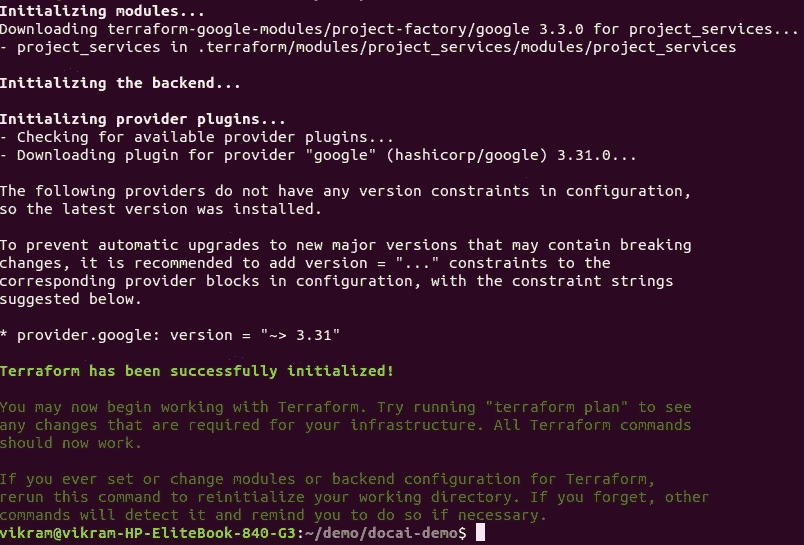

# 谷歌云平台中的文档人工智能

> 原文：<https://levelup.gitconnected.com/document-ai-in-google-cloud-platform-7714298f50ba>

## 自动文档处理和实体提取

贵公司是否有大量文档/ PDF 文件需要员工手动检查并输入数据库？

是啊！那么，你是在正确的博客上！


[斯科特·格雷厄姆](https://unsplash.com/@sctgrhm?utm_source=medium&utm_medium=referral)在 [Unsplash](https://unsplash.com?utm_source=medium&utm_medium=referral) 上拍照

# 介绍

大多数企业现在都坐拥文档金矿。这些文件是合同，pdf，电子邮件，客户反馈，模式。随着时间的推移，这些文档越来越多。

以下是拥有数百万份合同文档的企业的一些示例。他们需要在生命周期的不同时间阅读这些文档来进行分析。这需要大量的处理时间并且容易出错。

*   抵押贷款提供商
*   保险公司
*   学校

这些是非结构化数据。

# 文件 AI

Document AI 测试版提供了一个可扩展的无服务器平台，可以自动分类、提取和丰富扫描文档中的数据。它将非结构化数据转换为结构化数据。

在内部，它使用与支持谷歌搜索、谷歌助手、自然语言处理 API 相同的深度机器学习技术，从您的非结构化文档中获取有价值的见解。


# 用例

该组织有多个外地办事处，总部运行人力资源/工资系统。新加入者的详细信息由现场经理填写在表格中，然后表格被发送到总部。操作员手动将详细信息输入系统，然后员工的电子邮件、培训、门禁卡、笔记本电脑和其他手续就会被分类。

这种端对端的过程需要几天时间，在此之前，员工无所事事。在我看来，新加入者(无论是新人还是有经验的人)总是渴望展示他/她的才华或技能，所以他们不应该在早期无所事事。

在本帖中，我们将看到如何自动化文档处理和端到端的新加入者流程:

*   现场经理填写表格并上传扫描的表格
*   应用程序从文档中提取数据并存储到数据库中
*   然后提醒其他流程，新加入者员工 id
*   其他流程，如 ID 卡、笔记本电脑、办公桌等，将使用 employee_id 从数据库中获取详细信息


体系结构

# 成分

以下 ***无服务器*** 组件用于该架构。这意味着你将支付每次使用，没有任何前期费用。此外，不需要配置或维护任何服务器。

1.  前端 app 上传扫描文档到**云运行**。
2.  该文档存储在**谷歌云存储**中。
3.  这触发了**云功能**。
4.  云函数调用**文档 AI** 获取实体。
5.  云函数读取响应生成 employee_id、email，并将数据存储到**云 Firestore。**
6.  新加入者通知被发送到**云发布/订阅**主题。
7.  这个主题有多个订户:桌面服务、笔记本电脑服务、身份证服务。这些服务将从 Firestore 获取详细信息。
8.  使用 **Cloud Run** 部署的服务具有从 Cloud Firestore 获取员工详细信息的端点。
9.  所有组件都将数据记录到 **Stackdriver** 。

# 使用 Terraform 部署此文档 AI 应用程序

# 设置

为了完成本指南，您需要安装以下工具

*   [Terraform](https://www.terraform.io/) :本指南使用 Terraform 部署资源。
*   [Git](https://git-scm.com/) : Git 用于克隆示例代码并触发新的部署。
*   [GCP](https://cloud.google.com/) :你需要一个启用了账单功能的 GCP 账户。

# 创建 GCP 项目

为本教程创建一个 GCP 项目。

**选择 Firestore 模式**

*   去 Firestore
*   选择本机模式
*   选择一个地点(例如美国)
*   点击“创建数据库”

# 创建服务帐户

*   创建服务帐户。
*   分配角色:编辑
*   下载密钥并将其重命名为 terraform-key.json

# 克隆存储库

克隆包含示例代码的以下存储库，然后切换到`terraform`目录:

```
$ git clone [https://github.com/vikramshinde12/document-ai-in-gcp.git](https://github.com/vikramshinde12/document-ai-in-gcp.git)
```

接下来，将`terrform.tfvars.example`文件复制到`terraform.tfvars`。您需要替换`project`变量的值。

然后，将服务帐户密钥 terraform-key.json 复制到该文件夹中。

执行以下命令来设置 Google 凭证。

```
$ export GOOGLE_CLOUD_KEYFILE_JSON=terraform-key.json
```

执行地形脚本

首先，初始化 Terraform。

```
$ terraform init
```



初始化地形

```
$ terraform plan
```


地形图

现在，将更改后的应用到 GCP 平台。

```
$ terraform apply
```


单击 URL，这将打开示例应用程序。

# 访问应用程序

在示例前端应用程序上上传示例文件。这个例子(sample.pdf)可以在资源库中找到。


使用文档 AI 提取实体，并将其添加到 Firestore 中。


示例表单及其在 Firestore 中的条目。

使用邮递员点击 API。


订户(例如 ID_Cards 服务、服务台服务、笔记本电脑服务)将收到新加入者的通知，并且它使用 API 获取详细信息。


云函数输出

# 打扫

首先，永久删除 Terraform 创建的资源:

```
$ terraform destroy
```

接下来，删除 Terraform 管理项目及其所有资源:

```
$ gcloud projects delete [project_id]
```

# 结论

通过这种方式，我们在**谷歌云平台中实现了端到端的自动化文档处理。**

我还在 github 中分享了 docker 容器和云功能的代码。

# 参考

[](https://cloud.google.com/document-ai/docs) [## 文档 AI 文档|云文档 AI 文档

### 测试版谷歌云平台服务条款的正式发布前条款涵盖了该产品或功能…

cloud.google.com](https://cloud.google.com/document-ai/docs) [](https://github.com/vikramshinde12/document-ai-in-gcp) [## vikramshinde 12/document-ai-in-GCP

### 这个存储库用于 Google 云平台中的自动文档处理-vikrashinde 12/Document-ai-in-GCP

github.com](https://github.com/vikramshinde12/document-ai-in-gcp)