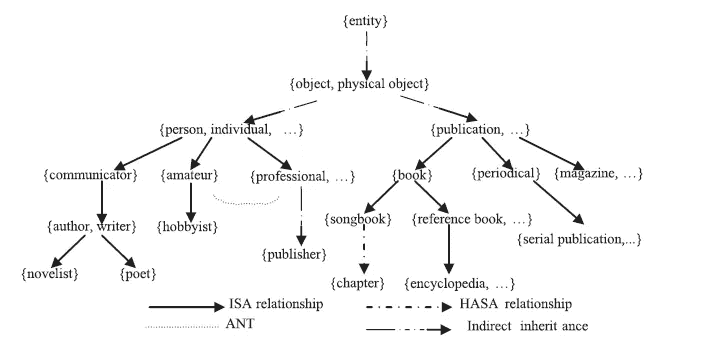
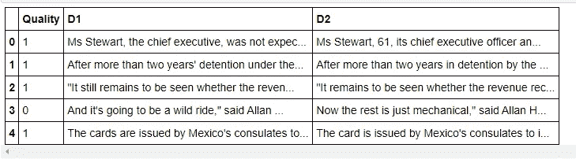

# 具有同义词集和路径相似性的文档相似性

> 原文：<https://levelup.gitconnected.com/document-similarity-with-synset-and-path-similarity-predictive-hacks-73f0dccfa642>

## 一个如何使用 NLTK 中的 wordnet 找到路径相似的相似文档的例子

[](https://jorgepit-14189.medium.com/membership) [## 用我的推荐链接加入媒体-乔治皮皮斯

### 阅读乔治·皮皮斯(以及媒体上成千上万的其他作家)的每一个故事。您的会员费直接支持…

jorgepit-14189.medium.com](https://jorgepit-14189.medium.com/membership) 

我们将提供一个例子，说明如何使用[synset](https://www.geeksforgeeks.org/nlp-synsets-for-a-word-in-wordnet/#:~:text=Synset%20is%20a%20special%20kind,Synset%20and%20some%20have%20several.)和[路径相似度](https://www.nltk.org/howto/wordnet.html)来定义相似的文档。我们将创建以下函数:

*   `**convert_tag:**`将`nltk.pos_tag`给出的标签转换成`wordnet.synsets`使用的标签。您需要在`doc_to_synsets`中使用该功能。
*   `**document_path_similarity:**`使用`doc_to_synsets`查找每个文档中的同义词集，然后使用`similarity_score`计算相似度，从而计算两个文档之间的对称路径相似度。
*   `**doc_to_synsets:**`返回文档中的同义词集列表。这个函数应该首先使用`nltk.word_tokenize`和`nltk.pos_tag`对文档进行分词和词性标注。然后它应该使用`wn.synsets(token, wordnet_tag)`找到每个令牌对应的 synset。应该使用第一个 synset 匹配。如果不匹配，则跳过该令牌。
*   `**similarity_score:**`将一个 synset 列表(s1)的规范化相似性得分返回到第二个 synset 列表(s2)上。对于 s1 中的每个同义词集，找出 s2 中具有最大相似度值的同义词集。将所有最大相似性值加在一起，并通过将其除以找到的最大相似性值的数量来归一化该值。小心数据类型，应该是浮点数。应该忽略缺失值。

```
import numpy as np
import nltk
from nltk.corpus import wordnet as wn
import pandas as pddef convert_tag(tag):
    """Convert the tag given by nltk.pos_tag to the tag used by wordnet.synsets"""

    tag_dict = {'N': 'n', 'J': 'a', 'R': 'r', 'V': 'v'}
    try:
        return tag_dict[tag[0]]
    except KeyError:
        return Nonedef doc_to_synsets(doc):
    """
    Returns a list of synsets in document.Tokenizes and tags the words in the document doc.
    Then finds the first synset for each word/tag combination.
    If a synset is not found for that combination it is skipped.Args:
        doc: string to be convertedReturns:
        list of synsetsExample:
        doc_to_synsets('Fish are nvqjp friends.')
        Out: [Synset('fish.n.01'), Synset('be.v.01'), Synset('friend.n.01')]
    """
    tokens = nltk.word_tokenize(doc)
    pos = nltk.pos_tag(tokens)
    tags = [tag[1] for tag in pos]
    wntag = [convert_tag(tag) for tag in tags]
    ans = list(zip(tokens,wntag))
    sets = [wn.synsets(x,y) for x,y in ans]
    final = [val[0] for val in sets if len(val) > 0]

    return finaldef similarity_score(s1, s2):
    """
    Calculate the normalized similarity score of s1 onto s2For each synset in s1, finds the synset in s2 with the largest similarity value.
    Sum of all of the largest similarity values and normalize this value by dividing it by the
    number of largest similarity values found.Args:
        s1, s2: list of synsets from doc_to_synsetsReturns:
        normalized similarity score of s1 onto s2Example:
        synsets1 = doc_to_synsets('I like cats')
        synsets2 = doc_to_synsets('I like dogs')
        similarity_score(synsets1, synsets2)
        Out: 0.73333333333333339
    """
    s =[]
    for i1 in s1:
        r = []
        scores = [x for x in [i1.path_similarity(i2) for i2 in s2] if x is not None]
        if scores:
            s.append(max(scores))
    return sum(s)/len(s)def document_path_similarity(doc1, doc2):
    """Finds the symmetrical similarity between doc1 and doc2"""synsets1 = doc_to_synsets(doc1)
    synsets2 = doc_to_synsets(doc2)return (similarity_score(synsets1, synsets2) + similarity_score(synsets2, synsets1)) / 2
```

测试其工作情况:

```
def test_document_path_similarity():
    doc1 = 'This is a function to test document_path_similarity.'
    doc2 = 'Use this function to see if your code in doc_to_synsets \
    and similarity_score is correct!'
    return document_path_similarity(doc1, doc2)
```

`[paraphrases](https://drive.google.com/file/d/1r5qgK0QB6Md0NWB2s9-dMNnBAS40Nfz9/view?usp=sharing)`是包含以下列的数据帧:`Quality`、`D1`和`D2`。`Quality`是指示变量，指示两个文档`D1`和`D2`是否是彼此的释义(1 表示释义，0 表示不释义)。

```
# Use this dataframe for questions most_similar_docs 
# and label_accuracyparaphrases = pd.read_csv('paraphrases.csv')
paraphrases.head()
```



# 最相似的文档

使用`document_path_similarity`，我们将在释义中找到具有最大相似性得分的文档对。*这个函数应该返回一个元组* `*(D1, D2, similarity_score)*`

```
def most_similar_docs():
    paraphrases['similarity_score'] = paraphrases.apply(lambda x:document_path_similarity(x['D1'], x['D2']), axis=1)
    return (paraphrases.sort_values('similarity_score', ascending=False).iloc[0]['D1'], paraphrases.sort_values('similarity_score', ascending=False).iloc[0]['D2'], paraphrases.sort_values('similarity_score', ascending=False).iloc[0]['similarity_score'])most_similar_docs()
```

输出:

```
('"Indeed, Iran should be put on notice that efforts to try to remake Iraq in their image will be aggressively put down," he said.', '"Iran should be on notice that attempts to remake Iraq in Iran\'s image will be aggressively put down," he said.\n', 0.97530864197530864)
```

# 标签准确性

通过使用`document_path_similarity`计算每对文档的相似度，为二十对文档提供标签。设分类器规则为:如果得分大于 0.75，标签为释义(1)，否则标签不为释义(0)。使用 scikit-learn 的 accuracy_score 报告分类器的准确性。

```
def label_accuracy():
    from sklearn.metrics import accuracy_scoreparaphrases['similarity_score'] = paraphrases.apply(lambda x:document_path_similarity(x['D1'], x['D2']), axis=1)
    paraphrases['predicted'] = np.where(paraphrases['similarity_score'] > 0.75, 1, 0)

    return accuracy_score(paraphrases['Quality'], paraphrases['predicted'])label_accuracy()
```

输出:

```
0.80
```

# 参考

[1] [Coursera](https://click.linksynergy.com/fs-bin/click?id=ZHrx*LMoSUs&offerid=759505.571&subid=0&type=4) (附属链接)

*原载于*[*https://predictivehacks.com*](https://predictivehacks.com/document-similarity-with-synset-and-path-similarity/)*。*