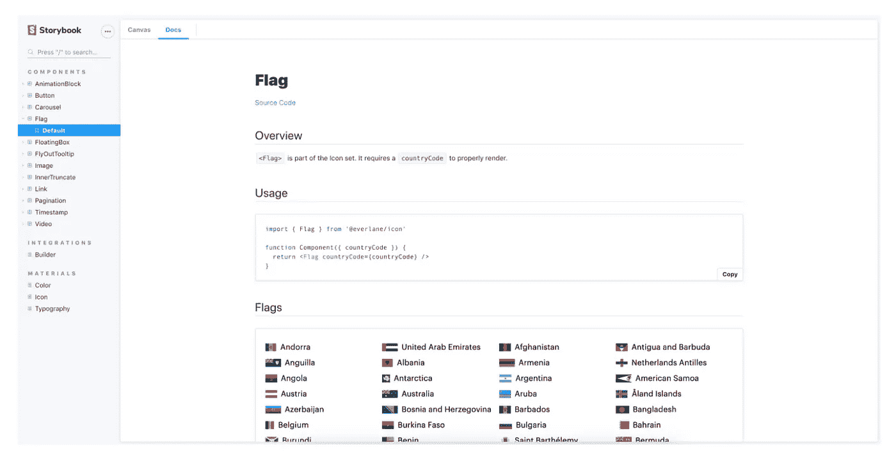
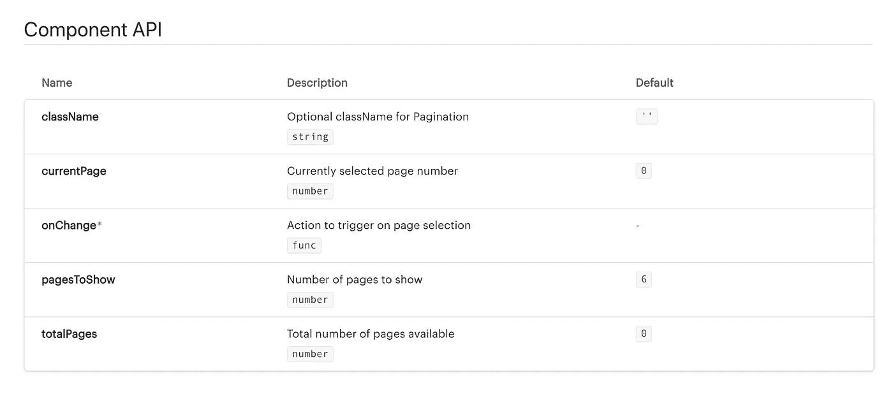
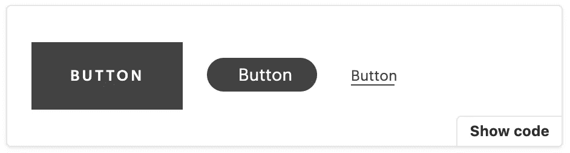
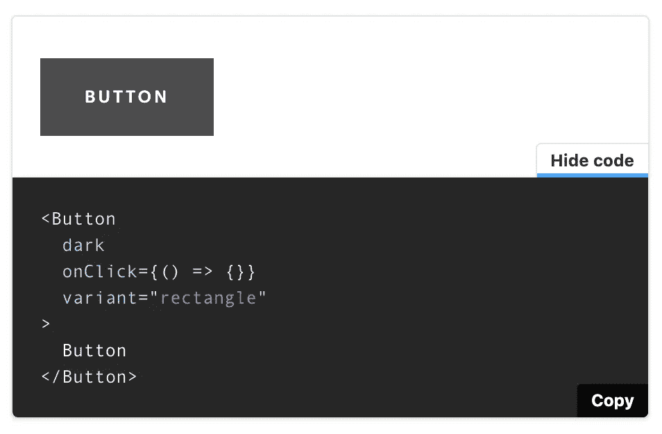
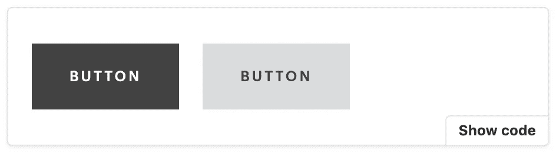
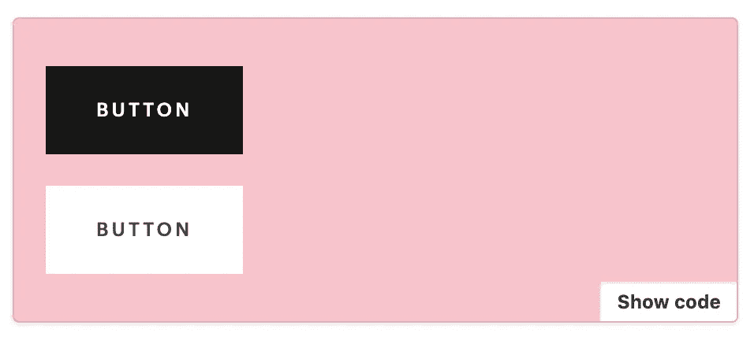

# 用故事书文档记录设计系统

> 原文：<https://levelup.gitconnected.com/documenting-design-systems-with-storybook-docs-e54b2fa5203>


我今年的目标之一是写一篇中型文章，只剩下几天时间了，我想分享我最近一直在做的一个项目——用[故事书文档](https://storybook.js.org/docs/react/writing-docs/introduction)记录 Everlane 的设计系统。

故事书是 UI 开发的游乐场。它是一个很好的工具，通过清晰的文档和使用示例来帮助设计师、项目经理和开发人员理解和可视化系统中的组件。当涉及到设计时，仪表板是唯一的真理来源——向工程师传递旧的和过时的草图文件的日子已经一去不复返了。

查看一些用 Storybook 构建的著名设计系统，这些系统在我从事这个项目时激发了我的灵感:

*   [IBM 碳](https://react.carbondesignsystem.com/?path=/docs/accordion--accordion)
*   [Workday 画布](https://workday.github.io/canvas-kit/?path=/story/welcome-getting-started--page)
*   [Gitlab](https://gitlab-org.gitlab.io/gitlab-ui/?path=/story/*)

至此，让我们深入一些关于如何用故事书记录设计系统的基本术语和例子🙂

# 📖故事

故事的核心是应用程序 UI 组件的渲染版本。故事集显示在故事书仪表板的左侧，选择每个故事将显示文档。



## JSX 减价

在 Storybook v5.3 中发布的 MDX 旨在通过允许 JSX 和 Markdown 在同一个文件中共存来提供对组件文档的完全控制。使用 MDX，您可以

*   进入门槛低——非工程人员不必编写代码来参与设计系统文档
*   易用性——开发人员可以将代码组件和文档保存在同一个文件中，这意味着在目录间导航花费的时间更少

```
# OMG This is markdown**I am writing bold text**<Component />
```

## 组件故事格式

CSF 是基于 ES6 模块的标准格式，用于定义故事和组件。每个 CSF 文件都由以下部分组成:

*   `default export` —描述组件的元数据

```
import Pagination from './Pagination'export default {
  title: 'Components/Pagination',
  component: Pagination,
}
```

*   `named export` —描述故事的函数

```
import Pagination from './Pagination'export const PaginationControls = () => (
  <div>
    <p>Rendering Pagination component</p>
    <Pagination />
  </div>
)
```

您也可以将 MDX 和 CSF 进行混搭。如果你想在`.mdx`中写一个故事，你应该使用[文档块](https://storybook.js.org/docs/react/writing-docs/doc-blocks#gatsby-focus-wrapper)，它使用`<Meta>`而不是`export default`来声明组件元数据。

```
import Pagination from './Pagination'<Meta
  title: 'Components/Pagination',
  component: Pagination,
/>export const PaginationControls = () => (
  <div>
    <p>This is what the Pagination component looks like</p>
    <Pagination />
  </div>
)
```

# 🏗文档块

文档块是编写文档的关键部分。可以通过从`@storybook/addon-docs/blocks`进行命名导入来访问块

```
import { Canvas, Meta, Story } from '@storybook/addon-docs/blocks'
```

`<ArgsTable>`是一个列出属性描述和默认值的表格组件。Storybook 由引擎盖下的 react-docgen 提供支持，它将自动推断道具类型，并从源代码中提取任何可用的信息。这可能是开始进行适当类型检查的一个很好的动机😉

现在默认道具类型和描述(只能从`/** multiline comments */`中推断)已经可用，道具表将自动生成:

```
import { Meta, ArgsTable } from '@storybook/addon-docs/blocks'
import Pagination from './Pagination'<Meta title="Components/Pagination" component={Pagination} /># Component API<ArgsTable of={Pagination} />
```



组件元数据在`<Meta>`中被捕获。它支持以下道具(据我所知):

*   `title`指定将在导航 UI 中显示的故事的名称。可以用`/`(例如`Components/Pagination`)将多个故事分组到一个类别下
*   `component`帮助提取组件描述和道具
*   `argTypes`覆盖默认属性类型值(字段值可在找到
*   `decorators`包装所有组件故事。这对于将类似`margin: ‘20px'`的东西应用到所有的故事中是很有用的
*   `parameters`配置不同的插件设置，如`background`和`viewport`

```
import { Meta } from '@storybook/addon-docs/blocks'
import Pagination from './Pagination'<Meta
  name="Components/Pagination"
  component={Pagination}
  decorators: [(Story) => 
    <div style={{ margin: '20px'}}>
      <Story />
    </div>
  ]
  parameters={{
    backgrounds: {
      default: 'blue',
      values: [ 
        { name: 'blue', value: '#00aced' },
        { name: 'gray', value: '#808080' },
      ],
    },
  }}
  argTypes={{
    currentPage: {
      name: 'Custom currentPage',
      description: 'Another description for currentPage',
      table: {
        type: {
          summary: 'string',
        },
        defaultValue: {
          summary: '0',
        },
      },
    },
  }}
/>
```

`<Story>`是描述组件呈现方式的基本构建块组件。故事是*功能*，意思是需要调用一个故事块里面的内容。

```
import { Story } from '@storybook/addon-docs/blocks'
import Button from './Button'export const DefaultButton = () => <Button>Click me</Button><Story name="Default">
  {DefaultButton()}
</Story>
```

这也可以以内联方式编写。

```
import { Story } from '@storybook/addon-docs/blocks'
import Button from './Button'<Story name="Default">
  {() => <Button>Click me</Button>}
</Story>
```

如果有三种类型的按钮，那么为了捕捉三种不同的按钮状态而声明三个独立的函数很快就会变得重复。相反，您可以做的是向故事传递一个`args`参数:

```
import { Story } from '@storybook/addon-docs/blocks'
import Button from './Button'export const DefaultButton = args => <Button {...args}>Click me</Button><Story name="Rectangle" args={{ variant: 'rectangle' }}>
  {DefaultButton.bind({})}
</Story>
<Story name="Pill" args={{ variant: 'pill' }}>
  {DefaultButton.bind({})}
</Story>
<Story name="Underline" args={{ variant: 'underline' }}>
  {DefaultButton.bind({})}
</Story>
```



`.bind({})`在这里很重要——它复制了`<DefaultButton>`,并将不同的参数应用于 Button 的每个复制版本。如果没有它，按钮的每个实例最终都会收到相同的参数。

## 

<canvas></canvas>

`<Canvas>`布置一个包装`<Story>`块的容器。有了画布，一个有边框的盒子和一个`Show code / Hide code`按钮(代码片段是自动生成的！)会显示在右下角。



`<Canvas>`适用于

1.  将两个或多个元素组合在一起
2.  包括用法的代码示例

让我们来看一个有深色和浅色变体的矩形按钮。



`<Canvas>`接受两个道具(可能更多，但是找不到任何文档):

*   `style`用于将样式更改应用到画布容器
*   `isColumn`垂直对齐子画布

```
<Canvas style={{ backgroundColor: 'pink' }} isColumn>
  <Story name="Dark">
    <Button variant="rectangle" dark={true} />
  </Story>
  <Story name="Light">
    <Button variant="rectangle" dark={false} />
  </Story>
</Canvas>
```



如果你对`<Canvas>`自动生成的代码片段不满意，你可以用`<Source>`编写自己的代码片段。

```
import { Source } from '@storybook/addon-docs/blocks'
import dedent from 'ts-dedent'<Source
  language="jsx"
  code={dedent`
    <Button variant="rectangle" />
  `}
/>
```

# ⚙️构型

在 Storybook v5.3 中，所有的服务器配置都位于`main.js`中。在 Storybook 的[默认设置](https://storybook.js.org/docs/react/configure/overview)之上，您还可以通过简单地添加一个`webpackFinal`字段来包含 webpack 设置。这对于在像 sass 加载器这样的模块中加载非常有用。

```
module.exports = {
  stories: ['../stories/*.stories.@(jsx|mdx)'],
  addons: ['@storybook/addon-docs'],
  webpackFinal: async config => {
    config.module.rules.push({
      test: /\.scss$/,
      use: [require.resolve('sass-loader')],
      include: path.resolve(__dirname, '../'),
    })    
    return config
  }
}
```

# 📚参考

除了挖掘 Github 问题之外，我发现这些文章非常有用！

*   [https://github . com/storybook js/storybook/blob/next/migration . MD](https://github.com/storybookjs/storybook/blob/next/MIGRATION.md)
*   [https://medium . com/storybook js/rich-docs-with-storybook-mdx-61 BC 145 AE 7 BC](https://medium.com/storybookjs/rich-docs-with-storybook-mdx-61bc145ae7bc)
*   [https://www.npmjs.com/package/@storybook/addon-docs](https://www.npmjs.com/package/@storybook/addon-docs)
*   [https://story book . js . org/docs/react/get-started/introduction](https://storybook.js.org/docs/react/get-started/introduction)

# 🚪关闭

在故事书文档之上，我强烈建议您查看一下[故事书控件](https://storybook.js.org/docs/react/essentials/controls#gatsby-focus-wrapper)，这是一个允许组件交互的附加组件，可以获得完整的设计系统体验。

非常感谢[迈克尔·希尔曼](https://github.com/shilman)、[帕特里克·拉弗朗斯](https://github.com/patricklafrance)、[弗朗西斯·蒂博](https://github.com/ThibaudAV)以及故事书社区的其他人创建并维护了这样一个伟大而有趣的项目。

感谢阅读！