# 记录您的无服务器解决方案🚀

> 原文：<https://levelup.gitconnected.com/documenting-your-serverless-solutions-509f1928564b>


塔曼娜·茹米在 [Unsplash](https://unsplash.com/s/photos/pencil?utm_source=unsplash&utm_medium=referral&utm_content=creditCopyText) 拍摄的照片

## 一个生成和托管你的无服务器文档的例子，比如 OpenAPI/Swagger，ADRs 和 TypeDoc 的代码文档。

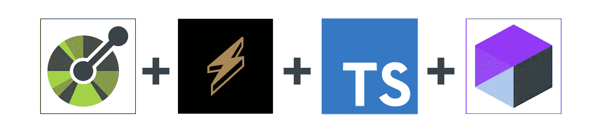

# 介绍

我们经常构建出奇妙的无服务器解决方案，但是我们在文档方面做得太少了。这可以包括一个描述你的 API 的 **OpenAPI** 文档( *Swagger* )，**代码文档** ( *显示你的 lambda 处理程序、包等*)，以及**架构决策记录** ( *ADRs* )。

本文展示了如何为您的无服务器解决方案自动生成所有这些文档，同时也展示了如何为您的利益相关者(*开发团队、外部公司、ISV 等*)托管这些文档

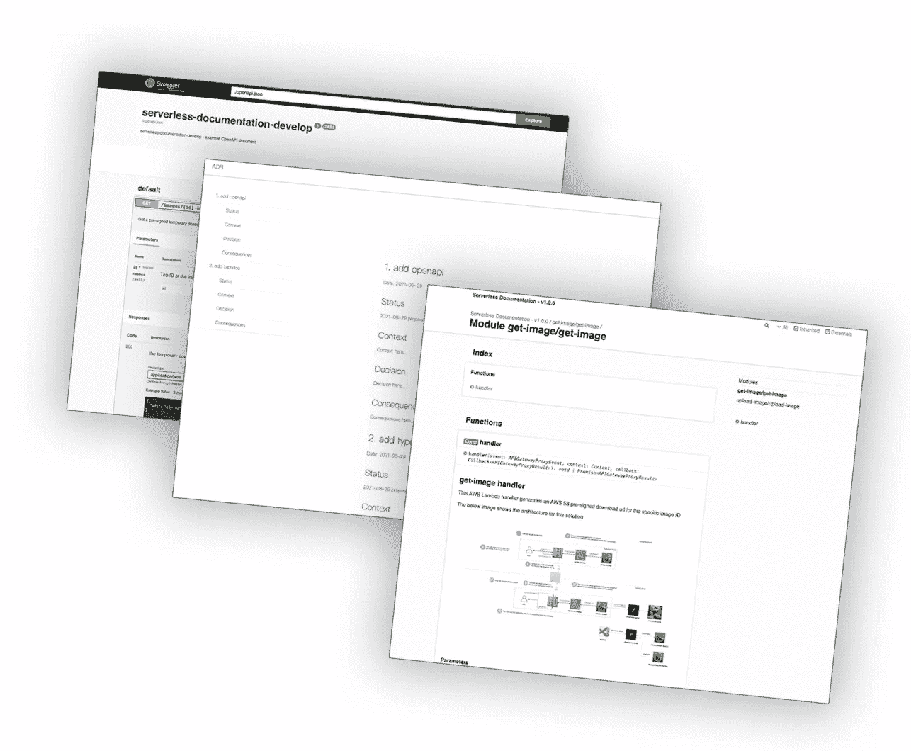

我们将为无服务器应用程序生成的文档类型的示例

你可以在这里访问[代码报告，这里有详细的注释。](https://github.com/leegilmorecode/serverless-documentation)

> *💡*请注意，这是演示生成各种文档的使用的最小代码和架构，所以这不是生产就绪，也不符合编码最佳实践。

# 我们在建造什么？🏗️

下图显示了我们在回购中构建的架构:

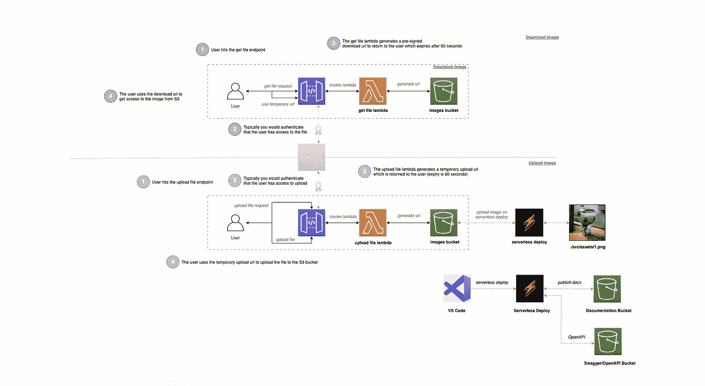

该架构基于下面的文章**，增加了生成和托管无服务器文档的步骤**🔦

[](/serverless-s3-pre-signed-urls-e52eebad8d2d) [## 无服务器 S3 预签名网址🚀

### 一个在您的无服务器解决方案中使用 AWS S3 预签名 URL 的实例，以及支持代码示例…

levelup.gitconnected.com](/serverless-s3-pre-signed-urls-e52eebad8d2d) 

**这个示例架构给了我们一些有形的东西，因此我们可以生成以下文档:**

1.  用于 API 的 [Swagger/OpenAPI](https://swagger.io/specification/) 文档。
2.  使用 [TypeDoc](https://typedoc.org/) 的代码文档。
3.  [ADR 的产生。](https://www.npmjs.com/package/adr)
4.  生成的文件存放在 [AWS S3](https://aws.amazon.com/s3/) 上以供查看。

# 部署解决方案！👨‍💻

🛑 ***注意*** *:* 运行以下命令将在您的 AWS 帐户上产生费用，因此相应地更改配置*。*

在文件夹的根目录下运行`npm i`，然后运行`npm run deploy:develop`，这将安装所有的依赖项，然后部署到 AWS。

# 生成文档！📝

好了，我们已经部署了解决方案，现在让我们来查看输出！

## OpenAPI/Swagger

我们将要涉及的第一个文档领域是 OpenAPI/Swagger 文档！

我们使用[无服务器-openapi-documentation-v2](https://www.npmjs.com/package/serverless-openapi-documentation-v2) 插件和无服务器框架在本地自动生成我们的 OpenAPI/Swagger 文档。

这是使用`npm run openapi`在文件夹的根目录下运行的，也是 [husky 预提交钩子](https://github.com/typicode/husky)的一部分，当你提交对库的任何更改时，它将自动运行。生成的`openapi.json`文件如下所示:

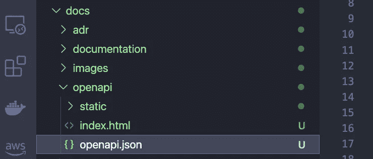

自动生成的 openapi.json 文件

我们为我们的 swagger 文档创建了一个名为`serverless.doc.yml`的独立文件，然后在主文件`serverless.yml`中链接到每个端点，如下所示:

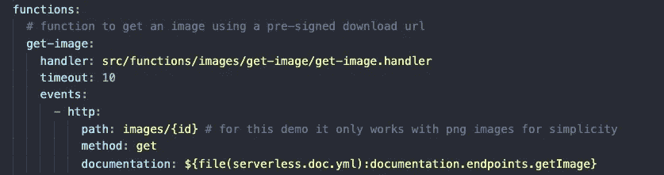

get-image 端点上的 documentation 属性示例

然后,`serverless.doc.yml`文件保存了您所期望的所有 OpenAPI 信息，比如模型、请求/响应、描述等等。下面显示了一个基本示例:

然后可以复制本地生成的`openapi.json`文件的内容，粘贴到 [swagger.io](https://editor.swagger.io/) 中查看，如下图所示，以验证其有效性:

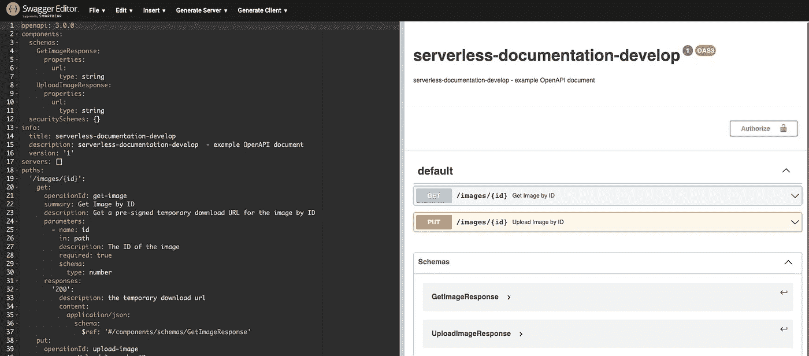

为我们的无服务器解决方案生成了 swagger/openapi 输出

作为无服务器部署的一部分，我们也使用如下所示的无服务器 s3 插件自动公开托管，你可以访问相关的 S3 桶 URL `[https://s3-openapi-develop.s3.eu-west-1.amazonaws.com/index.html#](https://s3-openapi-develop.s3.eu-west-1.amazonaws.com/index.html#/)`

使用具有以下配置的无服务器 S3 插件，在无服务器部署时自动将其推送到 AWS S3:

```
s3Sync:
   - bucketName: ${self:custom.openapiBucket}
     localDir: docs/openapi
     acl: public-read
```

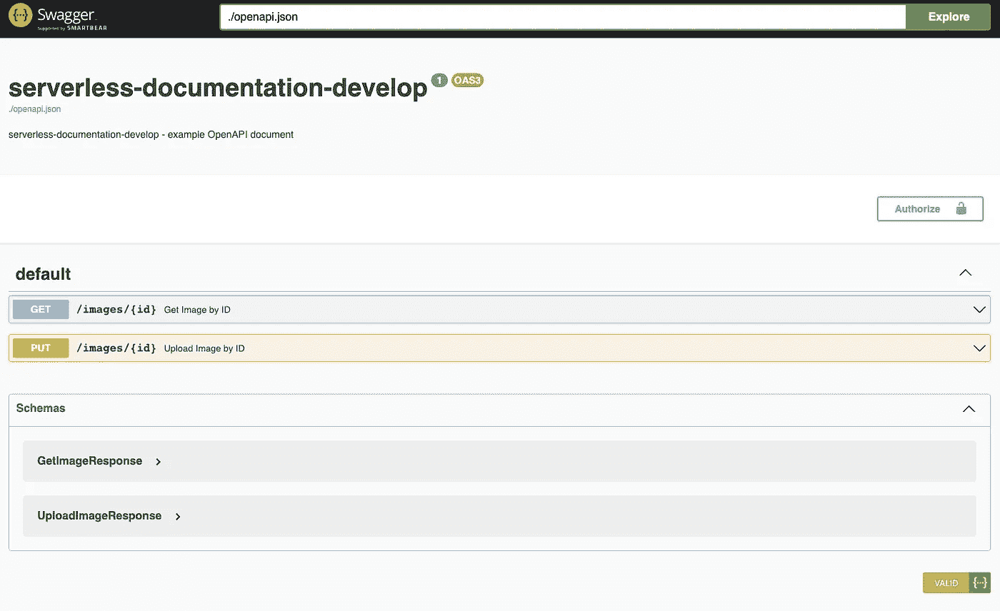

我们托管的开放 API 文档示例

正如你从我们的`./docs/openapi/static`文件夹中看到的，我们正在使用[https://github.com/swagger-api/swagger-ui/tree/master/dist](https://github.com/swagger-api/swagger-ui/tree/master/dist)资源库中的`dist`文件夹来允许我们在 S3 上正确地托管生成的`openapi.json`文件！

> *💡*您还可以将 S3 存储桶设为私有，只允许使用 VPN 的用户访问它——尽管本文没有涉及这一点。

## **代码文档**

部署完成后，无服务器 s3 插件将获得生成的 TypeDoc 代码文档，并为我们在 S3 上公开托管它！以下配置允许我们这样做:

```
s3Sync:
   - bucketName: ${self:custom.docsBucket}
     localDir: docs/documentation
     acl: public-read
```

> *💡*您还可以将 S3 存储桶设为私有，只允许使用 VPN 的用户访问它——尽管本文没有涉及。

如果您现在转到 docs AWS S3 存储区，您将能够查看您生成的解决方案文档！比如:`[https://s3-documentation-develop.s3.eu-west-1.amazonaws.com/index.html](https://s3-documentation-develop.s3.eu-west-1.amazonaws.com/index.html)`:

**索引页**

下面的屏幕截图显示了文档的自动生成索引页面，该页面在右侧列出了 lambda 函数:

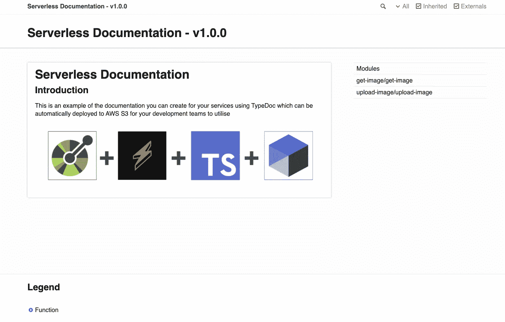

为解决方案文档生成的索引页

**单个λ函数**

下面的屏幕截图显示了当点击索引页面右侧的链接时自动生成的 lambda 函数页面:

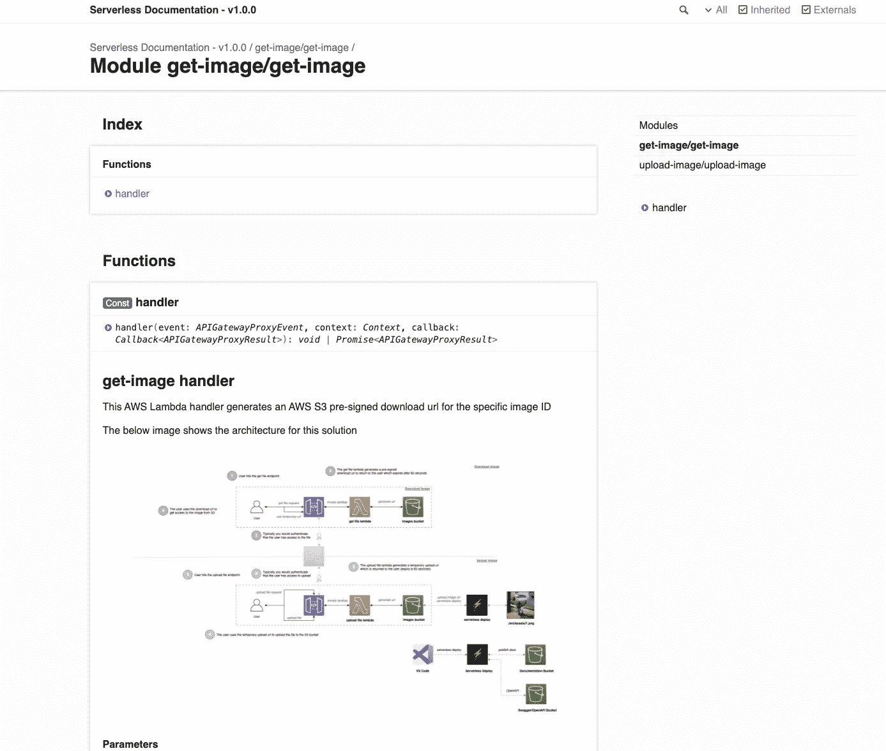

自动生成的 lambda 函数文档页面之一

> *💡*显然，你可以为你的任何代码生成文档，而不仅仅是像这个非常基本的例子中的 lambda 处理程序。

在根文件夹中有一个运行`npm run docs`的 [husky 预提交钩子](https://www.npmjs.com/package/husky),所以在提交时，你的文档总是自动更新，以防你忘记！

## ADRs ( *架构决策记录*)

接下来是架构决策记录！要添加新的 ADR，您可以运行以下命令:

`npm run adr:new — “add typedoc”`

这将在`\docs\adr`文件夹中为您生成一个新的 ADR，如下所示:

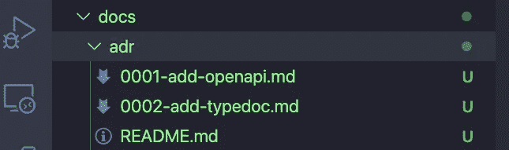

显示 ADR 文件夹的屏幕截图

您可以看到，您做出的每个架构决策都将有一个编号的 ADR，以及一个索引 read me 页面:`README.md`

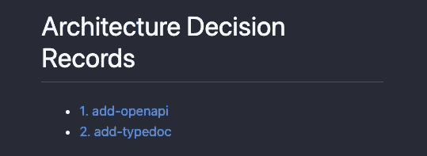

降价索引页面的屏幕截图

随后，您可以使用以下命令`npm run adr:list`列出您的 ADR，该命令将在您的终端中显示以下内容:

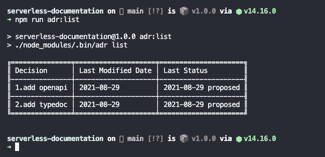

显示您的 ADR 详细信息的屏幕截图

要更新现有的 ADR，您可以运行`npm run adr:update — “add typedoc"`，即通过按键

如果您想在本地生成一个 HTML 版本的 ADRs，那么在运行`npm run adr:export`之后，您会在根文件夹中看到一个`export.html`文件:

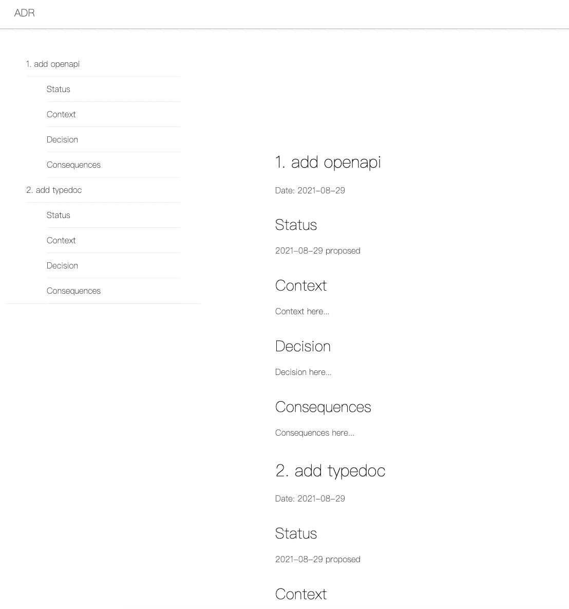

自动生成的 ADR 屏幕截图

> *🛑*
> 
> *💡您也可以像我们在上面为 OpenAPI 和代码文档所做的那样托管您生成的 ADR！*

# 测试 API！🎯

如果您愿意，您可以通过运行原始文章中概述的测试步骤来测试实际的功能 API(**然而，本文纯粹是关于生成和托管无服务器文档**

[](/serverless-s3-pre-signed-urls-e52eebad8d2d) [## 无服务器 S3 预签名网址🚀

### 一个在您的无服务器解决方案中使用 AWS S3 预签名 URL 的实例，以及支持代码示例…

levelup.gitconnected.com](/serverless-s3-pre-signed-urls-e52eebad8d2d) 

# 包扎

**作为一个记录您自己的无服务器解决方案的简单示例，我希望您发现这很有用！**

我很乐意就以下任何一个问题与您联系:

[https://www.linkedin.com/in/lee-james-gilmore/](https://www.linkedin.com/in/lee-james-gilmore/)
https://twitter.com/LeeJamesGilmore

如果你觉得这些文章鼓舞人心或有用，请随时用虚拟咖啡[https://www.buymeacoffee.com/leegilmore](https://www.buymeacoffee.com/leegilmore)来支持我，不管怎样，让我们联系和聊天吧！☕️

如果你喜欢这些帖子，请关注我的简介[李·詹姆斯·吉尔摩](https://medium.com/u/2906c6def240?source=post_page-----39c4f4ae5aff----------------------)以获取更多的帖子/系列，不要忘记联系我并打招呼👋

如果你喜欢，也请使用帖子底部的“鼓掌”功能！( ***可以不止一次鼓掌！！*** )

**本文由**[**sedai . io**](https://www.sedai.io/)赞助


如果您喜欢这篇文章，您可能也会喜欢以下内容:

[](/serverless-load-testing-at-scale-with-artillery-53ef6c8b77f7) [## 火炮规模的无服务器负载测试🚀

### 使用无服务器框架和大炮，对无服务器应用程序进行负载、冒烟、功能和模糊测试

levelup.gitconnected.com](/serverless-load-testing-at-scale-with-artillery-53ef6c8b77f7) [](/serverless-api-to-api-authentication-d4cb4472721e) [## 无服务器 API 到 API 认证🚀

### 使用 OAuth2 客户端凭证使用 Amazon Cognito 验证 API 到 API 集成的实用指南…

levelup.gitconnected.com](/serverless-api-to-api-authentication-d4cb4472721e) [](/serverless-lambda-storage-options-6c483d1fa990) [## 无服务器 Lambda 存储选项🚀

### 使用 Lambda 临时存储的实际示例，S3 和 EFS 作为比较，利用无服务器框架…

levelup.gitconnected.com](/serverless-lambda-storage-options-6c483d1fa990) [](/serverless-lambda-layers-d8f8374404e3) [## 无服务器 Lambda 层🚀

### 在 Lambda 中使用无头浏览器使用 AWS Lambda 层生成屏幕截图的实际示例

levelup.gitconnected.com](/serverless-lambda-layers-d8f8374404e3) [](/serverless-lambda-destinations-146f8b3c3456) [## 无服务器 Lambda 目的地🚀

### 充分利用 lambda 目的地粘合代码..

levelup.gitconnected.com](/serverless-lambda-destinations-146f8b3c3456) [](https://leejamesgilmore.medium.com/enterprise-serverless-series-358be237b510) [## 企业无服务器🚀(系列)

### 自从 lambda 成立以来，我主要在许多大型企业项目的无服务器领域工作…

leejamesgilmore.medium.com](https://leejamesgilmore.medium.com/enterprise-serverless-series-358be237b510) 

# 关于我

"*大家好，我是 Lee，英国的 AWS 认证技术架构师和首席软件工程师，目前是技术云架构师和首席无服务器开发人员，过去 5 年主要从事 AWS 上的全栈 JavaScript 工作。*

*我认为自己是一个无服务器布道者，热爱 AWS、创新、软件架构和技术。*

****提供的信息是我个人的观点，我对信息的使用不承担任何责任。*****