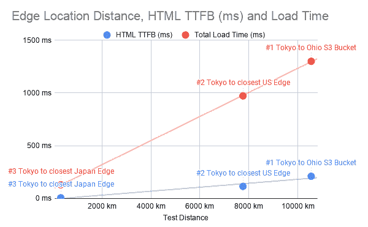

# Cloudfront 对 SEO 有影响吗？让我们在一个 S3 静态站点上设置并测试它！

> 原文：<https://levelup.gitconnected.com/does-cloudfront-impact-seo-lets-set-it-up-on-an-s3-static-site-and-test-it-6b1cb0a7386a>

这是我关于用 AWS 进行静态站点 SEO 的系列文章的第五篇。在上一篇文章中，我们[将静态网站上传到亚马逊 S3](https://trevorfox.com/2020/03/hosting-your-static-site-with-amazon-s3/) ，这样它就可以在网上公开访问了。在这篇文章中，我们将超越静态网站基础知识，开始讨论 Cloudfront CDN 如何影响加载速度和 SEO。耶！我们*终于要开始谈论 SEO 了*！

这篇文章将关注 SEO 的一个重要因素:速度。我们将首先分解一些首字母缩写词，然后我们将讨论如何使用 Cloudfront CDN 让您的网站变得更快。幸运的是，这一切都很简单，但是对于所有的搜索引擎优化:魔鬼在细节中。我们开始吧！

*   [**Cloudfront CDN 是如何工作的？**](#how)
*   [**Cloudfront CDN 如何提高 SEO？**](#seo)
*   [**Cloudfront CDN 实例速度测试**](#test)
*   [**在 S3**](#s3) 为静态站点搭建 Cloudfront CDN

## Cloudfront CDN 是如何工作的？

速度是最重要的。 [Cloudfront](https://aws.amazon.com/cloudfront/) 是 AWS 提供的内容分发网络(CDN)服务。如果你不熟悉 CDN 是做什么的或者它们是如何工作的，这个概念是非常简单的，即使技术是非常先进的。

图片来自:[https://aws.amazon.com/cloudfront/features/](https://aws.amazon.com/cloudfront/features/)

简而言之:CDNs 将你的内容从你的网络服务器(或者在我们的例子中，位于俄亥俄州的 S3 桶)分发到世界各地的多个其他服务器，称为“边缘位置”这些边缘位置缓存(存储副本)您的内容，以便在世界不同地区更容易获得。

这样，当有人在日本东京请求你的网站时，这些请求就不必一路跑到俄亥俄州的 S3 桶。相反，CDN 智能地将他们的请求路由到东京的边缘位置。这缩短了距离，减少了延迟，这意味着你的网站在世界各地加载速度更快！

## Cloudfront CDN 如何提高 SEO？

速度固然重要，但 CDN 对 SEO 的影响更大。搜索引擎希望为用户提供相关的网页内容和全面的良好体验。人们讨厌速度慢的网站，所以谷歌必须将这一点纳入他们的排名，以确保整体良好的体验。

搜索引擎青睐速度更快的网站还有一个不太明显的原因:它们必须抓取这些网站。对于谷歌来说，当涉及到运行抓取网页的服务器的能源成本时，时间就是金钱。如果一个网站很慢，实际上他们爬这个网站比爬一个更快的网站花费更多！这就是为什么 cdn 和缓存很重要。(我们将在以后讨论缓存。)

## 搜索引擎机器人和爬行

使用 CDN 还有第三个 SEO 好处。这是一个有点高级的用例，但是如果你的网站做了大量的 Javascript 客户端渲染，你可以使用 CDN 将[服务器端渲染(SSR)页面交付给搜索引擎机器人](https://aws.amazon.com/lambda/edge/)。这减少了搜索引擎抓取你的页面所花费的时间(和金钱)。

服务器端呈现也意味着搜索引擎不必(或能够)仅仅为了解析站点内容而呈现 Javascript。对于搜索引擎来说，这是一件相对昂贵的事情。好处是，由于搜索引擎不必花费太多精力来抓取和呈现您的内容，您可能会看到更高的抓取率，这意味着您将在搜索引擎索引中拥有更新鲜的内容。这对 SEO 来说非常好，尤其是对于非常大的动态网站。要做到这一点，你必须使用提供边缘功能的 CDN，如 [Cloudfront Lambda](https://docs.aws.amazon.com/AmazonCloudFront/latest/DeveloperGuide/lambda-at-the-edge.html) 和 [Cloudflare Workers](https://workers.cloudflare.com/) 。

如果你想了解更多关于为 SEO 部署 Cloudfront 的信息，请查看本演示文稿。

但是就我们的目的而言，我们最关心的是内容交付的速度。所以我们来看看 CDN 是如何提高速度的。

## Cloudfront CDN 示例速度测试

万一你和我一样，不相信你读到的一切，这里有一个并排的 [Pingdom](https://www.pingdom.com/) 网站速度测试，观察使用 Cloudfront CDN 的效果。这两项测试都在日本东京进行。第一个测试直接从俄亥俄州的 S3 水桶请求新网站的主页，第二个测试在我将我的网站部署在 Cloudfront 上之后请求该网站。

## [测试#1](https://tools.pingdom.com/#5c643b8932800000) :从日本到俄亥俄州的 S3 水桶

## [测试#2](https://tools.pingdom.com/#5c64d3d88e000000) :当 Cloudfront 价格等级设置为“仅使用美国、加拿大和欧洲”时，从日本到最近的边缘位置

## [测试#3](https://tools.pingdom.com/#5c643c0335c00000) :当 Cloudfront 价格等级设置为“使用所有边缘位置(最佳性能)”(日本也可能如此)时，从日本到最近的边缘位置

我不确定为什么 Pingdom 没有渲染这最后一个…

在每一个测试中，最显著的区别是每个请求的“等待时间”Pingdom 的等待时间是对到达第一位的时间(TTFB)的度量，它的意思是，*所请求资源的第一位到达浏览器需要多长时间*。虽然考虑到 javascript 和 CSS 等资源依赖于要加载的初始 HTML 文档，但这是一个非常重要的指标。

测试#1 中的瀑布图

**这里是每个测试的 HTML 文档的 TTFB:**

*   [测试#1](https://tools.pingdom.com/#5c643b8932800000) 从日本到俄亥俄州的 S3 桶: **210 ms**
*   [测试#2](https://tools.pingdom.com/#5c64d3d88e000000) :从日本到“美国、加拿大和欧洲”最近的地点: **114 毫秒**
*   [测试#3](https://tools.pingdom.com/#5c643c0335c00000) :从日本到最近的全球位置(日本): **6 ms！！**

正如我们所看到的，TTFB 随着请求必须经过的距离而线性增加。 **CDNs FTW！**

希望这足以让你相信使用 CDN 是一个好主意。即使这个测试没有直接证明排名的提高，你可以打赌你的网站的观众会欣赏减少的延迟和改善的加载时间。

现在让我们通过设置 Cloudfront 来交付托管在 S3 上的静态站点。

## 为 S3 托管的静态站点设置 Cloudfront CDN

注意:此配置允许对您网站的桶进行公共读取访问。更多信息，请参见[访问网站所需的权限](https://docs.aws.amazon.com/AmazonS3/latest/dev/WebsiteAccessPermissionsReqd.html)。

在上一篇文章中，我们把一个静态站点加载到了 S3，所以这篇文章假设你已经完成了。否则，回到，让你的网站加载到 S3。

*   转到[**https://s3.console.aws.amazon.com/s3/buckets/**](https://s3.console.aws.amazon.com/s3/buckets/)，选择托管静态站点的存储桶。
*   点击**属性**选项卡
*   点击**静态网站托管**框，打开静态网站托管对话框。

**注意#1:** 在接下来的步骤中，使用上面显示的静态网站托管端点非常重要。就是那个长得像<你的桶名>的。**S3-网站。**<your-bucket ' s-region>. Amazon AWS . com 这个以后真的很重要。

**注意#2:** 在上一篇文章中，您应该已经为 bucket 设置了公共读取权限。

*   [创建一个 CloudFront **web** 分发](https://docs.aws.amazon.com/AmazonCloudFront/latest/DeveloperGuide/distribution-web-creating-console.html)。选择**“Web”**作为发送方式。
*   在**源域名**字段中，输入您在步骤 2 中复制的端点。

*   将**原点路径**留空。你的网站*应该在你的桶的根目录下*。

**注意#3:** 暂时不用担心 **SSL (HTTPS)** 或者**备用域名**。我们将在下一篇文章中回到这个话题。

*   对于**查看器协议策略**，选择“重定向 HTTP 到 HTTPS”，因为它很酷。我们稍后也会回到这个话题。
*   选择符合您需求的**价格等级**。对于低流量的网站，每个选项都很便宜，但是你可以根据你想要优化加载时间的地理位置来选择你需要的最佳选项。
*   保留所有其他设置的默认设置。
*   选择**创建分配**。

现在坐下来等着吧！Cloudfront 会将您的内容传播到您根据价格等级选择的边缘位置。

**你的网站很快就可以通过一个类似于[https://d1ix3q7vxbh8zd.cloudfront.net/](https://d1ix3q7vxbh8zd.cloudfront.net/)的 Cloudfront 网址**访问了

## **速度测试你的云锋分布**

想要运行上面提到的测试吗？

1.  转到[https://tools.pingdom.com/](https://tools.pingdom.com/)
2.  在您的公共 S3 端点中输入静态站点的 URL(<your-bucket-name>)。**S3-网站。**<your-bucket ' s-region>. Amazon AWS . com)</your-bucket-name>
3.  然后用你新的 Cloudfront URL(https://<blah-blah-blah>. Cloudfront . net/)试试。</blah-blah-blah>
4.  试验 Cloudfront 价格等级和 Pingdom 位置，看看 CDN 的边缘位置如何影响 TTFB 和加载时间。

## 走向

我希望你有工具来理解为什么 CDN 的影响 SEO 和如何设置它们。如果你有任何问题，请在下面的评论区留言。

在下一篇帖子中，我们将*最后*更多的网站改成自己的带有 HTTPS 的自定义域名！