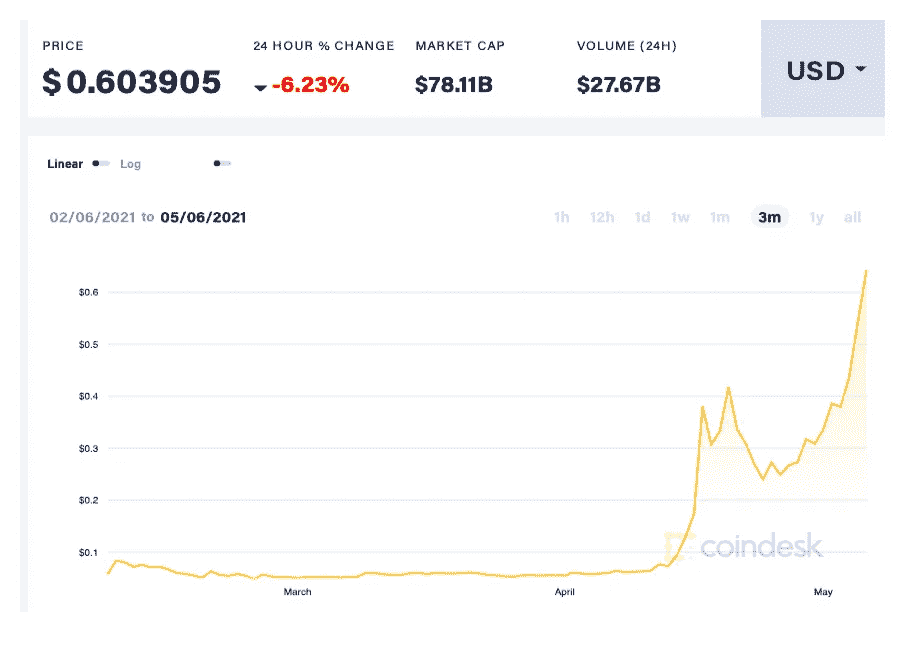

# 除了展示迷因的力量，Dogecoin 还有什么真正的价值吗？

> 原文：<https://levelup.gitconnected.com/does-dogecoin-have-any-genuine-merit-besides-demonstrating-the-power-of-memes-d4e69657f02c>

## 埃隆知道什么我们不知道的？

图片来自 [Shutterstock](https://www.shutterstock.com/image-photo/focus-select-blur-dogecoin-cryptocurrency-silver-1965542140)

我相信你现在已经知道 Dogecoin 了。

这是一种另类硬币，最初只是一个笑话，截至今天，其市值为 781 亿美元。今年二月中旬，当我最后一次写 doge coin T3 时，它的市值只有 80 亿美元。

你们当中精明的人会注意到，在不到 3 个月的时间里，增长了近 10 倍。难怪那些处于 crypto 边缘的人持怀疑态度——随意地抛出“波动性”和“泡沫”这两个词，好像他们是第一个注意到这一点的。

在[的那个故事](/deconstructing-dogecoin-not-all-cryptocurrencies-are-equal-ee347b29700f)中，我分享了我对加密货币 Dogecoin 的看法——看起来很奇怪，像埃隆·马斯克(Elon Musk)和说唱歌手史努比·多格(Snoop Dogg)这样的名人影响者对加密货币的价格拥有如此大的影响力，并且可以通过一些适时的推文影响其价格。我担心与 Dogecoin 和类似另类硬币相关的巨额资金可能会以某种方式玷污比特币和以太坊等更成熟、更合法的加密货币的声誉。

就像我从远处欣赏的比特币最大化主义者一样，我倾向于把 Dogecoin 看做一个新奇的东西，一个微不足道的烦恼——一个因其狂热追随者而着迷的对象，仅此而已。当然没什么可认真对待的。

然而，两个多月后的今天，Dogecoin 已经冲向了更高的高度:

来源: [Coindesk](https://www.coindesk.com/price/dogecoin)

我最初的印象仍然没有改变——我仍然不能让自己认为多吉只是一个有趣的人物。但与此同时，我也很内疚，我后悔当初没有在价格还不到现在的六分之一时买几个 Dogecoin。

我有一箱 FOMO 密码。这是个糟糕的例子。

# 我是一只秘密的狗，来自 FOMO

忏悔时间——几周前，我再也无法忍受了。

在一个无所事事的周六晚上，当我的妻子和孩子在看一些乏味的电视真人秀节目时，我决定买几个热狗。数量很少——事实上不到 100 美元。你可以在上面的图表中看到第一次上涨后，我在 4 月中旬买入，当时价格在 0.30 美元左右。

当然，我的钱在今天的价格基础上名义上翻了一倍，但我无法摆脱这样的想法:如果我在第一次写 DOGE 的时候买了，我现在已经有 10 倍的投资了。

对于那些来投资的人来说，我似乎正在经历一个重要的加密经历；绝望、遗憾、假设和假设。

*为什么我第一次意识到它的时候不买？如果我多买了一些会怎么样？
要是我早年对加密感兴趣就好了——我现在可能已经很富有了。*

我们对投资感到焦虑、争论和拖延，担心我们错过了最好的收益或者我们会在市场顶部买入。

当我们做了一笔投资后，我们会再次烦恼、争论和拖延是卖掉还是继续持有，以防错过进一步的收益。

如果你允许的话，FOMO 在投资的整个过程中都扮演着自己的角色。

这些情绪[并不是加密投资者](/the-basics-of-bitcoin-what-ive-learned-so-far-as-a-crypto-newbie-6847056a7b5c)的专利。它们适用于所有投资，并且一直如此。无论我们选择的投资是股票、房地产、大宗商品还是养老基金，当形势好、市场上涨时，我们都会后悔没有早点介入。当价格暴跌时，我们希望早点套现。

如果我对 Dogecoin 有一个策略(除了购买它来分散我对垃圾电视的注意力之外),它可能是抓住我所拥有的，并不时地多买一点。和其他事情一样，持有 DOGE 是一种保险，以防有一天我不得不遗憾地回顾我以 50 美元的利润卖掉我的硬币的时候，它们现在可能值这么多。当然，风险是它会崩溃或者干脆不存在，在这种情况下，我已经失去了我最少的股份。

# Dogecoin 是不是突然有点可取之处了？

在我最初的作品中，我把 Dogecoin 说得一无是处，我不想让人觉得我是个彻头彻尾的伪君子。我以前分享的观点仍然适用。

毫无疑问，埃隆·马斯克通过他在 Twitter 上的行为对它的价格产生了不相称的影响。最近一条调侃他即将在周六夜现场亮相的推文意味深长:

来源:[推特](https://twitter.com/elonmusk/status/1387290679794089986?s=20)

他的时间线上散落着其他暗示他对 Dogecoin 热情的推文:

来源:[推特](https://twitter.com/elonmusk/status/1284291528328790016?s=20)

像马斯克这样的人能够通过自己的行动影响市场并不罕见。但是他有将近 5300 万粉丝，这种推文的影响似乎是解释 DOGE 价格变动的最重要的因素。大多数人都很难给出其他解释。

我最初的想法依然如故。最根本的是，我担心的是，像我们现在看到的 DOGE 这样的事件，在证明数十亿美元的资产可以如此容易地被操纵时，在某种程度上更普遍地使加密货币失去了合法性。

这给比特币和以太坊最近几个月取得的同样令人印象深刻的收益蒙上了负面阴影，这要归功于高层人士的一两条热情的推文。主流金融机构对比特币更广泛的接受和采用是可以合理解释比特币如何升值的一个因素(例如)。

# 那么 Dogecoin 的优点是什么呢？

Nathaniel Whittemore 是每日播客“The Breakdown”的主持人，他最近播出了一个关于 DOGE 崛起的精彩节目，并展示了这条推文收到的一些回复:

来源:[推特](https://twitter.com/nlw/status/1389574984708804610?s=20)

我精心挑选了一些引起我共鸣的“胜利”,为了简洁起见，对它们进行了解释。如果我试图在 Dogecoin 本身以及作为加密货币的整体“大使”背后看到一些真正的价值，这些因素似乎是有意义的。

*   **这是投资加密的入门药物**——doge coin 就像加密货币友好、无威胁的面孔，允许人们涉足这个领域。假以时日，他们会自我教育，并有望做出更明智的投资(*推特用户:Prayerabolic* )
*   它利用互联网迷因的力量，将其转化为真实的东西——人类的能量现在实际上是一种货币。如果我们能团结起来，我们就能凭空创造财富，这是一件美好的事情。Doge 向我们展示了没有任何主流支持也是可能的。(*推特用户:LATX91* )
*   **它展示了区块链技术的安全性和弹性**——doge coin 基于两年未维护的代码，它本身是 2011 年比特币的副本，但它仍在运行并保持安全。这显示了比特币区块链的极端潜在安全性。(*推特用户:内森 _ 鲁德曼*)

虽然最初的推文宣称 Dogecoin 是比特币的一个巨大的“去你妈的”,但我挑选的论点似乎相当合理和相关。

互联网文化、模因和影响力过大——这些都是我们当今文化中不可避免的重要力量。不可否认，Dogecoin 令人印象深刻的是，它的遗产和它的进化方式植根于并主要归因于这些因素。

这本身令人印象深刻，如果不是令人欣慰的话。

## 马斯克不只是关于 DOGE

Dogecoin 的最后一个积极方面是——尽管埃隆·马斯克对 Dogecoin 很感兴趣，但他也是比特币的知名倡导者，私下投资比特币，并通过特斯拉投资，特斯拉持有大量比特币作为其国库的一部分。这种联系肯定会带来一些善意——有点像马斯克吸引人们对整个加密的关注(使用 DOGE)，并通过特斯拉证明加密作为去中心化金融工具(使用比特币)具有真正的效用和价值。

我不认为这是信仰的飞跃，是吗？

# 我对总督的恐惧依然存在

我仍然担心，随着 Dogecoin 的价格越来越高，随着市场上产生越来越多的泡沫，越来越多的投资者购买它，希望获得大胆的利润，这将在密码怀疑论者和更广泛的人群中引发怀疑。“泡沫”这个词将被广泛而频繁地使用。

如果这样的事件重复发生，越来越多的人会开始相信*所有的*密码都是迷因驱动的。他们会怀疑比特币、以太坊和其他区块链技术的真正和合法价值。他们的怀疑和愤世嫉俗之火将被点燃。

当价格在让少数幸运的人变得更富有后崩溃时，迟早会有许多人被套牢，损失超过他们的承受能力。它很可能会在一个比以前更高的新低点停止下降——没有迹象表明它会完全消失。但是会有一些人承担了超出他们承受能力的风险，最终会遭受财务损失。他们的故事会流传开来。

华尔街 Bets 和 GameStop 也是如此。同样的事情以前已经发生过无数次了。但这将是另一个这样的事件，被视为加密的代表，以及人们如何被它烧伤。

最后，还有监管的角度。

加密货币是自主的、不受监管的，而且可能会长期如此。如果像目前 Dogecoin 事件那样出现大量经济损失，政府干预的危险就会增加。

如果发现像马斯克这样的人物在出售前故意操纵价格，以夸大自己的利润，那么我想会有监管和法律方面的反弹，特别是如果这导致许多小投资者因被热情的推文吸引而损失惨重。

严酷的教训是，买家应该小心——但众所周知，当私人公民一再表现出无力明智地保护自己时，政府会代表他们进行干预。

# 最终想法

坦白的感觉真好，敞开了我的灵魂。现在公开了我有几只狗，我觉得没那么脏了。这并不意味着我在比特币或以太坊(或 Ripple)上作弊——我可能也在那个乏味的周六晚上买了几个……抱歉！).我对他们的信念依然坚定。

参与加密投资需要学习很多东西——不仅仅是技术和它的历史，还有投资的情感和心理方面。与 FOMO 打交道，管理与 Dogecoin 等公司相关的分心和炒作是其中很大一部分。

我将继续饶有兴趣地观察，并一如既往地被提醒只冒我能承受的风险。无论你投资什么硬币，我鼓励你也这样做(不是我在这里给理财建议！)

如果你喜欢阅读这样的故事，并且愿意支持 Medium 上的作家，考虑注册成为 Medium 会员。一个月 5 美元，给你无限的故事。如果你注册使用我的链接，我会赚一小笔佣金。

 [## 阅读托比·黑兹伍德(以及媒体上成千上万的其他作家)的每一个故事

### 作为一个媒体会员，你的会员费的一部分会给你阅读的作家，你可以完全接触到每一个故事…

tobyhazlewood.medium.com](https://tobyhazlewood.medium.com/membership)  [## Safe moon——被称为“加密的最新庞氏骗局”的 DeFi 令牌——有多安全

### 投资机会还是骗局？

levelup.gitconnected.com](/how-safe-is-safemoon-the-defi-token-described-as-cryptos-newest-ponzi-b49ddc1c9a4f) 

注:*本文仅供参考。不应将其视为财务或法律建议。在做任何重大财务决定之前，先咨询财务专家。*

## [如果你喜欢这篇文章，我希望你能加入我的邮件列表。](http://bit.ly/TobyHazlewoodList)