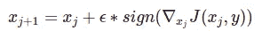
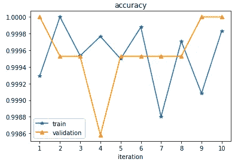
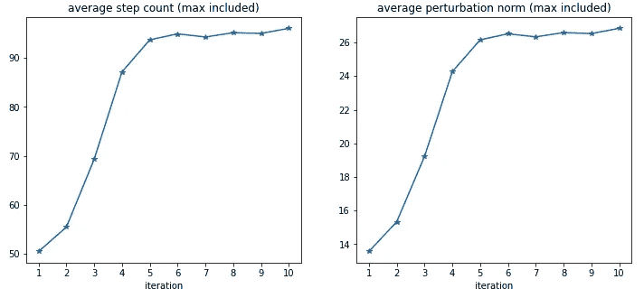
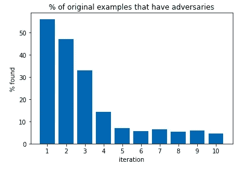
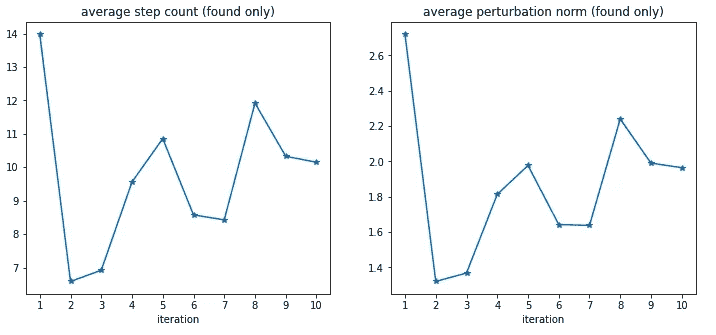
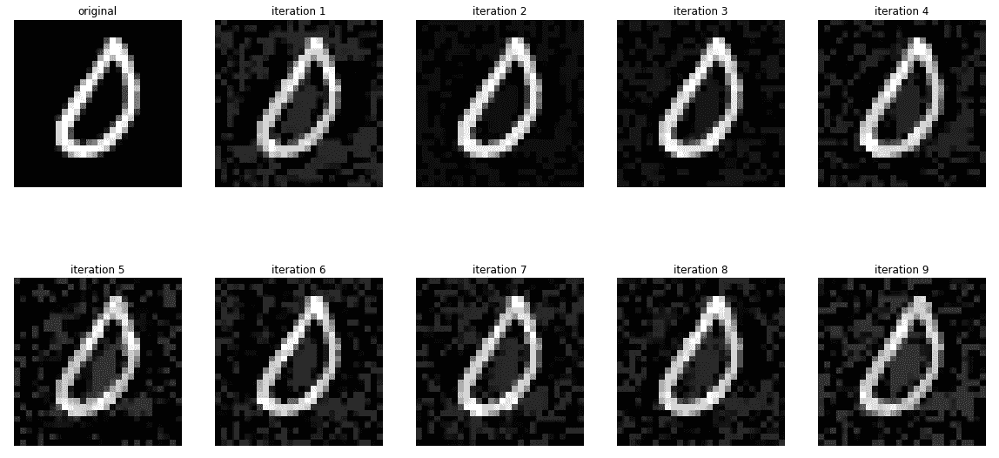
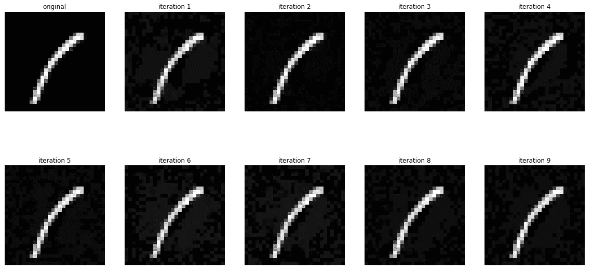

# 迭代对抗训练能击退白盒对抗攻击吗

> 原文：<https://levelup.gitconnected.com/does-iterative-adversarial-training-repel-white-box-adversarial-attack-30c655f6016>

**从定量和定性两个方面探究它如何有效地防止对立范例的白盒生成**

> **背景**

机器学习容易出现对立的例子——专门制作的有针对性的输入数据，以欺骗模型并导致错误的输出。对抗性训练是一种防御这种攻击的技术，通过故意产生对抗性的例子来增加训练数据集，希望提高模型的鲁棒性。那么，一个自然的问题是，它能走多远——如果我们用对抗性训练迭代，这个模型会如何进化？

**实验设置**

为了研究这个问题，让我们在这篇博文中构建一个简单的图像分类实验。我们使用 MNIST 数据集，它包含手写数字的 28x28 灰度图像。为了使它更简单，我们过滤掉所有其他数字，并且只专注于为数字 0 和 1 训练二进制分类器。培训方案描述如下:

1.  为模型选择神经网络体系结构。
2.  将数据集拆分为训练数据集`t0`和验证数据集`v0`。
3.  使用`t0`训练模型，并使用`v0`进行验证。
4.  在`t0`中为每幅图像生成一个反例。我们把这个迭代中所有的对抗性例子都叫做`adv_i`。
5.  使用`{t0, adv_1, …, adv_i}`训练模型的新实例，使用`v0`验证模型。
6.  回到步骤 4，现在`i->i+1`。重复，直到达到预定义的迭代次数。

有几点需要注意:

*   我们选择一个非常简单的模型架构。请参见下面的代码片段。我们甚至不用卷积层。如果你想重现这个实验，请随意选择一个更复杂的架构。

```
model = tf.keras.models.Sequential([
  tf.keras.layers.Flatten(input_shape=(28, 28, 1)),
  tf.keras.layers.Dense(128, activation=’relu’),
  tf.keras.layers.Dropout(0.2),
  tf.keras.layers.Dense(64, activation=’relu’),
  tf.keras.layers.Dense(1, activation=’sigmoid’)
])
```

*   在每次迭代中，从原始训练数据集`t0`中生成对立的例子。我们不想因为从以前的对立例子中产生新的对立例子而使实验复杂化。
*   我们总是使用原始验证数据集`v0`进行性能评估。这是为了让我们有一致的度量来比较迭代。
*   最后，我们使用迭代梯度符号法来产生对立的例子。对于原始训练数据集 t0 中的每个图像，通过迭代地添加少量扰动来创建其对立的例子。扰动是相对于输入的损耗梯度的逐元素符号。参见下面的公式。直觉是，我们将输入朝着导致输出更大损失的方向递增(所谓的梯度上升)。



迭代梯度符号法公式。图片作者。

> **可观测量**

现在，我们想要在迭代中跟踪什么？我们想看看对抗性训练是否会使产生对抗性例子变得更加困难。具体地说，回想一下我们使用迭代梯度符号方法来生成对立的例子。我们想看看需要多少步骤才能生成一个将模型推向错误分类的例子。此外，我们还跟踪原始图像和对立示例之间的差异的范数，以测量它需要的扰动，以便欺骗模型。直观上，更多的步骤和更大的范数意味着更难生成对抗性的例子，这反过来意味着该模型对白盒攻击更健壮。

只是为了在这个过程中设置一个界限，我们将每步的ϵ=0.01(增量梯度符号的系数)限制为 100 max。所有图像都归一化为[0，1]。所以理论上这个过程允许完全翻转每一个像素。如果在 100 步之后，它仍然不能产生一个可以导致`|prediction — label|>0.5`的对立例子，我们就放弃那个图像。在这种情况下，对于该图像，我们将步长记录为最大值 100，将 norm 记录为最大值 28(假设每个像素增量为 1)。

此外，我们还关注模型性能，以防由于该过程不断向模型训练中引入噪声样本而导致任何降级。

> **结果**

我们在 10 次迭代中对模型进行了对抗性训练，每次迭代有 5 个时期。模型性能几乎没有变化(度量是在每次迭代的最后一个时期之后获得的)，这是很好的。



跨迭代的准确性。图片作者。

我们可以看到，随着平均步长和平均范数变得越来越大，产生对立的例子变得越来越困难。



迭代中的平均步骤和范数(包括最大值)。图片作者。

然而，不要忘记，我们在这个过程中有一个界限，如果我们在 100 步内找不到图像的对立示例，我们会记录最大步数和范数。画出我们能找到对立例子的图像的百分比，我们确实看到它在下降。



反覆项目中对立范例的百分比。图片作者。

但是，如果我们只看统计数据，我们发现了一个对立的例子，平均步骤和平均规范的趋势是不确定的。



迭代中的平均步骤和范数(仅找到)。图片作者。

事实上，如果我们放大检查一个特定的例子和它在迭代中的对手，所需要的扰动量似乎没有增加很多，这与上面的度量一致，即我们发现在迭代中对手的例子的平均步骤和平均范数没有太大变化。



一个 0 示例及其在迭代中的对手。图片作者。



一个 1 的例子和它在迭代中的对手。图片作者。

> **结论**

实验表明，对抗性训练似乎减少了相同白盒攻击的表面——我们发现越来越少的对抗性例子。但这并没有从根本上提高标准——对于我们确实发现了对抗性例子的图像，它仍然非常琐碎，就好像模型没有经过对抗性训练一样。

检查这个[笔记本](https://github.com/eileen-code4fun/MachineLearning/blob/main/adversarial/adversarial.ipynb)中的完整代码在这个实验中使用。

# 分级编码

感谢您成为我们社区的一员！[订阅我们的 YouTube 频道](https://www.youtube.com/channel/UC3v9kBR_ab4UHXXdknz8Fbg?sub_confirmation=1)或者加入 [**Skilled.dev 编码面试课程**](https://skilled.dev/) 。

[](https://skilled.dev) [## 编写面试问题+获得开发工作

### 掌握编码面试的过程

技术开发](https://skilled.dev)