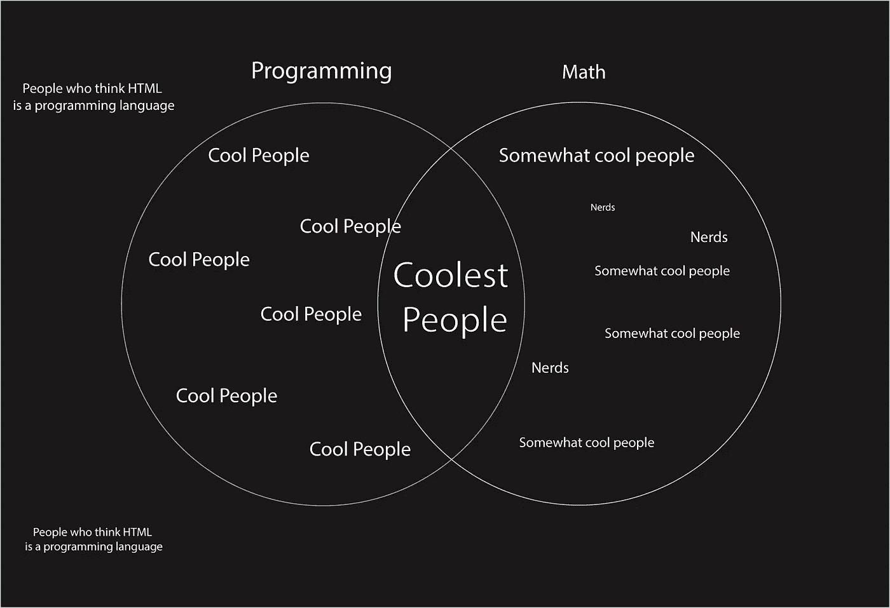

# 编程需要数学吗？为什么学习数学会让你成为更好的程序员

> 原文：<https://levelup.gitconnected.com/does-programming-require-math-why-learning-math-will-make-you-a-better-programmer-9e81a82dffa8>

# 编程需要数学吗？

似乎一般人都有一种先入为主的观念，认为数学和编程是一门相互交织的学科。要成为一名伟大的程序员，你还需要擅长数学。那么，编程需要数学吗？简而言之，是的编程总是需要至少少量的数学知识。然而，数学在编程中的应用程度会有很大的不同。作为一名软件开发人员，我相信你不需要成为一名数学家就能成为一名伟大的程序员。也就是说，数学的实践永远会让你在编程中受益。在这篇文章中，我希望解释为什么。

在我们开始之前，我想说明的是，直接适用于你工作的数学类型会因你想从事的行业而有很大的不同。作为一名 web 开发人员，我总是发现典型的商业数学已经足够让工作正常进行了。

然而，这与在数据科学等领域工作有着本质的不同。你需要微积分、线性代数和统计技能，否则你甚至不会触及到什么是可能的。在游戏开发中，即使是像 Pong 这样的基本街机风格的游戏，也比 Web 开发中的大多数高级主题需要更多的数学知识。

最重要的是，我有很多金融和精算行业的朋友，他们想学习如何编程，让自己成为更有价值的员工。即使他们的数学工作不需要太多或任何编程。

因此，在这一点上，我们已经承认编程确实与数学有着相当密切的关系。然而，你可能会松一口气，数学并不是成为一名伟大程序员的关键因素。那为什么要用编程学数学？嗯，这里有几个学习数学会让你成为更好的程序员的关键原因。

# 为什么要用编程学数学？

## 提高您的代码质量

学习数学对程序员来说如此有价值的一个主要原因是，它可以直接提高你的代码质量。作为程序员，我们必须努力找到解决问题的最简单的方法。易于理解的解决方案，产生更少的代码行，并减少引入错误的可能性。

数学是你用来解决问题的工具。所以强大的数学基础可以让这个过程变得容易很多。无论是编写代码还是理解他人。

例如，让我们说你想写一个函数，可以找到一个正整数的总位数。考虑到我们的编程工具集，我们可以想出很多方法来做到这一点。例如，我们*可以*这样写:

[https://gist . github . com/grant darling/8d 18 dadee 61 b 35 b 08 ea 83 ab 076 aa 601 f](https://gist.github.com/GrantDarling/8d18dadee61b35b08ea83ab076aa601f)

这段代码运行得非常好。尽管有许多不必要的步骤，并且需要多次转换数据类型。如果你有更强的数学基础，你可能会想到更好的数学解决方案。经过一些研究，我发现公式 log10(n)+1 用于查找正整数中的整数位数。让我们用我们的数学知识改写一下:

[https://gist . github . com/grant darling/f 577 f 0 FD 7 ECC 3a C4 a9 b 87 ea 9 e 76d 8 a5a](https://gist.github.com/GrantDarling/f577f0fd7ecc3ac4a9b87ea9e76d8a5a)

看看我们的代码有多干净？在相同的函数结构下，我们编写了更少的代码，需要更少的注释，并且从不改变数据类型。我还认为它更容易理解，也不太可能产生错误。所以我们的第一个发现是，通过编程学习数学将会产生更干净的代码实践！

## 增加就业机会和保障

作为一名程序员，扩展你的数学技能可以让你受益的另一个关键原因是，它将打开你原本无法获得的工作机会。不仅如此，它还增加了该领域内的工作保障。如果你花点时间想想，许多程序员都松了口气，满足于他们缺乏高级数学能力。这完全可以理解。

然而，这种对数学原理的缺乏理解造就了一大群不符合许多高薪、面向数学的编程工作要求的程序员。更糟糕的是，这让这些开发人员直接竞争不需要数学的工作。导致工作机会减少，竞争加剧。

这里有一个有偏见销售图来帮助说明我的观点:

*旁注:这并不意味着令人沮丧。世界各地对开发人员的需求仍然很高，这种想法不应该让你觉得没有数学就不能成为一名伟大的程序员。数学家也不是书呆子(除非他们是)。*

此外，即使你的工作不需要很多数学技能，这些技能在简历上看起来也很棒。你的潜在雇主会不可避免地认为你更聪明(即使你不是)，你的资历会让你在申请工作时受益。

在这一点上，我想传递一些我祖父在我年轻时给我的智慧，我拒绝在学校学习法语。他问道:“如果有两个完全一样的你去参加工作面试，但一个懂法语，另一个不懂。不考虑职位，你觉得谁更有机会得到这份工作？”。

这是一个简单明了的陈述。即便如此，作为一个孩子，它引起了我的共鸣。它证明了你的技能集合更能说明你学习的能力和意愿，而不是它能给团队带来的实际利益。不管怎样，我还是不会说法语。

## 改变你的思维方式

这就是数学的真正力量可以帮助开发人员/程序员的地方。它可以间接地改变你处理信息和解决问题的方式。从本质上改变你的大脑来看待不同的情况。

NYU 大学心理学教授 Clancy Blair 表示，数学可以提高推理和逻辑能力，解决问题和分析能力。所有这些都是计算机科学的支柱。成为一名伟大的程序员意味着抽象思维，这将有助于培养培养这种成长的技能。

## 打破可能的障碍

作为程序员，我们都有探索、构建和发现新事物的与生俱来的渴望，这种渴望既让我们兴奋，也对我们提出了挑战。我最近意识到，数学是我们打开代码隐藏潜力的明显障碍。

这么多神奇的领域都需要数学。机器人技术、机器学习、浏览器 web 应用程序自动化、图形引擎和游戏开发仅仅是你用成熟的数学技能和编程所能做的事情的皮毛。

这就是编程的美妙之处。它挑战你的极限，让你*想要*学习新的东西，而你以前可能会因为太难或与你的生活无关而忽视这些东西。但最终，它们都会让你成为更好的程序员。

## 一些智慧的遗言

虽然这篇文章试图对学习数学很有说服力(*，我相信这很重要*)。我想谈一些额外的想法。无论我们选择用时间做什么，总会有机会成本。如果我们在一项活动上花了时间，我们就再也没有时间去做别的事情了。

出于这个原因，我们需要专注于我们的主要目标，花大量的时间练习能让我们最快到达目标的技能。如果你想成为一名伟大的程序员，你需要大量编写代码*。*这意味着如果你还不是一个熟练的程序员，你花在学习数学*上的时间可能会更好地花在学习如何编程上。永远记住这一点！*

这就引出了我的第二点。你练习的任何技能都会有一个收益递减点。简单来说，这意味着当你在某件事情上投入更多的时间时，你开始从该活动中获得更少的实际利益。所以如果你已经对编程驾轻就熟，学习数学可能会给你带来比编程更多的好处。我最近试图将此视为一种平衡，在这种平衡中，应该更加重视编程，但随着你编码技能的提高，它们应该被你数学技能的提高所抵消。

至少这是一个开发者的观点。

# 最后

要成为一名伟大的程序员，练习编程技能是必不可少的。也就是说，学习数学是一项令人难以置信的脑力劳动，可以提高你的核心分析能力。

编程需要数学吗？不，至少不是真正的 T1。拥有一些算术知识和很强的逻辑思维能力，你可以成为一名优秀的、可雇佣的程序员。然而，这不应该阻止你学习数学。它可以提高你的代码质量，让你更容易被雇佣，改变你解决问题的方式，给你更大的灵活性来构建你的代码！

所以，帮你自己一个忙，通过发展你的数学技能，向成为更好的程序员迈出下一步。

如果你正在寻找一些伟大的免费资源来教你程序员的数学，这是一个惊人的开始:[计算机科学课程](https://github.com/ossu/computer-science)。

这对我帮助很大。编码快乐！

*原载于 2020 年 6 月 2 日 https://thecodebytes.com***。**