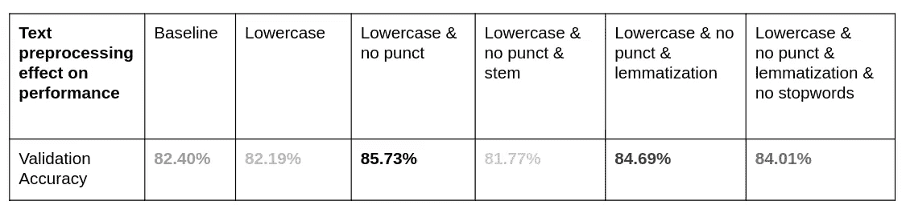
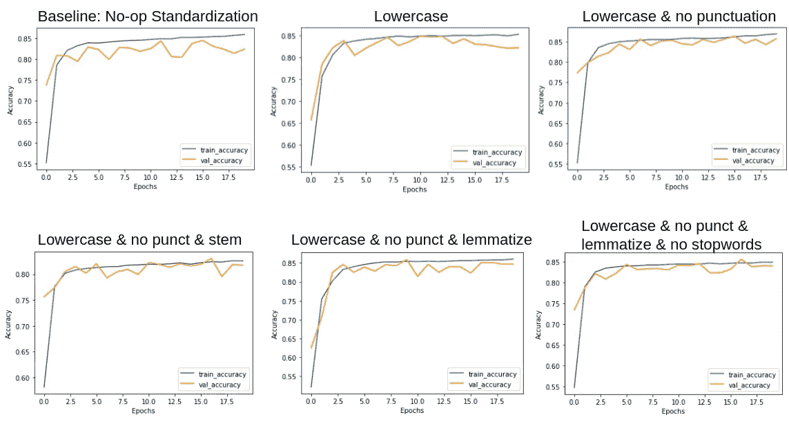

# 文本预处理是否影响自然语言处理性能？

> 原文：<https://levelup.gitconnected.com/does-text-preprocessing-affect-natural-language-processing-performance-ccadaaaab39b>

使用 Tensorflow 对各种文本预处理技术效果的实证研究。

说到自然语言处理，一个关键但经常被忽略的前置步骤是文本预处理。在将输入输入到模型中之前，有许多方法可以对其进行预处理。这篇博文实验并比较了各种文本预处理技术在情感分类任务中的效果。

感情分类例子摘自 [Tensorflow 教程网站](https://www.tensorflow.org/text/tutorials/text_classification_rnn)。我们将预测 IMDB 评论的正面和负面情绪。我们拥有的数据集是 50000 条高度极性的电影评论及其相应标签的列表——0 或 1，分为一半一半用于训练和测试。由于模型不是这篇文章的重点，并且在 Tensorflow 教程中已经有详细介绍，所以我们不会在它上面花太多时间。型号代码在文章末尾提供。它由一个文本矢量化层、一个嵌入层、一个双向 LSTM 层以及最后一个产生标签预测的密集层组成。需要注意的最重要的一点是，在文本矢量化层中，我们将参数`standardize`设置为`None`，因为我们将在预处理中进行自己的标准化。

我们首先在没有任何文本标准化的情况下训练模型。这是我们的基线。经过 20 个时期(后续测试也是如此)，我们获得了 82.40%的验证准确率。注意，我们有一个`preprocess`函数，它应用了给定的定制标准化。我们在这篇博文中使用了这个`preprocess`函数。

基线代码

接下来，我们简单地将文本转换成小写，我们获得了 82.19%的验证准确率。小写减少了输入的稀疏性，但是有引入歧义的风险。例如，`apple`和`Apple`可能意味着不同的东西，一个是一种水果，另一个是一家公司。

小写代码

然后，除了小写，我们删除标点符号。这一次，我们获得了 85.73%的验证准确率。去掉标点符号减少了对句子部分末尾“新”字的不正确处理，例如`“hello world,”`中的`“world,”`而不是实际的`“world”`。即使标点符号有时可能带有强烈的情感，如感叹号，但在这里删除它们似乎很有帮助。

小写和无标点符号代码

继续，我们尝试词干化和词汇化。词干化和词汇化都是一种将单词的形态变体简化为其基本/词根形式的处理。不同之处在于词干化仅基于简单的启发式字符规则，而词汇化内置了更多的语言知识。比如输入单词`apples`、`geese`、`churches`，词干化产生`appl`、`gee`、`churches`，而词条化产生`apple`、`goose`、`church`。作为另一个例子，对于输入单词`likes`、`liking`、`likely`、`unlike`和`liked`，词干化将它们全部简化为`like`，而词汇化仅将`likes`转换为`like`，并保留所有其他变体，因为它们很可能根据上下文表示不同的意思。

经过词干化和词元化后，我们获得了 81.77%和 84.69%的验证准确率，这与我们的直觉相符，即词元化优于词干化。

词干化和词汇化代码

最后，我们试着去掉所有的停用词。停用词是指像`i`、`my`、`you`、`her`、`be`、`don’t`、`can`、`must`等词。停用词没有正式的定义。它们是传统自然语言处理为了简化而通常丢弃的那种单词。我们获得了 84.01%的验证准确率。它稍微低一点的表现是意料之中的，因为停用词包含否定，比如`don’t`，可以完全改变一篇评论的情绪。

删除停用字词代码

在这种情况下，看起来简单的小写和删除标点符号效果最好。请参见下表进行概述，然后提供模型的代码片段。事实上，其他人也进行过[类似的调查](https://arxiv.org/abs/1707.01780#:~:text=version%2C%20v3)%5D-,On%20the%20Role%20of%20Text%20Preprocessing%20in%20Neural%20Network%20Architectures,Text%20Categorization%20and%20Sentiment%20Analysis&text=While%20our%20experiments%20show%20that,of%20variability%20across%20preprocessing%20techniques.)。对于哪个总体来说最好，是的，你猜对了。看情况。

结果概述

训练图

模型和训练代码