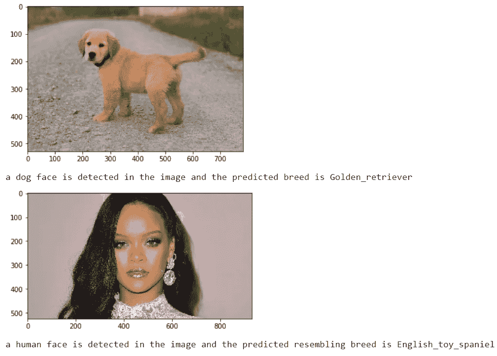

# 基于 CNN 和迁移学习的犬种分类

> 原文：<https://levelup.gitconnected.com/dog-breed-classification-using-cnn-and-transfer-learning-cc93a4497e90>


# 项目概述:

本文主要是为了构建一个可以在 web 或移动应用程序中使用的管道，以处理真实世界中用户提供的图像。给定一张狗的图片，你的算法将识别出狗的品种。如果提供一个人的图像，代码将识别相似的狗品种。

# 评估指标:

由于这是一个多类分类问题，所以我们使用准确度作为主要度量来评估模型性能。主要是因为这些类别在数据中几乎是平衡的。

# 路线图:

> 步骤 0:导入数据集
> 步骤 1:检测人类
> 步骤 2:检测狗
> 步骤 3:创建 CNN 来分类狗的品种(从头开始)
> 步骤 4:使用 CNN 来分类狗的品种(使用迁移学习)
> 步骤 5:创建 CNN 来分类狗的品种(使用迁移学习)
> 步骤 6:编写您的算法
> 步骤 7:测试您的算法

# 步骤 0:

我们导入狗图像的数据集用于进一步建模。我们通过使用 scikit-learn 库中的`load_files`函数来填充一些变量。

导入狗数据:

*   `train_files`、`valid_files`、`test_files` -包含图像文件路径的 numpy 数组
*   `train_targets`、`valid_targets`、`test_targets` -包含一个热编码分类标签的 numpy 数组
*   `dog_names` -用于翻译标签的字符串值犬种名称列表

```
**from** **sklearn.datasets** **import** load_files       
**from** **keras.utils** **import** np_utils
**import** **numpy** **as** **np**
**from** **glob** **import** glob

*# define function to load train, test, and validation datasets*
**def** load_dataset(path):
    data = load_files(path)
    dog_files = np.array(data['filenames'])
    dog_targets = np_utils.to_categorical(np.array(data['target']), 133)
    **return** dog_files, dog_targets

*# load train, test, and validation datasets*
train_files, train_targets = load_dataset('../../../data/dog_images/train')
valid_files, valid_targets = load_dataset('../../../data/dog_images/valid')
test_files, test_targets = load_dataset('../../../data/dog_images/test')

*# load list of dog names*
dog_names = [item[20:-1] **for** item **in** sorted(glob("../../../data/dog_images/train/*/"))]

*# print statistics about the dataset*
print('There are **%d** total dog categories.' % len(dog_names))
print('There are **%s** total dog images.**\n**' % len(np.hstack([train_files, valid_files, test_files])))
print('There are **%d** training dog images.' % len(train_files))
print('There are **%d** validation dog images.' % len(valid_files))
print('There are **%d** test dog images.'% len(test_files))
```

导入人类数据

```
**import** **random**
random.seed(8675309)

*# load filenames in shuffled human dataset*
human_files = np.array(glob("../../../data/lfw/*/*"))
random.shuffle(human_files)

*# print statistics about the dataset*
print('There are **%d** total human images.' % len(human_files))
```

# 第一步:探测人类

我们使用 OpenCV 实现的[基于 Haar 特征的级联分类器](http://docs.opencv.org/trunk/d7/d8b/tutorial_py_face_detection.html)来检测图像中的人脸。OpenCV 提供了许多预先训练好的人脸检测器，作为 XML 文件存储在 github 上。我们已经下载了这些检测器中的一个，并将其存储在`haarcascades`目录中。

```
**import** **cv2**                
**import** **matplotlib.pyplot** **as** **plt**                        
%matplotlib inline                               

*# extract pre-trained face detector*
face_cascade = cv2.CascadeClassifier('haarcascades/haarcascade_frontalface_alt.xml')

*# load color (BGR) image*
img = cv2.imread(human_files[3])
*# convert BGR image to grayscale*
gray = cv2.cvtColor(img, cv2.COLOR_BGR2GRAY)

*# find faces in image*
faces = face_cascade.detectMultiScale(gray)

*# print number of faces detected in the image*
print('Number of faces detected:', len(faces))

*# get bounding box for each detected face*
**for** (x,y,w,h) **in** faces:
    *# add bounding box to color image*
    cv2.rectangle(img,(x,y),(x+w,y+h),(255,0,0),2)

*# convert BGR image to RGB for plotting*
cv_rgb = cv2.cvtColor(img, cv2.COLOR_BGR2RGB)

*# display the image, along with bounding box*
plt.imshow(cv_rgb)
plt.show()
```


在使用任何面部检测器之前，标准程序是将图像转换为灰度。`detectMultiScale`函数执行`face_cascade`中存储的分类器，并将灰度图像作为参数。

在上面的代码中，`faces`是检测到的人脸的 numpy 数组，其中每一行对应一个检测到的人脸。每个检测到的面部是具有四个条目的 1D 阵列，其指定检测到的面部的边界框。数组中的前两个条目(在上面的代码中提取为`x`和`y`)指定了边界框左上角的水平和垂直位置。数组中的最后两个条目(这里提取为`w`和`h`)指定了盒子的宽度和高度。

# 写一个人脸检测器

```
*# returns "True" if face is detected in image stored at img_path*
**def** face_detector(img_path):
    img = cv2.imread(img_path)
    gray = cv2.cvtColor(img, cv2.COLOR_BGR2GRAY)
    faces = face_cascade.detectMultiScale(gray)
    **return** len(faces) > 0
```

# 第二步:探测狗

在本节中，我们使用预训练的 [ResNet-50](http://ethereon.github.io/netscope/#/gist/db945b393d40bfa26006) 模型来检测图像中的狗。我们的第一行代码下载了 ResNet-50 模型，以及在 [ImageNet](http://www.image-net.org/) 上训练过的权重，ImageNet 是一个非常大、非常受欢迎的数据集，用于图像分类和其他视觉任务。ImageNet 包含超过 1000 万个 URL，每个 URL 都链接到一个包含来自 [1000 个类别](https://gist.github.com/yrevar/942d3a0ac09ec9e5eb3a)之一的对象的图像。给定一个图像，这个预训练的 ResNet-50 模型返回该图像中包含的对象的预测(从 ImageNet 中的可用类别中获得)。

```
**from** **keras.applications.resnet50** **import** ResNet50

*# define ResNet50 model*
ResNet50_model = ResNet50(weights='imagenet')
```

# 预处理数据

当使用 TensorFlow 作为后端时，Keras CNNs 需要一个 4D 数组(我们也称之为 4D 张量)作为输入，其中形状`nb_samples`对应于图像(或样本)的总数，`rows`、`columns`和`channels`分别对应于每个图像的行数、列数和通道数。

下面的`path_to_tensor`函数将彩色图像的字符串值文件路径作为输入，并返回适合提供给 Keras CNN 的 4D 张量。该函数首先加载图像，并将其调整为像素的正方形图像。

接下来，图像被转换成数组，然后数组被调整大小为 4D 张量。在这种情况下，由于我们正在处理彩色图像，每个图像有三个通道。同样，由于我们处理的是单个图像(或样本)，返回的张量总是有形状的

`paths_to_tensor`函数将字符串值图像路径的 numpy 数组作为输入，并返回一个带有形状的 4D 张量

这里，`nb_samples`是所提供的图像路径阵列中的样本数或图像数。最好把`nb_samples`想象成你的数据集中 3D 张量的数量(其中每个 3D 张量对应一个不同的图像)！

```
**from** **tqdm** **import** tqdm

**def** path_to_tensor(img_path):
    *# loads RGB image as PIL.Image.Image type*
    img = image.load_img(img_path, target_size=(224, 224))
    *# convert PIL.Image.Image type to 3D tensor with shape (224, 224, 3)*
    x = image.img_to_array(img)
    *# convert 3D tensor to 4D tensor with shape (1, 224, 224, 3) and return 4D tensor*
    **return** np.expand_dims(x, axis=0)

**def** paths_to_tensor(img_paths):
    list_of_tensors = [path_to_tensor(img_path) **for** img_path **in** tqdm(img_paths)]
    **return** np.vstack(list_of_tensors)
```

# 使用 ResNet-50 进行预测

为 ResNet-50 和 Keras 中任何其他预训练模型准备好 4D 张量，需要一些额外的处理。首先，通过对通道重新排序，将 RGB 图像转换为 BGR 图像。所有预训练模型都有额外的归一化步骤，即必须从每个图像的每个像素中减去平均像素(以 RGB 表示，并根据 ImageNet 中所有图像的所有像素计算得出)。这在导入的函数`preprocess_input`中实现。如果你很好奇，可以在这里查看`preprocess_input` [的代码](https://github.com/fchollet/keras/blob/master/keras/applications/imagenet_utils.py)。

现在我们有了一种方法来格式化我们的图像以提供给 ResNet-50，我们现在准备使用模型来提取预测。这是通过`predict`方法完成的，该方法返回一个数组

-第项是模型预测的图像属于

-第个 ImageNet 类别。这在下面的`ResNet50_predict_labels`函数中实现。

通过获取预测概率向量的 argmax，我们获得了与模型的预测对象类别相对应的整数，我们可以通过使用这个[字典](https://gist.github.com/yrevar/942d3a0ac09ec9e5eb3a)来识别对象类别。

```
**from** **keras.applications.resnet50** **import** preprocess_input, decode_predictions

**def** ResNet50_predict_labels(img_path):
    *# returns prediction vector for image located at img_path*
    img = preprocess_input(path_to_tensor(img_path))
    **return** np.argmax(ResNet50_model.predict(img))
```

# 写一个狗探测器

在查看[字典](https://gist.github.com/yrevar/942d3a0ac09ec9e5eb3a)时，您会注意到对应于狗的类别以不间断的顺序出现，并对应于字典关键字 151-268，包括从`'Chihuahua'`到`'Mexican hairless'`的所有类别。因此，为了检查预训练的 ResNet-50 模型是否预测图像包含狗，我们只需要检查上面的`ResNet50_predict_labels`函数是否返回 151 和 268 之间(包括 151 和 268)的值。

我们使用这些想法来完成下面的`dog_detector`函数，如果在图像中检测到狗，则返回`True`(如果没有检测到狗，则返回`False`)。

```
*### returns "True" if a dog is detected in the image stored at img_path*
**def** dog_detector(img_path):
    prediction = ResNet50_predict_labels(img_path)
    **return** ((prediction <= 268) & (prediction >= 151))
```

# 第三步:创建一个 CNN 来分类狗的品种(从头开始)

现在我们有了在图像中检测人类和狗的功能，我们需要一种从图像中预测品种的方法。在这一步中，您将创建一个对狗的品种进行分类的 CNN。你必须从头开始创建你的 CNN*(所以，你还不能使用转移学习*！)，并且您必须达到至少 1%的测试精度。在本笔记的第 5 步中，您将有机会使用迁移学习来创建一个 CNN，从而大大提高准确性。**

**小心添加太多的可训练层！更多的参数意味着更长的训练时间，这意味着你更有可能需要一个 GPU 来加速训练过程。令人欣慰的是，Keras 提供了一个方便的时间估计，每个纪元可能需要的时间；您可以推断出这一估计值，以计算出您的算法需要多长时间来训练。**

**我们提到，从图像中给狗分配品种的任务被认为是非常具有挑战性的。要知道为什么，想想*甚至人类*都很难区分布列塔尼犬和威尔士史宾格犬。**

****

**不难找到其他具有最小类间差异的犬种对(例如，卷毛寻回犬和美国水猎犬)。**

****

**同样，回想一下拉布拉多有黄色、巧克力色和黑色。你的基于视觉的算法将不得不克服这种高类内变异，以确定如何将所有这些不同的色调归类为同一品种。**

****

**我们还提到，随机机会提出了一个异常低的标准:抛开类别略有不平衡的事实，随机猜测将提供大约 1/133 的正确答案，这相当于不到 1%的准确性。**

# **预处理数据**

```
****from** **PIL** **import** ImageFile                            
ImageFile.LOAD_TRUNCATED_IMAGES = **True**                 

*# pre-process the data for Keras*
train_tensors = paths_to_tensor(train_files).astype('float32')/255
valid_tensors = paths_to_tensor(valid_files).astype('float32')/255
test_tensors = paths_to_tensor(test_files).astype('float32')/255**
```

# **模型架构**

```
****from** **keras.layers** **import** Conv2D, MaxPooling2D, GlobalAveragePooling2D
**from** **keras.layers** **import** Dropout, Flatten, Dense
**from** **keras.models** **import** Sequential

*### create the architecture using Sequential()*
model = Sequential()

*### a convolution layer to extract features from the input image,* 
*### first CONV layer has 16 filters of size 3x3*
*### Since this is the first layer we must input the dimension shape which is a 224 x 224 pixel image with depth = 3 (RGB).*
model.add(Conv2D(16, (3, 3), activation='relu', input_shape=(224,224,3)))

*### The next layer will be a pooling layer with a 2 x 2 pixel filter to get the max element from the feature maps.* 
*### This reduces the dimension of the feature maps by half and is also known as sub sampling.*
*### progressively reduce spatial size (width and height) of input* 
model.add(MaxPooling2D(pool_size=(2, 2)))

*### Create one more convolution layer and pooling layer like before, but without the input_shape*
*### increase total number of filters learned*
model.add(Conv2D(32, (3, 3), activation='relu'))
model.add(MaxPooling2D(pool_size=(2,2)))
*### Create one more convolution layer and pooling layer like before, but without the input_shape*
*### increase total number of filters learned*
model.add(Conv2D(64, (3, 3), activation='relu'))
model.add(MaxPooling2D(pool_size=(2, 2)))

model.add(GlobalAveragePooling2D())

model.add(Dense(133, activation='relu'))
*### TODO: Define your architecture.*

model.summary()**
```

****

# **编译模型**

```
**model.compile(optimizer='rmsprop', loss='categorical_crossentropy', metrics=['accuracy'])**
```

# **训练模型**

```
****from** **keras.callbacks** **import** ModelCheckpoint  

*### TODO: specify the number of epochs that you would like to use to train the model.*

epochs = 50

*### Do NOT modify the code below this line.*

checkpointer = ModelCheckpoint(filepath='saved_models/weights.best.from_scratch.hdf5', 
                               verbose=1, save_best_only=**True**)

model.fit(train_tensors, train_targets, 
          validation_data=(valid_tensors, valid_targets),
          epochs=epochs, batch_size=20, callbacks=[checkpointer], verbose=1)**
```

# **测试模型**

**在狗图像的测试数据集上尝试你的模型。**

```
***# get index of predicted dog breed for each image in test set*
dog_breed_predictions = [np.argmax(model.predict(np.expand_dims(tensor, axis=0))) **for** tensor **in** test_tensors]

*# report test accuracy*
test_accuracy = 100*np.sum(np.array(dog_breed_predictions)==np.argmax(test_targets, axis=1))/len(dog_breed_predictions)
print('Test accuracy: **%.4f%%**' % test_accuracy)**
```

****

# **第四步:使用 CNN 对狗的品种进行分类**

**为了在不牺牲准确性的情况下减少训练时间，我们向您展示如何使用迁移学习来训练 CNN。**

# **获取瓶颈特征**

```
**bottleneck_features = np.load('bottleneck_features/DogVGG16Data.npz')
train_VGG16 = bottleneck_features['train']
valid_VGG16 = bottleneck_features['valid']
test_VGG16 = bottleneck_features['test']**
```

# **模型架构**

**该模型使用预训练的 VGG-16 模型作为固定特征提取器，其中 VGG-16 的最后卷积输出作为输入馈送到我们的模型。我们只添加了一个全局平均池层和一个全连接层，其中后者包含每个狗类别的一个节点，并配备了一个 softmax。**

```
**VGG16_model = Sequential()
VGG16_model.add(GlobalAveragePooling2D(input_shape=train_VGG16.shape[1:]))
VGG16_model.add(Dense(133, activation='softmax'))

VGG16_model.summary()**
```

# **编译模型**

```
**VGG16_model.compile(loss='categorical_crossentropy', optimizer='rmsprop', metrics=['accuracy'])**
```

# **训练模型**

```
****from** **keras.callbacks** **import** ModelCheckpoint  
checkpointer = ModelCheckpoint(filepath='saved_models/weights.best.VGG16.hdf5', 
                               verbose=1, save_best_only=**True**)

VGG16_model.fit(train_VGG16, train_targets, 
          validation_data=(valid_VGG16, valid_targets),
          epochs=20, batch_size=20, callbacks=[checkpointer], verbose=1)**
```

# **测试模型**

```
***# get index of predicted dog breed for each image in test set*
VGG16_predictions = [np.argmax(VGG16_model.predict(np.expand_dims(feature, axis=0))) **for** feature **in** test_VGG16]

*# report test accuracy*
test_accuracy = 100*np.sum(np.array(VGG16_predictions)==np.argmax(test_targets, axis=1))/len(VGG16_predictions)
print('Test accuracy: **%.4f%%**' % test_accuracy)**
```

****

# **用模型预测狗的品种**

```
****from** **extract_bottleneck_features** **import** *

**def** VGG16_predict_breed(img_path):
    *# extract bottleneck features*
    bottleneck_feature = extract_VGG16(path_to_tensor(img_path))
    *# obtain predicted vector*
    predicted_vector = VGG16_model.predict(bottleneck_feature)
    *# return dog breed that is predicted by the model*
    **return** dog_names[np.argmax(predicted_vector)]**
```

# **第五步:创建一个 CNN 对狗的品种进行分类(使用迁移学习)**

**在第 4 步中，我们使用迁移学习来创建一个使用 VGG-16 瓶颈特征的 CNN。在本节中，您必须使用不同的预训练模型中的瓶颈功能。为了方便您，我们预先计算了目前在 Keras 中可用的所有网络的功能:**

*   **[VGG-19](https://s3-us-west-1.amazonaws.com/udacity-aind/dog-project/DogVGG19Data.npz) 的瓶颈特征**
*   **[ResNet-50](https://s3-us-west-1.amazonaws.com/udacity-aind/dog-project/DogResnet50Data.npz) 瓶颈特性**
*   **[盗梦空间](https://s3-us-west-1.amazonaws.com/udacity-aind/dog-project/DogInceptionV3Data.npz)瓶颈特性**
*   **[异常](https://s3-us-west-1.amazonaws.com/udacity-aind/dog-project/DogXceptionData.npz)瓶颈特性**

**只需要遵循与第 4 步相同的步骤，那么我们的最终测试准确率为 80.5024%。**

# **第六步:编写你的算法**

**编写一个算法，该算法接受图像的文件路径，并首先确定图像是否包含人、狗或两者都不包含。然后，**

*   **如果在图像中检测到一只**狗**，返回预测的品种。**
*   **如果在图像中检测到一个**人**，返回相似的狗品种。**
*   **如果在图像中没有检测到**或**，则提供指示错误的输出。**

```
**%pylab inline
**import** **matplotlib.pyplot** **as** **plt**
**import** **matplotlib.image** **as** **mpimg**

*### TODO: Write your algorithm.*
*### Feel free to use as many code cells as needed.*
**def** image_detecter(img_path):

    img=mpimg.imread(img_path)
    imgplot = plt.imshow(img)
    plt.show()

    **if** dog_detector(img_path) == **True**:
        dog_name = Resnet50_predict_breed(img_path)
        print("a dog face is detected in the image and the predicted breed is **{}**".format(dog_name.split(".")[1]))

    **elif** face_detector(img_path) == **True**:
        resembling_breed = Resnet50_predict_breed(img_path)
        print("a human face is detected in the image and the predicted resembling breed is **{}**".format(resembling_breed.split(".")[1]))

    **else**:
        print("there is an error")**
```

# **步骤 7:测试你的算法**

```
****import** **glob**

**for** filepath **in** glob.iglob('images_for_step7/*.jpg'):
    image_detecter(filepath)**
```

************

# **结果:**

**最终的结果看起来相当准确，我们可以看到，狗的品种预测都是正确的，人类的相似品种是有意义的。**

**迁移学习比我从头构建的 CNN 模型更有效。主要是因为来自迁移学习的模型是由大量数据训练的，所以架构已经明白什么样的特征最能代表一幅图像，这使得分类过程变得容易得多，即使我们没有大量数据，我们也不需要牺牲准确性。**

# **结论:**

**端到端问题解决方案:本文提供了一个解决方案，它可以接收图像，然后返回狗的品种和类似的人类品种。**

**我在这个项目中发现的最有趣的方面是迁移学习的魔力，即使我们没有足够的数据，我们也能得到更好的结果，但我们仍然可以根据我们的目的训练预训练的模型，这是迁移学习最美妙的事情。**

# **改进:**

**-获取更多数据来训练犬种分类模型
-尝试通过使用不同的迁移学习模型来更多地调整模型
-尝试向现有架构添加更多层**

**完整的编码请参考**

**[](https://github.com/liping97412/image_classifier/blob/master/dog_app.ipynb) [## Liping 97412/图像分类器

### permalink dissolve GitHub 是 4000 多万开发人员的家园，他们一起工作来托管和审查代码，管理…

github.com](https://github.com/liping97412/image_classifier/blob/master/dog_app.ipynb)**