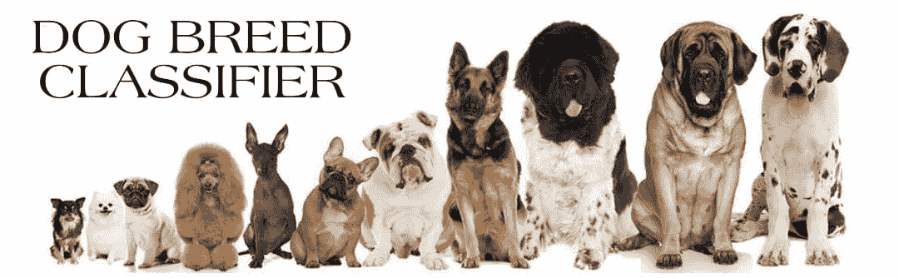
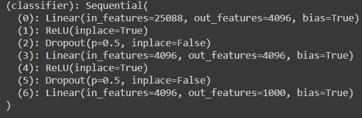
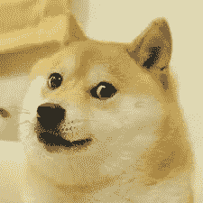

# 基于迁移学习的 PyTorch 犬种分类器

> 原文：<https://levelup.gitconnected.com/dog-breed-classifier-with-pytorch-using-transfer-learning-8f15af6f9010>

## 一步一步的指南来创建自己的狗品种分类器。



由[凯西·庄小昆·维特卡创作](https://theblissfuldog.com/search?type=article&q=Kathy%20Dannel%20Vitcak)

那么你以前听过深度学习这个词吗？还是刚开始学？

在这篇文章中，我将指导你建立自己的狗品种分类器。在这个项目结束时，

*   您的代码将接受任何用户提供的图像作为输入。
*   如果在图像中检测到狗，它将提供狗的品种的估计。
*   如果检测到人类，它将提供一个最相似的狗品种的估计。

我会让它尽可能简单，而不会让你不知所措。

# 前方的路

*   步骤 0:导入数据集
*   步骤 1:图像预处理
*   第二步:选择迁移学习的模式
*   步骤 3:更改预训练模型的分类器
*   步骤 4:编写训练算法
*   第五步:训练模型
*   步骤 6:测试模型
*   步骤 7:在你自己的图片上测试

你兴奋吗？？？让我们开始吧！

# 步骤 0:导入数据集

你可以从 Kaggle 下载你自己的数据集，访问这个[网站](https://www.kaggle.com/c/dog-breed-identification)。或者，你可以从[这里](https://drive.google.com/file/d/1K57UHSJsCsjQCTi5yutgUtyzKJK36U86/view?usp=sharing)下载。

然后只需解压 zip 文件！

由于在本地机器上处理图像需要大量的时间和资源，因此我将使用 colab 的 GPU 来训练我的模型。因此，如果你没有自己的 GPU，确保你切换到 colab 跟随。

将必要的库**导入到笔记本的第一个块中总是一个好的做法。所以我们会在这里做。**

导入库

在 glob 括号的双引号内输入 dog_images 的路径。

将图像导入笔记本

```
Output : There are 8351 total dog images.
```

# 步骤 1:图像预处理

首先，您需要将 train、validation 和 test 文件夹加载到一些变量中。

然后，您需要对加载的图像进行一些转换。这被称为数据的**预处理。**

## 为什么有必要？

*   您的图像必须与网络的输入大小相匹配。如果您需要调整图像的大小以匹配网络，则可以将数据重新缩放或裁剪到所需的大小。
*   **增强**也能让你训练网络对图像数据的失真保持不变。为此，我会随机裁剪和调整图像的大小
*   **数据标准化是**一个重要的步骤，它确保每个输入参数(本例中为像素)具有相似的**数据**分布。这使得收敛更快，同时训练网络。

## 将图像存储到数据加载器中

现在我们需要将 train、valid 和 test 目录加载到数据加载器中。这将使我们能够把数据分成小批量。

我会将加载器作为键值对存储到字典中，这将有助于以后调用它们。

# 第二步:选择迁移学习的模式

## 什么是预训练模型，我们为什么要使用它？

预训练模型是由其他人创建的用于解决类似问题的模型。

*   你不是从零开始建立一个模型来解决一个类似的问题，而是将这个模型作为一个起点。
*   一个预先训练好的模型在你的应用中可能不是 100%准确，但是它节省了重新发明轮子所需的巨大努力。
*   **迁移学习**包括利用在一个问题上学到的特点，并在一个新的类似问题上利用它们。例如，已经学会识别浣熊的模型的特征可能有助于启动旨在识别塔努基的模型。

有几种预先训练好的模型可供您选择进行模型训练。例如 Densenet、Resnet、VGG 模型。我会用 VGG-16 进行模型训练。你可以在 pytorch [这里](https://pytorch.org/docs/stable/torchvision/models.html)阅读其他型号。

# 步骤 3:更改预训练模型的分类器

将采取以下步骤来改变预训练的分类器:

1.  从先前训练的模型中提取图层。
2.  冻结它们，以避免在未来的训练中破坏它们所包含的任何信息。
3.  在冻结层上添加一些新的可训练层。他们将学习将旧要素转化为新数据集的预测。
4.  在数据集上训练新图层。

由于特征已经被预训练的模型学习，所以在对狗图像的训练期间将它们冻结。我们只会改变分类器的维度，只会训练它。



原始分类器层

原始分类器层有 25088 个维度，但是为了匹配我们预处理过的图像大小，我们需要把它改为 4096。

为了在 GPU 上训练模型，我们需要使用以下命令将它移动到 GPU-RAM 空间中。

现在我们需要选择一个损失函数和优化器。

损失函数将计算我们的模型预测和实际图像之间的误差。如果你的预测完全错误，你的**损失函数**将输出一个更高的数字。如果他们很好，它会输出一个较低的数字。我将使用**交叉熵损失**。

优化器是用来改变你的**神经网络**的属性的算法或方法，比如权重和**学习速率**，以减少损失。我会使用 **SGD 优化器**。

0.001 的学习率有利于训练。但是你也可以尝试其他的学习速度。

# 步骤 4:编写训练算法

现在到了激动人心的部分，我们将编写训练函数。我已经用代码写了注释。因为这个函数中的一切都是不言自明的。

我已经用它写了验证代码行。因此，在训练模型时，我们会同时受到两种损失。

每次损失减少时，我也会存储模型。这样我就不必在以后每次打开新实例时都训练它。

# 第五步:训练模型

现在，我将通过在函数中提供参数来开始训练模型。我会训练它 10 个纪元。

```
OUTPUT:Epoch: 1 	Training Loss: 2.443815 	Validation Loss: 0.801671
Validation loss decreased (inf --> 0.801671).  Saving model ...
Epoch: 2 	Training Loss: 1.440627 	Validation Loss: 0.591050
Validation loss decreased (0.801671 --> 0.591050).  Saving model ...
Epoch: 3 	Training Loss: 1.310158 	Validation Loss: 0.560950
Validation loss decreased (0.591050 --> 0.560950).  Saving model ...
Epoch: 4 	Training Loss: 1.200572 	Validation Loss: 0.566340
Epoch: 5 	Training Loss: 1.160727 	Validation Loss: 0.530196
Validation loss decreased (0.560950 --> 0.530196).  Saving model ...
Epoch: 6 	Training Loss: 1.088659 	Validation Loss: 0.560774
Epoch: 7 	Training Loss: 1.060936 	Validation Loss: 0.503829
Validation loss decreased (0.530196 --> 0.503829).  Saving model ...
Epoch: 8 	Training Loss: 1.010044 	Validation Loss: 0.500608
Validation loss decreased (0.503829 --> 0.500608).  Saving model ...
Epoch: 9 	Training Loss: 1.054875 	Validation Loss: 0.497319
Validation loss decreased (0.500608 --> 0.497319).  Saving model ...
Epoch: 10 	Training Loss: 1.000547 	Validation Loss: 0.545735<All keys matched successfully>
```

# 步骤 6:测试模型

现在，我将在模型以前没有见过的新图像上测试模型，并计算验证准确性。

我已经训练了 10 个纪元，获得了 83%的准确率。并且，得到了下面的输出！

```
Output:
Test Loss: 0.542430 Test Accuracy: 83% (700/836)
```

## 如何提高这个模型的准确性？

*   通过对其进行更多时期的训练(比较训练和验证损失)
*   通过改变学习率(如 0.01，0.05，0.1)
*   通过改变预先训练的模型(类似密集网络，但需要更多的训练时间)
*   通过进一步预处理图像

# 步骤 7:测试你自己的图像

现在您已经训练并测试了您的模型。现在是最激动人心的部分。你能走到这一步，我向你致敬。

1.  将您想要测试的新图像和保存的模型加载到内存中

2.现在，我们必须对图像进行预处理，并通过将其测试到我们训练好的模型中来预测类别

3.现在，通过将图像路径作为参数传递给这个函数，我们可以预测狗的名字。

我已经传递了下面的图像，并获得了这个名称作为输出。



Meme Doge [Credits](https://knowyourmeme.com/memes/doge)

```
Output:
Norwegian buhund
```

挪威的布洪看起来很像我们的模因·多吉·:D

结论

这只是一个开始，你可以用这个模型做更多的事情。你可以通过在某个地方部署它来创建一个应用程序。我尝试过在不使用迁移学习的情况下从零开始创建自己的模型，但测试精度不能超过 13%。你也可以试试，因为这有助于理解概念。

请随时在 [Linkedin](https://www.linkedin.com/in/ahmadshaikhk/) 上与我联系。

# 参考

这个项目是我的 Udacity 的[深度学习](https://www.udacity.com/course/deep-learning-nanodegree--nd101)纳米学位的一部分。这是我为这个项目设计的 Github [库](https://github.com/Ahmad-shaikh575/dog-breed-classifier/)。

预先训练好的 VGG 模型[研究论文](https://arxiv.org/abs/1409.1556)。

PyTorch 官方[网站](https://pytorch.org/docs/stable/index.html)。