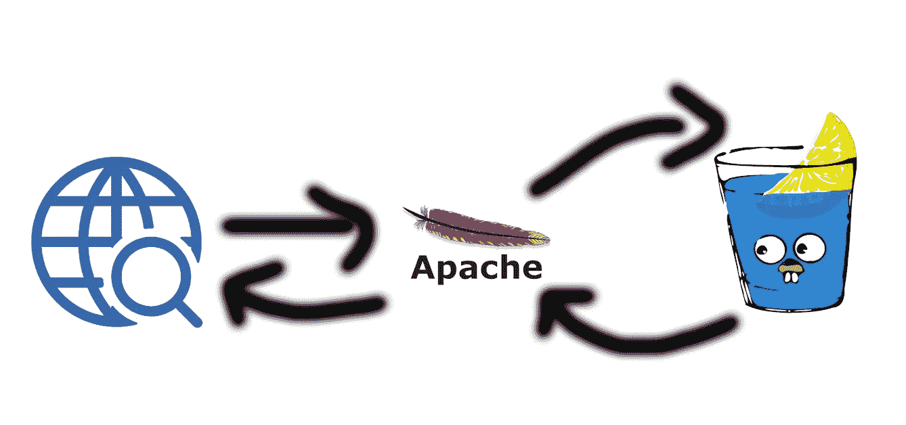
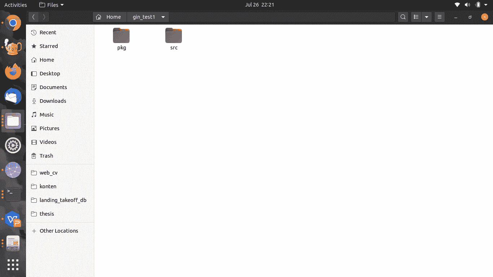
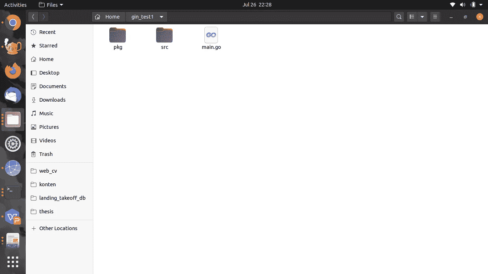
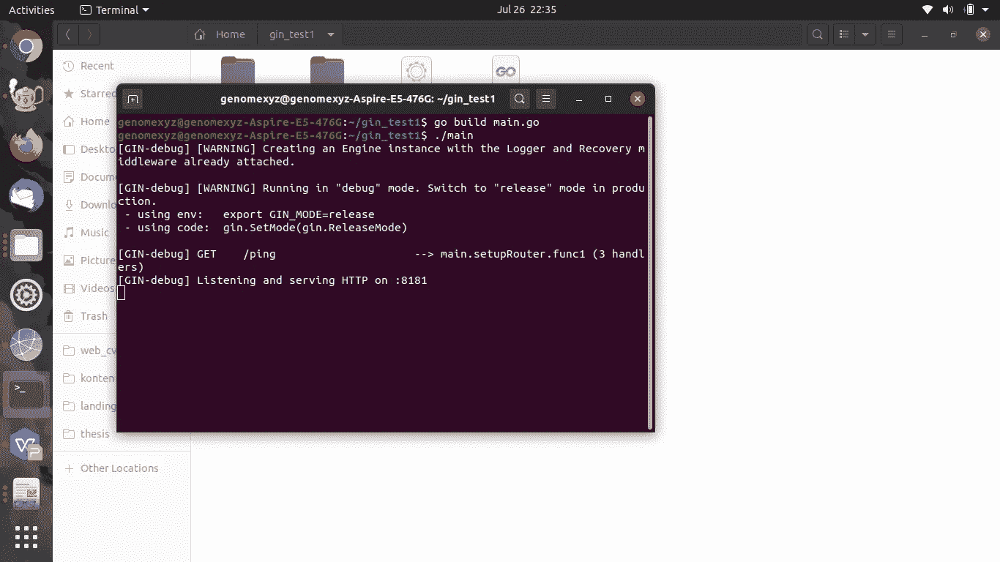
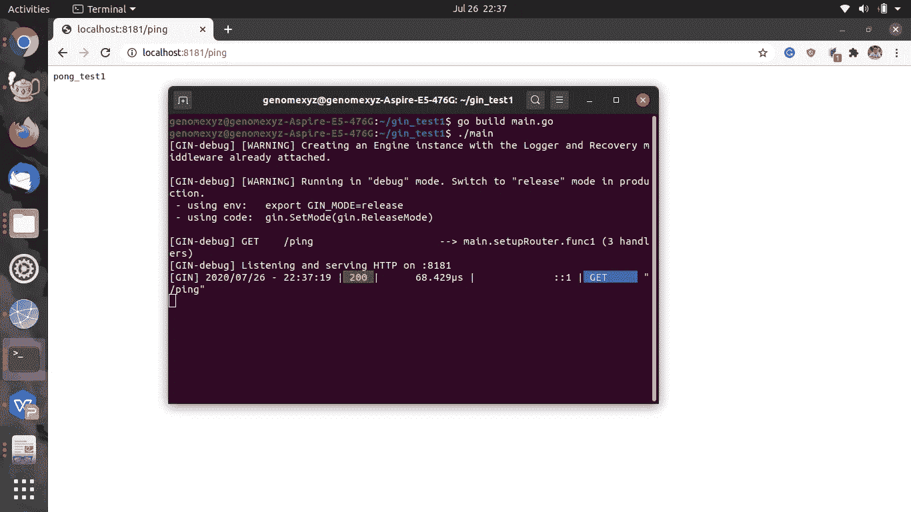
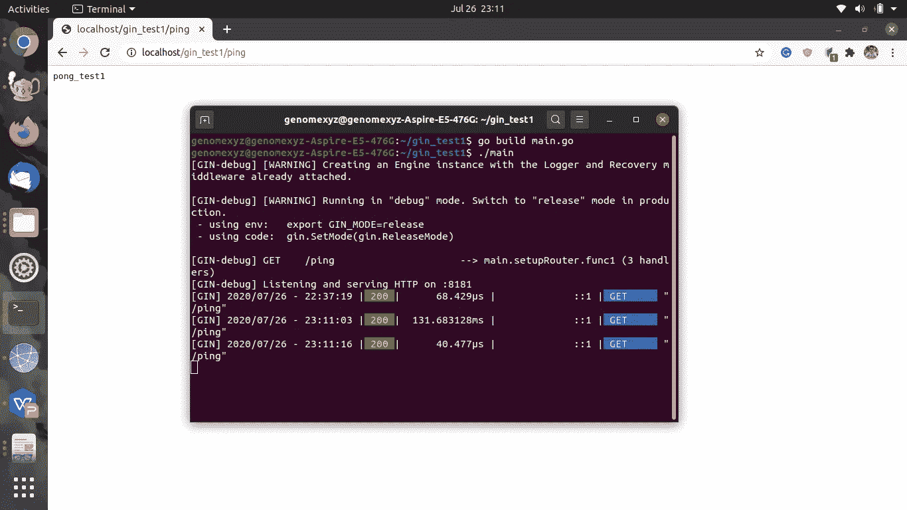
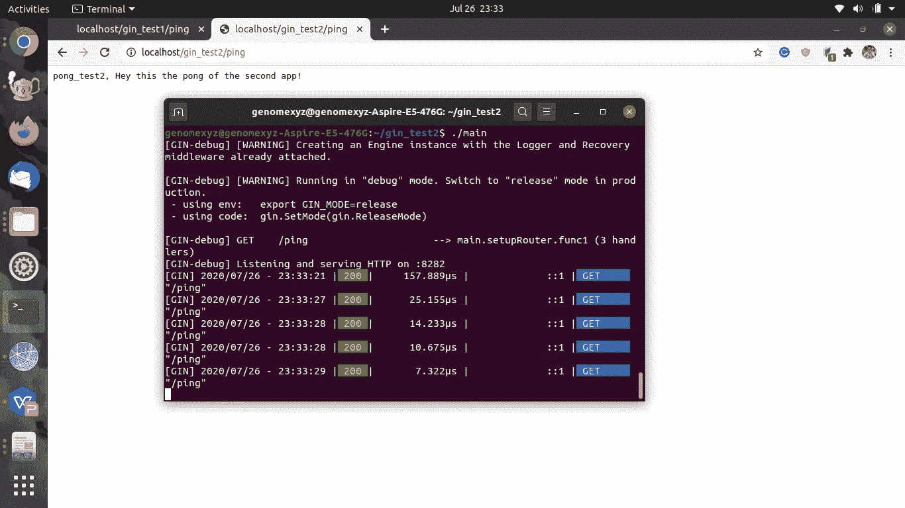

# 使用 Apache 进行反向代理，通过 HTTP 端口访问应用程序(避免难看的 URL)

> 原文：<https://levelup.gitconnected.com/doing-a-reverse-proxy-using-apache-to-access-app-trough-http-port-and-avoid-an-ugly-url-1430eb59bd3f>

## 使用 golang gin-gonic 的示例案例

HTTP 端口是 80。在我们的应用程序中很容易附加端口 80(即 Flask、Gunicorn、Django)，瞧，你得到一个漂亮的 URL ( `http://your_url/`)，不需要在 URL 中提到端口(`your_url:port/`)。但问题是在大多数情况下，你的机器中已经有一个 PHP web 应用程序，使用 Apache 或 Nginx 作为 web 服务器，所以端口 80 已经被使用了。在我之前的[帖子](/hands-on-how-to-host-django-with-apache2-d9cd0670d51b)中，我已经为 Django 提出了这个问题及其解决方案。但是不同的是，在这篇文章中，我没有使用 Python，所以我不能使用 WSGI。对于 Django，默认的 web 服务器不是用于生产的，所以您必须使用另一个 web 服务器，比如 WSGI。

**在这篇文章中，我将使用 golang 和 gin-gonic 作为 golang 的 web 框架**。gin-gonic 的默认 web 服务器可用于生产，因此**我们将把 Apache 的连接转发到我们的 gin web 应用程序，这被称为反向代理**。

这个实验的要求是:

*   Golang 编译器(版本 1.11，对 gin 的要求)
*   姜-戈尼克语([https://github.com/gin-gonic/gin](https://github.com/gin-gonic/gin))
*   阿帕奇第二版(`sudo apt install apache2`)

这意味着您已经安装了 Golang 编译器和 Apache 版本 2，现在为新项目创建一个新目录并在其中安装 gin。

使用 gin 创建一个新的“hello world”web 应用程序，命名为`main.go`。

在这里我们注册/ping，所以当我们访问我们的 _url/ping 时，我们会收到一个回复“pong_test1”。

现在编译并运行它(或者你可以只使用`go run main.go`来运行它而不编译它)。

你会看到这样的东西

现在在浏览器中打开 web 应用程序(localhost:8181/ping)。

我们的 hello world 计划已经成功建立。现在我们将地址改为`[http://localhost/gin_test1](http://localhost/gin_test1.)` [。](http://localhost/gin_test1.)我们怎么做？我们将使用 Apache 中的代理模块(mod_proxy)。

# 准备 mod_proxy 进行反向代理

我们将**使用 a2enmod** 启用一些模块。在我之前的文章中，我已经解释了当你使用这个命令时会发生什么。

然后**使用`sudo nano /etc/apache2/sites-enabled/000-default.conf`编辑**T0 的内容。**把这段代码追加到下面的** `<VirtualHost *:80>`里面。

**保存并在`sudo systemctl restart apache2`前重启 apache2** 。这里，关于我们添加的 3 行代码的解释很少。`ProxyPreserveHost on`就是**把原来的主机头传递给真正的 web app 服务器**(localhost:8181 就是这样)。为了确保反向代理工作`ProxyPass`和`ProxyPassReverse` **必须有相同的参数**。第一个参数是我们想要注册的地址，第二个参数是 web 应用程序的真实地址。

现在在`[http://localhost/gin_test1/ping](http://localhost/gin_test1/ping.)` [访问我们的 gin web 应用程序。](http://localhost/gin_test1/ping.)

是的，我们成功了❤.

现在…

# 想注册另一个 gin web app 怎么办？

使用`ProxyPass`和`ProxyPassReverse`在`/etc/apache2/sites-enabled/000-default.conf`中注册该应用即可。这里我们将创建另一个应用程序，其内容为`main.go`

并注册地址为`http://localhost/gin_test2`的 app。

然后在浏览器中打开`[http://localhost/gin_test2](http://localhost/gin_test2)/ping`，瞧。

我们成功地在 apache2 中注册了 2 个 web app。

反向代理的用途很多。除此之外，反向代理用于安全原因和负载平衡器。

下一篇文章再见。

# 参考

https://github.com/gin-gonic/gin 于 2020 年 7 月 26 日进入

https://www . digital ocean . com/community/tutorials/how-to-use-Apache-http-server-as-reverse-proxy-using-mod _ proxy-extension 于 2020 年 7 月 26 日访问