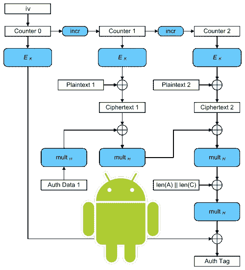

# 在 Android 中做 AES/GCM:实地探险

> 原文：<https://levelup.gitconnected.com/doing-aes-gcm-in-android-adventures-in-the-field-72617401269d>

Android 开发生态系统还需要另一篇关于 AES 加密和解密的博客文章吗？可能不会，但就在本周，我被一系列让我措手不及的问题绊倒了，所以我决定分享我的经验，以防对别人有所帮助。

> TL；大卫:这是你怎么做的。如果您需要指定 IV 和 AAD 作为输入，[这里有](https://gist.github.com/marcobrador/75b7164c7315e25db163bc04b9b9dfc2)一个变通办法(以及在[生成密钥](https://gist.github.com/marcobrador/7fb741eb0c0c20840d59f4cc8164b29c)时需要的调整)——但是使用这种方法要非常小心！

# 问题是

就在本周，我不得不设计一个加密 API，它将允许我们使用预先存在的加密库和 Android KeyStore API。这个想法是，在有硬件加密处理器的设备中，我们的软件将依靠它进行加密和解密；而在其余的设备中，它将退回到现有的库。这就需要一个通用的、抽象的 API，允许软件的其他部分不需要知道使用的是哪种加密环境。加密和解密将在 GCM 模式下使用 AES 来完成。

到目前为止，一切顺利。对吗？

## 我在网上看到的

因此，和其他开发人员一样，我上网搜索 Android KeyStore API 定义以及如何使用它的例子。简而言之，我的发现总结如下:

StackOverflow 告诉我的

看起来不错，不是吗？

问题是输入和输出参数与我们先前存在的库使用的参数不匹配。根据我们现有的加密引擎:

*   加密例程还应该将一个`iv`和`aad`作为输入参数。
*   加密例程还应该返回一个`tag`作为输出。
*   解密程序应该将`aad`和`tag`作为输入参数。

AES GCM 不是标准*吗*？这些差异是如何产生的？

# **一点理论**

*如果你知道什么是*`*iv*`*`*aad*`*`*tag*`*就跳过这一节。如果你需要复习，你应该读一读。***

**第一步是调查。我对这些参数并不陌生，但老实说，我不知道它们应该如何生成和使用。所以让我们后退一步，试着完全理解它们:**

**`iv`([初始化向量](https://en.wikipedia.org/wiki/Initialization_vector)的简称)是使用[分组密码](https://en.wikipedia.org/wiki/Block_cipher)时的常用参数。它用于确保用相同的密钥对相同的数据加密两次会产生不同的输出，这就是为什么`iv`永远不会被重用是非常重要的。**

**另一方面，`aad`和`tag`仅用于[认证加密](https://en.wikipedia.org/wiki/Authenticated_encryption)密码(有时也称为“AEAD”，是“带关联数据的认证加密”的简称)，如 GCM 模式下的 AES:**

*   **`tag`是加密程序的输出，然后被提供给解密程序以验证密文没有被篡改(也就是说:*验证*密文是用用于解密的相同密钥生成的)。**
*   **`aad`代表“附加认证数据”，是用于计算`tag`的加密和解密程序的输入。**

# **解决方案**

**不幸的是，对于我上面解释的所有差异，没有单一的解决方案。相反，对于每个参数，需要做不同的事情:**

## **返回`tag`**

**让我们从简单的开始。经过一番寻找，我在 [Java 文档](https://docs.oracle.com/javase/7/docs/api/javax/crypto/Cipher.html#doFinal())中找到了答案:**

> **如果正在使用诸如 GCM/CCM 的 AEAD 模式，则在加密的情况下附加认证标签，或者在解密的情况下验证认证标签。**

**说白了:`Cipher.doFinal()`方法(GCM 模式下)加密时在密文末尾追加`tag`，解密时验证(从密文末尾读取)。这意味着我现在可以写这样的东西:**

**标签现在可以作为单独的加密输出返回**

## **那么 aad 呢？**

**按照理论，加密和解密数据时也应该提供`aad`，但是上面的代码片段中根本没有出现。答案还是在 [Java 文档](https://docs.oracle.com/javase/7/docs/api/javax/crypto/Cipher.html#updateAAD(byte[]))中，在那里我们可以找到方法`Cipher.updateAAD(byte[] src)`。**

**老实说，我不确定我是否理解了方法的描述。我能确定的是(因为我试过了)它确实影响到了所用的`aad`:如果你试图在加密或解密中改变它，解密会以一个`AEADBadTagException`失败，这意味着认证失败。**

**如果我们使用`Cipher.updateAAD(byte[] src)`方法来定义`aad`，我们的代码看起来会像这样:**

**推荐的方法**

**注意，我已经将`aad`设置为加密例程的*输出*，而不是输入。这样做有一个原因，我稍后会解释。这里重要的是**上面的代码展示了一种方法，我会推荐给任何寻找安全 API 来在 Android 中实现 AES GCM 加密和解密的人**。**

## **静脉注射**

**但是我们还有一点不适合我们的另一个加密库:初始化向量应该是加密方法的输入，而不是输出。**

**看起来使用`[GCMParameterSpec](https://docs.oracle.com/javase/7/docs/api/javax/crypto/spec/GCMParameterSpec.html)`类我们可以做到:**

**提供 IV 和 AAD 作为加密方法的输入**

**不幸的是，如果我们试图执行它，我们将会以一个异常结束:`java.security.InvalidAlgorithmParameterException: Caller-provided IV not permitted`——我相信这是不言自明的:Android 不允许我们指定和 IV。句号。**

**但是，为什么呢？这是 API 23 中引入的一种行为，旨在确保调用者不会重用 IVs，因为这可能会破坏分组密码的安全性(正如我之前解释的)。底线是:你不应该重复使用同一个密钥的 IVs，为了确保 Android 在内部生成一个随机的。**

**出于类似的原因，我认为最好在加密例程中生成`aad`:以避免不知道自己在做什么的调用者提供固定值。通过在内部生成它，我们可以确保它是随机的。**

**但是如果你*真的*需要(就像我需要的)提供`iv`(和`aad`)作为输入参数，你可以做一件事。创建 AES 密钥时，您可以使用`setRandomizedEncryptionRequired()`方法明确请求 Android 允许您提供`iv`作为输入。密钥生成方法将是:**

**生成允许我们提供 IV 的 AES 密钥**

**不用说，**只有当你真的知道自己在做什么的时候才这么做**！特别是，如果你走这条路，确保你的`iv`(和`aad`)以一种适当的方式生成，并且对于你的用例足够随机。**

# **结束语**

**我认为公平地说，Java 和 Android APIs 不容易实现与其他加密系统互操作的 AES GCM。但是，为什么呢？这不应该是重点吗？**

**如果有人感兴趣，这里是我对为什么这些 API 的设计者决定以这种方式实现它们的想法:**

*   **关于`tag`被包含在`Cipher.doFinal()`的结果中，我认为很明显这里的要点是不要破坏 JCE API。`Cipher.doFinal()`多年来一直返回一个`byte[]`，不管加密原语是什么，所以他们决定让它保持原样。**
*   **关于`aad`，我相信如果它是`GCMParameterSpec`构造函数的一部分会更好，但是我猜想在`Cipher`类中将它作为一个方法是有原因的(我还不知道)。我*可以*说的是，文档远非清晰，更重要的是，它应该更具体地说明当调用者没有指定时使用哪个`aad`值。**
*   **最后，IV:我喜欢 Android(公平地说，还有 iOS)为他们的加密 API 提供安全默认的方法。对于非密码专家来说，其他 API(如 JCE)提供的选择数量可能会令人望而生畏，因此最好默认提供最安全的选择。**