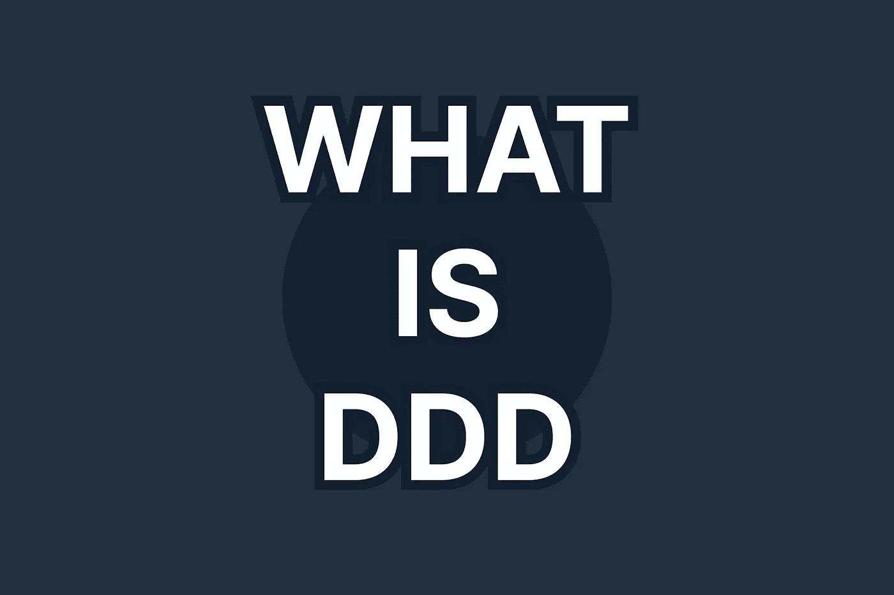

# 深入领域驱动的设计

> 原文：<https://levelup.gitconnected.com/domain-driven-design-in-software-development-f92c3f58d012>

## 软件开发背景下的领域驱动设计

尽管领域驱动设计(DDD)从 2004 年就已经出现了，但是这个概念并没有在那段时间里广泛传播。然而，近年来，这个词经历了第二次春天。所以是时候问一下**什么是领域驱动设计**了。

软件开发是**而不是**本身就是目的。相反，开发软件是为了解决现实世界中的技术问题。这需要技术，但这不是重点，这只是达到目的的手段。**真正的关注点是主题(领域)！**因此，对 it 的良好理解对于成功和有针对性的开发至关重要。

建立专业理解的要求也适用于开发人员。对主题(领域)的良好理解源于定期的交流和共同的语言，这代表了一种挑战，尤其是在跨学科的团队中:毕竟，每个学科都有其技术语言，这就是为什么误解是不可避免的。

Eric Evans 创造了术语**领域驱动设计** (DDD)作为他 2004 年的书标题的一部分，*领域驱动设计:解决软件核心的复杂性*。

核心思想是在软件开发过程中突出领域(主题、原因),并确保所有相关人员对领域语言有共同的理解，不管他们各自的学科。

为了做到这一点，埃文斯提出了一套术语和工具，可以帮助对领域建模并找到共同语言，他称之为**无处不在的语言**。最终，领域驱动的设计是关于移情、理解和为领域工件找到正确的术语。

照片由[汉娜·约书亚](https://unsplash.com/@hannahjoshua?utm_source=medium&utm_medium=referral)在 [Unsplash](https://unsplash.com?utm_source=medium&utm_medium=referral) 上拍摄

# 命令

接近这种无处不在的语言的目标的第一个方法是认识到用户在使用软件时有目标和追求意图。没有人为了换一个号码而换一个号码。

例如，更改数字的目的可能是调整销售税率以符合新的法律要求。技术更新变成了税收调整的技术结构。这种语义和意图必须映射到软件的建模和实现中。

当然，技术意图最终必须转化为技术构造，因为提到的例子是从技术角度的更新。然而，在没有 DDD 的情况下，经常犯的错误是不尽可能晚地进行翻译，而是在 API 级别进行翻译，因此也在 UI 中进行翻译，这意味着应用程序的大部分都失去了技术意图。

**DDD 为此提供了所谓的命令**作为工具。命令是封装了域意图的对象。因此，它有一个描述性的名称，例如，“取消订单”，但也有数据和元数据。虽然数据提供了域细节(例如，涉及哪个订单)，但是元数据包含了业务参数，例如订单 ID。

根据经验，命令名由一个**命令动词**和一个**名词**组成。

举个例子:**取消订单**

还有一点很重要，那就是命令不一定要由接收该命令的应用程序来处理，它也可以被拒绝，这可能有各种业务或技术原因。

奥斯卡·伊尔迪兹在 [Unsplash](https://unsplash.com?utm_source=medium&utm_medium=referral) 上拍摄的照片

# 领域事件

如果你把一个命令理解为一个动作，那么很明显，反作用是硬币的另一面。这些代表了 DDD 所谓的“领域事件”，描述了一个已经发生且无法挽回的事实。例如，订单被取消的事实不能撤销，但是反向交易可以抵消取消的影响。

同样的模式也可以在支票账户中找到，在这种账户中，失败的转账是无法撤销的——但是贷方抵消了银行借方的影响。

从技术上讲，域事件类似于命令，因为它也有名称、日期和元数据。然而，与 Command 不同，该名称通常使用过去时态的名词和动词来表示，例如“订单已取消”来表示它已经发生了。

命令和域事件不一定是 1:1 的关系。很可能一个命令触发不同的域事件，或者不同的命令导致相同的域事件。这里唯一的决定性因素是一个命令总是包含至少一个域事件，除非它最初因为技术原因被拒绝。

域事件不仅可以作为对命令的反应，还可以用来通知其他潜在的相关方与业务相关的事件。在这种情况下，实现经常会接触到消息传递和基于事件的架构。

# 状态

尽管命令和域事件都包含业务数据，但这不一定是处理命令的所有相关数据。有时，数据是独立于命令而需要的，并且其寿命比(短寿命的)命令更长。例如，当取消订单时，有关订单最初是何时发出的信息只能在 14 天内取消。

这种信息形成应用程序的“状态”，即它代表所有功能对象的当前状态。命令改变状态，域事件通知它的改变。但是，在某些情况下，虽然状态没有改变，但也会发生域事件。不更改也可能是技术上相关的信息，例如，拒绝取消请求，客户服务应该对此做出反应。

国家的一个基本要求是始终一致、可靠和正确。因此，命令必须是原子性，保持一致性，不得相互干扰，且必须包含永久的变化。因此，它们遵循关系数据库中已知的经典 ACID 标准。在命令、域事件和状态的交互中，由应用程序来保证这些标准。

# 聚集

在 DDD 中，聚合正好满足了这个目的。聚合最终不过是一个外壳，它封装了功能和逻辑上相关的状态以及相应的命令和域事件，必要时序列化命令，并解决任何冲突。

重要的是要知道**一个命令总是恰好指向一个集合**。因此，不存在聚合范围的命令，这从事务的角度来看也是没有意义的，因为每个聚合负责在内部遵守 **ACID 标准**。出于这个原因，DDD 偶尔会谈到代表“交易边界”的总量。

由此产生的问题是，我们应该如何理想地对聚合进行切片。大型聚合可以防止域冲突，但会损害应用程序的并发性，因为命令可能必须序列化。小型聚合促进了这种并发性，但很快会导致域冲突。因此，真相介于两者之间:

**聚合应该尽可能大，但尽可能小！**

在这方面，操作一个高效的单元设计是 DDD 最重要的挑战之一，但同时也是最重要的机会之一:正是在这里，它是关于处理潜在的领域和商业风险它们的概率和危险。不是用领域手段解决每一个可以想到的技术问题。这是关于权衡彼此的努力和风险。

有些问题从技术角度来看可以一直不解决，如果万不得已，用手工解决会更好。弄清楚这些问题及其含义是总体设计中最关键的因素之一。

# 结论

命令、域事件、状态和集合——从技术角度来看，这是开始使用 DDD 的第一步，尽管 DDD 自然包括更多。

然而，问题的关键不是根据教科书使用这些工具，而是将它们理解为达到目的的一种手段。因此，主要的焦点应该放在 DDD 的实际意义上，并在一个跨学科的团队中找到一种共同的专业语言。

这一挑战实际上与技术无关，这可能是 DDD 近 20 年来未能进入主流的主要原因之一。作为一名开发人员，认真对待 DDD 意味着离开技术舒适区，进入全新的、完全未知的领域。这需要勇气、好奇心、兴趣和同理心。

然而，如果你拥有这些品质，你就拥有了成功运用 DDD 的最重要的工具。另一方面，如果你把 DDD 简化为埃里克·埃文斯书中的模式，你在形式上是在追随 DDD，但你却远远偏离了真正的目标。

最终，DDD 就像著名的“四人帮”的面向对象设计模式:它不是关于示例性的实现，而是它背后的基本思想——这经常被误解。

感谢您阅读我关于领域驱动设计的文章。我希望你能从中吸取一些东西。关注更多。

干杯！

# 接下来阅读

 [## 深入 CQRS

### 什么是 CQRS，为什么它越来越受欢迎？

levelup.gitconnected.com](/what-is-cqrs-8ddd74ca05bb)  [## 什么是活动采购(为什么)?

### 深入了解活动采购

levelup.gitconnected.com](/basics-of-event-sourcing-12ebe0b86788)  [## 为什么我从打字稿转向 Go

### 以及为什么我不会放弃使用 TypeScript

levelup.gitconnected.com](/why-did-i-move-from-typescript-to-go-1d9f92ef882a)