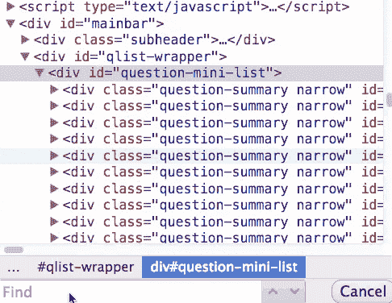
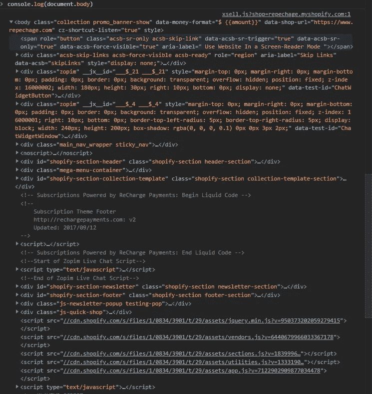
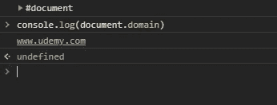
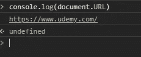
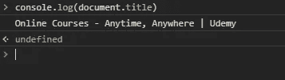
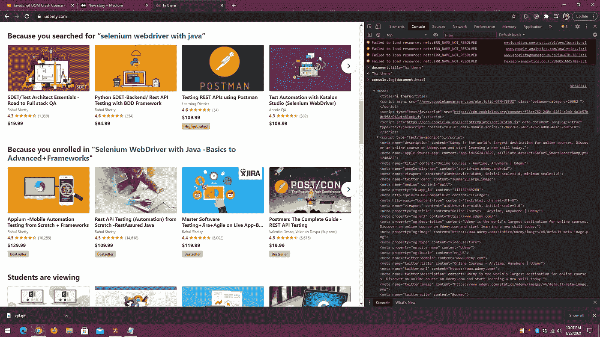
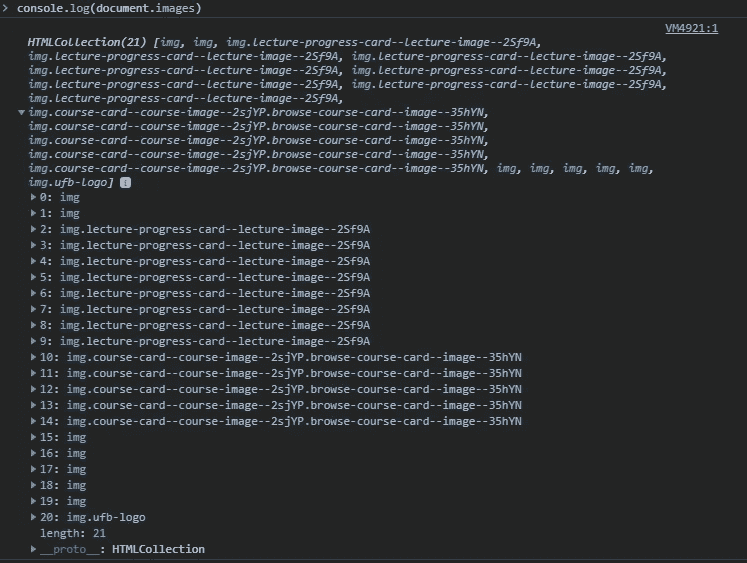
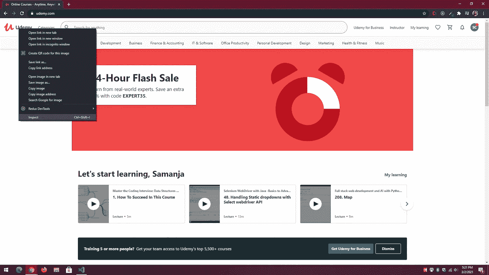
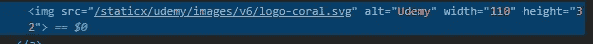
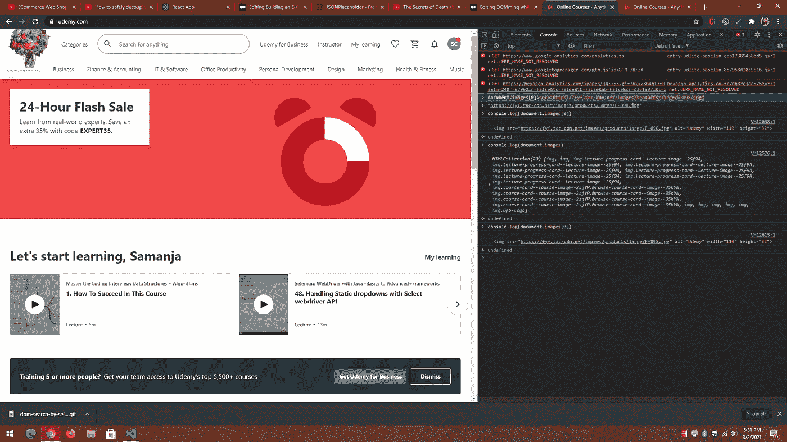

# 使用 JavaScript 入侵网站

> 原文：<https://levelup.gitconnected.com/domming-while-javascripting-612f6c9324a9>

## 如何使用 JavaScript 来读取、写入或操作 DOM



DOM 命令

## 什么是 DOM？

文档对象模型是一个跨平台和独立于语言的接口，它将 HTML 和 XML 视为一个树形结构，其中每个节点是一个表示文档一部分的对象。DOM 是 HTML 文档的结构化表示，可以看作是由浏览器创建的树节点或元素。JavaScript 可用于读取、写入或操作 DOM。作为面向对象的，它有属性和值。我们可以使用 JavaScript 操纵网页上的一切。

我们从检查页面开始。右键单击鼠标，然后单击检查。然后点击控制台。然后键入 console.dir(document)。

```
console.dir(document)
```


JavaScript DOM 操作

记住 DOM 是一个对象，这个命令的作用是显示附加到文档对象的所有不同的属性和方法。文档由页面中所有内容的集合组成。有一个名为 document.body 的命令，通过它我们可以访问节点体的所有属性，节点体是一个具有属性和值的对象。让我们看看检查身体标签。

```
console.log(document.body)
```

我们将获得文档主体标签中所有内容的列表。



JavaScript DOM 操作控制台. log(document.body)

现在让我们通过使用控制台日志来检索网站的域

```
console.log(document.domain)
```



JavaScript DOM 操作|获取域

如果您使用 localhost，它将返回 127.0.0.1，而不是域。

现在让我们看看如何检索 URL

```
console.log(document.URL)
```



JavaScript DOM 操作|获取 URL

现在让我们用命令得到标题

```
console.log(document.title)
```



JavaScript DOM 操作|获取标题

## 操纵网站

让我们用命令更改标题

```
document.title="hi there"
```


JavaScript DOM 操作|更改了标题

## 我们换个标志吧

为此，我们需要抓住控制台的头部，因为徽标通常位于 html 的头部标签内。

```
console.log(document.head)
```

在抓取控制台的头部时，我们会看到对象头部的所有属性和值的列表。



JavaScript DOM 操作|获取头部

正如你所看到的，在所有这些属性中找到标识是非常困难的。为了使事情变得简单，我将使用这个命令

```
console.log(document.images)
```



寻找 Udemy 网站的标志

同样，几乎不可能在网站的众多图片中找到哪个是指这个标志的。查找某个元素的控制台信息的一个很酷的技巧是右键单击某个元素，然后单击 inspect。



查找网站元素的 DOM 信息

在检查了我们得到的标志后



徽标信息

$0 是我们对控制台的称呼。我们必须用 0 来指代控制台中的徽标图像。像这样:

```
console.log(document.images[0])
```

这将为我们呈现标志的图像信息。

现在让我们最后把标志换成我们自己选择的标志。我从互联网上选择了一个图片，图片地址是:" "[https://fyf.tac-cdn.net/images/products/large/F-898.jpg](https://fyf.tac-cdn.net/images/products/large/F-898.jpg)"，但是你也可以选择一个你喜欢的标志。通过使用命令。

```
document.images[0].src="[https://fyf.tac-cdn.net/images/products/large/F-898.jpg](https://fyf.tac-cdn.net/images/products/large/F-898.jpg)"
```

我们可以做到这一点:



更改网站的徽标

最后，我们黑进了一个著名的网站，改变了他们的标题和标志。我希望用我未来的技能取得更大的成就。

编码和创建！！

萨曼贾