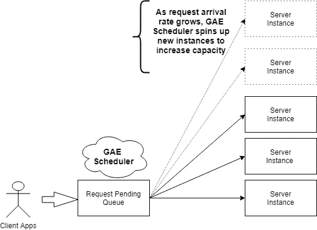
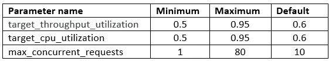
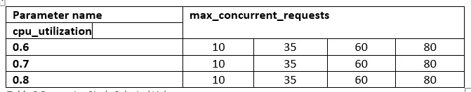
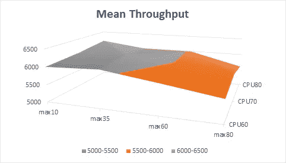
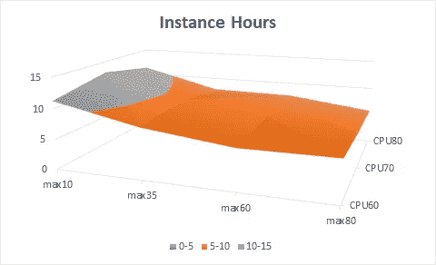
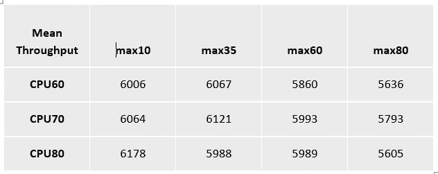
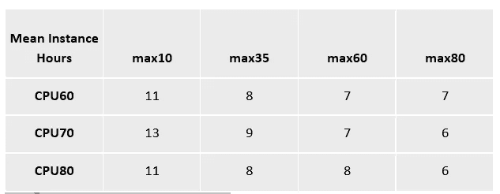

# 不要接受默认值！如何通过谷歌应用引擎自动缩放降低成本

> 原文：<https://levelup.gitconnected.com/dont-accept-the-defaults-how-to-reduce-costs-with-google-app-engine-autoscaling-316af4804a01>

谷歌应用引擎(GAE)和 AWS Lambda 等无服务器技术是基于云的软件系统的强大平台。无服务器平台易于部署和管理，这使得它们成为许多组织将其工作负载迁移到云的一个极具吸引力的选择。

无服务器平台还有另一个吸引人的特性——它们能够随着请求负载的增长自动扩展服务。这种*自动扩展*功能的具体运作方式取决于云平台。月底你会收到账单。

在云可伸缩性系列的[第一篇文章中，我们展示了无服务器平台(GAE)的编程语言选择如何对性能产生重大影响，并可以导致成本降低 4 倍以实现基线吞吐量。在接下来的工作中，我们将在 GAE 上试验自动缩放参数。结果显示了如何通过修改默认值来匹配服务的工作负载，从而以更低的成本获得更高的性能。](https://medium.com/@i.gorton/scalability-and-cost-analysis-for-cloud-based-software-systems-part-1-472012435b26)

或者，在与默认 GAE 平台设置几乎相同的性能下，您可以实现近 50%的成本降低。随着系统的扩展，50%的成本降低可能是一大笔钱。

该系列的第一篇文章详细解释了我们的总体目标和实验方法，因此我们在此不再赘述。让我们深入了解一下自动扩展如何在 GAE 上工作，并解释我们可以修改哪些参数来影响工作负载的管理方式。

# 谷歌应用引擎自动缩放

自动缩放是您在 app.yaml 文件中指定的一个选项，该文件在您上传服务器代码时被传递给 GAE。自动缩放的应用程序由 GAE 根据一组默认参数值进行管理，您可以在 app.yaml 中覆盖这些参数值。

图 1 GAE 天文尺度

GAE 根据传入的流量负载管理应用程序部署的服务器实例数量。如果没有传入的请求，那么 GAE 将不会安排任何实例，您将无需支付任何费用。当请求到达时，GAE 部署一个实例来处理请求。

部署一个实例可能需要大约 500 毫秒到几秒钟[，这取决于您使用的编程语言](https://medium.com/dev-genius/scalability-and-cost-analysis-for-cloud-based-software-systems-part-1-472012435b26)。这意味着如果没有常驻实例，延迟可能会很高。为了减轻实例加载延迟的影响，可以指定可用于处理请求的最小实例数。这当然要花钱。

随着请求负载的增长，GAE 调度程序将动态加载更多的实例来处理请求。有三个参数可以精确控制这种操作方式。这些是:

**目标 CPU 利用率**:设置 CPU 利用率阈值，超过该阈值将启动更多实例来处理请求。范围是 0.5 (50%)到 0.95 (95%)。如果您什么都不做，您将得到默认值 0.6 (60%)。

**最大并发请求数:**设置在调度程序生成新实例之前，一个实例可以接受的最大并发请求数。默认值为 10，最大值为 80。文档没有说明允许的最小值，但是可以推测，1 将定义一个单线程服务。

**目标吞吐量利用率:**它与为最大并发请求指定的值一起使用，以指定何时启动新实例。范围是 0.5 (50%)到 0.95 (95%)。默认值为 0.6 (60%)。它是这样工作的——当一个实例的并发请求数达到最大并发请求数乘以目标吞吐量利用率的值时，调度程序会尝试启动一个新的实例。

明白了吗？😊

因此，默认情况下，在创建新实例之前，一个实例将处理 10 x 0.6 = 6 个并发请求。如果这 6 个(或更少)请求导致一个实例的 CPU 利用率超过 60%，调度程序也会尝试创建一个新实例。

反正我觉得。

但是等等，还有呢！

您还可以指定值来控制 GAE 何时根据请求在请求待定队列中等待分派给实例进行处理的时间间隔来扩展实例。这个*最大挂起延迟*参数是在启动额外的实例来处理请求和减少整体延迟之前，GAE 应该允许请求在挂起队列中等待的最长时间。默认值为 30 毫秒。该值越低，应用程序向上扩展的速度就越快。你可能会花更多的钱。

还有一个*最小挂起延迟*参数，默认值为零。如果你很勇敢，最小值和最大值如何一起工作在这里解释[。](https://cloud.google.com/appengine/docs/standard/python/config/appref#scaling_elements)

这些自动缩放参数设置使我们能够微调服务的行为，以平衡性能和成本。这很好，不是吗？

对于 GAE 软件架构师来说，问题很简单，你如何选择参数值？你从哪里开始？可能的设置组合很多。您如何知道您的参数值尽可能地服务于您的用户和您的预算？在这个视频中有一些来自 Google [的好的一般性建议，但是你仍然面临为你的应用选择精确参数值的问题。](https://www.youtube.com/watch?v=eUXUY7QFfAI)

例如，让我们只考虑三个可用的参数，如表 1 所示。一个应用程序实际上有 45x45x80 种可能的配置。如果您想知道，这是 162K 的配置。我想我不想知道。

表 1 自动缩放参数

即使我们将 10 作为最大并发请求的实际最小值，我们仍然有超过 141K 的配置。如果我们非常实际地考虑吞吐量和 CPU 利用率的增量值为 0.05，最大并发请求的增量值为 10，那么我们最终会得到 648 种可能的配置。这仍然是不切实际的，特别是当我们真的不知道我们的服务对任何参数值有多敏感的时候。

那么，我们如何有效地获得一些关于如何调整我们的应用程序以进行扩展的见解呢？

请继续阅读…

# GAE 自动缩放参数研究

简而言之，我们有一个棘手的问题需要探索。我们可以调整多种配置设置。任何改变将如何精确地影响我们系统的成本和吞吐量基本上是未知的？更棘手的是，这些设置并不是独立的——改变一个设置会影响其他设置对性能和成本的影响

那么，我们能做什么呢？

调整系统性价比的一种方法是进行参数研究。也称为参数研究，该方法允许您指定评估参数，定义参数范围，指定设计约束，并分析每个参数变化的结果。

让我们为 GAE 应用程序定义这样一个研究。

第一步是选择一个或多个配置参数，并为每个参数分配一个可能值的列表。通常最好从参数化地处理少量设置开始。在研究了它们的结果之后，您可能会添加另一个配置参数，或者用一个可能具有更显著效果的参数来替换一个影响不大的参数。一起改变三个或四个以上的参数很少有帮助。

在本文展示的参数研究中，我们探讨了改变 CPU 利用率和最大并发请求参数值的影响。我们为 CPU 利用率选择三个值，即{0.6，0.7。0.8}，分别从默认的 60%到 80%不等。对于每个实例的最大并发请求数，我们选择 4 个值，即{10，35，60，80}，默认值为 10，最大值为 80，如表 2 所示。

表 2 参数研究选定值

这为 GAE 应用程序定义了 12 种不同的配置。这些使我们能够探索每个参数值的范围，并分析它们如何相互作用。

为了量化这些参数变化导致的性能和成本差异，我们对我们上一篇文章中[描述的 Go GAE 服务器进行了一系列测试。我们针对每个服务器配置运行了 512 个并发客户端请求的最大负载，并记录了每个测试的吞吐量、延迟和成本指标。每个测试至少运行 3 次，以获得一致的测量结果，同样遵循这里](https://medium.com/dev-genius/scalability-and-cost-analysis-for-cloud-based-software-systems-part-1-472012435b26)[描述的方法](https://medium.com/dev-genius/scalability-and-cost-analysis-for-cloud-based-software-systems-part-1-472012435b26)。

现在是有趣的部分——结果！

# 实验结果

探索参数研究结果的一种简便方法是为感兴趣的给定指标绘制响应面。例如，图 2 描绘了每个测试配置的平均响应时间。我们可以看到，当最大并发请求值位于参数值范围的低端时，平均吞吐量最高。它对 CPU 利用率设置值也不敏感。随着最大并发请求值的增加，在最坏的情况下，平均吞吐量下降了大约 9%。

图 2 所有测试配置的平均响应时间

接下来，让我们比较一下每个配置的成本，这是由 GAE 执行每个测试收取的实例小时数来衡量的。图 3 绘制了一个响应面，显示当一个实例的并发性设置为 10 时，会产生更高的成本。随着并发级别的提高，成本降低了近 50%,而且似乎对 CPU 利用率相对不敏感。

图 3 所有测试配置的实例小时成本

响应面对于比较结果的总体*形状*非常有用，可以识别结果中的波峰和波谷，在这些地方进一步的研究可能是有益的。然而，为了详细分析这些测试结果到底告诉了我们什么，我们需要看看这些数字。为此，表 3 显示了每个测试配置的平均吞吐量，表 4 显示了每个测试配置的实例小时平均成本。

表 3 每个测试配置的平均吞吐量

表 4 每种测试配置的平均成本

从这些结果中我们可以得出几个重要的观察结果:

*   默认的参数设置{CPU60，max10}既没有提供最高的性能，也没有提供最低的成本。
*   我们使用{CPU80，max10}配置**以与默认配置相同的成本获得了 **3%的高性能**。**
*   与默认配置设置相比，我们从{CPU70，max35}配置中获得了略高(~2%)的性能，同时降低了 18%的成本。更快更便宜是好事。
*   对于{CPU70，max 80 }测试配置，我们以大约 54%的成本获得了大约 96%的默认配置性能。

# 要拿走的分数

这些结果表明，探索 GAE 应用的配置参数设置可以获得可观的回报。在这个实验中，我们看到近 50%的成本降低，而性能损失最小。与默认的 GAE 设置相比，我们可以以低得多的成本获得稍好的性能。仅仅这些结果就足以激励我们去探索改变配置值是如何提高性价比的。

特定参数值的影响当然会因应用程序的行为及其工作负载而异。这就是为什么本文中描述的使用参数研究的系统研究方法是一种强有力的方法。

在测试环境中部署和评估不同的配置既便宜又快速。也可以将这种实验作为生产环境的一部分。GAE 使您能够部署相同代码的不同版本，具有不同的参数设置，并使用 GAE [流量分流特性](https://cloud.google.com/appengine/docs/admin-api/migrating-splitting-traffic)将相同百分比的请求路由到每个版本。使用 GAE 控制台和[云监控功能](https://cloud.google.com/monitoring/api/metrics_gcp)，您可以跟踪每个实例的成本和平均延迟，以比较每个设置组合的效果。如果您是 AWS Lambda 商店，您可以使用 [lambda 函数别名和流量转移](https://aws.amazon.com/about-aws/whats-new/2017/11/aws-lambda-supports-traffic-shifting-and-phased-deployments-with-aws-codedeploy/#:~:text=You%20can%20now%20shift%20incoming,based%20on%20pre%2Dassigned%20weights.&text=Now%2C%20you%20can%20point%20a,%2C%20AWS%20CLI%2C%20and%20SDKs.)进行类似的部署和监控。

也许从这篇文章中最重要的东西如下。不要接受无服务器应用程序的默认配置参数，因为它的负载很大。有了探索配置设置的系统方法，您几乎肯定能够以更低的成本为您的客户端提供更好的性能。所以优先考虑你的客户——你的云提供商已经赚了足够多的钱！