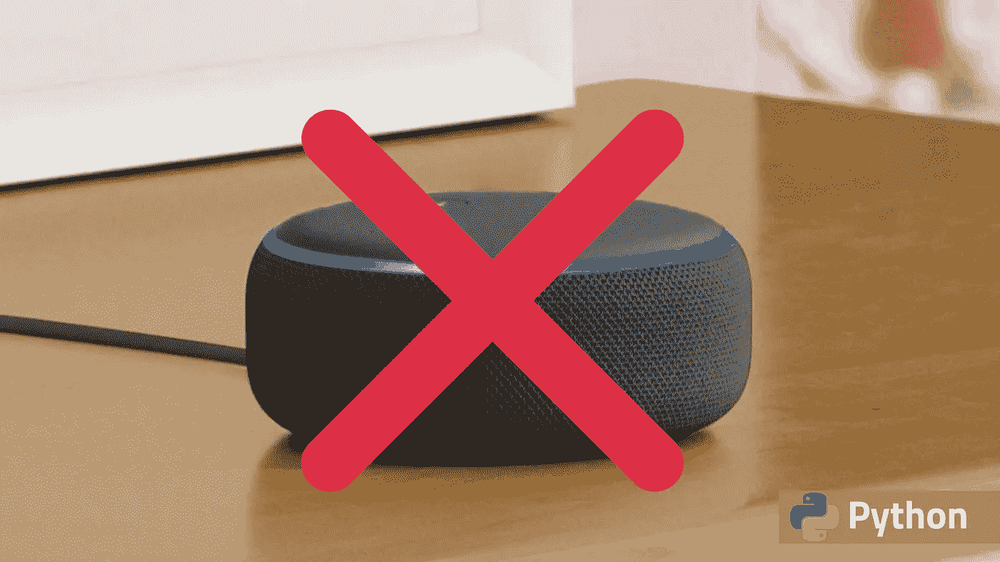

# 不要买 Alexa！建立你自己的

> 原文：<https://levelup.gitconnected.com/dont-buy-alexa-build-your-own-3967222f2ca8>

## 只用几行简单的 Python 代码



自动化是 21 世纪的趋势。从网络自动化到家庭自动化，它无处不在。每个人都希望将他们所有的日常工作和日常任务自动化。大公司正在大量投资创造家庭自动化设备。家庭自动化设备最大的成功之一是智能扬声器。现在市场上有许多智能扬声器，其中带有 Alexa 的亚马逊 Echo 是你能找到的最好的之一。如果你想买一个亚马逊 echo，它将花费你 100 多美元。不是每个人都能负担得起一个扬声器的费用。有一件事你可以做，你可以免费打造你自己的 Alexa。**不用担心，如果你从未写过一行代码，我会指导你完成所有的基础工作。**

# 先决条件

1.  从[这里](https://www.python.org/downloads/)下载 Python 的最新版本。
2.  下载代码编辑器或 IDE，如 [VS 代码](https://code.visualstudio.com/download)
3.  喝杯咖啡或茶开始吧。

我们将使用一些基本的 python 库和模块来为我们创建 Alexa。打开代码编辑器，创建一个新的 python 文件。现在打开您的终端，使用下面的命令安装所需的库。

```
pip install pyttsx3
pip install SpeechRecognition
```

这是我们需要安装的两个主要的软件包，我们将根据需要安装其他软件包。

Pyttsx3 : Pyttsx3 是一个文本到语音的 python 库，用于将文本转换成语音。
**SpeechRecognition** :这个 Python 库用于将语音转换成文本

现在我们已经安装了将文本转换成语音和将语音转换成文本的功能。我们将使用 python 在我们的代码中使用它。我们将创建两个函数。一个函数将我们的声音转换成文本，另一个函数将结果转换成语音。

## **1。语音转文本**

运行上面的代码，说出它将在控制台屏幕上打印出来的内容。

## 2.文本到语音

我们的 Alexa 结构被创建。现在让我们在聊天机器人中添加一些功能和对话。

1.  **基本对话:**使用`in`我们可以创建许多对话。
2.  使用 python 中的时间模块，我们可以让聊天机器人说出当前的时间和日期。
3.  **笑话:** `**pyjokes**`是一个 python 模块，可以用来在我们的 Alexa 中添加笑话工具。`pip install pyjokes`
4.  趋势新闻:使用新闻 API，我们可以让我们的 Alexa 说出趋势新闻。
5.  维基百科:这是 python 中的一个模块，我们用它在 Alexa 中添加了名人搜索功能。
6.  **操作系统:**这是 python 中的一个内置模块，使用它我们可以添加一些功能，比如播放音乐，通过命令打开应用程序。

从[这里](https://gist.github.com/Abhayparashar31/7a4e7e751a5059e686ea21a89b4821b9)复制代码，让你开始使用 Alexa。

您甚至可以通过添加随机选项和更多第三方模块(如电子邮件、请求、吐司通知程序等)来更进一步。

以下是你可以从这篇文章中得到的一些想法

[](/20-python-packages-that-you-must-try-a81862c913f6) [## 你必须尝试的 20 个 Python 包

### 这让你的生活更轻松

levelup.gitconnected.com](/20-python-packages-that-you-must-try-a81862c913f6) 

一些你可能会喜欢的读物

[](/25-useful-python-one-liners-that-you-should-ec613df18260) [## 您应该知道的 25 个有用的 Python 命令行程序

### 这使得 python 不朽

levelup.gitconnected.com](/25-useful-python-one-liners-that-you-should-ec613df18260) [](https://medium.com/python-in-plain-english/5-python-features-you-didnt-know-3bcbcfacfea5) [## 你不知道的 5 个 Python 特性

### Python 是编程世界中使用最多的语言之一。它在全球拥有超过 10，000 名开发人员…

medium.com](https://medium.com/python-in-plain-english/5-python-features-you-didnt-know-3bcbcfacfea5)