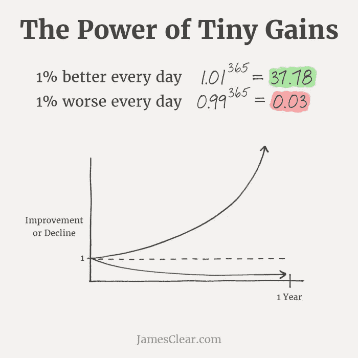

# 不要专注于精通编码——专注于每天都变得更好

> 原文：<https://levelup.gitconnected.com/dont-focus-on-coding-mastery-focus-on-getting-better-each-day-b6c4c6c3459e>

为什么只关注最终游戏会让你失望。

尼古拉斯·霍伊泽在 [Unsplash](/s/photos/master-craftsman?utm_source=unsplash&utm_medium=referral&utm_content=creditCopyText) 上拍摄的照片

我的工程师生涯很短。我花了 10 年时间在几家不同的公司写专业代码，其中只有 6 年是全职工程师。

在那短暂的时间里，我曾有过这样的时刻，我意识到自己并没有成为一名工程师。我花了一段时间来编写看似简单的解决方案，我觉得无论我多么努力，我都不会变得更好。

我们都想成为大师。我们想成为编码艺术的专家工匠(或女工匠)。我们希望有这样的时刻，我们看到一个问题，知道如何解决它，然后像直觉而不是有意识的思考那样执行。

在我为这个目标喝彩的同时，我想提醒你。很有可能，专注于那个目标，你只会感到不断的气馁和不断的无动力。专注于成为大师总是会让你感到匮乏，因为你永远不会像你认为的那样“到达”。

这里有一些提醒，帮助你在通往成功的道路上保持动力和鼓励。

## 精通需要时间

我相信你们都看过推文或者听过开发者在短短几年内从初级到高级的故事。这些故事可能事实上是正确的，但我发现他们中的许多人并没有讲述整个故事。

我**不是**声称这些工程师不诚实或虚伪。他们确实努力工作，花了很多时间才达到现在的位置。

但是，每当我挖掘这些看似快速的恒星的故事时，我发现比它看起来要多很多很多年的工作。提醒你一下，这可能不全是多年的编码工作。有些人在十几岁时花了数年时间创业，因此除了编程之外，还积累了许多其他技能。其他人在正确的时间出现在正确的地点来加速他们的成长，因为他们在第一时间投入了数年来得到那份工作。

不管是哪种情况，他们通常都要走很长的路才能到达目的地。要成为一名优秀的软件工程师，你需要有解决大量问题的经验。当你进入这个行业才几年的时候，如果你还没有成功，不要气馁。

## 专注于精通会减少实际的进步

当你花了所有的时间思考，“我必须成为大师！我要成为大师！”你永远不会意识到你已经走了多远。你会忘记你已经学过的东西。

这是我几年前经历过的。过去几个月，我一直在处理一个框架，并努力理解它。我想成为这个框架的“大师”,因为我们整个公司都在使用它——我想脱颖而出。可悲的是，这个过程并不顺利。

后来有一天，我有了突破。我经历了大多数开发人员梦寐以求的一天。一切都在我的脑海中完美地重现。我看到一个问题，知道如何解决它，知道如何编码它，知道如何测试它。这是心流状态的顶峰。我直觉地知道该做什么。

如果你在同一天早上问我对框架的理解程度，我会耸耸肩。我会说，“我不是很了解它。还在学。”但我比我想象的更进一步。

我能称之为经验掌握吗？不要！我现在比以往任何时候都清楚，我所使用的框架比我当时想象的要复杂得多。我今天仍然在学习它。

但这是一场小胜，这很重要。

[https://jamesclear.com/continuous-improvement](https://jamesclear.com/continuous-improvement)

## 专注于每天变得更好

这听起来像是心理学上的胡言乱语，但你需要专注于你的小胜利。专注于每天只提高 1%(见上图)。

[James Clear](https://jamesclear.com/continuous-improvement) (以及 [many](https://www.artofmanliness.com/articles/get-1-better-every-day-the-kaizen-way-to-self-improvement/) [others](https://jamesaltucher.com/blog/habits-one-percent/) )都谈到了“持续改进”的理念和复合化的效果。虽然敏捷宣言中没有明确指出，但是在这个框架中也确实有持续改进的感觉。

那么，你该如何开始这段每天都变得更好的旅程呢？这是我尽力遵循的一种方法。

每周选择你的代码或技能的一个方面来提高。**写下来**。每天都要集中精力提高这一周的技能。

在周末，反思你是如何变得更好的，**庆祝你的进步**，然后为接下来的一周选择一个新的。

像这样选择一项技能是有效的，因为你不需要成为大师，你只需要一周一次在一件事情上提高一点点。如果你认真对待这一点，那么到明年的这个时候，你将已经花了大量的时间来提高或培养 52 项技能。 **52** ！

然而，大多数人做的是。他们梦想能够像大师一样编码，但从不接受编码挑战或困难的故事。希望他们能清晰有效地交流，但继续保持沉默，从不写作、博客或提出想法。为不懂一门以上的语言而生闷气，而不是要求他们的经理每天花一个小时来学习，概述这对他们和他们的团队会有什么好处。他们对自己没有导师感到沮丧，因为他们没有向自己钦佩的高级工程师寻求指导。

制定一些你能在周末完成的小目标。这是随着时间的推移不断取得小胜利的高潮，它会把你带到下一个层次。

成为一名优秀的软件开发人员也是值得追求的。这需要时间、努力和导师来帮助你实现目标。但不应该是你的重点。

相反，要有耐心，庆祝你的小胜利，并专注于每天都变得更好。每周确定一项具体的技能，并在之后反思自己的进步。你将在几周内成为一名更好的开发人员。

编码快乐！