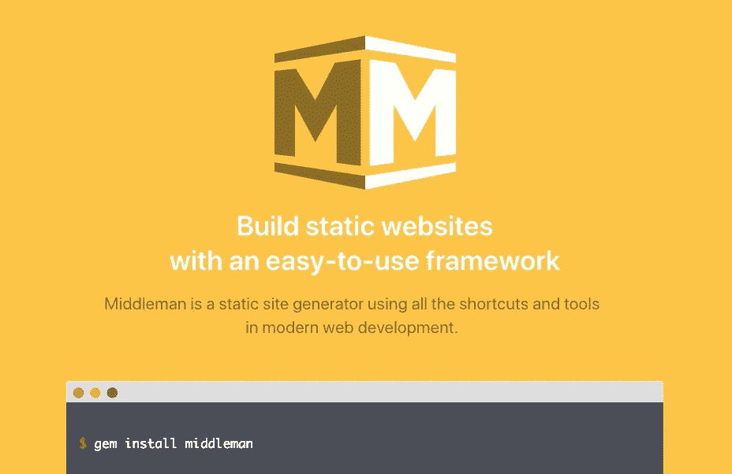
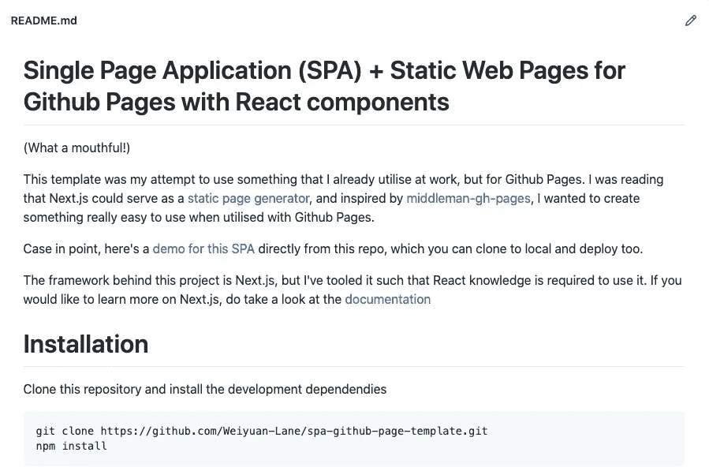
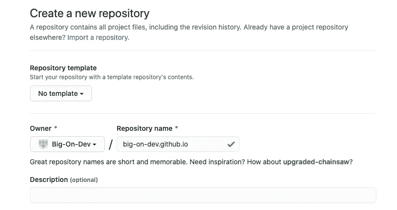
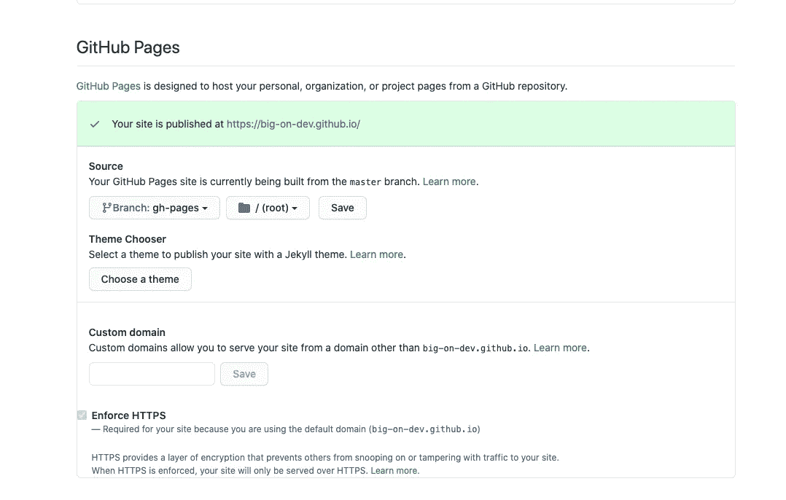
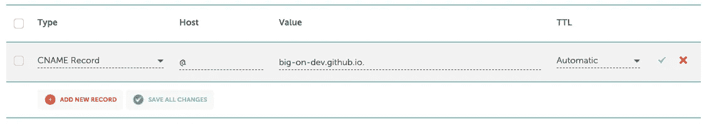
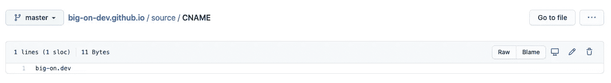
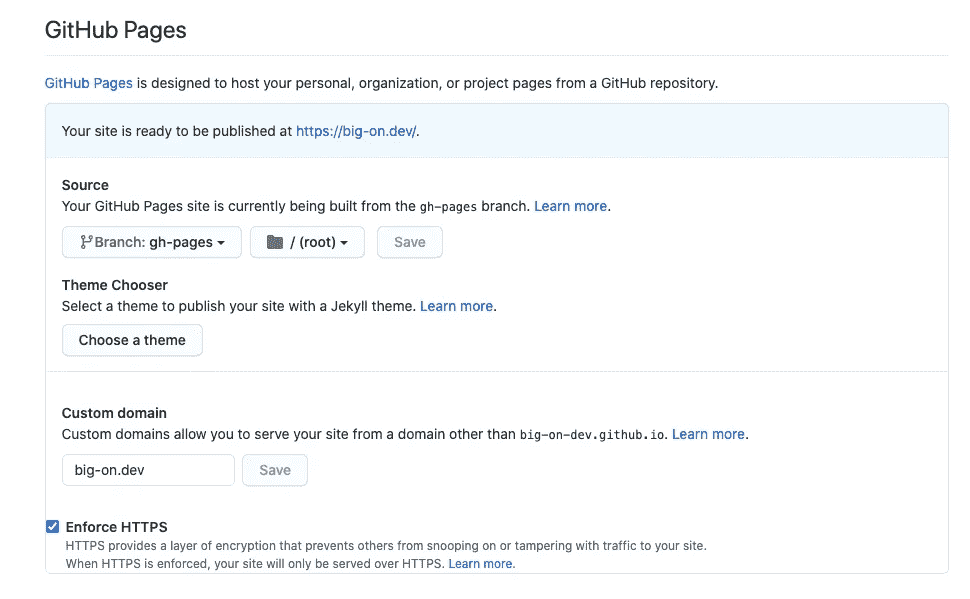
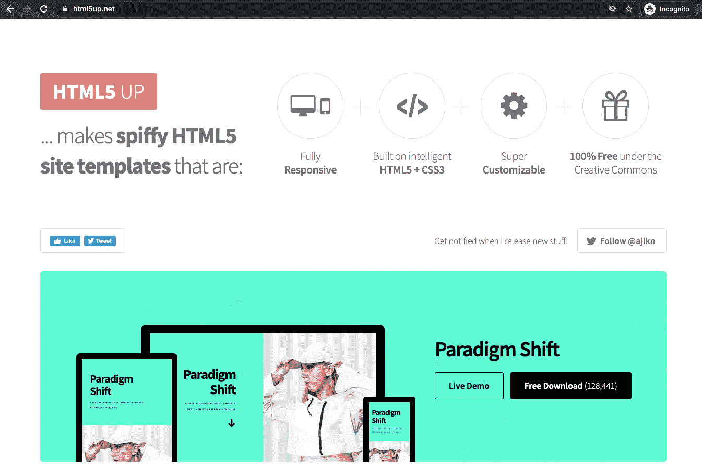

# 没有自己的网站？以下是如何在 1 小时内以低成本或零成本设置一个！

> 原文：<https://levelup.gitconnected.com/dont-have-your-own-website-here-s-how-you-can-set-one-up-in-1-hour-at-a-low-to-no-cost-b2463db30916>


快速、免费、简单？怎么能允许这样呢？—图片来源: [pixabay](https://pixabay.com/illustrations/freedom-silhouette-woman-2053281/) ，作者:[谢弗勒](https://pixabay.com/users/sch%C3%A4ferle-3372715/)

> 总有第一次。你的第一语言。你的第一个剧本。**你的第一个网站。**
> 
> 不仅开发者可以拥有网站。有了正确的知识，任何人都可以做到！
> 
> 那么…一个人到底该如何开始呢？

在今天的工具和服务生态系统中，建立一个属于你自己的网站不再像几十年前那样是一项不可完成的任务。你不需要让你自己的服务器机架(或笔记本电脑)在你房间的角落里持续运行来托管你自己的网站/在线投资组合。

事实上，在 HTTPS 的支持下，建立一个站点是很容易的，不管有没有你自己的自定义域。所有这些都可以在一个小时内完成，我将在下面的步骤中演示。

静态网站有大量免费且受欢迎的托管工具，比如[谷歌云](https://cloud.google.com/free)、[Heroku](https://www.heroku.com/)——仅举几例。**在接下来的步骤中，我将用 GitHub 进行演示，使用** [**GitHub 页面**](https://pages.github.com/) **，让您的第一个站点上线。**

# 第一步:选择你的环境

**预计时间:**不适用，**难度:**低，**费用:** $0

虽然在你的网站上使用纯 HTML 文件是可能的，但我不推荐这样做，因为随着项目规模的增长，它会变得难以处理。首先，可重用的代码，比如部分 HTML 内容，是不可能的。您还可能最终将值硬编码到几个 HTML 文件中，从而难以长期维护您的站点。

我们在这里想要的是一个前端框架加上静态网站生成工具。幸运的是，已经有一些方便的框架服务于这个目的。



来源:[middlemanapp.com](https://middlemanapp.com/)

我经常为 GitHub 页面使用的一个带有静态站点生成器的前端框架是[中间人](https://middlemanapp.com/)。该框架提供了许多 Rails 开发者可能熟悉的不同特性，比如[布局](https://middlemanapp.com/basics/layouts/)和[局部](https://middlemanapp.com/basics/partials/)。它的另一个卖点是，它支持一个具有博客功能的静态网站的引导(其中的帖子存储在单独的 markdown 文件中)，而不需要额外的托管成本的整个编辑器 UI 和博客数据库。再加上中间人页面，在 GitHub 页面上安装一个中间人应用是轻而易举的事情。



来源:[spa-GitHub-page-template](https://github.com/Weiyuan-Lane/spa-github-page-template)GitHub 页面

当然，中间人不是唯一的选择。如果您是一名有抱负的前端开发人员，并且以前可能接触过 JavaScript 和 React，那么使用 React 组件的前端框架可能更适合您！在上面，我已经为 GitHub 页面创建了一个 [Next.js 模板和工具，可以立即用于创建你自己的站点！](https://github.com/Weiyuan-Lane/spa-github-page-template)

一旦您选择了您想要的环境，我们就可以进入下一步了。

# 步骤 2:创建您的存储库

**预计时间:** 2 分钟，**难度:**低，**费用:** $0

转到第 2 步，我们只需要在 GitHub 中创建存储库。



来源: [Github](https://github.com/new)

这一步非常简单，只要确保您转到 github.com/new 的，并将存储库名称设置为`<username|organisation>.github.io`。

如果您在步骤 1 中选择了 Next.js 模板，那么您可以在这里引用分叉的存储库作为模板，这将极大地简化步骤 3。

# 步骤 3:设置您的环境，推送默认代码

**预计时间:**5-10 分钟，**难度:**中期，**费用:** $0

一旦创建了存储库，您应该会看到一组指令来推动您的第一次提交。

除了推送一个 readme 文件，您还可以选择设置您的环境并推送样板源代码。不要担心，我们可以稍后更改默认内容，但我们希望尽可能少地更改这一步，以便我们可以在修改网站内容之前验证托管内容和工作流是否有效。

# 第四步:建立并发布你的网站！

**预计时间:** 5 分钟，**难度:**中期，**费用:** $0

在为您的环境提交之后，只需运行命令来构建和部署您的站点！

如果你正在使用中间人，我强烈建议在你的源代码的根目录中添加下面的脚本(对于 Unix 环境)，并在每次你想要更新你的网站的静态文件时调用`./publish`。在每个新的构建过程中，这个脚本会从以前的构建中清除构建文件，以解决这个 [Git 问题](https://github.com/edgecase/middleman-gh-pages/issues/24)。

如果您正在使用[spa-github-page-template](https://github.com/Weiyuan-Lane/spa-github-page-template)，只需在您的终端中运行以下命令:

```
npm run publish
```

还有维奥拉。静态站点的所有文件和资产都应该在此时构建，并推送到存储库的`gh-pages`分支。

# 步骤 5:配置 GitHub 页面

**预计时间:** 3 分钟，**难度:**低，**费用:** $0



又一个简单的步骤。一旦您的静态站点被发布到`gh-pages`分支，只需在您的存储库的`Settings > Options`中设置 GitHub Pages 分支设置(一直向下滚动)，然后点击 save。

在这一点上，你的网站应该在`<username|organisation>.github.io`上(如果它还没有出现，可能要等几分钟)。如果站点总是返回一个`404`，请确保您验证了上面截图中的设置，并检查了`gh-pages`分支，确保根目录中有一个有效的`index.html`文件。

# (可选)步骤 6:添加您的自定义域

**预计时间:** ~10 分钟，**难度:**高，**费用:**因域费用而异

假设你想超越 GitHub 的默认域名`github.io`，你可以购买你自己的域名并从 GitHub 页面支持它。

为此，您首先需要购买域名。使用像 [Namecheap](https://www.namecheap.com/) 这样的域名注册商来购买你选择的域名。购买后，在域管理菜单中添加以下`CNAME`记录，将`Host`设置为您想要的子域(除了“@”，它是一个特殊字符，表示没有子域)。

在下图中，我的站点`big-on.dev`被定向到`big-on-dev.github.io`。如果我决定使用`www.big-on.dev`，我需要将`Host`值改为`www`。



接下来，在源代码中添加一个`CNAME`文件。确保将该文件复制到构建目录和`gh-pages`中，作为构建过程的一部分:



一旦设置了这些资产，您就可以转到您的存储库中的`Settings > Options`，定制域应该已经设置好了。如果您看到一个加载栏，请稍等片刻，等待设置完成。一旦完成，你可以选择`Enforce HTTPS`选项。



在您自己的自定义域再次访问您的站点，您应该会看到 GitHub 页面上托管的内容！

# 你的第一个网站上线了！


我的副业——在一个小时的时间内完成，自定义域！

嘿，你的网站建好了！总而言之，如果你使用 GitHub Pages 自己的域名，你不需要支付任何费用，甚至是托管费用。多酷啊！

**考虑到自定义域的设置，总时间估计在 30 分钟左右。**我们把时间乘以二作为额外的缓冲，应该还是落在 1 小时的时间要求之内！

第一次建立自己的网站可能是一项非常艰巨的任务。然而，一旦你跨越了这个里程碑，探索其他工具就变得容易多了，比如 Google Cloud 中的 Cloud Run 和 App Engine，以创建不仅仅是一个静态网站。**如果你喜欢冒险，不妨在你的页面上添加**[](https://analytics.google.com/analytics/web/)****[**搜索控制台工具**](https://search.google.com/search-console) **。添加这些工具的步骤非常简单，但是学习使用它们对于探索更深入的 web 开发，比如 SEO 概念，会有很大的帮助。******

****最后但同样重要的是，你的网站可能已经上线了，但是加入一些很酷的网站设计也是一项艰巨的任务。如果是这样，不用再找了——到处都有免费的模板，有些模板只需要使用他们作品的署名。 [Html5 UP](https://html5up.net/) 是我的最爱之一——不需要额外的注册或信息就可以访问基本模板。您可以使用这些模板作为起点，并根据需要修改样式。****

********

****图片取自 https://html5up.net/的[。没有赞助，但这是一个很酷的网站](https://html5up.net/)****

****无论如何，我希望你喜欢这篇关于建立自己网站的简短指南！****

****Ciao~****