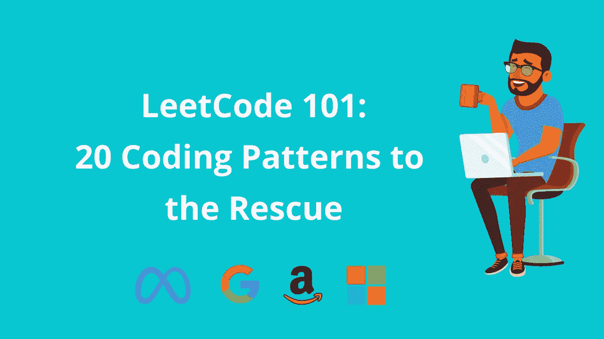

# 不要只是 LeetCode 请遵循编码模式

> 原文：<https://levelup.gitconnected.com/dont-just-leetcode-follow-the-coding-patterns-instead-4beb6a197fdb>

面试前不喜欢练 100 个编码题怎么办？

[钻研编码面试](https://designgurus.org/course/grokking-the-coding-interview)

编码面试越来越难了。为了准备编码面试，你需要几周，甚至几个月的准备。

没有人真的喜欢花那么多时间准备编码面试。那么有没有更聪明的解决办法呢？

首先，我们来看问题。

准备编码面试的人肯定都知道 LeetCode。它可能是最大的编写面试问题的在线知识库。我们来看看人们在使用 LeetCode 时会面临哪些问题。

# LeetCode 的问题

LeetCode 有 2k 多的问题。LeetCode 面临的最大挑战是**缺乏组织性；**它有一大堆编码问题，人们不知道从哪里开始或者关注什么。

人们不禁要问，是否有足够多的问题可以让人们认为自己已经为编码面试做好了准备？

我希望看到一个精简的流程来指导我，教会我足够的算法技巧，让我对面试充满信心。**作为一个懒惰的人，我不喜欢回答 500 多个问题。**

# 解决方案

人们经常遵循的一种技术是解决与相同数据结构相关的问题；比如关注数组相关的问题，然后 LinkedList，HashMap，Heap，Tree，或者 Trie 等。虽然这确实提供了一些组织，但仍然缺乏一致性。例如，许多问题可以使用 HashMaps 来解决，但仍然需要不同的算法技术。

我希望看到问题集不仅遵循相同的数据结构，而且遵循相似的算法技术。

我碰到最好的就是类似**滑动窗口**、**快慢指针**、**拓扑排序**等解题模式。遵循这些模式帮助我培养了“将新问题映射到已知问题”的能力。这不仅使整个编码-面试-准备过程变得有趣，而且更有条理。

> 编码模式增强了我们"**将新问题映射到已知问题的能力**。

# 编码模式

我收集了大约 20 种编码问题模式，我相信它们可以帮助任何人学习这些漂亮的算法技术，并在编码面试中产生真正的影响。

这些模式背后的想法是，一旦你熟悉了一个模式，你就能够用它解决许多问题。关于这些模式的详细讨论以及相关问题的解决方案，请看 [**探究编码面试**](https://designgurus.org/course/grokking-the-coding-interview) 。

所以，事不宜迟，让我列出所有这些模式:

1.  **推拉窗**
2.  **岛屿(矩阵遍历)**
3.  **两个指针**
4.  **快&慢指针**
5.  **合并间隔**
6.  **循环排序**
7.  **链表的就地冲正**
8.  **树宽优先搜索**
9.  **树深度优先搜索**
10.  **两堆**
11.  **子集**
12.  **改良的二分搜索法**
13.  **按位异或**
14.  **前 K 个元素**
15.  **K 路合并**
16.  **拓扑排序**
17.  **0/1 背包**
18.  **斐波那契数列**
19.  **回文子序列**
20.  **最长公共子串**

下面是每个模式的简单介绍，并附有示例问题:

编码模式

# 结论

不管喜欢与否，LeetCode 类型的问题几乎是每个编程面试的一部分，所以每个软件开发人员都应该在面试前练习一下。他们唯一的选择是聪明地准备，通过关注潜在的问题模式来学习解决问题。在 [**寻找编码面试**](https://designgurus.org/course/grokking-the-coding-interview) 和 [**寻找编码面试的动态编程**](https://designgurus.org/course/grokking-dynamic-programming) 中了解更多关于这些模式和示例问题的信息。

查看 [**设计大师**](https://www.designgurus.io/) 关于编码和系统设计面试的一些有趣课程。

 [## FAANG 编码访谈的顶级编码模式

### 编码模式增强了我们“将新问题映射到已知问题的能力”

medium.com](https://medium.com/interviewnoodle/top-leetcode-patterns-for-faang-coding-interviews-bdbe8766534c)  [## 系统设计面试生存指南(2023):准备策略和实用技巧

### 2023 年系统设计面试剧本。

levelup.gitconnected.com](/system-design-interview-survival-guide-2023-preparation-strategies-and-practical-tips-ba9314e6b9e3)  [## 准备编码面试的终极策略

### 如何更快地准备编码面试

medium.com](https://medium.com/interviewnoodle/the-ultimate-strategy-to-preparing-for-the-coding-interview-ee9f7eb439f3) 

# 感谢阅读

*   👏请为这个故事鼓掌，然后跟我来👉
*   📰查看关于[编码和系统设计访谈](https://arslan-ahmad.medium.com/)的更多内容
*   🔔关注我:[LinkedIn](https://www.linkedin.com/in/arslanahmad/)|[Twitter](https://twitter.com/arslan_ah)|[简讯](https://designgurus.org/interview-noodle-page)