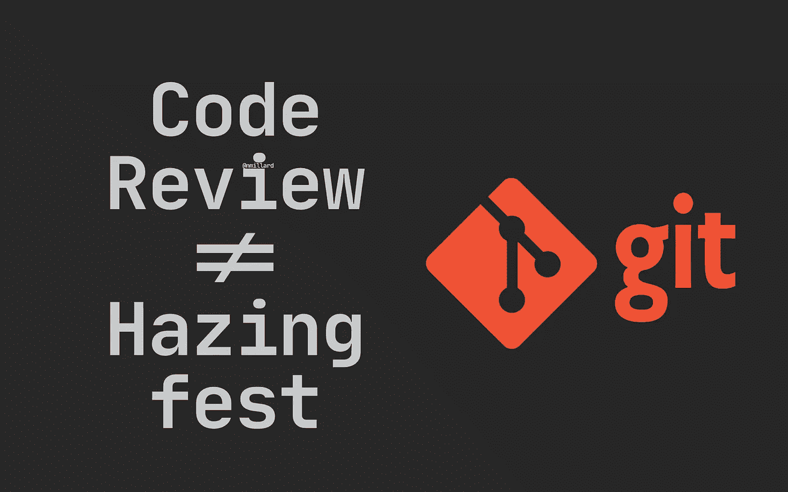
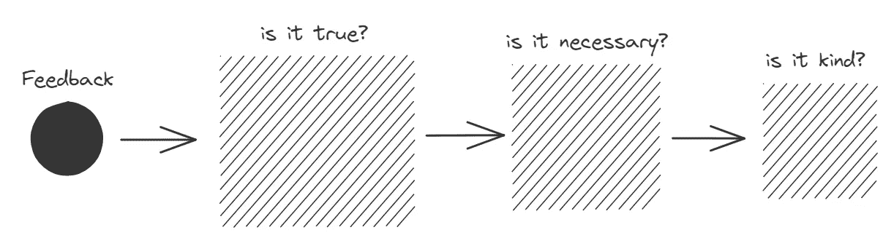
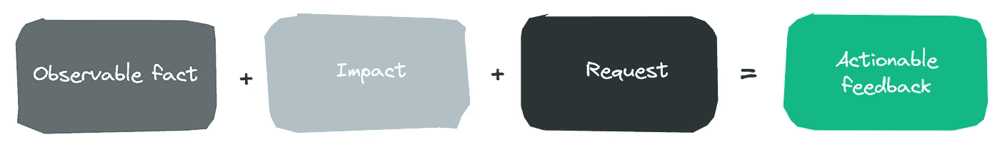

# 不要让你的代码审查变成恶作剧

> 原文：<https://levelup.gitconnected.com/dont-let-your-code-reviews-turn-into-hazing-fests-30975cb34dcb>

## 实用工程指南

## 创建拉请求和进行代码评审的最佳实践。

尼克拉斯·米勒德拍摄的图片

变更列表、补丁、拉取请求，不管名字是什么，只有少数几件事会像将您的辛苦工作合并到共享代码库的过程一样有害。

有些人把代码评审看作是一种邀请，来维护他们的知识，表达他们没有根据的观点，公开羞辱他人，告诉他人如何编码，只是做一个普通的 d*ck。

我将介绍一些我发现有效的技巧，它们对于创建不会破坏友谊或同事关系的拉式请求很重要。我将借用 [April Wensel](https://medium.com/u/e52a7bee92a7?source=post_page-----30975cb34dcb--------------------------------) 提出的一些想法和谷歌和微软的最佳实践，并结合我自己的经验。

> 我在文章的底部提供了实用的清单，我相信你会觉得有用。

## 什么是对待拉式请求的健康态度？

将“拉”请求视为改进共享代码库、学习新实践、方法和方法论的机会，并抓住机会指导他人。

每个工程师、开发人员和编码人员做事情的方式都不同，通常有许多可接受的方法来解决问题或修复 bug。只要遵循这四条原则，大多数纠纷都可以得到解决。

*   技术事实推翻了个人观点和偏好。
*   新代码应该与当前解决方案的风格保持一致。
*   不要批准你自己都不了解的代码。
*   坚持在前面编写高质量的代码，而不是在后面创建“清理”或重构任务。

不要试图炫耀或断言你知道得更多。就这么简单。

我希望你能欣赏这些简单的原则，否则，写一个回应，要求我详细说明这一点。

🔔[想要更多这样的文章吗？在这里签名。](https://nmillard.medium.com/subscribe)

## 提供反馈不是你展示自己的机会。

我是一个非常固执己见的开发人员，你可能已经从我的病毒式文章[中猜到了，停止使用 If-Else 语句](https://nmillard.medium.com/list/bashing-traditional-branching-ifelseswitch-327d4a671e5a)，但是，我仍然认为反馈应该是富有同情心的——但也应该是坦率的(正如 Wensel 所说的)。

这是一个艰难的平衡，你需要超越软件工艺来学习如何提供伟大的，有用的反馈，而不是在这个过程中烧毁桥梁。

温塞尔提出了一个令人敬畏的实用方法。本质上，你把你的反馈放到了测试中:它是真实的，必要的，友好的吗？

April Wensel 的富有同情心的反馈模型。

有时(即经常)我们把自己的观点当作绝对真理。想想吧。“字段应该在构造函数之前声明”，“永远不要使用单例”，“最佳实践是…”。这三种说法都是观点。不是真相。

诸如“我认为你应该花更多的时间适当地学习 X 设计模式”这样的评论可能是真的，但是它是必要的和善良的吗？你的意图也许是好的，但我确信你触发了接收者的防御机制。从现在开始，你将很难说服他们做出任何新的改变。

试着用陈述一个可观察到的事实来组织你的评论，这如何影响你或代码库，并询问你希望有什么改变。

劳拉·霍根的“反馈方程”。

顺便说一句，重要的是要假设最初的开发者心中有最好的意图。因此，不要说“这个代码很糟糕，不能正常工作”，而是尝试陈述你观察到的情况，为什么它不能工作，以及开发人员如何让它工作。

顺便说一下，关于莱纳斯的公开咆哮有一个有趣的讨论。我强烈建议大家阅读这篇文章。

## 创建大型拉动式请求的清单。

确保:

*   你的代码构建(哦…)
*   单元测试提供了足够的代码覆盖率
*   这些变更正确地实现/修复了用户故事/错误
*   代码在本地用类似生产的数据进行测试
*   拉请求恰当地描述了所做的更改
*   提供用户故事/错误的链接
*   提及任何与用户故事/Bug 无关的改进

这些要点对你来说可能听起来微不足道，但我保证你会在某个时候回顾一份遗漏了某个步骤的公关。

此外，如果你不是你编写代码领域的主题专家(SME)，那么将 SME 作为评审者是一个[的好习惯。](https://github.com/dotnet/aspnetcore/blob/6e4217f8c33fc0b993d4ab4617c6818a52bef5bc/CONTRIBUTING.md)

## 还有你审查别人代码的清单…

我鼓励你将这个列表复制到拉取请求的评论中，并逐个检查。

*   代码符合解决方案中的实践吗？
*   代码是否易于阅读和维护？
*   新的变化需要更新文档吗？
*   边缘情况和异常是否得到适当处理？
*   没有圈复杂度或认知复杂度得分超过 10 的方法。
*   代码在本地签出
*   通过运行应用程序在本地测试代码

作为一个回顾，如果你觉得自己在代码所属的特定领域不够胜任，联系主题专家是很重要的。

# 让我们保持联系！

[点击这里](https://nmillard.medium.com/subscribe)订阅时事通讯，获取类似文章的通知，并查看 YouTube 新频道[*(@尼可拉斯·米勒德)*](https://www.youtube.com/channel/UCaUy83EAkVdXsZjF3xGSvMw)

*连接上* [*LinkedIn*](https://www.linkedin.com/in/nicklasmillard/)

# 好奇者的资源。

*   [谷歌工程实践文档](https://google.github.io/eng-practices/)由谷歌提供
*   [富有同情心但又坦诚的代码评审](https://www.youtube.com/watch?v=Ea8EiIPZvh0)作者 [April Wensel](https://medium.com/u/e52a7bee92a7?source=post_page-----30975cb34dcb--------------------------------)
*   米格尔·德·伊卡萨的[开源贡献礼仪](https://tirania.org/blog/archive/2010/Dec-31.html)
*   [工程指南](https://github.com/dotnet/aspnetcore/wiki/Engineering-guidelines)由微软(。网队)
*   劳拉·霍根的反馈方程
*   伊利亚·格里戈利克:不要“推动”你的拉动式请求