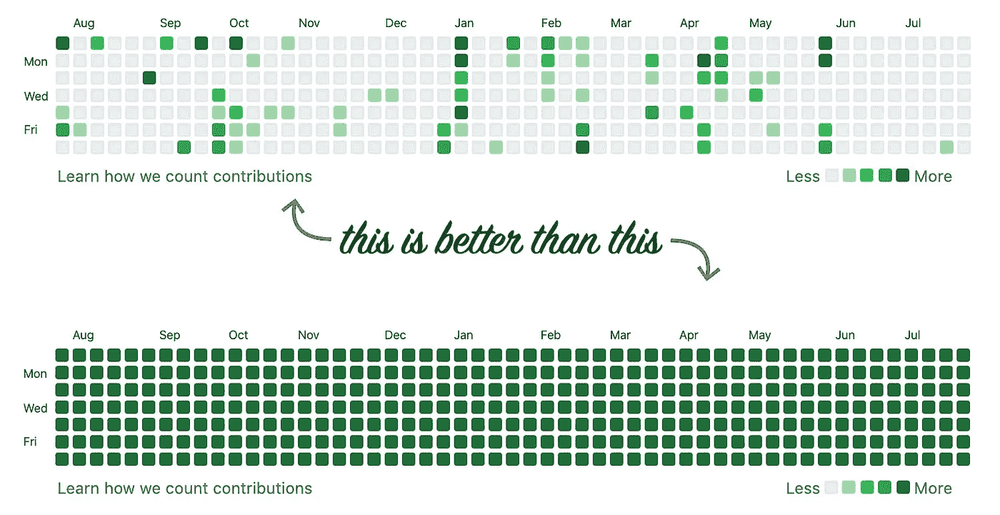

# 求职时不要犯这些错误

> 原文：<https://levelup.gitconnected.com/dont-make-these-mistakes-when-applying-for-a-job-60777737b7f1>

## 我们在申请开发人员职位时发现的六个常见错误

我们团队有几个软件开发人员空缺，我最近一直在审查简历，进行预筛选和面试。这是我第一次完全站在面试过程的这一边，到目前为止，这是一次有见地和有益的经历。

我发现了不同应聘者在招聘过程中会犯的一系列“常见”错误。有些是不幸的人为失误，有些是试图欺骗系统…他们提出了质疑。

现在，对于开发者来说，这是一个很好的就业市场，你可能不会有太多的困难找到一个新的职位。尽管如此，求职时还是要尽量避免这些错误:

1.  别忘了附上你的简历
2.  不要发错简历
3.  没有其他人的简历
4.  不要链接过时/未使用的社交媒体
5.  不要复制粘贴你的测试答案
6.  不要低估自己

# 1.别忘了附上你的简历

听起来可笑又牵强？没有那么多。**大约有 5%的候选人没有在申请中附上简历**。

在某些情况下，这不是他们的错:这是他们过去采用的制度。声称“提交您的个人资料”的求职网站可能无法正确整合和发送信息，并且没有可供审查的文件，我们得到的唯一信息是姓名和/或电子邮件。

没有简历=没有申请(图片由[蒂姆·高](https://www.pexels.com/photo/man-in-white-shirt-using-macbook-pro-52608/)提供)

最初，我会联系候选人，索要他们的简历……但最终停止了。当然，这不是候选人的错，但是当我已经有许多其他资料要审查的时候，我不可能去追他们。

我因此失去了优秀的候选人吗？也许吧。我会因为浪费时间去寻找其他没有附上简历的候选人而失去那些附上简历的优秀候选人吗？大概吧。这对谁都不公平。

当你申请工作时，确保你使用的系统有你的简历存档。如果没有，我们可能什么都得不到。

# 2.不要发错简历

当来自田纳西州的约翰·多伊寄出来自德克萨斯州的迈克尔·史密斯的简历时(姓名和地点均为化名)，这有点令人困惑和怀疑。

我说的不是那些用昵称或“美国名字”提交简历的人([不幸的是，仍然存在歧视，使用一个*更容易的*名字打开了许多大门](https://www.huffpost.com/entry/jose-joe-job-discrimination_n_5753880))，即使我过去也这么做过。我说的是附上一个完全不同的地方，完全不同的背景，完全不同的人的简历。

我见过几次这种情况，感觉很尴尬。尤其是当其中一个配置文件与工作完全匹配，而另一个完全不相关(仍在工作范围内)时。

在谈论错误姓名的同时，如果你添加了一封求职信(大多数人不会)，在随申请一起提交之前重读一遍。当你在求职信中加入错误的公司名称时，看起来有点糟糕。

# 3.没有其他人的简历

这一点可能更适用于需要一定创造力的职位，但在某种程度上，它适用于所有人。

许多简历有相同的模板(和几乎相同的内容，太！).结果，他们并不突出。另一方面，简历更新颖的候选人更容易被记住。

这些郁金香同样美丽，但你只会记住一朵

在反复看到相同的简历后，大部分结构、姓名、经历都很相似的简历变得模糊不清。很难区分两者。给你的简历增添情趣！添加颜色，使用不同的模板，不同的字体和图标…

在某些情况下，这是不可能的，因为公司需要特定的格式。**这一点不仅仅是为了陈述；也是关于内容的**。总有一些东西可以让你脱颖而出。

很长一段时间，我在简历上列举了一些在地方/大学报社做漫画家的经历。去面试的时候，我经常受到“*啊！你就是那个为报纸*画画的家伙。我的经历和其他人相似，但我有自己的优势。一些与众不同的古怪的东西让我脱颖而出，让我难忘。

# 4.不要链接过时/未使用的社交媒体

如果你在你的社交媒体档案和账户上添加链接，我们很可能会检查它们。如果它们是空的或者 10-15 年没有更新，它们会给人留下不好的印象。

说真的，如果你只有一个十几年没更新的回购，为什么要链接你的 Github 个人资料？还是你的空 LinkedIn？还是 4 年前一个有彩蛋照片和单条推文的推特账号？它不会告诉我任何好消息。

对于开发者来说，Github 是一个有趣的案例。他们(我们)急着在简历上加一个 la 链接，但随后简历是空的，或者没有贡献，或者(嗯，更糟糕的是)他们有太多的贡献。

有一次，我们有一个候选人，他创建了一个脚本，可以自动生成虚拟提交并推送到回购。这样，他们的贡献图表看起来不真实的深绿色。但是，实际上，他的独特贡献是……一个生成虚拟提交和推送的开发良好的脚本。

这些贡献图有一张是假的…不知道是哪张？

我个人喜欢看人们在 Github 上开发什么。如果他们什么都没有，这不会影响他们的资格，但可能会让他们的生活更轻松。这是因为人们倾向于更自在地谈论他们的激情，如果我看到一个有趣的项目，我可能会询问它。

# 5.不要复制粘贴你的测试答案

…或者，至少，聪明一点。

如果你有一个带回家的编程测试，不要只是毫无意义地从网上复制粘贴答案。拥有 Google-foo 是一项伟大的技能(我认为知道如何在网上查找信息是必不可少的，候选人在网上搜索面试没有任何问题)，但记住:面试官也有它…他们有反抄袭软件，也会标记你的结果。

在我们的团队中，我们对 [HackerRank](https://www.hackerrank.com/) 进行了小规模的编程测试，作为结果的一部分，我们得到了一份剽窃检测报告。如果算法标记了所有候选人的答案，这看起来不太好。

另外，如果/当你进入下一个阶段，你可能会被要求解释代码。如果你抄袭它是可以的，但是至少你应该理解它并且能够解释它。

# 6.不要低估自己

我们有一些有 15 年相关经验的候选人申请需要 2-4 年的职位。不幸的是，这些候选人几乎被系统自动丢弃。这是因为他们的期望与职位描述不相符，而说服人力资源部门提升一个空缺职位是很困难的。

有些情况下，这种经验差异可能是合理的:人们改变职业生涯或尝试软件开发中的不同领域……但除此之外，雇佣经验丰富的候选人并不可行。

现实一点，不要妄自菲薄。如果你有知识和经验可以在更高的水平，不要申请更低的水平。

与上面的观点相反，**如果你不符合所有的要求**，不要害怕去申请；你可能仍然是一个完美的匹配，并得到这份工作。雇佣一个缺乏经验但有前途的技能的候选人比相反的情况更容易说服 HR。

最后，归结起来就是:不要妄自菲薄，要胸怀大志。如果你是匹配的，很好。如果你不是，公司会告诉你是否有更低的职位适合你。

*原载于 2021 年 8 月 1 日 https://alvaromontoro.com**[*。*](https://alvaromontoro.com/blog/67982/dont-make-these-mistakes-when-applying-for-a-job)*