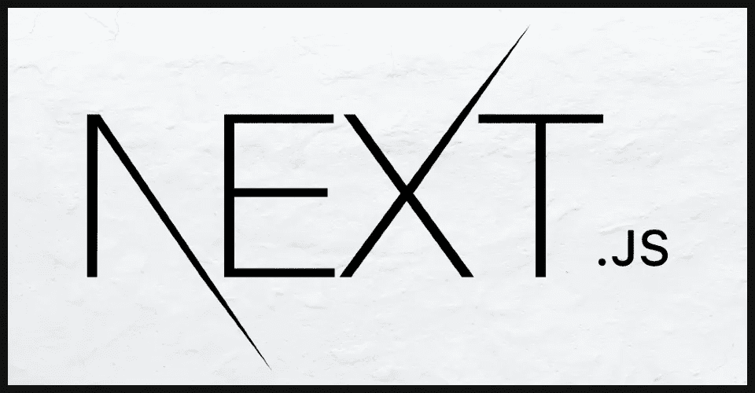

# 不要在 NextJS 上睡觉

> 原文：<https://levelup.gitconnected.com/dont-sleep-on-nextjs-97045166328f>

[NextJS](https://nextjs.org/) 是由 [Vercel](https://vercel.com/) 创建的 React 框架。当我第一次听说它时，我一直在我的项目中使用 [Gatsby](https://www.gatsbyjs.com/) ，有时当我需要客户端路由时[创建 React App](https://create-react-app.dev/) 。本·阿瓦德制作了一些关于[盖茨比和 NextJS](https://www.youtube.com/watch?v=VoscwJ6MGsU) 的视频，当我第一次看到它们时，我认为我对盖茨比没什么意见——我无法证明使用 Next 的合理性。

然而，根据最近对 NextJS 文档的研究，这个框架比我想象的更强大。和 Gatsby 一样，Next 使用了一个 [pages](https://nextjs.org/docs/basic-features/pages) 结构，假设每个页面都应该是静态生成的。在一个 SEO 为王的世界里，这是一件好事，你要确保你的内容和算法匹配良好。然而，如果你想使用服务器端渲染，[你可以很容易地做到这一点](https://nextjs.org/docs/basic-features/data-fetching#getserversideprops-server-side-rendering)。此外，为了获得在与客户端路由器相关联的页面之间导航的速度，Next 使用它的自定义标记预呈现页面。本质上，在做所有这些事情时，NextJS 具有您可能希望从 Gatsby *和* Create React App 中获得的特性！唯一显而易见的问题是，如果你向网速慢的用户提供应用程序；Create React App *可能*在页面导航方面比 NextJS 表现更好，但实际上……向网速较慢的用户提供 React 可能不是一个好主意。

另一个考虑是，您可能无法使用 Create React 应用程序特定的工具。首先想到的是 [SuperTokens](https://supertokens.io/) ，它的 React SDK 是专门围绕标准的 Create React App 路由器设计的。

对于 NextJS 来说，最后一个需要考虑的问题是使用什么作为托管解决方案。由于 NextJS 是由 Vercel 开发的，所以与平台的集成很好。Netlify 也有一个托管 NextJS 应用程序的解决方案，尽管我需要仔细看看它有多好。您还可以使用类似 Kubernetes 的节点服务器进行部署。

尽管如此，我还是打算在我的个人项目中使用 NextJS。最终，我计划将我的博客从 Eleventy 迁移到 Next。

*原载于*[*https://blog . kapic . io*](https://blog.kapic.io/dont-sleep-on-nextjs/)*。*