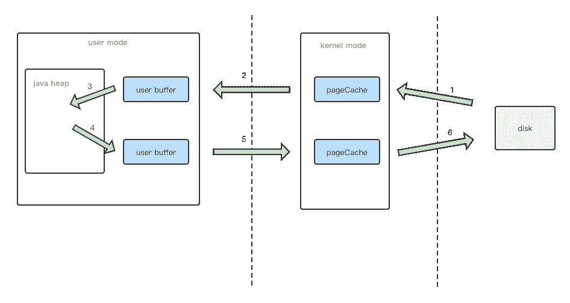
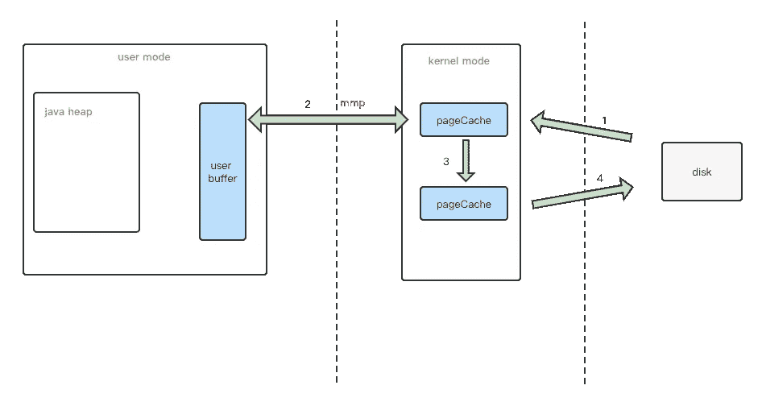

# 不要使用 FileInputStream 传输文件

> 原文：<https://levelup.gitconnected.com/dont-use-fileinputstream-to-transfer-files-5990805de28e>

为了提高效率，请使用 FileChannel。

每个人都熟悉文件的复制。我假设每个人都像我一样使用输入和输出流来操作。从源文件创建输入流，然后从目标文件创建输出流，最后将输入流的数据读入输出流。

高级 Java 开发人员应该知道输入/输出流有很多缺点。输入/输出流阻塞了 IO，通常称为 BIO。当系统调用发生时，当前线程将被阻塞，直到数据完全复制到用户模式缓冲区。而且由于 java 虚拟机的原因，每次复制一个文件，都需要在用户态和内核态之间多次复制文件。整个文件复制过程如下图所示。

我们在程序中并不真正使用这些文件数据。我们只是复制了一个文件。数据从磁盘中读取，并在一系列操作后完好无损地返回到磁盘。难道我们就不能省略这么多不必要的副本吗？答案是肯定的。

Java NIO 是在 Java 1.4 之后提出的，其中 FileChannel 给了我们一种新的传输文件的方式。

## 使用直接内存

FileChannel 是一种通道技术，用于读取、写入、映射和操作文件。数据不会被直接传输。需要和 ByteBuffer 结合使用。可以通过 getChannel 获取频道。

ByteBuffer 有堆缓冲实现和直接内存缓冲实现。如果使用直接内存，可以直接省略上图中的步骤③和④，从而提高文件传输效率。

读写数据时，内存是在 JVM 堆中分配的，JVM 堆内存伴随着不规则的 GC。因此，在读写数据时，需要将数据从 JVM 堆复制到另一个与 JVM 运行时无关的缓冲区，然后进行用户态内核态切换，将数据从用户空间复制到内核空间缓冲区，防止 GC 移动对象导致内存地址变化。直接内存只是避免了 java IO 的缺点。

## mmap+写

后来 mmap 技术可以进一步减少数据副本的数量。使用 mmap 的目的是将内核中读缓冲区的地址映射到用户空间中的缓冲区，这样内核缓冲区就可以与应用程序内存共享，省去了将数据从内核读缓冲区复制到用户缓冲区的过程。但是，内核读缓冲区仍然需要将数据传输到内核写缓冲区。一般流程如下图所示。

*   通过 mmap 启动一个系统调用，映射用户进程内核空间的读缓冲区和用户空间的用户缓冲区的内存地址。
*   CPU 使用 DMA 控制器将数据从主存或硬盘复制到内核空间的读缓冲区。
*   用户进程通过 write()函数向内核发起系统调用，上下文从用户空间切换到内核空间。
*   CPU 将读缓冲区中的数据复制到写缓冲区。

相比以上，mmap+write 减少了一个数据副本。在 Java 中，mmap 是通过 MappedByteBuffer 实现的。具体代码如下:

虽然 mmap 可以提高文件传输效率，但是当 mmap 一个文件时，如果该文件被另一个进程截获，那么写操作就会被访问非法地址的 SIGBUS 信号终止。默认情况下，SIGBUS 会终止进程并生成一个 coredump，服务器可以相应地终止。

## 发送文件

虽然 mmap 减少了一份数据来提高效率，但是有些朋友会问，在没有内存映射的情况下，是否可以在内核状态下只复制一次相同的数据。答案是肯定的，可以使用 sendfile。对应 Java 中的`FileChannel.transforTo()`函数。

本文简要介绍如何通过 FileChannel 操作文件 IO。当我们需要传输或复制文件时，我们不需要使用低效的 BIO APIs。请使用 Java NIO 来替换它们。是时候放弃过时的 BIO APIs 了。最后，感谢您的阅读。

 [## 每个 Java 开发人员都必须知道的五个 API 性能优化技巧

### 为什么你的 API 响应这么慢？也许你需要解决这些问题。

medium.com](https://medium.com/javarevisited/five-api-performance-optimization-tricks-that-every-java-developer-must-know-75324ee1d244)  [## 让 Java 应用程序运行更快的十个优化技巧

### 这些技巧可能会将应用程序的性能提高几倍。

medium.com](https://medium.com/javarevisited/ten-optimization-tricks-to-make-your-java-application-run-faster-9742f568ed6f)  [## 每个 Java 开发人员都应该知道的 5 个最佳 Java 库

### 你知道这些优秀的 Java 库吗？

medium.com](https://medium.com/javarevisited/5-best-java-libraries-every-java-developer-should-know-28a1c080bbf)