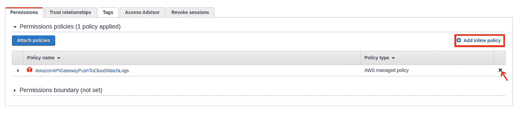

# 不要用 Lambda 移动数据！API 网关可以提供帮助

> 原文：<https://levelup.gitconnected.com/dont-use-lambda-to-move-data-api-gateway-can-help-fe899df239e6>

API Gateway 是 Lambda 的最佳伴侣，很多人都是用 API Gateway 尝试自己的第一个 Lambda 函数。但很多人不知道的是，API Gateway 不仅仅是一个触发器，它能做的比你想象的更多。

本文将带您了解如何使用 API Gateway 来:

1.  验证用户输入
2.  转换数据格式
3.  与其他 AWS 服务集成

# 1.输入验证

最重要的安全原则之一是永远不要相信用户的输入。所以你可能在 Lambda 函数的开头有一些验证用户输入的代码。

我们可以首先使用 API Gateway 验证输入，避免不必要的 Lambda 调用，而不是调用 Lambda 函数来验证用户输入并返回错误。我们可以这样做:

## 步骤 1:创建数据模型

首先，我们需要定义我们想要的用户输入的模型，以便 API Gateway 可以使用它来进行验证。

在 AWS 控制台中，创建 REST API 后，您可以看到一个名为**模型的页面。**


在**模型**页面中，我们可以使用 JSON 模式创建数据模型

**Model** 是一个 [**JSON schema**](https://json-schema.org/learn/getting-started-step-by-step.html) ，可以定义请求内容的预期结构。例如，我可以定义我的 API 端点来摄取包含字符串`name`的 JSON 一个整数`id`；并且没有额外的价值，通过下面的模式:

```
{
    "$schema":"[http://json-schema.org/draft-04/schema#](http://json-schema.org/draft-04/schema#)",
    "properties":{
        "name":{
            "type":"string"
        },
        "id":{
            "type":"integer"
        }
    },
    "required":[
        "id",
        "name"
    ],
    "additionalProperties":false
}
```

这只是一个简单的例子。使用 JSON Schema，您可以定义更复杂的验证规则，比如最小值/最大值、枚举、模式匹配、嵌套对象。

## 步骤 2:用 API 端点绑定模型

接下来，我们需要将模型绑定到我们想要进行验证的端点。在**resources**页面，点击进入端点，选择**方法请求**。


在**方法请求**页面中，我们可以将模型绑定到一个端点

我们为**请求验证器**选择**“验证主体、查询字符串参数和头”**，以便 API 网关验证来自用户的请求主体。

在**请求体**选项卡下，我们添加一行，其中**内容类型**设置为**应用程序/json** (当然，如果您的 API 接收不同的内容类型，您可以使用其他内容类型)。在**模型名称**列中，我们选择我们在步骤 1 中创建的模型。

现在，我们可以测试我们的 API。返回**方法执行**页面，点击**测试**。在此页面上，我们可以预览 API 的行为，而无需部署它。


如果输入无效，API 将返回 HTTP 400 错误

我尝试使用一个空对象作为输入。因为模型声明`name`和`id`是必需的，API 会立即返回一个 HTTP 400 错误，而不会调用下游流程。

## 步骤 3:修改错误响应

正如我们所看到的，API 返回了一个错误消息**“无效的请求体”**。例如，如果我们输入一个带有`name`和`id`的 JSON，但是数据类型错误:

```
{
    "name": "Richard",
    "id": "This is a string"
}
```

它仍然返回相同的消息。它不是很有用，因为它没有告诉用户请求的哪一部分是无效的。

在**网关响应**页面中，我们可以为每种响应类型定制响应。对于我们的用例，我们将定制**错误的请求体**。


我们可以定制来自 API 网关的响应

点击`application/json`下的**响应模板**，我们可以看到默认的模板是:

```
{"message":$context.error.messageString}
```

我们需要把它改成更有意义的信息。我们可以使用许多[变量](https://docs.aws.amazon.com/apigateway/latest/developerguide/api-gateway-mapping-template-reference.html#context-variable-reference)来构造响应体。在我们的例子中，我们将使用`$context.error.validationErrorString`，我们将模板改为:

```
{"message":"$context.error.validationErrorString"}
```


使用$context 变量收缩响应体

保存模板后，我们可以返回到**方法执行**页面，再次进行测试。

现在，如果我们输入一个空对象作为输入，API Gateway 会用消息响应一个 HTTP 400 错误

```
[object has missing required properties (["id","name"])]
```

如果我们将一个字符串放入 **id** 字段，它会以消息作为响应

```
[instance type (string) does not match any allowed primitive type (allowed: ["integer"])]
```


响应现在包含验证错误

# 2.数据转换和服务集成

很多时候，当人们想要向客户提供 AWS 服务时，他们不会直接公开服务 API，因为他们想要控制请求和响应格式。首先必须考虑使用 Lambda 来转换数据格式，并对 AWS 服务进行 API 调用。

## 示例:从 DynamoDB 获取记录

从 DynamoDB 查询记录应该是最常见的 API 用例之一。API Gateway 可以帮助我们将用户输入的查询字符串翻译成 DynamoDB 查询。并且把结果翻译成我们想要的格式给用户。

在本例中，我将创建一个 GET 端点，从查询字符串中获取`id`，然后从 DynamoDB 返回相关记录。

## 步骤 1:创建 IAM 角色

我们需要为 API 网关创建一个 IAM 角色来访问 AWS 服务。在本例中，我们将创建一个授予 DynamoDB 查询权限的角色。

在 **IAM 角色**页面中，我们创建了一个新角色。对于**【可信实体】**，我们选择 **API 网关**。然后，我们将所有配置保留为默认设置，直到最后一步。给角色起一个名字，例如**DynamoDBQueryForAPIGateway**。


为 API 网关创建新角色

接下来，我们需要分离默认的**AmazonAPIGatewayPushToCloudWatchLogs**策略，并添加我们的内联策略。



删除默认策略并添加我们的内联策略

在内联策略中，我们在表上授予 **DynamoDB Query** 权限。


添加内联策略以授予对 DynamoDB 表的查询访问权限

## 步骤 2:要求用户提供查询字符串参数

在 **GET** 方法的**方法请求**页面下，我们为**请求验证器**选择**“验证查询字符串参数和头”**。

在**“URL 查询字符串参数”**部分，我们添加了一个名为`id`的行，并标记为**必填**。

现在，端点检查用户是否在查询字符串中提供了参数`id`，如果不存在，则拒绝调用。


将 id 作为端点的必需参数。

## 步骤 3:将用户输入转换成 DynamoDB API 调用

转到**集成请求**页面，这是我们构造 DynamoDB 调用的地方。

为**集成类型**选择 **AWS 服务**； **DynamoDB** 用于 **AWS 服务**；并为 **AWS 区域**选择 DynamoDB 表的区域。

对于执行角色，输入我们在步骤 1 中创建的角色的 ARN。

对于 **HTTP 方法**和**动作**，我们可以查看一下 API 参考。每个 AWS 服务都有自己的 API 请求格式。在这种情况下，我们将使用**发布**查询 ( [API 引用](https://docs.aws.amazon.com/amazondynamodb/latest/APIReference/API_Query.html#API_Query_Examples))。


向下滚动到底部，我们可以看到**映射模板**部分，那是我们构造 API 调用体的地方。

我们将添加一个新的映射模板，将**内容类型**设置为**应用程序/json** (我们期待来自用户请求的 json)。

对于**请求体通过**，我们选择**从不**。任何不是 JSON 的请求都将被拒绝，这样外人就不能绕过我们的映射直接访问 DynamoDB API。


使用映射模板构造 DynamoDB API 调用

最精彩的部分来了，模板本身。API Gateway 中的映射模板使用 [**Apache Velocity 模板语言(VTL)**](https://velocity.apache.org/engine/devel/vtl-reference.html) 格式。我们可以使用 VTL 来构造 API 调用体，就像我们通常构造 API 调用一样。结合一些简单的逻辑，如 if-condition、for-loop 和 API Gateway 提供的[变量](https://docs.aws.amazon.com/apigateway/latest/developerguide/api-gateway-mapping-template-reference.html)，我们可以根据用户输入进行 DynamoDB API 调用。

在本例中，我们将构建一个普通的**查询**调用，使用用户提供的`id`参数作为主键条件:

```
{
    "TableName": "xxxxxxxx",
    "KeyConditionExpression": "id = :id",
    "ExpressionAttributeValues": {
        ":id": {
            "N": "$input.params('id')"
        }
    }
}
```

## 步骤 4:将查询结果转换为 API 响应

类似于构造 API 调用，我们可以基于 DynamoDB 的结果构造对用户的响应。

在**集成响应**页面中，我们可以配置来自 DynamoDB 的响应和发送给用户的响应之间的映射。为了简单起见，我们将使用默认的。

在**映射模板**部分下，我们添加一个新模板，其中**内容类型**设置为**应用程序/json。**


使用映射模板将 DynamoDB 响应转换为用户响应

对于模板主体，我们将使用一个 For 循环列出所有被查询的条目，并将它们显示为一个简单的 JSON 对象，而不是 DyanmoDB 提供的原始格式。

或者，我们可以使用 if 条件来检查是否有任何记录返回。如果没有返回记录，我们甚至可以将 HTTP 响应代码覆盖为 404。([覆盖状态代码](https://docs.aws.amazon.com/apigateway/latest/developerguide/apigateway-override-request-response-parameters.html#apigateway-override-request-response-parameters-override-response)的 AWS 文件)

```
#set($inputRoot = $input.path('$'))#if($inputRoot.Items.size() == 0)
#set($context.responseOverride.status = 404)
{
    "message":"Record not found"
}
#else
[
#foreach($item in $inputRoot.Items)
    {
        "id" : $item.id.N,
        "name" : "$item.name.S"
    }#if($foreach.hasNext),#end
#end
]
#end
```

## 尝试一下

现在，如果我们返回到**测试**页面，我们可以提供查询字符串并测试我们刚刚创建的 API。

如果我们将`id=1`放入查询字符串(我已经在 DynamoDB 表中创建了记录)，我们可以看到 API 返回我们定义的 JSON 数组，而不是来自 DynamoDB 的复杂响应结构。


API 以我们定义的格式返回记录。

如果我们放入`id=2`(我没有这个 id 的记录)，API 会返回一个 HTTP 404 错误，以及我们在模板中定义的错误消息。


当没有找到记录时，API 返回 404 错误。

# 包裹

## 费用

对于许多 web 应用程序来说，大部分流量是读取流量。如果我们在 API Gateway 中实现它们，我们可以节省那些不必要的 Lambda 调用的成本。

即使 Lambda 调用是不可避免的，我们仍然可以在 API Gateway 中进行输入验证。通过保护 Lambda 函数不被用户犯下愚蠢的错误，我们可以避免在做无意义的事情上浪费调用。

## 并发

您可能会注意到 API Gateway 提供了 5000 个突发并发。然而，如果每个 API 调用都以 Lambda 函数结束，那么这个并发数就变成了 1000，因为 Lambda 只给你这个并发数。

通过将那些简单的 API 调用(尤其是读取流量)从 Lambda 中剥离出来，我们可以将宝贵的 Lambda 并发性留给更复杂的任务。

# 特征图像

