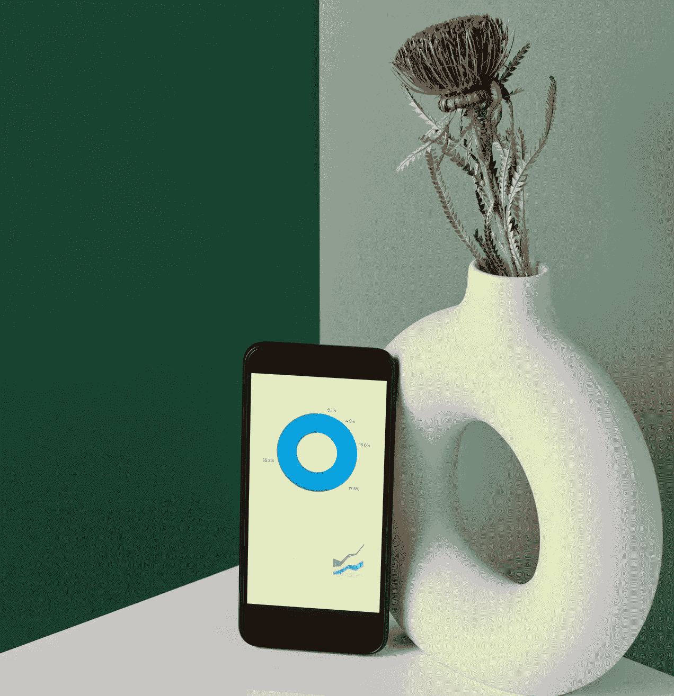
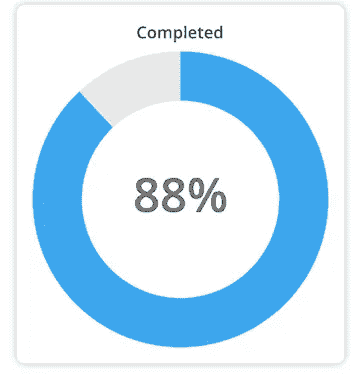

# 带角度和 D3 的环形仪表

> 原文：<https://levelup.gitconnected.com/donut-gauges-with-angular-and-d3-7be1b5f39492>



具有圆环图的移动设备

谁不爱吃甜甜圈？人们在应用程序的报告、仪表盘和卡片元素上尽情享用。您可以轻松地在 Angular 中创建环形量规，而无需使用庞大的库或购买商业组件。只要有一点点诀窍，我们就能制作出一些你尝过的最美味的甜甜圈图！

> 本文是带角度和 D3 的[迷你图的姊妹篇](/sparklines-with-angular-and-d3-d279dbac0c38)，在这里你可以学习如何创建漂亮的迷你图。

为了烘培它，我们**T5**将使用 [D3.js](https://d3js.org/) ，在维基百科上描述为:

> D3.js(也称为 D3，是数据驱动文档的缩写)是一个 JavaScript 库，用于在 web 浏览器中生成动态、交互式数据可视化。它利用了广泛实现的可缩放矢量图形(SVG)、HTML5 和级联样式表(CSS)标准。
> 
> **注意:** 没有 D3.js 也有其他方法来构建一个圆环图**，也许用直接的 SVG 代码也一样简单。然而，我将把它留到另一篇文章中来讨论！**

# 先决条件

最近我看到的大多数 Angular 目标教程都喜欢带你安装 Angular 并创建一个全新的项目。我不打算这么做，因为我坚信在你到达这里之前，你应该有一个框架的基础知识。然而，我会提供一个如何开始使用 Angular 的链接，所以如果你是新手，请浏览教程(英雄之旅),然后回来和我们一起制作一些甜甜圈！[角斗士英雄之旅](https://angular.io/tutorial)

您需要安装 D3 库，这可以在提示符下完成:`**npm install d3 --save**`

然后，为了确保我们在实现 D3 时不会发疯，我们需要键入:`**npm install @types/d3 --save-dev**`

## tsconfig.json

在我们继续之前，我喜欢在构建 Angular 应用程序时使用路径快捷方式。这样我只需用**~ app/feature/demo/demo . component**就可以访问**src/app/feature/demo/demo . component . ts**。为此，您需要打开根目录中的 **tsconfig.json** 文件，并将以下内容添加到 compilerOptions 部分，我通常将该部分插入到 moduleResolution 的正下方和 importHelpers 的前面。

```
**"paths": {
      "~app/*": ["src/app/*"],
      "~assets/*": ["src/assets/*"],
      "~environment/*": ["src/environments/*"]
},**
```

# 图表组件

我们需要一个组件来实际显示圆环图。我们将通过使用:
`**ng generate component feature/chart**`生成一个图表组件来实现

创建完成后，我们打开:**app/feature/chart/chart . component . ts**

## 图表.组件. ts

我们将利用相当多的核心角度接口，包括***AfterViewInit***， ***ElementRef*** ， ***HostListener*** ， ***Input*** ，以及 ***ViewChild*** 。我们通过导入来做到这一点。
替换现有的:
`**import { Component, OnInit } from '@angular/core';**`

同:`**import { AfterViewInit, Component, ElementRef, HostListener, Input, ViewChild } from '@angular/core';**`

一旦完成，让我们导入 D3 库:
`**import * as d3 from 'd3';**`

好的，这应该能让我们成功！

这里可能会有一个错误，因为我们实现的是 OnInit 而不是 AfterViewInit，所以我们需要做两处调整:

替换包含`**export class ChartComponent implements OnInit {**`的第 10 行或其附近的出口声明

用`**export class ChartComponent implements AfterViewInit {**`

我们还需要用**ngafterviewit()**替换 **ngOnInit()** 方法。在 14 号线上或周围更换`**ngOnInit(): void {}**`

用`**ngAfterViewInit(): void {}**`

为什么这很重要？如果你对[Angular Component life cycle](https://angular.io/guide/lifecycle-hooks)不太熟悉，它本质上是一种在组件生命周期中的特定事件(创建、更新和销毁)将代码“注入”到组件中的方法。来自官方的 Angular 文档:

> 组件实例的生命周期始于 Angular 实例化组件类并呈现组件视图及其子视图。生命周期继续进行更改检测，Angular 检查数据绑定属性何时更改，并根据需要更新视图和组件实例。当 Angular 销毁组件实例并从 DOM 中删除其呈现模板时，生命周期结束。指令也有类似的生命周期，Angular 在执行过程中创建、更新和销毁实例。

因此，在尝试绘制任何东西之前，我们希望等到组件尽可能初始化。这一点尤其重要，因为我们将利用 **ViewChild** 装饰器，根据 Angular 文档，该装饰器设置在调用**ngafterviewit()**之前，但在其他初始化生命周期挂钩之后。

> 视图查询是在调用`***ngAfterViewInit***`回调之前设置的。

**主持听众** 好吧！现在，我们还想确保当调整窗口大小时，我们的图表也随之调整大小。我们希望捕获任何窗口大小调整事件，以便在其容器内适当地重新绘制图表。最简单的方法是通过 Angular host listener——我们捕获任何' **window:resize** '事件，然后执行我们的 re-draw 方法 **this.resize()** ，我们将在本文中进一步实现它。

```
**@HostListener('window:resize', ['$event'])
onResize() {
    this.resize();
}**
```

**Input**
我们还需要来自调用组件的一些信息来初始化图表并适当地调整大小。

```
**/* The colors of the donut chart, starting with the fill color, followed by the gauge background color. */
@Input() colors: string[] = [];****/* The value to fill the donut, followed by the "unfilled" amount e.g. if we were displaying a donut representing 100% and we wanted to fill 88% of it, we'd supply [88,11] here. */
@Input() data: number[] = [];** **/* The height of the donut */
@Input() height: number;****/* Label for the inside of the donut, if desired */
@Input() label: string;****/* Color of the label inside of the donut */
@Input() labelColor: string = 'rgba(80,80,80,.8)';** **/* The title of the chart, if desired */ 
@Input() title: string;****/* The width of the donut. */
@Input() width: number;**
```

请记住，如果您不想使用 RGBA 值，您可以简单地使用十六进制代码，如' **#4682B4'** ，或颜色的名称，如**'矢车菊蓝'，**，但我喜欢允许自己自由的不透明度(RGBA 数组中的第四个数字，范围在 0-完全透明和 1-不透明之间，如 0.4)

**查看子节点**

继续前进！我们还想利用 Angular 的 **ViewChild** 来方便地(不需要生成或要求特定的元素 id，这在显示多个图表时会非常麻烦)引用容器和图表 DOM 元素。

```
**@ViewChild('chart', {static: false}) chart: ElementRef<SVGElement>;****@ViewChild('container', {static: false}) container: ElementRef<HTMLDivElement>;****@ViewChild('titleContainer') titleContainer: ElementRef<HTMLDivElement>;**
```

最后，我们需要存储一个 SVG 全局变量，以便在构建甜甜圈时引用。

```
**public svg: any;**
```

## 快速回顾

到目前为止，我们的 **chart.component.ts** 文件看起来应该与此非常相似:

```
**import { AfterViewInit, Component, ElementRef, HostListener, Input, ViewChild } from '@angular/core';
import * as d3 from 'd3'****@Component({
    selector: 'app-chart',
    templateUrl: './chart.component.html',
    styleUrls: ['./chart.component.scss']
})
export class ChartComponent implements AfterViewInit {** **@HostListener('window:resize', ['$event'])
  onResize() {
    this.resize();
  }** **/* The colors of the donut chart, starting with the fill color, followed by the gauge background color. */
  @Input() colors: string[] = [];** **/* The value to fill the donut, followed by the "unfilled" amount e.g. if we were displaying a donut representing 100% and we wanted to fill 88% of it, we'd supply [88,11] here. */
  @Input() data: number[] = [];** **/* The height of the donut */
  @Input() height: number;** **/* Label for the inside of the donut, if desired */
  @Input() label: string;** **/* Color of the label inside of the donut */
  @Input() labelColor: string = 'rgba(80,80,80,.8)';** **/* The title of the chart, if desired */ 
  @Input() title: string;** **/* The width of the donut. */
  @Input() width: number;** **@ViewChild('chart') chart: ElementRef<SVGElement>;
  @ViewChild('container') container: ElementRef<HTMLDivElement>;
  @ViewChild('titleContainer') titleContainer: ElementRef<HTMLDivElement>;** **public svg: any;** **constructor() { }** **ngAfterViewInit(): void {
  }****}**
```

## 调整大小

我们想要实现的第一个方法是 resize。这将允许我们在触发 resize 事件时修改图表的高度和宽度，并允许我们执行初始大小设置。我们将使用 **ViewChild** 对 **this.container** 和 **this.chart** 的定义，然后访问它们的 **nativeElement** 属性。

> **注意** :
> 如果你不熟悉你在整个代码示例中看到的反斜线`***`***`，这不是一个粗心的错误！使用反斜线代替引号`***'***`或双引号`***"***`就是 JavaScript 中的插值或模板文字。MDN Web Docs 将模板文字描述为:**模板文字是用反斜杠(** `***`***` **)分隔的文字，允许被称为*替换*的嵌入式表达式。**你可以在这里找到更多信息:[https://developer . Mozilla . org/en-US/docs/Web/JavaScript/Reference/Template _ literals](https://developer.mozilla.org/en-US/docs/Web/JavaScript/Reference/Template_literals)

```
**private resize(): void {
  this.height = (this.height && !isNaN(this.height) && this.height > 0) ? this.height : this.container.nativeElement.parentElement.parentElement.offsetHeight;** **this.width = (this.width && !isNaN(this.width) && this.width > 0) ? this.width : this.container.nativeElement.parentElement.parentElement.offsetWidth;** **this.chart.nativeElement.style.height = `${this.height}px`;
  this.container.nativeElement.style.height = `${this.height}px`;
  this.chart.nativeElement.style.width = `${this.width}px`;
  this.container.nativeElement.style.width = `${this.width}px`;
}**
```

现在我们有了 resize 事件，让我们将它添加到我们的**ngafterview it**方法中，以便在初始化时设置我们的高度和宽度。此外，让我们稍后用一个 **d3.select()** 更容易地引用我们的实际图表。

```
**ngAfterViewInit(): *void* {
    this.resize();
    this.buildChart();
}**
```

## 建筑图

现在我们开始讨论事情的实质。我们需要生成并绘制我们的甜甜圈。首先，让我们创建一个方法:buildChart()。

```
**private buildChart(): void { }**
```

**故事的标题** 如果您想在甜甜圈标尺上方的卡片上显示一个标题，我们将检查标题并通过 ***innerHTML*** 添加它。

```
**if (this.title) {
  this.titleContainer.nativeElement.innerHTML = this.title;
}**
```

**创建 SVG** 让我们在 ViewChild 变量`**chart**`上通过 D3 `**select()**`方法创建我们的 SVG 元素。

```
**this.svg = d3.select(this.chart.nativeElement)
  .append('g')
  .attr('overflow', 'visible')
  .attr('transform', `translate(${this.width / 2},${this.height / 2})`);**
```

**Colors** 接下来，我们需要设置 D3 的`**scaleOrdinal()**`方法，它最终是一个映射方法，将我们的颜色通过它们在它们的域和范围内的顺序位置映射到我们的值。来自官方 D3.js 文档:

> 用指定的 [*域*](https://github.com/d3/d3-scale#ordinal_domain) 和 [*范围*](https://github.com/d3/d3-scale#ordinal_range) 构造一个新的序数刻度。如果没有指定*域*，则默认为空数组。如果没有指定*范围*，则默认为空数组；在定义非空范围之前，序号始终返回未定义。

```
**const color = d3.scaleOrdinal(this.data, this.colors);**
```

**弧线** 我们将需要利用弧线生成器来创建一个圆形图表。D3 有一个`**arc()**`方法可以做到这一点。这将生成一个具有内外半径的圆弧，该圆弧将有效地确定圆环的宽度。

```
**const arc = d3.arc()
  .innerRadius(Math.min(this.width, this.height) / 3)
  .outerRadius(Math.min(this.width, this.height) / 2)
  .cornerRadius(0);**
```

谁知道要做一个油炸圈饼，你需要一个馅饼？D3 的`**pie()**`方法生成将表格数据集表示为饼图或圆环图所需的角度。为了实际创建圆环图，我们将饼图传递给上面的弧线生成器。然而，首先，我们需要创建一个饼图，不加修改地将我们的数据集传递给它`**(d: any) => d)**`。

```
**const pie = d3.pie()
  .value((d: any) => d);**
```

该做油炸圈饼了！现在一切都为我们的计算做好了准备，我们可以开始画我们的甜甜圈了。我们将`**this.data**`传递给我们的`**pie()**`方法进行计算。然后，我们输入并附加一个路径，该路径有一个从饼图和数据生成的弧线。

```
**const path = this.svg.selectAll('path')
  .data(pie(this.data))
  .enter()
  .append('path')
  .attr('d', <any>arc)
  .attr('fill', (d:any) => color(d))
  .attr('stroke', 'none');**
```

**标记为** 如果我们想在圆环图中显示一个值，我们只需将`**text**`追加到我们的 svg 中。我们还对它应用了`**chart-label**`类，并用`**this.labelColor**`提供的颜色填充它。

```
**if (this.label) {
  this.svg.append('text')
    .attr('alignment-baseline', 'middle')
    .attr('class', 'chart-label')
    .attr('fill', this.labelColor)
    .attr('text-anchor', 'middle')
    .attr('x', 0)
    .attr('y', 0)
    .text(`${this.label}`);
}**
```

**结束**
现在我们已经完成了所有这些，您的`**buildChart()**` 方法应该是这样的:

```
**private buildChart(): void {
  if (this.title) {
    this.titleContainer.nativeElement.innerHTML = this.title;
  }** **this.svg = d3.select(this.chart.nativeElement)
    .append('g')
    .attr('overflow', 'visible')
    .attr('transform', `translate(${this.width / 2},${this.height / 2})`);

  const color = d3.scaleOrdinal(this.data, this.colors);** **const arc = d3.arc()
    .innerRadius(Math.min(this.width, this.height) / 3)
    .outerRadius(Math.min(this.width, this.height) / 2)
    .cornerRadius(0);** **const pie = d3.pie()
    .value((d: any) => d);** **const path = this.svg.selectAll('path')
    .data(pie(this.data))
    .enter()
    .append('path')
    .attr('d', <any>arc)
    .attr('fill', (d:any) => color(d))
    .attr('stroke', 'none');** **if (this.label) {
    this.svg.append('text')
      .attr('alignment-baseline', 'middle')
      .attr('class', 'chart-label')
      .attr('fill', this.labelColor)
      .attr('text-anchor', 'middle')
      .attr('x', 0)
      .attr('y', 0)
      .text(`${this.label}`);
  }****}**
```

**初始化它** 

```
**ngAfterViewInit(): void {
    this.resize();
    this.buildChart();
}**
```

**总结** 在所有这些有趣的事情之后，我们应该得到一个如下所示的 chart.component.ts 文件:

```
**import { AfterViewInit, Component, ElementRef, HostListener, Input, ViewChild } from '@angular/core';
import * as d3 from 'd3'****@Component({
    selector: 'app-chart',
    templateUrl: './chart.component.html',
    styleUrls: ['./chart.component.scss']
})
export class ChartComponent implements AfterViewInit {****@HostListener('window:resize', ['$event'])
  onResize() {
    this.resize();
  }** **/* The colors of the donut chart, starting with the fill color, followed by the gauge background color. */
  @Input() colors: string[] = [];** **/* The value to fill the donut, followed by the "unfilled" amount e.g. if we were displaying a donut representing 100% and we wanted to fill 88% of it, we'd supply [88,11] here. */
  @Input() data: number[] = [];** **/* The height of the donut */
  @Input() height: number;** **/* Label for the inside of the donut, if desired */
  @Input() label: string;** **/* Color of the label inside of the donut */
  @Input() labelColor: string = 'rgba(80,80,80,.8)';** **/* The title of the chart, if desired */ 
  @Input() title: string;** **/* The width of the donut. */
  @Input() width: number;** **@ViewChild('chart') chart: ElementRef<SVGElement>;
  @ViewChild('container') container: ElementRef<HTMLDivElement>;
  @ViewChild('titleContainer') titleContainer: ElementRef<HTMLDivElement>;** **public svg: any;** **constructor() { }** **ngAfterViewInit(): *void* {
    this.resize();
    this.buildChart();
  }** **private buildChart(): void {
    if (this.title) {
      this.titleContainer.nativeElement.innerHTML = this.title;
    }** **this.svg = d3.select(this.chart.nativeElement)
      .append('g')
      .attr('overflow', 'visible')
      .attr('transform', `translate(${this.width / 2},${this.height / 2})`);

    const color = d3.scaleOrdinal(this.data, this.colors);** **const arc = d3.arc()
      .innerRadius(Math.min(this.width, this.height) / 3)
      .outerRadius(Math.min(this.width, this.height) / 2)
      .cornerRadius(0);** **const pie = d3.pie()
      .value((d: any) => d);** **const path = this.svg.selectAll('path')
      .data(pie(this.data))
      .enter()
      .append('path')
      .attr('d', <any>arc)
      .attr('fill', (d:any) => color(d))
      .attr('stroke', 'none');** **if (this.label) {
      this.svg.append('text')
        .attr('alignment-baseline', 'middle')
        .attr('class', 'chart-label')
        .attr('fill', this.labelColor)
        .attr('text-anchor', 'middle')
        .attr('x', 0)
        .attr('y', 0)
        .text(`${this.label}`);
    }** **}** **private resize(): void {
    this.height = (this.height && !isNaN(this.height) && this.height > 0) ? this.height : this.container.nativeElement.parentElement.parentElement.offsetHeight;** **this.width = (this.width && !isNaN(this.width) && this.width > 0) ? this.width : this.container.nativeElement.parentElement.parentElement.offsetWidth;** **this.chart.nativeElement.style.height = `${this.height}px`;
    this.container.nativeElement.style.height = `${this.height}px`;
    this.chart.nativeElement.style.width = `${this.width}px`;
    this.container.nativeElement.style.width = `${this.width}px`;
  }****}**
```

## chart.component.html

我们的组件很棒，但是我们还没有显示任何东西。让我们在 chart.component.html 用以下内容快速替换 Angular 中的占位符:

```
**<div #titleContainer class="chart-title"></div>
<div #container>
  <svg #chart></svg>
</div>**
```

您应该认识上面的**#容器**、**#图表**和**#标题容器**标识符——这些是我们在**图表.组件. ts** 中用 **ViewChild** 引用的

# 演示组件

图表组件现在已经完成，但是我们没有使用它。让我们以使用它为目的创建一个新组件。

`**ng generate component feature/demo**`

## 演示.组件. ts

我们只需要设置一个`data`变量，它将保存我们量表的值和剩余的值来完成量表。我们将使用传入的数据变量来传递我们的**demo.component.html**文件，该文件实际上调用了我们的图表组件。

```
**import { AfterViewInit, Component } from '@angular/core';****@Component({
  selector: 'app-demo',
  templateUrl: './demo.component.html',
  styleUrls: ['./demo.component.scss']
})
export class DemoComponent implements AfterViewInit {** **public data: number[] = [88, 12];** **constructor() { }** **ngAfterViewInit(): void {}****}**
```

## demo.component.html

现在让我们来显示圆环图仪表。我们会把它包起来，让它更显眼。我们将在下一节中设计这些样式。注意我们是如何将 **[data]="data"** 发送到 app-chart 组件的。

```
**<div class="content">
  <div class="card">
    <div class="card-content">
      <div class="chart-wrapper">
        <app-chart 
            [colors]="['#3DA5EE', '#E8E8E8']"
            [data]="data"
            [height]="300"
            [label]="'88%'"
            [title]="'Completed'"
            [width]="300"
        ></app-chart>
      </div>
    </div>
  </div>
</div>**
```

# 风格

所有这些工作都很棒，但是除非它们看起来很吸引人，否则我们为什么会在这里？我说的对吗？让我们打开 **src** 目录下的 **styles.scss** 文件。

> **抬头！**
> 如果你在生成 Angular 项目时没有指定`***--style scss***`，那么你将会根据你的选择来寻找 **styles.css、styles.less 或 styles.sass** 。如果您根本没有指定`***--style***`，那么您将会寻找 **styles.css**

```
[**@import**](http://twitter.com/import) **url('**[**https://fonts.googleapis.com/css2?family=Open+Sans:wght@400;600;800&display=swap'**](https://fonts.googleapis.com/css2?family=Open+Sans:wght@400;600;800&display=swap')**);****:root {
  font-family: 'Open Sans', sans-serif;
  font-size: 12px;
}****.card {
  align-content: flex-start;
  align-items: flex-start;
  border-radius: 8px;
  box-shadow: 0 0 8px 0 rgba(40, 40, 40, .3);
  display: flex;
  flex: 0 0a 300px;
  flex-flow: row wrap;
  justify-content: flex-start;
  margin: 8px;
  padding: 16px;
  position: relative;
  width: 300px;
}****.card-content {
  height: 100%;
  width: 100%;
}****.chart-label {
  color: rgba(120,120,120,.4);
  font-size: 4rem;
  font-weight: 600;
  text-align: center;
}****.chart-title {
  color: rgba(40,40,40,.8);
  font-size: 1.4rem;
  font-weight: 600;
  margin: 0px 0px 8px 0px;
  text-align: center;
  width: 100%;
}****.chart-wrapper {
  min-height: 300px;
  min-width: 300px;
  width: 300px;
}****.content {
  display: flex;
  flex-flow: row wrap;
  justify-content: space-evenly;
}**
```

# 应用

最后，我们需要设置更多的项目，如样式和路由(这样我们就可以进入我们的演示组件)。

## app-routing.module.ts

让我们打开位于**app/app-routing . module . ts**中的 **app-routing.module.ts** 文件，设置我们的路由并默认到演示组件。路由超出了本文的范围，所以如果您不确定这里发生了什么，我建议您阅读 Angular Router。

```
**import { NgModule } from '@angular/core';
import { Routes, RouterModule } from '@angular/router';****import { DemoComponent } from '~app/feature/demo/demo.component';****const routes: Routes = [
  {
    path: '',
    pathMatch: 'full',
    redirectTo: 'demo',
  },
  {
    component: DemoComponent,
    path: 'demo'
  }
];****@NgModule({
  imports: [RouterModule.forRoot(routes)],
  exports: [RouterModule]
})
export class AppRoutingModule { }**
```

## app.component.html

我们将清除我们的 **app/app.component.html** 文件中的所有无意义内容，并用一个简单的 liner 替换它。不，真的，这就是我们想要的文件。

```
**<router-outlet></router-outlet>**
```

# 成品

如果一切顺利，当你加载你的应用程序时，你会看到一个带有圆环标尺的卡片(通常是[**http://localhost:4200**)。](http://localhost:4200).)



完成的圆环图仪表的屏幕截图

# Git 储存库

你可以在 github 这里访问完整的项目:[https://github.com/johnathanesanders/angular-d3-donut-gauge](https://github.com/johnathanesanders/angular-d3-donut-gauge)

**感谢阅读！**

*甜甜圈照片由* [*迈克尔·布隆维斯特*](https://www.pexels.com/@mikael-blomkvist?utm_content=attributionCopyText&utm_medium=referral&utm_source=pexels) *发自* [*像素*](https://www.pexels.com/photo/a-cellphone-beside-a-vase-6483588/?utm_content=attributionCopyText&utm_medium=referral&utm_source=pexels)