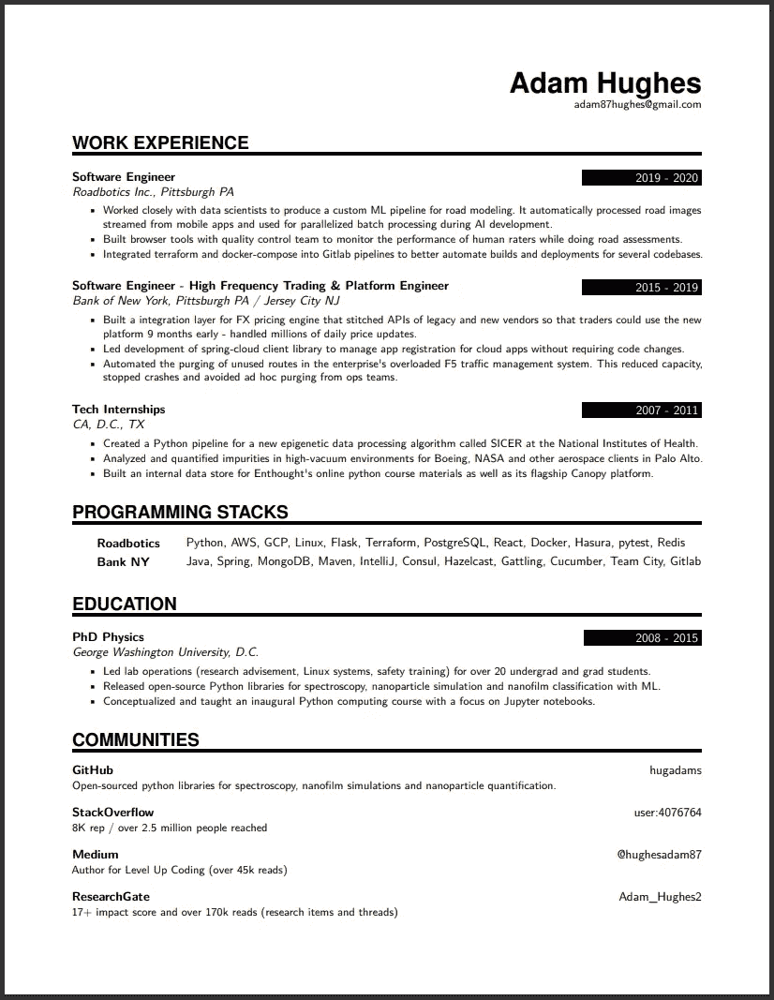
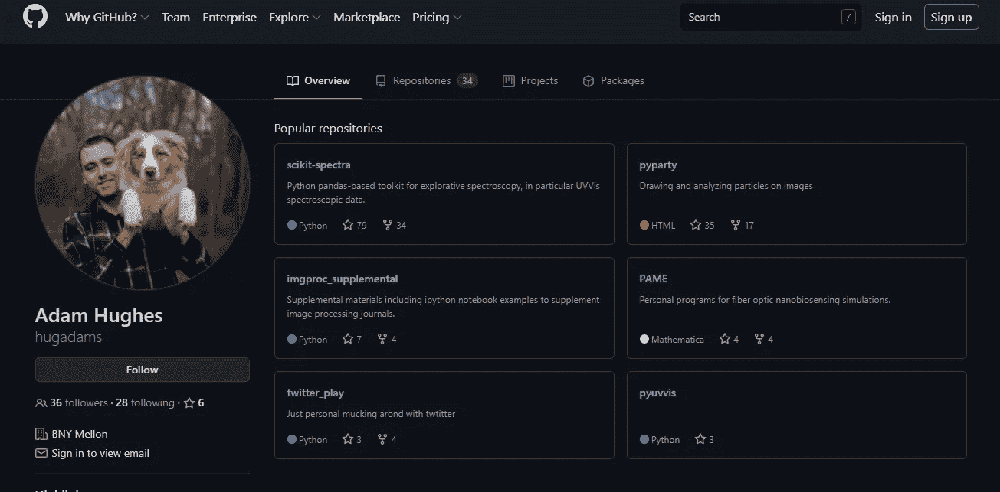

# 失去技术工作的该做和不该做的事

> 原文：<https://levelup.gitconnected.com/dos-and-dont-s-of-losing-a-tech-job-f7d5d3c940ea>

## 如何反弹

图片来源:[https://unsplash.com/photos/1K9T5YiZ2WU](https://unsplash.com/photos/1K9T5YiZ2WU)

失去，甚至是离开一份技术行业的工作是很艰难的。这是一种不和谐的体验，导致一种“下一步是什么？”在这个混乱的时期，你最不想做的事情就是四处挣扎，犯下你以后会后悔的错误。我自己最近也在那里，我整理了下面的清单，帮助你快速找到下一个大机会。

## 做:算出你的价值

这很难，而且莫名其妙地令人生畏。在手机屏幕上，还有比“你期望的薪水是多少？”更令人烦恼的问题吗？你不想升得太高而冒被取消资格的风险，也不想去了又不得不退回或接受一份不理想的薪水。避免这种不舒服情况的唯一方法是真正知道自己的价值。但是怎么知道呢？

最重要的是，你永远不应该在薪酬上倒退(在同一个地理市场)。你上一份工作挣了 10 万美元吗？然后要求 12 万美元。有人认为你那时值 10 万美元，所以你现在可能值 12 万美元。接下来，尝试使用类似于 [GlassDoor](https://www.glassdoor.com/Salaries/index.htm) 和 [PayScale](https://www.payscale.com/) 的薪资资源工具。最后，请记住，尤其是在大公司，一些工程师可以赚很多钱。举个例子，一个 20 多岁的孩子在脸书(和其他地方)赚的钱比你想象的要多。虽然他的确很特别，但如果他没有要求，他永远也不会得到。

还不够难受吗？看看他的另一部关于 25 岁成为百万富翁的视频。

## DONT:忘记申请失业/眼镜蛇

出于某种原因，我们中的许多人习惯性地认为失业是一种施舍——事实并非如此。即使你可以放弃它，你为什么要放弃呢？你的税款已付入资金池，现在是投资回报的时候了。

这一过程需要几周(在 Covid 时代则需要几个月)才能完成。这让我非常沮丧，我为此写了一整篇文章。所以立即开始。还有，记得问前雇主要他们的 UC 账号；申请的时候你会需要这个。

PS: [COBRA](https://www.investopedia.com/articles/insurance/11/intro-cobra-health-insurance.asp) 是一项奥巴马医保计划，让您在失业或其他符合资格的事件后的一定时间内保留当前的医疗保健(可能需要支付保费)。

## 做:按计划行事

随着生活的中断，比如失业，最重要的是**坚持常规**。试着同时醒来和入睡；[生理节奏的中断导致抑郁](https://www.health.harvard.edu/blog/why-your-sleep-and-wake-cycles-affect-your-mood-2020051319792)。专门花时间磨练技能、建立简历和找工作。像对待一份新工作一样对待这些活动。这将有助于你在紧张时期保持专注和冷静。

## DONT:对生活方式进行重大改变

虽然这可能是一个反思和培养新爱好的好时机，但不要放弃太多。例如，现在是开始更有规律地慢跑的好时机。但现在可能不是报名参加不可退款的 CrossFit 计划或购买新钢琴的最佳时机。请记住，这个时期只是暂时的，因此应避免轻率的决定和轻率的支出。

## 做:保持你的简历简洁

去年，我的公司雇佣了 5 名工程师，为此我审阅了几十份简历。一个明显的趋势出现了:越来越多有经验的工程师有着巨大的、通常是臃肿的简历——通常有 6 页甚至更多！我讨厌这些简历。

简历最重要的方面不是它的全面性。在于它简洁而富有美感；你的简历应该*流行*。虽然你可能会想象一位印象深刻的招聘人员会从头到尾仔细阅读你的简历，但请记住，这些人每周会阅读数百份简历，很可能不会在你的简历上花哪怕 10 秒钟。因此，你的简历应该在尽可能短的时间内传达基本技能和能力。细节可以在面试的时候补充。

试着写一份一页纸的简历。它应该让招聘人员一眼就知道她需要知道的一切。只有一页会迫使你言简意赅，只列出最重要的成就，并更加注意组织和布局。

我 2020 年夏天的一页简历——通过背面的[和](https://www.overleaf.com/)[resume . io](https://resumake.io/)100%免费

网上有很棒的入门简历模板。如果你精通乳胶，背页的[是一个解决方案。对于非德州人来说，](https://www.overleaf.com/gallery/tagged/cv) [ResumeGenius](https://resumegenius.com/) 和 [Zety](https://zety.com/resume-builder) 是很好的起点，值得花钱购买。

## DONT:忘记你简历上的内容

一份简短的简历有一个很大的优势，那就是它限制了面试官可能会问你的问题。也许你的工作经历只有 9 发子弹。确保你能自信地对所有 9 个人说话！在面试中，没有什么比错过像“请告诉我更多关于这一点”这样的上篮问题更令人沮丧的了，因为他们指的是四年前的一份工作，而你甚至完全忘记了自己曾经拥有过这份工作。在镜子或配偶面前大声练习，详述你简历中的每一条信息。试着预测可能的后续问题，鼓励别人询问你的简历。

哦——如果有一项技术你已经使用过，但没有信心谈论它，避免把它写进简历的诱惑。面试官不会喜欢看到 Apache Airflow 在那里，只听到你说“这是我参与的一个项目，但我不太了解它”。

## 做:更新你的 LinkedIn

如果一家公司认真考虑你，他们 100%会在 LinkedIn 上查看你。现在想象一下这样一个场景:一位招聘人员对你漂亮的简历印象深刻，跳到 LinkedIn 上，却看到了一个贫瘠、普通、不知名的个人资料页面。不幸的是，你只有一次机会留下第一印象，所以不要因为你懒得上传专业的大头照而搞砸了。

更进一步，确保任何公共社交媒体账户(如 Twitter)都没有对你进行负面描述。你谷歌过自己吗？你的招聘人员会的。

## **DONT:继续使用公司财产(这包括代码)**

我一生中最大的错误之一[是在离开一家公司后保留代码。同样，在你离开后，不要持有公司的财产，停止使用与它们相关的所有电子邮件/账户。当然，也不要用你公司的笔记本电脑浏览求职公告板或开始失业过程。你的 IT 部门很可能会发现这一点，你将有一些严重的解释要做。](/my-3-biggest-failures-as-software-developer-6c16a171eaaf)

## **做:允许自己享受一些休息时间**

虽然遵守时间表和设定目标很重要，但是享受你的休息时间也是可以的。不要感到内疚。这不是懒惰，而是一个反思和自我关心的机会。多散步；去看那个你一直拖延的医生；粉刷游戏室。花一分钟去闻一闻玫瑰的芳香，欣赏真正重要的东西。这只是暂时的。花一些时间来恢复和重新聚焦。你应得的。

## **DONT:申请工作等待太久**

这对于技术工作来说至关重要，因为周转时间可能会很长。不要等到你的简历很完美，或者等到你完成了 React 课程之后再去申请。弄些申请来试试水。如果很多兴趣回来了，那么你可以放慢脚步，和你的首选公司建立关系。

当我在 2020 年夏天失业时，市场很艰难。那么多质量工程师同时被放走，我不得不申请了几十份工作才拿到一份 offer。总而言之，我花了三个月的时间，付出 100%的努力重新站起来。不管市场状况如何，如果你迟迟不出手，你会后悔的。

## **做:系统地申请工作**

如果你有存款，可以暂时不用工作，利用这段时间去追逐你梦想的工作。例如，也许你的最终目标是在谷歌或 Slack 获得一份工作。这些是第一层潜在客户。列出一级、二级和三级雇主。把它想象成大学申请:你早早地从顶级学校开始，然后随着时间窗口的缩小，逐渐撒下更广的网。

在第一个月，把你的申请限制在少数一级雇主。可能还会加入一些第 2 层应用程序。如果你找到了，比如谷歌，给他们你的全部注意力。你不会想在同一周内同时面试五家其他公司。重复这个过程，直到所有一级公司都耗尽，或者直到你的时间表需要涉足二级和三级。关键是要在可控的阶段做到这一点，而不是随机地应用于任何一份工作。

## **DONT:过河拆桥**

失去工作是一次非常情绪化和充满压力的经历。很有可能你会生气，幻想着在一场光荣的、被烧焦的比赛中数落你的经理。请不要这样做。[多达 85%的工作都是通过人际关系网获得的](https://www.linkedin.com/pulse/new-survey-reveals-85-all-jobs-filled-via-networking-lou-adler)，你永远不知道过去的同事或老板什么时候会成为你获得新机会的敲门砖。

不要过河拆桥，再诱人([图片来源](https://www.google.com/url?sa=i&url=https%3A%2F%2Fwww.reddit.com%2Fr%2Fim14andthisisdeep%2Fcomments%2F8z7jjs%2Fbecause_dogs_are_often_jumping_off_cliffs_to%2F&psig=AOvVaw0N65wC6PK5Fgn7eqldjU1l&ust=1618861835072000&source=images&cd=vfe&ved=0CA0QjhxqFwoTCNiy1LbIiPACFQAAAAAdAAAAABAD))

## **做:技能磨练**

技术发展很快，换工作是探索新趋势和新技术的好时机。Kubernetes、Serverless、Terraform、GraphQL、NextJS——可能有一长串你熟悉但没有时间实际使用的酷技术。现在是一个学习的机会，尤其是如果这些出现在热门的招聘信息中。

不要害怕对自己投资一点。花 99 美元在 [Skilled.dev](https://skilled.dev/) 上，149 美元在[面试蛋糕](https://www.interviewcake.com/upgrade)上，或者花 9.99 美元在 YouTube Red 上，这样你就可以在飞机上练习问题，这对于在科技面试中获得优势来说是微不足道的。如果你对系统设计感兴趣，[我已经为你准备了一些免费资源](/5-tips-for-system-design-interview-preparation-90df3616fe2)。

## **DONT:痛打自己一顿**

我把最重要的一点留到了最后。这样的事情时有发生。它们经常发生在每个人身上。不要让这个拖累你或定义你。这些事件往往是变相的祝福——众所周知的人生指南针的校正方向。认命吧，学你能学的，继续前进，朋友。

## **奖金 DO:开源项目**

开源网站是从拥挤的申请人中脱颖而出的好方法。我经常被问到我的开源工作，就像某种成人礼一样，尽管它是在研究生院早期写的，并不代表我目前的能力。

我的 GitHub 页面:所有这些都是死项目，但是招聘人员似乎很兴奋地选中了这个框。

在我们公司，我们甚至为申请人提供带样品工作的选择，而不是给一个带回家的项目。意料之中的是，被问到自己工作的申请人通常表现得更好。这个故事的要点是，拥有任何种类的开源存在或附带项目最终都可能是让你与众不同的区分因素。

我错过了什么吗？留下评论，它可能会出现在文章中！