# RSpec 中的替身、实例替身和间谍

> 原文：<https://levelup.gitconnected.com/doubles-instance-doubles-and-spies-in-rspec-82e38c0746f4>

最近，我正在创建一个小项目，用我在 Ruby 中为 RSpec 测试所学到的新概念进行试验，并有所收获。我到底如何测试一个实例(或类！)一个模型中的方法，它完全依赖于另一个模型中的方法的结果。

我给你举个基本的例子。我有一个用户模型和一个宠物模型，宠物属于用户。为了掌握如何在测试中交织模型的概念，我在名为#pet_animal 的用户模型上创建了一个简单的方法，并给它一个简单的 true 输出。然后，我想在宠物模型中创建一个名为#be_happy 的方法，如果#pet_animal 的输出等于 owner 实例参数中的 true，那么该动物将返回“Purr”。原谅那些不可思议的基本方法，尤其是如果它们没有多大意义的话。这就更能理解双打等人了。

这是真正的基本设置！

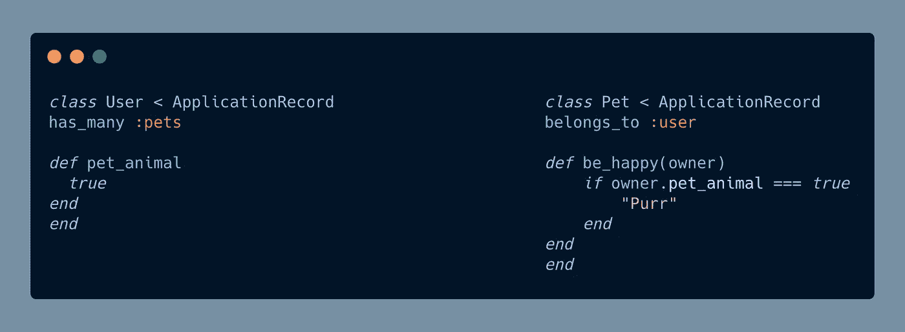

所以，在宠物的测试文件夹里。我需要重新创建一个 owner 实例来测试#be_happy 方法。第一个选择是创造一个替身。

# **双打**

double 将模拟用户对象。这使您可以简化流程。如果在我们的#pet_animal 方法中实现 true 的业务逻辑很重要，那么测试将会花费更长的时间，并且可能不会返回我们实际想要测试的内容！相反，我们可以绕过它，在 double 中将方法自动设置为 true。允许我们测试 Pet #be_happy 方法。

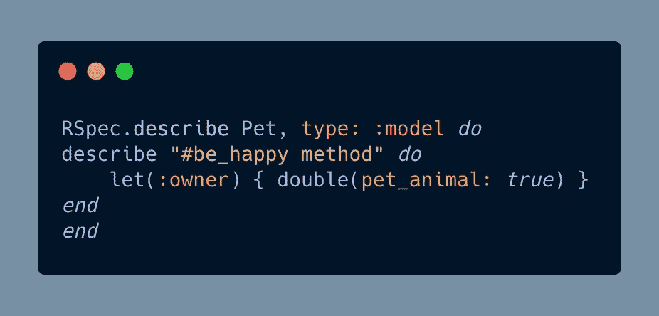

简单双重检验

这里，我们使用 let 方法将我们创建的 double 设置为变量:owner。然后，我们使用 double 方法将 pet_animal 设置为 true。

接下来，我们需要创建我们的宠物的一个实例，以便我们可以调用必要的方法！

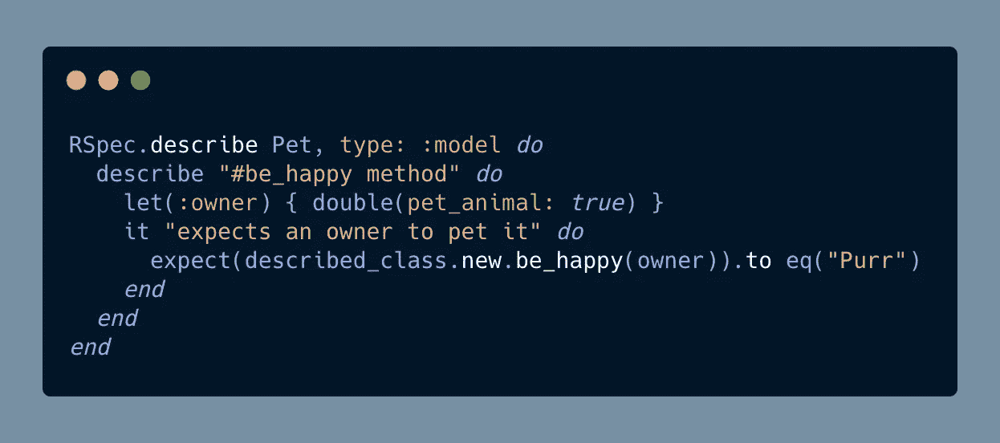

第 5 行简单地写道，当调用#be_happy 方法并且 owner 参数的#pet_animal 方法等于 true 时，期望所描述的类(Pet 类)的新实例等于“Purr”。

你也可以把你的主题设置在顶部，这样 expect 方法就干净一点了。

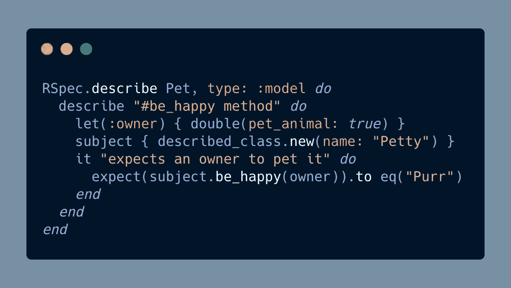

这两个都会给你一个及格的测试。

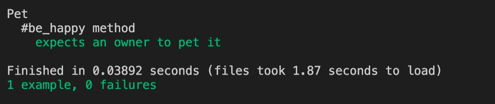

不过，使用替身也有一些缺点，尽管很小:

1.  我们不是在模仿现实生活中的物体，而是在创造一个虚幻的物体。我可以向我们的 owner 变量添加甚至不在我们的用户模型中的方法，测试仍然会通过。RSpec 不会验证我们在这里针对真实类定义的方法。
2.  运行测试所花的时间比实例的两倍少，但比探测的多！即使它相对较小。
3.  作为开发人员，我们有责任确保这些方法与现实生活中的方法相匹配。如果考虑到模型可能增长到的规模和…方法的变化，这可能会很困难！

这个链接给你一个关于性能/速度的好主意。[表演。](https://www.ombulabs.com/blog/rspec/ruby/spy-vs-double-vs-instance-double.html)

然而，如果你确实想让你的测试更稳定，结构更好，并且速度更快。我建议在测试中使用实例替身。

# 实例双精度/验证双精度

这与 double 类似，只是它会验证 double 的接口，以确保它匹配它所模仿的类或实例。这使得您的测试更加严格，因为您必须正确地模拟一个对象。想象它就像一个演员和一个替身，你不想让观众(测试)认为他们之间有任何区别。

实例方法只能定义它正在复制的类上的方法。首先，确保向实例传递一个参数，双重验证 RSpec 将哪个类作为实例对象。

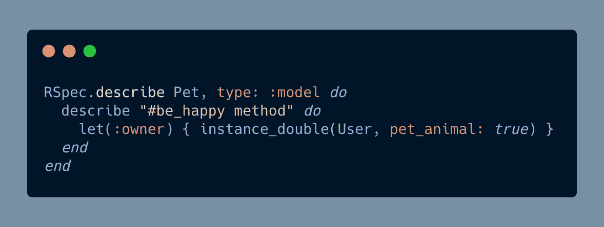

实例 _ 双精度方法

现在，如果我向 instance_double 添加一个不在我们的用户类中的额外方法，RSpec 将返回一个错误。

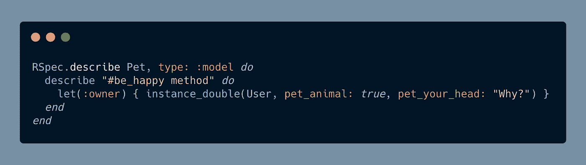

下面你可以看到 RSpec 返回了一个错误消息，告诉我们#pet_your_head 方法没有在 User 类中实现。完美！我们不希望任何额外的代码可能会导致我们在测试中不必要的问题。

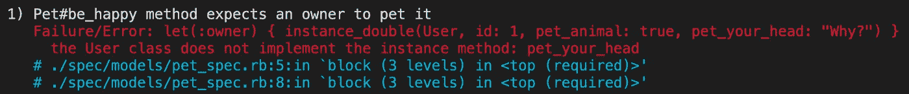

它甚至会测试你传入的参数数量是否正确，如果有的话。下面，我试图在测试中给我们的#pet_animal 方法传递一个参数。

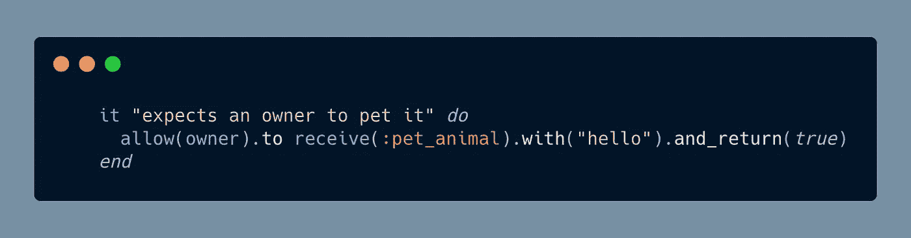

但是正如我们所看到的，RSpec 检查实际的方法并进行比较。然后给你一个错误，说明特定的方法不需要任何参数！所以它也会检查它们的实现和参数。这确保了我们的替身尽可能地与我们的班级相似或接近。

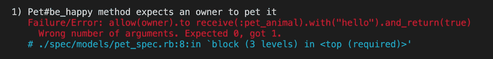

因此，为了正确实现实例变量，我们必须坚持使用该类提供的相同方法。

现在我们必须正确地创建一个实例 double。因为我想尽可能地复制这个。我已经创建了一个 instance_double，其中包含了创建一个完整的用户实例和一个宠物实例所需的所有数据。

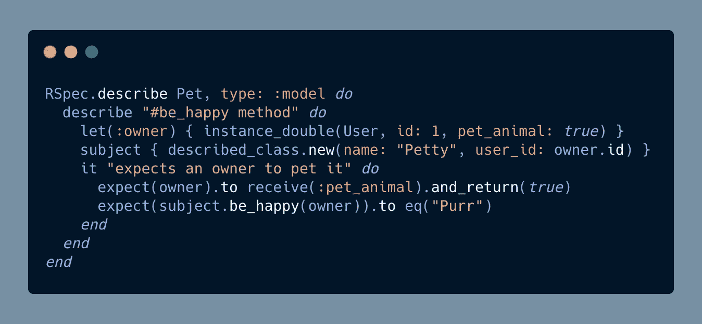

在这里，您可以看到使用 id 和测试所需的方法创建了一个用户，使用名称和宠物所属的 user_id 创建了一个宠物。

然后我做了一个断言，期望我们的所有者调用#pet_animal 方法，我希望它返回 true！然后，我希望 subject(或“Petty”)返回“Purr”，因为我们的 owner 方法等于 true。我可以删除第 6 行，期望所有者接收该方法。但这只是一个额外的层，以确保我们测试正确。

这将返回:

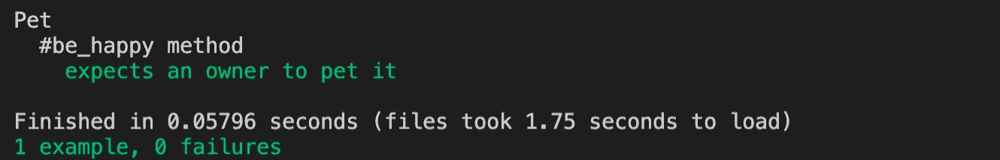

太棒了。最后，让我们来看看间谍。

# 间谍

间谍很简单。它们与 double 非常相似，但如果有什么不同的话，那就是更不严格。主要的两个区别是:

1.  你把间谍写反了。因此，您首先在测试中调用方法，然后编写断言。
2.  您实际上从来不需要定义方法。你只需要创建一个可以接受任何东西的对象。

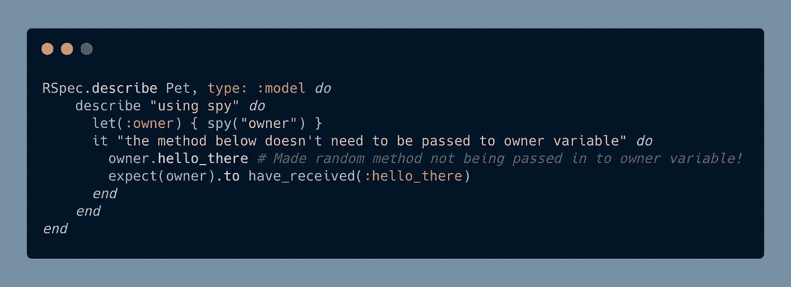

尽管如此，测试将通过！

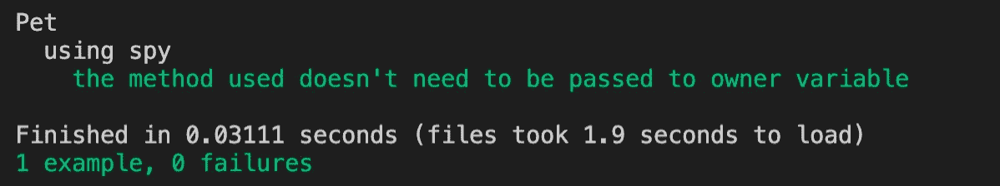

就是这样！双打的三个例子！我强烈推荐使用双实例，因为它们使你的代码最简洁，并且尽可能地反映类和方法！

Udemy 有一个很好的 RSpec 测试入门课程。链接到页面。