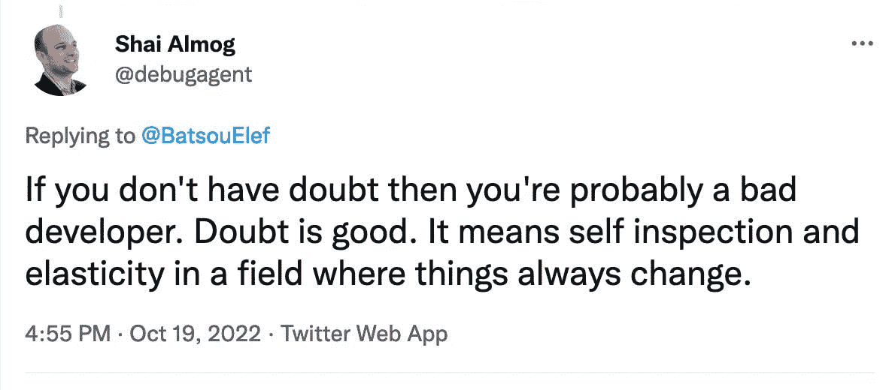

# 调试中的疑问

> 原文：<https://levelup.gitconnected.com/doubt-in-debugging-dcdaf2649b0b>

怀疑并不好玩。我们希望对自己的方向有信心，当我们需要勇气前进时，怀疑是最强大的。当我们没有足够的经验时。但是从另一个角度来看，怀疑就是谨慎。阻止我们冒险的重要屏障。

[参见推特上的](https://debugagent.com/(https://twitter.com/debugagent/status/1582732171198205955)

当我们在调试时，怀疑可能是最糟糕的。凌晨 2 点，当我们盯着屏幕，完全没有主意的时候…我应该这样做吗？我有资格吗？其他程序员会花这么多时间看这样的问题吗？我现在应该已经解决了！

好吧。是的。如果你没有经历这些感受，那么你可能没有创造出任何有趣的东西，也没有足够的精力去追求一个问题的结论。是的，睡觉是处理一些问题的最好方法，但有时这还不够。有时这不是一个选项，有时直到问题得到解决我才会入睡。当我们杀死虫子时，怀疑并没有消失，你活着是为了改天再战。

# 为什么要调试？

我不想谈论冒名顶替综合症，我不是心理学家，对这个话题也没什么有趣的可说。我认为有趣的是，我们感受最深的一点是漫长而丑陋的调试会话。毕竟，白天有许多地方可能会发生这种情况，但是对开发人员来说，在我们调试的时候，这是普遍现象。

有很多原因，但我认为其中一个核心原因是我们是调试的冒名顶替者。我们假装知道如何调试，但没有传授的技术。我们没有在训练营或者大学学过调试。也许是“单步执行”按钮和检查变量。大概就是这样。看着木头，用头撞墙。

即使我们试图解决问题，我们也把这个过程看作是倒垃圾。我们捏着鼻子跑向门口。努力不吸入恶臭。没什么技巧。不学习。没有欢乐。只是我们需要走的一条可怕的路。难怪我们感到怀疑，我们不想在这里。我们没有工具来解决这个问题，我们可能真的没有资格做这个。

学习调试技术并拥抱这个过程不会让疑问消失。那是一个固定装置。但这将使它变得易于管理，并减少它露出丑恶嘴脸的时间。快速有效地解决问题提供了一种只有公开演讲才能匹敌的自信。

我在之前的博客中写了很多关于调试的内容，比如这个系列的。我重新做了很多工作，希望减少这种特别的痛苦，让所有人都更容易调试。另外，有一本[的书即将出版](https://www.amazon.com/dp/1484290410/)，你现在就可以预订…

我还在研究同一主题的新课程，以进一步澄清一些难以用书面形式解释的事情。它将遵循与这本书相似的道路。我希望它能以一种小的方式帮助我作为一个年轻程序员的一个大的痛点。

几周后我有一个关于调试技术的 T4 演讲。上次我给它的[评论是相当惊人的](https://twitter.com/debugagent/status/1573250587151458305)。

# Twitter 的解决方案

在另一个不同的话题上，随着每个人都去乳齿象(包括[我](https://mastodon.social/@debugagent))我一直在考虑稍微改善一下情况。这样做的第一个问题是缺乏内容。许多内容创建者不会直接发布到 twitter 上。当灵感来临时，我们会写信给一个缓冲工具。这在社交网络中更有意义的时候会在推特上发布。一些工具甚至足够智能，可以转发最近的帖子，这样人们就不会错过它们。

现在顶级工具都是商业化的，有很多问题。没有人支持乳齿象。我想创建一个像这样的免费/开源工具。理想情况下，一些更“黑客友好”的东西，与 git 一起工作。为此，我尝试使用 twitter API，这简直是一场灾难。它有几个级别和版本。如果没有更高的访问级别，就不能使用 1.1 版的 API。对于 1.1 版本，我们有简单而优秀的 twitter4j。但是如果没有开发者帐号的提升，我们就不能使用它。似乎每个负责提升开发者账户的人都被解雇了。我还担心他们会在对抗机器人的战斗中削减一些权限。

问题是 API 在版本 2 中不能很好地工作。甚至 twitter 本身也没有把媒体上传移植到第二版，所以他们希望你用第一版上传图片，用第二版上传其他东西。除了最基本的用例之外，文档是丰富的，对任何东西都没有帮助。相当令人沮丧。如果你有服务器端社交网络的经验，并且知道如何处理这个问题，请给我写信。

# 离开 Lightrun

从个人角度来说。我离开了 Lightrun。我作为第一个非创始人加入了这家公司，并编写了服务器、插件和 CLI 的初始实现。这很有趣，但在过去的几个月里没有这么有趣。现在我在放弃我的选择。我签约写另一本书，这本书我刚开始写。我还在创建新的在线课程，并参与一些 OSS 项目。

我也有一个在 Java 领域很酷的想法。我正在探索这一点，可能会建成。

我将在 [ADDO 会议](https://www.alldaydevops.com/addo-speakers/shai-almog-0)上发言，但是如果你只听我的一个演讲，请加入我的 [LJC 演讲](https://www.meetup.com/londonjavacommunity/events/289073610/)。正如我在上面提到的[，这是我最好的演讲之一。](https://twitter.com/debugagent/status/1573250587151458305)