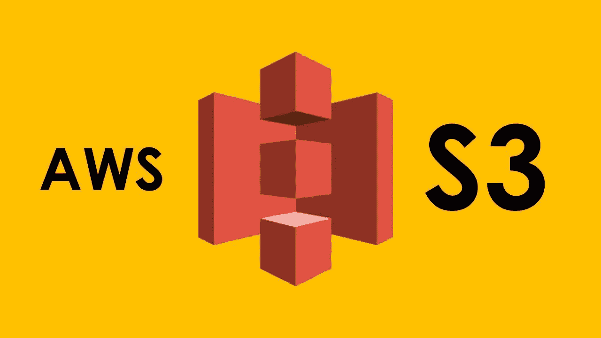

# 从 Spring Boot 的 AWS S3 桶下载单个或多个文件

> 原文：<https://levelup.gitconnected.com/download-single-file-or-multiple-files-from-s3-bucket-in-spring-boot-6aad1523241d>



亚马逊简单存储服务(亚马逊 S3)是一种对象存储服务，提供行业领先的可扩展性、数据可用性、安全性和性能。存储在**亚马逊 S3** 的每个文件(作为一个对象)都用一个键来表示。

**场景:**

我们有一个场景，文件已经上传到 S3 桶，我们需要下载文件。为了下载文件，我们需要一个文件名，它是代表 S3 桶中文件的关键字。

为了实现这一点，我们使用带`aws-java-sdk-s3.`的弹簧靴

**亚马逊 S3 Java SDK** 提供了一个简单的接口，可以用来在任何时间、从网络上的任何地方存储和检索任何数量的数据。它让任何开发者都可以使用亚马逊用来运行其全球网站网络的高度可伸缩、可靠、安全、快速、廉价的基础设施。该服务旨在最大化规模效益，并将这些效益传递给开发者。

**Spring Boot 版本** : 2.1.x

**等级依赖:**
编译组:`'com.amazonaws'`，名称:`'aws-java-sdk-s3'`，版本:`'1.11.699'`

```
**Maven Dependencies:**
 <dependency>
 <groupId>com.amazonaws</groupId>
 <artifactId>aws-java-sdk-s3</artifactId>
 <version>1.11.699</version>
 </dependency>
```

## ***配置***

## **应用属性**

## **申请. yml**

```
region: us-east-1bucketName: devBucketName
```

## **文件服务**

**我们可以为 AWS 凭证传递以下运行时参数或在配置中提供凭证。**

```
AWS_ACCESS_KEY_IDSES_SECRET_ACCESS_KEY
```

**概要:**

因此，我们已经看到了如何导入依赖项和创建 YML 配置。我们还编写了一个文件服务类来从 s3 bucket 下载文件。