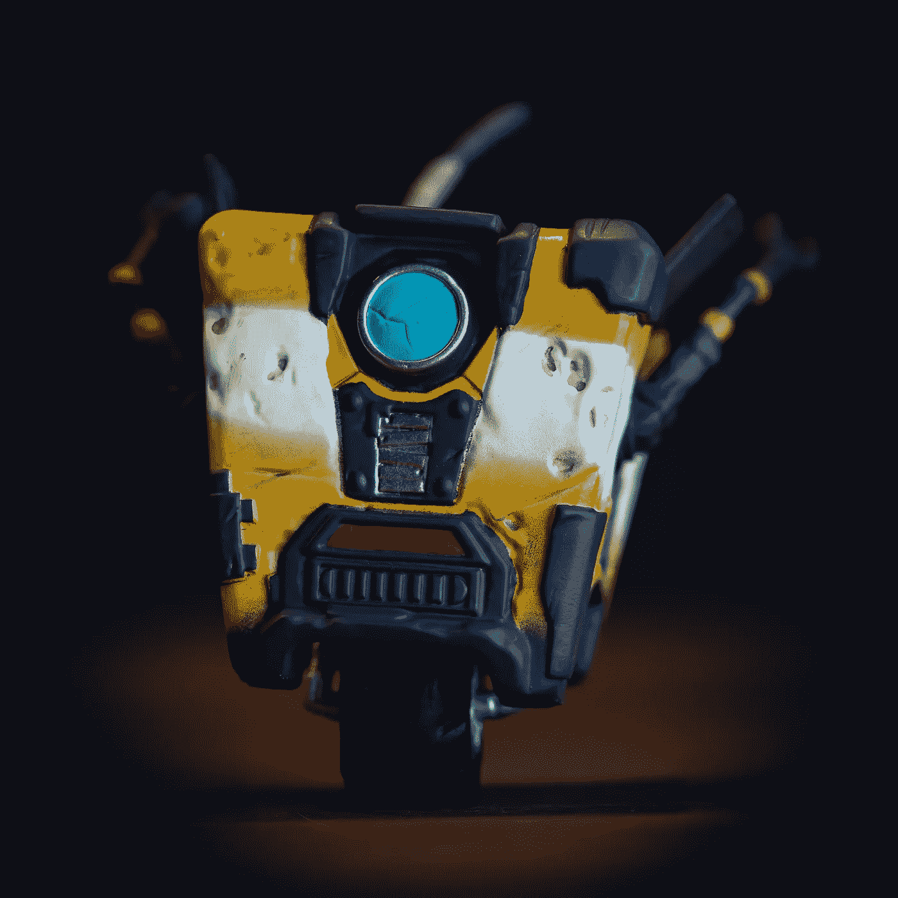
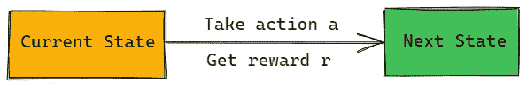
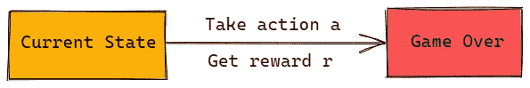
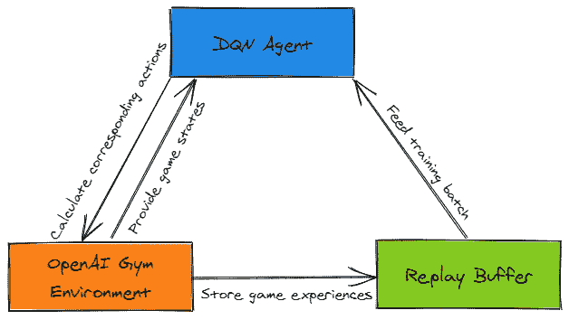
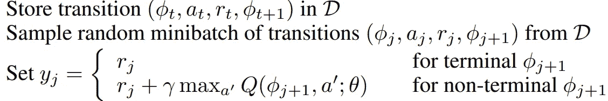
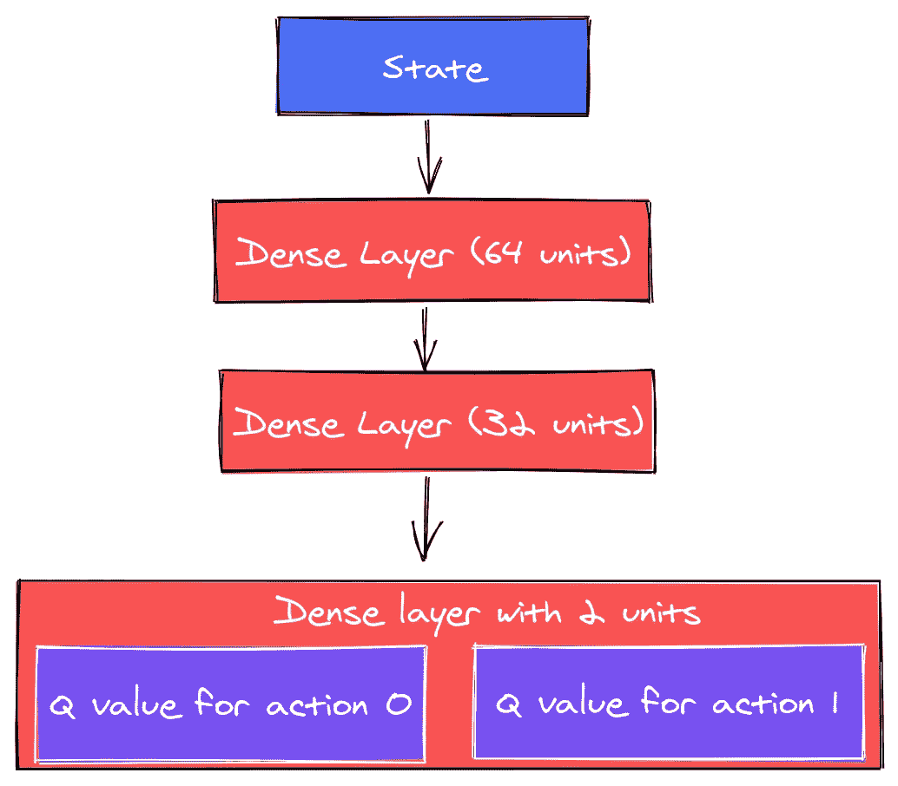
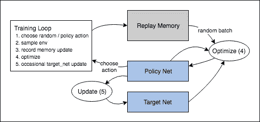
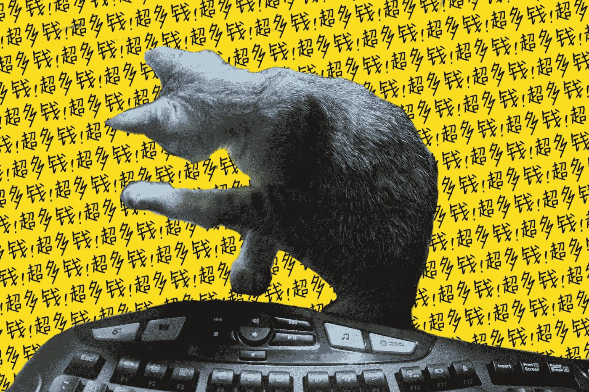

# DQN 从零开始使用 TensorFlow 2

> 原文：<https://levelup.gitconnected.com/dqn-from-scratch-with-tensorflow-2-eb0541151049>

## 一个高度可行的计划，以建立自己的 DQN

Max Kleinen 在 [Unsplash](https://unsplash.com/s/photos/robot?utm_source=unsplash&utm_medium=referral&utm_content=creditCopyText) 上的照片(这是我最喜欢的游戏中的一个角色。猜猜那是什么？)

自从大肆宣传 Alpha Zero 以来，深度强化学习已经遍布新闻。

虽然 A3C 正在成为 RL 的首选方法，但对于初学者来说，DQN 仍然是了解 RL 基础的更好方法。

然而，很少有教程适合有抱负的 RL 开发人员。

大量现有的深度强化学习教程(分为 1 个或更多):

*   没有代码:(
*   使用抽象出必要概念的高级包，如`tf_agent`
*   不要解释高层概念和实现细节之间的联系

这篇文章旨在成为一个**高度可操作的**循序渐进的教程:

*   演示如何构建一个完整的 DQN 模型
*   不用比 TensorFlow 2 和 OpenAI Gym 更高级的东西
*   解释如何从高级概念到实现，一次一步，与真实的开发流程保持一致

对于阅读代码比阅读帖子更好的代码忍者来说，代码在[这个库](https://github.com/ultronify/dqn-from-scratch-with-tf2)中，更复杂的版本在[这个库](https://github.com/ultronify/cartpole-tf-dqn)中。

对于喜欢从实时编码会话中学习的人:

# 快速回顾一下 DQN 是如何工作的

由于这篇文章主要关注的是建造 DQN 的可行计划，我们将只讨论这个理论的过于简化的版本:

*   强化学习:从其**与**环境**交互**的**后果**中学习。
*   Q 学习:预测对给定状态采取行动的**预期未来回报**，即 Q 值。
*   深度强化学习(DQN): Q 学习，但是使用**深度神经网络**。

在 DQN，我们希望通过预测可以对状态执行的所有可能行动的预期长期回报(Q 值)来指导给定状态下的行动选择，因此关键是通过训练让 Q 值预测越来越接近“真理”。

如上所述，DQN 训练的核心是得到一个状态-动作对的下一个“更可取的”Q 值(深度神经网络训练中的“标签”)。我们称之为目标 Q 值。

对于终端和非终端状态，不同地计算目标 Q 值的值:

当非终结状态转换发生时，如下图:

当前状态和动作对的目标 Q 值(最优长期报酬)是即时报酬和下一个状态的贴现 Q 值之和(动作导致的贴现最优长期报酬):`Q_next = gamma * Q_current + r`

在这种情况下，由于下一个状态不存在，当前状态和动作的下一个目标 Q 值将只是直接的奖励。

现在我们已经知道了什么是 DQN 以及它是如何工作的，让我们开始构建一个。

# 代码框架

正如我所承诺的，我不会用 500 行实现细节来淹没你。

相反，我们将从高级组件开始，逐步填充更多的代码。

在 DQN，我们需要如图所示的以下组件:

*   DQN 特工:负责学习如何玩游戏
*   重放缓冲器:负责存储游戏体验
*   环境:代表游戏规则

高层设计

定义了所需的组件后，我们将把上面的组件转换成代码。

## DQN 代理商

DQN 代理的工作是:

1.  通过预测所有可能动作的 Q 值来选择给定状态下要采取的动作，并选择具有最高 Q 值的动作
2.  从过去的游戏经验中学习如何更好地预测 Q 值

为此，DQN 代理需要具备:

1.  给定当前环境状态产生动作的方法。我们称之为政策。
2.  一种让代理从经验中学习的方法。我们称之为`train`,它接受一批游戏体验并输出一个`loss`来表示训练的有效性。

以下代码将上述要求转化为一个类接口:

## 重放缓冲器

由于我们将进行游戏回放训练，我们需要一个回放缓冲区，以便更容易地存储和检索游戏体验:

游戏体验稍后用于训练 DQN 代理，因此它需要所有信息训练需求:

[来源](https://drive.google.com/file/d/0BxXI_RttTZAhVUhpbDhiSUFFNjg/view)

从上面的 DQN 更新公式(第一行)中，我们可以看到，对于每个转换，它需要:

*   当前状态
*   对当前状态采取的操作
*   对当前状态采取行动带来的回报
*   采取行动后的状态

它们对应于我们实现的`store_gameplay_experience`的输入参数。

## 环境

我们将使用 OpenAI Gym 中的环境，它具有以下 API:

注意:我选择使用 OpenAI Gym 环境，而不是构建一个，因为它的 API 足够通用，可以在任何未来的 RL 任务中使用，并且没有 RL 相关的复杂性。

## 将碎片拼在一起

高层设计

定义了核心组件后，我们可以按照上图实现训练循环:

# 填写细节

有了上面的高级代码，我们的代码已经是端到端可测试的了，这对初学者来说很重要。

从存根代码开始，让我们填充实现细节。

## DQN 代理商

要让 Q 学习“深度”，我们需要一个深度的神经网络。

由于推车杆子不是一个复杂的游戏，我们将使用一个小密网:

我们可以用下面的代码在 DQN 代理类中实现一个助手函数来生成上面的网络:

有了上面的帮助器函数，我们就可以在 DQN 代理类构造函数中初始化 Q 网络和目标 Q 网络:

注意:由于用于训练的目标 Q 值也来自 Q 网络，为了不让 Q 网络追逐移动的目标，我们仅在一轮训练完成后更新 Q 网络。在上面的代码中，`q_net`是被主动训练的那个，`target_q_net`是训练后才改变的那个。下图显示了这两个网络如何相互作用。

[来源](https://pytorch.org/tutorials/intermediate/reinforcement_q_learning.html)

现在网络已经就绪，我们可以使用它通过 Q 网络运行状态，并选择具有最高 Q 值的动作，从而从状态生成动作:

下一步是添加一个模型训练方法，该方法严格遵循上面 DQN 重述部分中的公式:

[来源](https://drive.google.com/file/d/0BxXI_RttTZAhVUhpbDhiSUFFNjg/view)

## 重放缓冲器

replay buffer 类只是一个固定长度的先进先出队列，不会消耗太多内存，并清除过时的游戏体验:

注意:有许多方法可以实现 replay buffer 类。要有创意:)

## 训练循环

由于组件被很好地定义，训练循环保持不变。

通过执行训练循环，我们可以训练一个玩得很好的 DQN 代理:

训练前的游戏录制样本

训练后的游戏录制示例

# 让培训变得更容易

如果你还在这里，恭喜你！您刚刚成功实现了一个全功能的 DQN，但是您可能会发现 DQN 很难训练。别担心，我们只需要最后的润色。

## 额外探索

如果你用上面的代码训练 DQN，你可能会发现训练非常慢，有时甚至不收敛。

这是一个探索与利用的问题，这意味着模型不太可能探索未知的状态，因此，它可能会陷入已知的状态。

解决方案是使用以下代码将随机性添加到策略中:

注意:使用上面的代码，有 5%的变化 DQN 代理会绕过网络，随机产生动作，以 Q 网络不会的方式探索游戏。

## 绩效跟踪

由于培训可能需要一段时间(大约 30 分钟)，理想情况下，我们希望跟踪模型的性能，以确保培训的进展。

以下代码使用训练有素的 DQN 代理播放 10 集游戏，取平均分作为 DQN 表现:

利用上面的助手函数，我们可以在训练循环中使用它来监控训练期间的表现:

## 模型保存和加载

虽然训练这个 DQN 只需要大约 30 分钟，但训练一个更复杂的 DQN 可能需要几天，在理想情况下，我们希望保留训练检查点和最佳性能模型，以减少像电脑被猫拔掉插头这样的事故(这发生在我身上……):

在上面的代码中，应该在更新网络后立即在训练循环中调用方法`save_checkpoint`,该网络保存了最近 10 个训练结果以防意外。

只有当一个新的性能最佳的模型出现时，才应该调用`save_model`,因此`save_model`导出的模型将是生产中使用的模型(或者是实验项目的测试)。

有了变化，培训体验应该会好很多。

最后，这只猫拔掉了我电脑的电源:

认识一下 Monhchi:编码猫