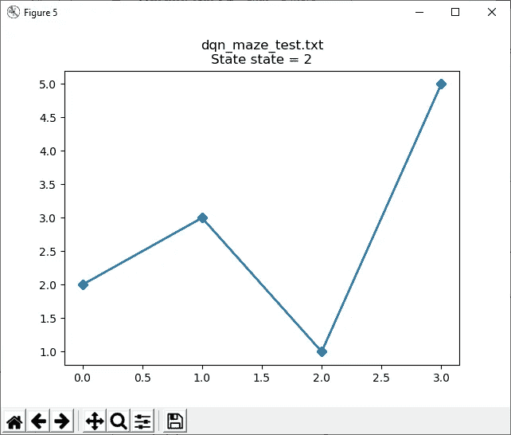

# DQN 迷宫求解器

> 原文：<https://levelup.gitconnected.com/dqn-maze-solver-d01afbd1986b>

# 介绍

在我之前的文章中，我展示了如何使用基于表格的 Q 学习方法构建一个解决迷宫的 Q 学习器。在这篇文章中，我展示了如何使用 DQN(深度 Q 学习)解决相同的迷宫。这个示例程序的代码可以在[这里](https://github.com/danmcleran/tinymind/tree/master/examples/dqn_maze)找到。

# 强化学习

在强化学习问题中，主体通过评估环境的状态、采取行动和接受奖励来与环境进行交互。我们的目标是了解随着时间的推移，哪些行为能带来最大的回报。


# 迷宫问题

正如在[的上一篇文章](https://medium.com/swlh/table-based-q-learning-in-under-1kb-3cc0b5b54b43)中，我们将尝试解决迷宫问题。一只老鼠被随机丢进迷宫中 6 个地方中的一个，它必须学会找到奶酪(奖励)。


正如在[之前的文章](https://medium.com/swlh/table-based-q-learning-in-under-1kb-3cc0b5b54b43)中一样，我们在程序中定义迷宫如下:

# DQN 建筑

对于这个问题，我们将从[之前的解决方案](https://medium.com/swlh/table-based-q-learning-in-under-1kb-3cc0b5b54b43)中去掉 Q 表，用神经网络代替。我们将需要 1 个输入神经元(状态)和 6 个输出神经元(动作)。我选择实现一个比输出神经元多 2 个神经元的隐藏层(感觉不错)。每个输出神经元代表从该状态采取的动作。输入层有 1 个神经元，代表我们鼠标的当前状态。使用 [Q-format](/qformat-92b4e570235f) ，我通过获取当前状态并除以最大可能状态(即总共 5，6 个状态，编号为 0-5)来缩放输入。为此，DQN 神经网络查询环境，并期望它初始化指针，该指针指向给定状态数值表示的神经网络的输入数组。

实现这一点的另一种方法是有 6 个输入神经元。但是，这种方法工作得很好，因为我们有 16 位分辨率，只有 6 个状态。

# DQN 神经网络

使用的神经网络代码也来自 [tinymind](https://github.com/danmcleran/tinymind) 。为了深入了解这些神经网络是如何工作的，请看我的文章[。训练神经网络来预测从给定状态采取的每个动作的 Q 值。在神经网络被训练之后，我们然后选择包含最高 Q 值的动作(即输出神经元 0 ==动作 0，输出神经元 1 ==动作 1，等等。).](/a-neural-network-in-under-4kb-41fc2d7d9174)


图 1:DQN 迷宫求解器的神经网络结构


图 2:代理使用神经网络来获取/设置 Q 值

DQN 在 [dqn_mazelearner.h](https://github.com/danmcleran/tinymind/blob/master/examples/dqn_maze/dqn_mazelearner.h) 中定义如下:

# **构建示例**

将目录更改为 tinymind/examples/dqn_maze 中的示例代码。我们创建一个目录来保存构建的可执行程序，然后编译这个示例。我们需要编译神经网络 LUT 代码，因为我们都定义了要编译的 lut 的类型。在这种情况下，我们只需要带符号的 [Q-format](/qformat-92b4e570235f) 类型的 Q16.16 的 tanh 激活函数。有关 [tinymind](https://github.com/danmcleran/tinymind) 中神经网络如何工作的详细说明，请参见本文[文章](/a-neural-network-in-under-4kb-41fc2d7d9174)。

```
# Simple Makefile for the DQN maze example# Tell the code to compile the Q16.16 tanh activation function LUT**default**:#   Make an output dir to hold the executablemkdir -p ./output#   Build the example with default build flagsg++ -O3 -Wall -o ./output/dqn_maze dqn_maze.cpp dqn_mazelearner.cpp ../../cpp/lookupTables.cpp -I../../cpp -I../../include/ -DTINYMIND_USE_TANH_16_16=1**debug**:#   Make an output dir to hold the executablemkdir -p ./output#   Build the example with default build flagsg++ -g -Wall -o ./output/dqn_maze dqn_maze.cpp dqn_mazelearner.cpp ../../cpp/lookupTables.cpp -I../../cpp -I../../include/ -DTINYMIND_USE_TANH_16_16=1# Remove all object files**clean**:rm -f ./output/*
```

这将构建一个 maze leaner 示例程序，并将可执行文件放在。/输出。现在，我们可以进入生成可执行文件的目录，并运行示例程序。

```
cd ./output
./dqn_maze
```

当程序结束运行时，您将看到最后一条输出消息，如下所示:

```
take action 5
*** starting in state 4 ***
take action 5
*** starting in state 5 ***
take action 1
take action 5
*** starting in state 2 ***
take action 3
take action 1
take action 5
*** starting in state 0 ***
take action 4
take action 5
*** starting in state 1 ***
take action 5
*** starting in state 1 ***
take action 5
*** starting in state 3 ***
take action 1
take action 5
*** starting in state 5 ***
take action 1
take action 5
*** starting in state 4 ***
take action 5
```

您的消息可能会略有不同，因为我们在每次迭代中都会在随机房间中启动鼠标。在示例程序执行期间，我们将所有鼠标活动保存到文件(dqn_maze_training.txt 和 dqn_maze_test.txt)中。在训练文件中，鼠标在前 400 集采取随机动作，然后在接下来的 100 集，随机性从 100%随机降低到 0%随机。要查看前几次训练迭代，您可以这样做:

```
head dqn_maze_training.txt
```

您应该会看到类似这样的内容:

```
1,3,4,3,1,5,
1,3,1,5,
1,3,4,3,1,5,
5,4,5,
1,5,
2,3,1,5,
3,2,3,4,0,4,3,1,5,
4,0,4,5,
4,0,4,0,4,0,4,5,
4,0,4,5,
```

同样，您的消息看起来会略有不同。第一个数字是开始状态，其后的每个逗号分隔值是鼠标从一个房间到另一个房间的随机移动。示例:在上面的第一行中，我们从 1 号房间开始，然后移动到 3 号、4 号、1 号、5 号房间。因为 5 是我们的目标状态，所以我们停止了。这看起来如此不稳定的原因是，在训练的前 400 次迭代中，我们从可能的行动中随机做出决定。一旦我们到了状态 5，我们得到我们的奖励，并停止。

# 可视化培训和测试

我已经包含了一个 [Python 脚本](https://github.com/danmcleran/tinymind/blob/master/examples/dqn_maze/dqn_mazeplot.py)来绘制训练和测试数据。如果我们绘制起始状态== 2 的训练数据(即开始时鼠标被放入房间 2):


图上的每一条线代表一集，在这一集的开始，我们将老鼠随机放入 2 号房间。你可以看到，在最坏的情况下，我们采取了 18 次随机移动来找到目标状态(状态 5)。这是因为在每一步，我们只是生成一个随机数，从可用的动作中进行选择(例如，下一步应该移动到哪个房间)。如果我们使用脚本来绘制起始状态== 2 的测试数据:



你可以看到，在我们完成训练后，Q 学习者已经学会了一个最佳路径:2->3->1->5。

# 确定 Q 学习者的规模

我们使用 DQN 而不是基于表的 Q 学习器的原因是，当状态的数量或状态空间的复杂性会使 Q 表变得不合理地大时。对于这个迷宫问题，这是不成立的。我选择这个问题来展示基于表格的 Q-learning 和 DQN 之间的直接比较，不一定是为了节省空间。事实上，DQN 实现比基于表的方法占用更多的代码和数据空间。在一个更复杂的状态空间中，我们将能够实现 DQN 相对于基于表的优势。

在任何情况下，我们都想测量实现我们的迷宫求解 DQN 需要多少代码和数据:

```
g++ -c dqn_mazelearner.cpp -O3 -I../../cpp -I../../include/ -DTINYMIND_USE_TANH_16_16=1 && mv dqn_mazelearner.o ./output/.cd ./output/size dqn_mazelearner.o
```

您应该看到的输出是:

```
text data bss dec hex filename
12224 8 3652 15884 3e0c dqn_mazelearner.o
```

我们可以看到整个 DQN 在 16KB 以内。DQN 很小。

# 结论

到今天为止， [tinymind](https://github.com/danmcleran/tinymind) 支持两种类型的 Q-learning:基于表格的 Q-Learning 和 DQN。示例程序以及单元测试存在于存储库中，以展示它们的用途。DQN 用一个神经网络代替 Q 表来学习状态、动作和 Q 值之间的关系。当状态空间很大并且 Q 表消耗的内存非常大时，人们会希望使用 DQN。通过使用 DQN，我们用内存换取了 CPU 周期。DQN 的 CPU 开销将远远大于 Q 表。但是，DQN 允许我们进行 Q 学习，同时保持我们的内存足迹对于复杂环境的可管理性。