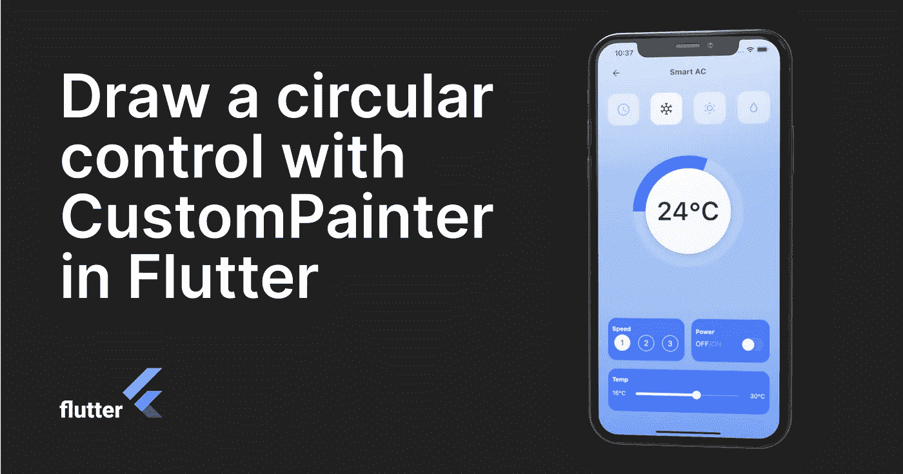
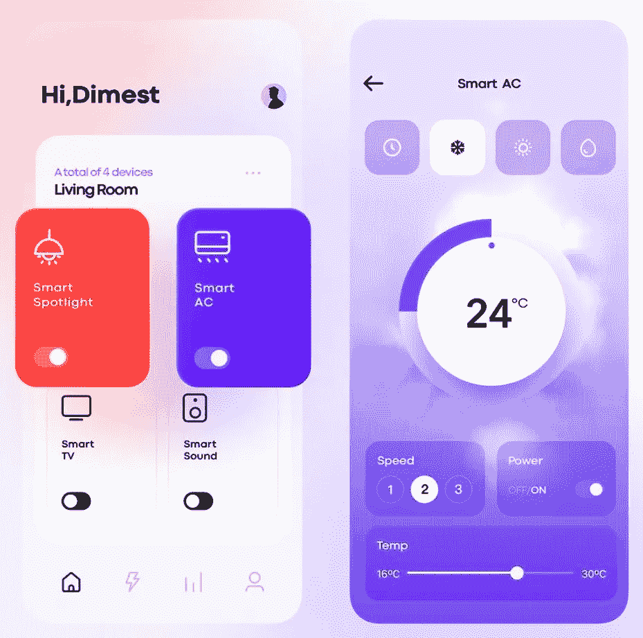
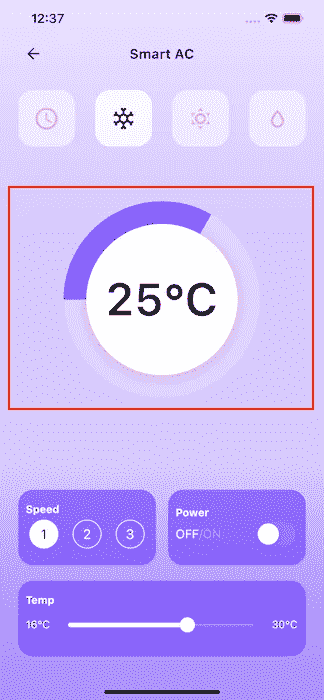
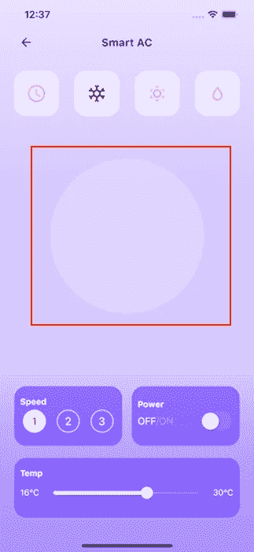
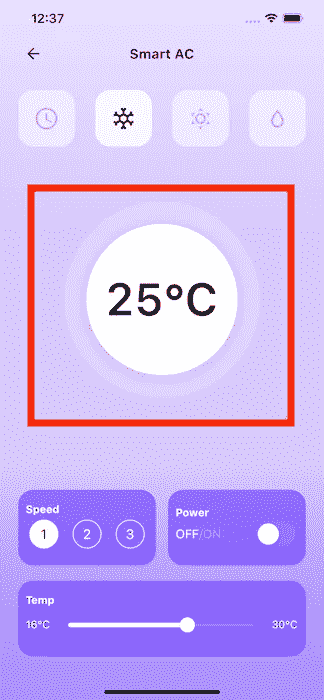
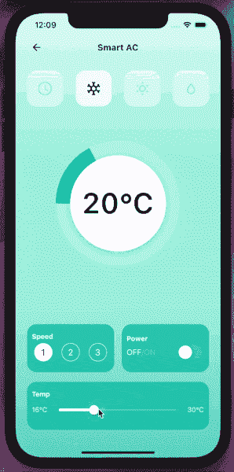

# 在 Flutter 中使用 CustomPainter 绘制圆形控件

> 原文：<https://levelup.gitconnected.com/draw-a-circular-control-with-custompainter-in-flutter-895cc3da0878>

## 了解如何使用 Flutter CustomPainter 来美化您的下一个应用程序的 UI。



您有兴趣为您的下一个应用程序创建自定义界面吗？在本教程中，我将展示如何在不使用任何外部库的情况下绘制自定义形状和路径来增强应用程序的 UI。

对于本教程，我决定从 Instagram 上的 [**Dimest**](https://www.instagram.com/dimest.c/) 个人资料中找到的这个项目中获取灵感。本质上是一个智能家居控制用户界面。



https://www.instagram.com/dimest.c/[的智能家居控制](https://www.instagram.com/dimest.c/)

虽然第一个屏幕很简单，可以重新创建，但我的注意力落在了第二个屏幕上。特别是，我觉得写一篇关于如何创建圆形控件的帖子可能会很有趣，圆形控件是用来表示所选温度的半圆。



红色矩形代表我们将要构建的组件的突出显示部分。

本质上，这个界面有趣的部分是红色矩形突出显示的部分。为了创建这一部分，我想到了使用一个 [**堆栈**](https://api.flutter.dev/flutter/widgets/Stack-class.html) 小部件，并将我的小部件放入其中。`Stack`是一个小部件，它相对于其盒子的边缘定位其子部件。

# 目录

*   基本 UI 实现
*   定制油漆
*   自定义画家

# 基本 UI 实现

让我们从代码开始。第一个小部件是一个具有特定宽度和高度以及装饰的`Container`。`BoxDecoration`小部件是一个圆形，白色背景，增加了不透明度。

```
Stack(
  alignment: Alignment.*center*,
  children: [
    Container(
      width: 260,
      height: 260,
      decoration: BoxDecoration(
          color: Colors.*white.withOpacity(0.2)*,
          shape: BoxShape.circle,
          ),
    ),

..... ],
),
```

热重新加载应用程序以查看结果:



第一步后的用户界面

第二个小部件是一个`Container`，宽度和高度都很小，还有一个装饰。`BoxDecoration`部件有一个圆形，白色背景颜色和一个`BoxShadow`部件来添加模糊效果。

```
Container(
  width: 200,
  height: 200,
  decoration: BoxDecoration(
      color: Colors.*white*,
      shape: BoxShape.circle,
      boxShadow: [
        BoxShadow(
          color:
              Colors.*grey*.withOpacity(0.3),
          spreadRadius: 5,
          blurRadius: 7,
          offset: Offset(0, 3), ),
      ]),
),
```

热重新加载应用程序以查看结果:



第二步后的用户界面

最后添加了一个简单的*文本*小部件来显示温度。

最重要的部分，也是文章的核心，是画出将被插入到两个小部件容器之间的半圆。

在继续构建我们的小部件之前，重要的是要知道该做什么，我们需要使用 [**CustomPaint**](https://api.flutter.dev/flutter/widgets/CustomPaint-class.html) 小部件来访问绘制一些自定义设计的低级图形。

# 定制油漆

`CustomPaint`是一个小部件，它提供了一个画布，在绘画阶段可以在上面画画。 *CustomPaint* 小部件的一些重要属性是:

*   `painter`在孩子面前画画的画家；
*   `foregroundPainter`跟随孩子作画的画家；
*   `child`默认情况下，画布将采用孩子的尺寸，如果它被定义的话；
*   `size`如果没有定义子元素，那么应该指定画布的大小；

对于基本形状的入门，您只需要这些属性中的两个:

*   `painter`是我的定制画师；
*   `size`我画半圆的画布的大小；

```
class SemiCircleWidget extends StatelessWidget {
  final double? diameter;
  final double? sweepAngle;
  final Color? color;

  const SemiCircleWidget({
    Key? key,
    this.diameter = 200,
    @required this.sweepAngle,
    @required this.color,
  }) : super(key: key);

  @override
  Widget build(BuildContext context) {
    return CustomPaint(
      painter: MyPainter(sweepAngle, color),
      size: Size(diameter!, diameter!),
    );
  }
}
```

因为我的半圆的颜色必须根据我的小部件接受的参数`color`和`sweepAngle`的温度值而改变。
这个小工具还带有代表我的半圆直径的`diameter`参数。在这种情况下，它是一个固定的数字，但您可以选择使用任何值。

画师是通过子类化[**custom painter**](https://api.flutter.dev/flutter/rendering/CustomPainter-class.html)实现的。

# 自定义画家

一个`CustomPainter`展示了一个画布，您可以在其中绘制线条、形状或任何类型的自定义绘画。因为 *MyPainter* 类是从 *CustomPainter* 扩展而来的，CustomPainter 是一个抽象类并覆盖了它的两个方法。

```
class MyPainter extends CustomPainter {

  @override
  void paint(Canvas canvas, Size size) { ... }

  @override
  bool shouldRepaint(CustomPainter oldDelegate) => false;}
```

*   `paint()`显示一个画布，您可以在其中绘制任何内容。你在这个方法中编写所有的绘图代码，这个方法给你两个参数:画布的*和*大小*。*
*   `shouldRepaint()`方法控制画师何时应该重画。如果你的 painter 没有可变属性，你可以返回`false`否则，添加一个适当的逻辑来重画。

```
class MyPainter extends CustomPainter {
  MyPainter(this.sweepAngle, this.color);
  final double? sweepAngle;
  final Color? color;

  @override
  void paint(Canvas canvas, Size size) {
    final Paint paint = Paint()  
      ..strokeWidth = 60.0   // 1.
      ..style = PaintingStyle.stroke   // 2.
      ..color = color!;   // 3.

    double degToRad(double deg) => deg * (math.pi / 180.0);

    final path = Path()
      ..arcTo(   // 4.
          Rect.fromCenter(
            center: Offset(size.height / 2, size.width / 2),
            height: size.height,
            width: size.width,
          ),   // 5.
          degToRad(180),   // 6.
          degToRad(sweepAngle!), // 7.
          false);

    canvas.drawPath(path, paint);   // 8.
  }

  @override
  bool shouldRepaint(CustomPainter oldDelegate) => false;
}
```

1.  创建一个带有可见边框的`Paint`对象；
2.  具有一定的厚度；
3.  并且具有基于温度值而变化的颜色；

然后我创建一个`Path`对象:

4.使用`arcTo` *添加圆弧；*

5.从矩形的中心点、宽度和高度构造一个矩形。`center`参数被假定为从原点的偏移；

6.圆弧从 180°开始；

7.并由`sweepAngle`扫到了*；*

8.最后，通过将路径传递给`drawPath()`和`*paint*`，在画布上绘制路径。

*——为了简化操作，我创建了一个简单的方法将角度转换成弧度。*

最后，在我的两个小部件*容器*之间插入我的新小部件:

```
Stack(
  alignment: Alignment.*center*,
  children: [
    Container(
      width: 260,
      height: 260,
      decoration: BoxDecoration(
          color: Colors.*white*,
          shape: BoxShape.circle,
          gradient: RadialGradient(colors: [
            Colors.*white*.withOpacity(0.2),
            Colors.*white*.withOpacity(0.2),
          ])),
    ),
    SemiCircleWidget(
      diameter: 200,
      sweepAngle: ((provider.myList[1].value - 15) * 12.0).clamp(0.0, 180.0),
      color: getSliderColor(provider.myList[1].value),
    ),
    Container(
      width: 200,
      height: 200,
      decoration: BoxDecoration(
          color: Colors.*white*,
          shape: BoxShape.circle,
          boxShadow: [
            BoxShadow(
              color:
                  Colors.*grey*.withOpacity(0.3),
              spreadRadius: 5,
              blurRadius: 7,
              offset: Offset(0,
                  3), *// changes position of shadow* ),
          ]),
    ),
    Text(
      '${convertToInt(provider.myList[1].value)}°C',
      style: TextStyle(
          fontSize: 60,
          fontWeight: FontWeight.*w600*),
    )
  ],
)
```

热重新加载应用程序以查看以下内容:


最后的结果

为了完整起见，我构建了整个界面，但是在本教程中，我省略了其他部分，因为它们被认为是不必要的。我将完整应用程序的源代码链接留给您。



带有动画颜色的智能控件

[](https://github.com/davideagostini/smart_home) [## davideagostini/smart_home

### 了解如何在 Flutter 中使用 CustomPainter 绘制圆形智能控件

github.com](https://github.com/davideagostini/smart_home) 

希望这篇教程对你接下来的 app 开发有所帮助。在结束之前，我建议你喜欢并分享这篇文章，并留下评论。它不会让你付出任何代价，同时鼓励我继续创作其他类似的内容。谢谢你的支持。

下节课再见。😉

# 我博客上的其他帖子

[](/building-beautiful-ui-in-flutter-8e75277aa980) [## 在 Flutter 中构建漂亮的 UI

### 增强下一个 Flutter 移动应用程序设计的快速介绍指南

levelup.gitconnected.com](/building-beautiful-ui-in-flutter-8e75277aa980) [](/build-a-web-app-with-flutter-and-deploy-it-to-firebase-hosting-3ee020b0e3db) [## 用 Flutter 构建一个 web 应用程序，并将其部署到 Firebase 主机上

### 在这篇文章中，在简要介绍了 Flutter 之后，我展示了一些 web 特性，我们将看到如何构建和部署一个简单的…

levelup.gitconnected.com](/build-a-web-app-with-flutter-and-deploy-it-to-firebase-hosting-3ee020b0e3db)