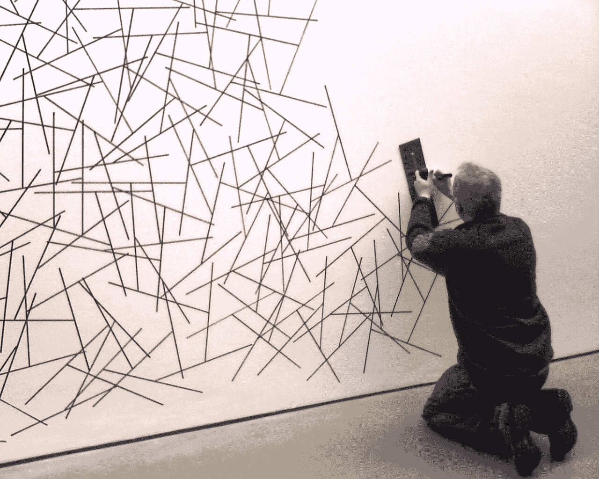
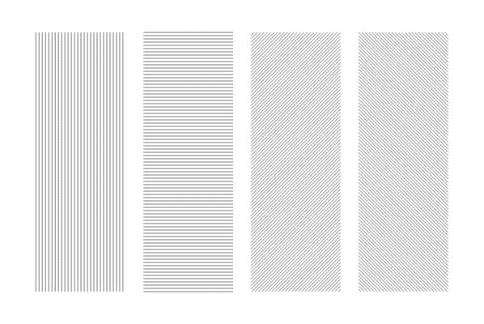
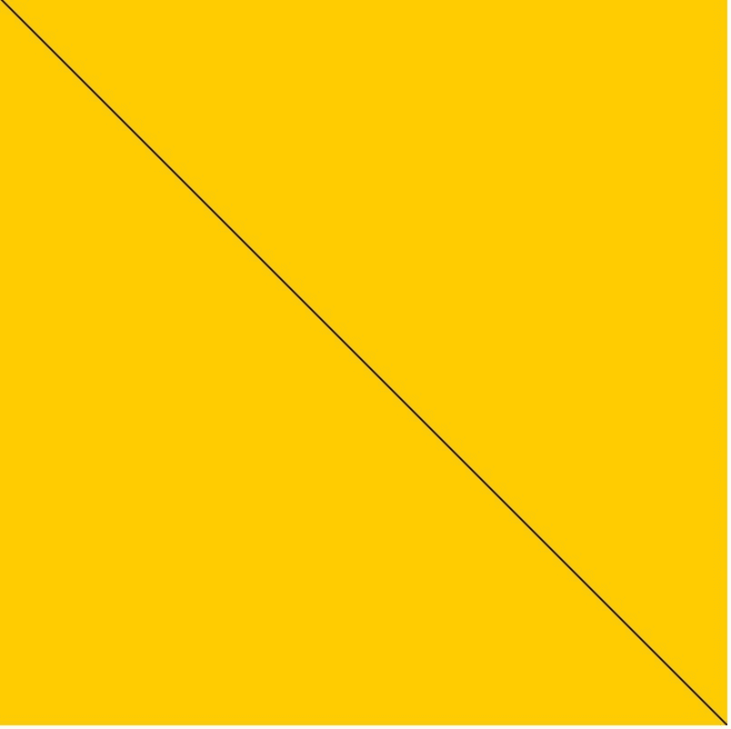
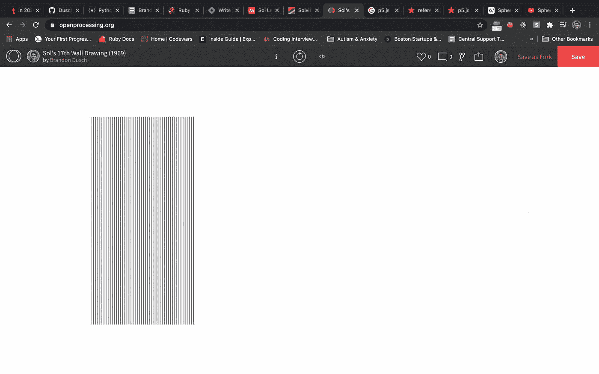
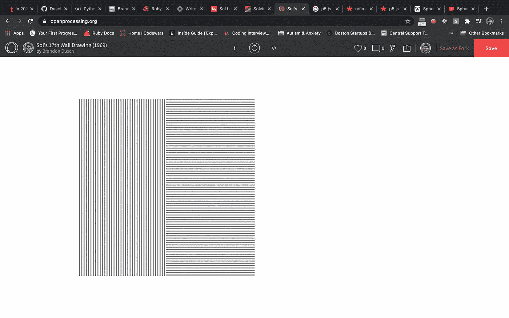
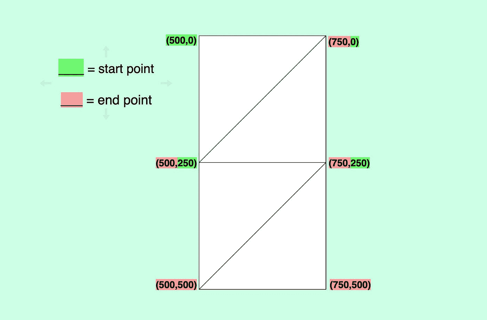
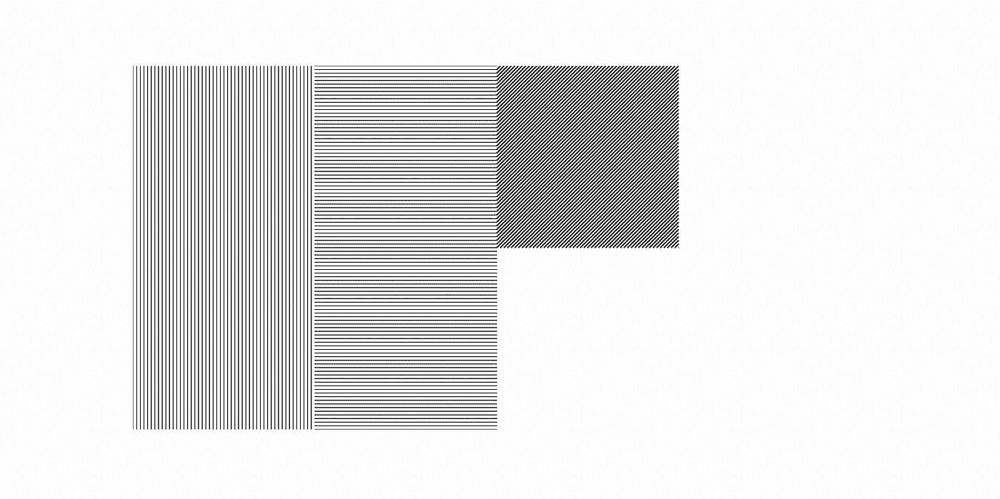
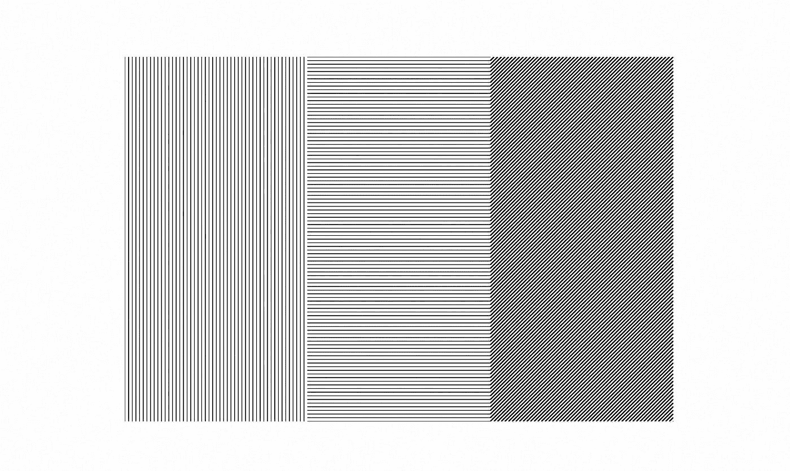
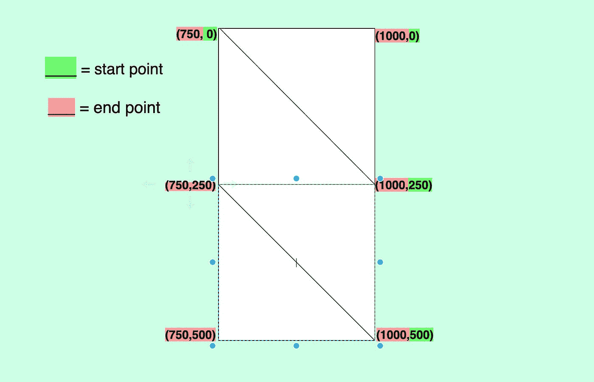
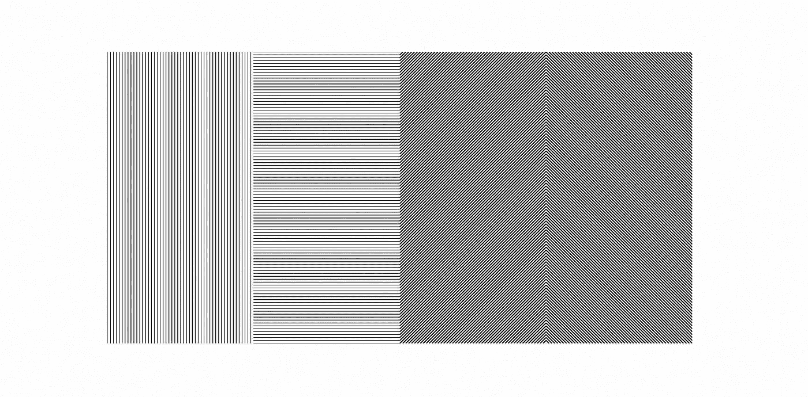

# 用 p5.js 画出你的第一张草图！

> 原文：<https://levelup.gitconnected.com/draw-your-first-sketch-with-p5-js-78a5a5ce0ba2>


# 当星星碰撞:艺术和技术在一起

当我在初中和高中的时候，在想从事技术工作之前，我学的是艺术。具体来说是声乐。但是我喜欢用其他艺术形式来表达自己，比如绘画和写作。

今年，我想用一种更有创造性和表现力的方式来编码，而不是通常的函数式或面向对象的方式。我最近开始学习使用 p5.js JavaScript 库用代码创建引人注目的草图。根据他们的[官网](https://p5js.org/)，“p5.js 拥有全套绘图功能”，将整个浏览器视为一个素描画布。

# 什么是素描？

“草图”是从[处理语言](【processing.org】)的方法论中借用的一个术语，这是 p5.js 的直接影响。草图是用代码将想法可视化的实践。

# 索尔·勒威特的壁画

我这门课的第一个家庭作业是通过画出这些[美国艺术家 Sol LeWitt](https://massmoca.org/sol-lewitt/) 的壁画来练习素描。被认为是概念和极简艺术的先驱，LeWitt 以他的壁画而闻名。他的画的古怪之处在于它们不是真正的画！有简单的文字卡，上面有如何想象一幅特定的壁画的“说明”。



这些说明通常由一两句话组成。这个想法是观察者通过严格遵循 Sol 的指示来再现作品。然而，观察者可以自由地解释指令中没有明确提到的任何东西。

对于像我这样刚开始学习用代码画画的人来说，这似乎是一个理想的第一次练习。

# 使用 p5.js 的 Sol 的墙壁绘图

让我们借助 p5.js 的力量，用代码画出 Sol 的*“墙画# 17”*！以下是图片和说明:



> *四部分图，每部分的线条方向不同。*

## 开放式加工

如果你以前从未“画过草图”或使用过像 p5.js 这样的库，一个很好的开始练习的地方是在 [OpenProcessing](https://openprocessing.org/user/254847/) ，这是一个非常棒的创造性编码在线编辑器。创建一个帐户是免费的，你可以马上开始素描。你也可以使用 p5.js 的[内部编辑器](https://editor.p5js.org/)，但是本教程将在 OpenProcessing 中完成。

## 开始新的草图

点击右上角的“创建草图”。将出现一个新的编辑器，其中包含这两段重要的代码:

```
{ createCanvas(windowWidth, windowHeight); background(100); } { ellipse(mouseX, mouseY, 20, 20); }
```

第一个函数`setup()`，正如它所说的那样:它设置画布，我们将在其上绘制草图。在内部，我们用`createCanvas()`设置画布的尺寸，将其拉伸到浏览器窗口的大小。

另一个函数`draw()`，执行里面所有的 p5 代码，并在之前设置好的网页“画布”上“绘图”。

在本教程的其余部分，我们将努力重构这两个函数，这样我们就可以生成我们的 Sol 绘图。

## 解析指令

为了呈现想要的图形，我们需要解析 Sol 的指令，并把它们转换成伪代码。让我们重温一下这些说明:

> *四部分图，每部分的线条方向不同。*

我们可以将“部分”视为画布上获得不同线条方向的部分:

*   **第一部分** —线条上下
*   **第二部分** —线条从左到右
*   **第三部分** —线条是左对角线
*   **第四部分** —线条是右对角线

另外，请注意，在最终的图像中，它的宽度大于高度。这告诉我们，当我们设置画布时，它的尺寸应该反映这一点。让我们用 1000x500:

现在我们的画布大小合适了，是时候进入下一步了。

## `line()`功能

我们试图复制的图画只是由线条组成的。在 p5.js 中，有一组专用于绘制二维形状的特殊函数，包括线条！

`line()`函数在传递参数`x1`、`y1`、`x2`和`y2`->-`line(x1,y1,x2,y2)`时在页面上绘制一条物理线。在下面的例子中，我们使用函数将画布一分为二。



但是不停地给`line()`写多个调用不是很无聊吗？我们还需要注意 1000 x 500 的画布尺寸。这个问题的一个很好的解决方案是使用 for loops*！

## 一圈圈的线

对于壁画，我们需要画足够多的线来模拟上面的草图。`line()`肯定会有用。

`for`循环是一种特别方便的画线工具，因为我们可以控制迭代的极限以及每次的步数。因为有四个部分，我们需要**4**个循环。

*** 虽然说明中没有明确说明，但我画的线条延伸了 500 像素高，相当于画布的高度。它们的宽度将是画布宽度的 1/4，250 像素宽。

***第一部分:垂直线—*** 要画这第一部分，我们知道每条垂直线必须是 500 像素高。所以我们也知道自己的 y 坐标:(`x1, 0, x2, 500`)。在循环中，为了保持行与行之间的间距，x 坐标将改变 5，直到它们到达画布中的 250 像素标记。

它看起来是这样的:

接下来，坐标为`x, 0, x, 500`的线路代码:

这是我们得到的结果:



呜哇呜！我们已经画出了我们壁画的第一部分！前进！

***第二部分:水平线—*** 在这一部分，我们处理的是从左到右的水平线。不像上一部分，我们知道每一行的*高度*，在这一部分我们知道每一行的*宽度*:250 像素宽！这是因为，由于每条线跨越了画布整个“四分之一”的宽度，所以它的宽度是 250。

这部分从上一部分在 250-px 标记处停止的地方继续。这意味着每条线将从 250 像素的标记延伸到 500 像素的标记。因此，每条线的 x 坐标不会改变，将始终是`250,500`。

水平线的`for`循环将遍历每 5 个 y 坐标，每次绘制`line()`，直到我们跨越画布的整个 500 像素高度:



不错:)接下来进入下一部分。

***第三部分:左对角线—*** 画布的后两部分肯定是更有挑战性的绘制。不像第一部分和第二部分，我们可以用恒定的 x 或 y 坐标画线，最后两部分处理对角线。

我发现的一种方法是从不同的起点画出第三部分的每一部分，直到某一点，但仍然完成它。想象你将第三部分水平分割，并通过每一半画一条对角线:



这张草图概括了我对如何以一种支离破碎的方式绘制线条的一般想法，每个三角形都从上一个三角形停止的地方开始。因此，这就是一些坐标被双重标记的原因。

我还注意到，当每条线都画在三角形中时，`y1`和`x2`坐标会改变，而`x1`和`y2`坐标保持不变。

按照这个逻辑，我们可以创建一个`for`循环并执行以下操作:

这是我们从剩余的壁画中得到的:



太棒了。那么如何才能画出第三部的其余部分呢？我们只能迭代到 250 来均匀地绘制线条，这将我们置于画布的*高度*的 250px 标记处。因此，我们应该在我们的`y1`坐标上加 250，从正确的位置开始，完成最后两个三角形:



***第四部分:右对角线—*** 对于我们的第四部分也是最后一部分的壁画，我们需要画出与方向相反的*对角线。*

像上次一样，想象您将零件分成两个正方形，并将每条线一分为二以创建四个三角形，记住您在画布中的坐标位置:



由于方向的改变，我们的起点和终点似乎被重新安排了。从(1000，0)开始，随着线条向第一个三角形的末端绘制，`x1`和`y2`根据迭代而变化。

当绘制下一个三角形时，从(750，0)开始远离斜边绘制的线，`y1`和`x2`坐标改变:

如果我们把它放在一个限制为 250 的`for`循环中，我们会得到:

像前一部分一样，我们添加了两个更多的`line()`调用，其中 250 被添加到`y1`坐标中:

我们已经完成了索尔·勒维特的壁画！



对于第一个 p5 小品来说还不错吧？

# 资源

[创造你自己的索尔·路易特(带 p5.js)](https://medium.com/@mere.strickland/create-your-own-sol-lewitt-with-p5-js-165cdeda2d88) 梅雷迪思·斯特里克兰

[Casey Reas 和 Ben Fry 的加工历史](https://medium.com/processing-foundation/a-modern-prometheus-59aed94abe85)

[求解 Sol 解决方案页面](http://solvingsol.com/solutions/)

*原载于*[*https://blog.mydevdiary.net*](https://blog.mydevdiary.net/draw-your-first-sketch-with-p5js-ckk2t5k8r0fvuqps12z300frr)*。*