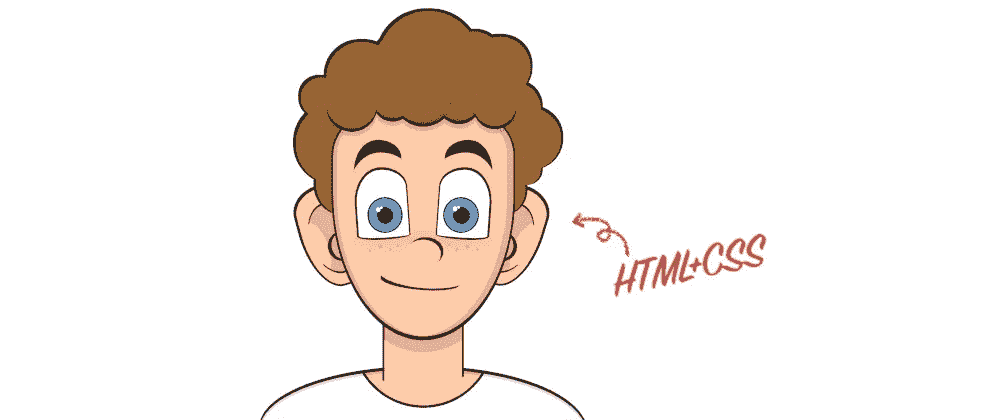

# 用 HTML 和 CSS 绘制一个卷发男孩的漫画

> 原文：<https://levelup.gitconnected.com/drawing-a-cartoon-of-a-boy-with-curly-hair-with-html-and-css-130b0c874cde>

我喜欢编写 [CSS 图纸](https://medium.com/counterarts/100-days-of-css-illustrations-a272f97edd92)来取乐。我发现这很放松，并且认为这是练习 CSS 的一个极好的方法。所以今天，我做了一个疗程，在 CodePen 上完成了[这幅画:](https://codepen.io/alvaromontoro/full/mdmzojb)

我记录了这个过程(就像我通常做的那样)，但这次有点不同:我第一次用视频记录了自己的发言和解释过程。一般来说，我只展示过程中的时间流逝，因为我太在意自己的声音和口音。不管怎样，这是视频:

是我第一个长视频。任何建设性的反馈都将受到赞赏和欢迎。

这个过程比平时花了更长的时间——我大声描述了每一步——并遵循了以下步骤:

*   使用带`border-radius`的椭圆绘制基本头部。
*   加耳朵(用`scaleX(-1)`互翻一份)。
*   附上脸的部分:嘴，眼睛，鼻子…
*   添加颈部(一个简单的正方形)。
*   分三步使用一束`box-shadow`绘制头发。
*   通过在矩形上设置一条柔和的曲线(`border-radius`)来完成主体。

这样，画的所有部分都完成了，但它看起来太简单和单调了。所以为了完成 CSS 艺术，我添加了一些细节，比如阴影，雀斑，脸颊上的一些红晕…

—

而且，如果你不喜欢长视频，或者我的声音很烦人或者让你睡着了(你不会是第一个)，下面是我通常做的延时视频:

如果你喜欢这个内容，[也可以看看我的频道](http://youtube.com/c/AlvaroMontoroCSS)上的其他视频！:P