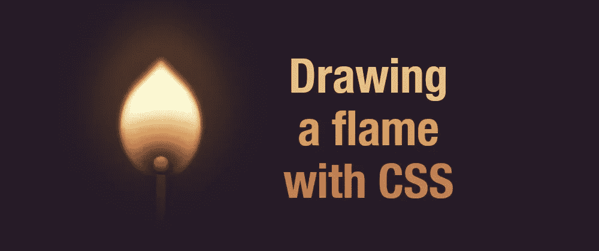
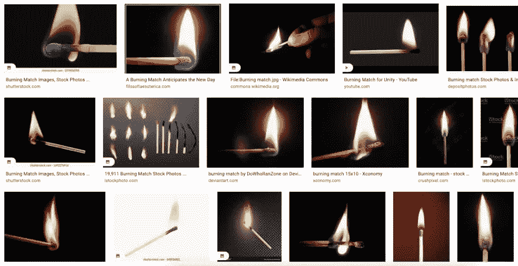

# 用 CSS 绘制火焰

> 原文：<https://levelup.gitconnected.com/drawing-a-flame-with-css-e0c8d83e61b6>



## 一个关于创建燃烧的火柴的 CSS 艺术的详细教程

我在大约 30 分钟内完成了这个火焰的[初始版本，并在网上分享了它。然后我把它上传到 Instagram，有个东西引起了我的注意。通常，我在分享 CSS 艺术的时候不使用滤镜(那会是*欺骗*)，但是这次有东西带我使用滤镜。我试了几个，发现一个使图像看起来不那么明亮，更真实，所以我改变了初始版本，更新了颜色，以匹配过滤后的版本。结果是:](https://codepen.io/alvaromontoro/full/RwLYzeR)

在这篇文章中，我将描述用一个 HTML 元素绘制一个类似于**的火焰的过程。不一定要一样(就像雪花，没有两个火焰是一样的。)它更像是我所做的事情的日志。如果你画了它，你可以改变它的价值观，让它与众不同，成为你自己的。**

此外，这篇文章有点长，因为我解释了所使用的不同属性及其原因。想快速画点什么就直接复制代码，现场看。

# 初始形状

首先，我们需要单个 HTML 元素:

```
<div class="flame"></div>
```

然后我们需要让它看起来像火焰。我选择了水滴形状。它可能并不完美，但它很容易就能做出不同的形状。人们联想到火焰的东西。

为了创建一个 drop，我画了一个正方形，在一个角上应用 0 的`[border-radius](https://developer.mozilla.org/en-US/docs/Web/CSS/border-radius)`，在其余的角上应用 100%，然后使用`[transform](https://developer.mozilla.org/en-US/docs/Web/CSS/transform-function/rotate)` [和](https://developer.mozilla.org/en-US/docs/Web/CSS/transform-function/rotate) `[rotate()](https://developer.mozilla.org/en-US/docs/Web/CSS/transform-function/rotate)`相应地倾斜元素:

```
.flame {
  /* set the size of the flame side */
  width: 40vmin;
  /* make it square */
  aspect-ratio: 1;
  /* give it a drop/tear shape */
  border-radius: 2% 87% 45% 85%;
  /* position it at the center of the screen */
  position: absolute;
  top: 50%;
  left: 50%;
  /* really in the center + tilt clockwise*/
  transform: translate(-50%, -50%) rotate(45deg);
  /* temporary for demo, so the shape is visible */
  background: red;
}
```

您可以调整`border-radius`值以避免过于对称。请随意将它们更改为您更喜欢的内容。比如我把它改成了`2% 87% 45% 85%`(加了一个动画就更多了。)

还有，让我们给身体增加一点点风格，这样就不全是白色了。只是一个黑暗的背景。你可以把它变成黑色。我喜欢做一些稍微柔和的东西，这样以后画出来会更流畅:

```
body {
  background: #251c27;
}
```

# 渐变

你以前见过火焰或燃烧的火柴，你知道大多数人不是这样画它们的。它不是一种单一的颜色，也不是三种不同颜色黄色、橙色和红色的组合。



真正的火焰不是黄色的。

它是从白色到橙色到黑色的颜色过渡，边缘有一些蓝色。这样的过渡意味着渐变。要么使用实际的[渐变作为背景](https://developer.mozilla.org/en-US/docs/Web/CSS/gradient)，要么使用[框阴影](https://developer.mozilla.org/en-US/docs/Web/CSS/box-shadow)。

在 CSS 中，渐变是从上到下“区分优先级”的。这意味着列表上的第一个将在所有其他的顶部。我添加了四个渐变和一个新的基色(浅黄色):

*   从底部到顶部的[径向渐变](https://developer.mozilla.org/en-US/docs/Web/CSS/gradient/radial-gradient)，从微透明的暗色(几乎是黑色)到完全透明。
*   从底部开始的另一个径向渐变，从微透明的深色到完全透明。
*   另一个径向渐变从底部开始，这次是从黄色到橙色到半透明的黄色。
*   从白色到半透明黄色的[线性渐变](https://developer.mozilla.org/en-US/docs/Web/CSS/gradient/linear-gradient)将作为火焰的基础。

你可能会问:为什么几乎相同的东西有三个径向梯度？诀窍是稍微改变它们的大小、位置和百分比，因此将三者结合起来会创造出完全不同的东西，这是单一径向渐变所无法实现的。我用了三个，但是我可以做更多来使它更真实。或者，为了使绘图更卡通，限制它为一个梯度，并有更清晰的边缘。

> *记住:火焰倾斜 45 度！这意味着火焰的底部是 HTML 元素的右下角！*

在看了 Instagram 滤镜建议的图片后，我选择了柔和的颜色。最初，我用了更鲜艳的颜色。但是你可以想出任何你想要的颜色:让你的画独一无二！黄色火焰？绿色火焰？蓝色火焰？它们听起来都很完美。

让我们用这些渐变替换上一步中添加的临时背景:

```
.flame {
  /* ... */
  background: 
    radial-gradient(100% 100% at 90% 90%, #251c27, #251c2733 20%, #251c2700 50%),
    radial-gradient(farthest-side at 110% 120%, #251c27, #631, #cb6c3b88, #0000),
    radial-gradient(at 100% 100%, #fc08, #cb6c3b, #eebd7600 60%),
    linear-gradient(135deg, #fff0 20%, #ff0),
    #ffe
    ;
}
```

# 阴影

在这一点上，我们有一个类似火焰的东西，但它看起来太尖锐了。如果你看上面截图的图片，你会注意到火也有柔和的光芒。我们可以使用`[box-shadow](https://developer.mozilla.org/en-US/docs/Web/CSS/box-shadow)` [属性](https://developer.mozilla.org/en-US/docs/Web/CSS/box-shadow)来添加它。

我们将有比渐变更多的阴影，因为我们将在火焰的内部和外部都应用它们。内部给一些色调，外部创造一个发光的效果。

和渐变一样，我们需要考虑阴影是从上到下堆叠的:第一个阴影会在上面，可能会隐藏下面的部分`box-shadow`。使用[半透明的颜色](https://alvaromontoro.com/blog/67865/the-ultimate-guide-to-css-colors-2020-edition)，我们可以为火焰创造一些独特的体验。

我添加的阴影是:

在内部:

*   顶部的橙色/红色阴影(使其更柔和、更真实。)
*   底部蓝色阴影(让它更真实。)
*   真实火焰周围的橙色/黄色阴影(给它更多的“辉光”)

在外面:

*   黄色/橙色阴影包围火焰，但倾向于上升(使其更模糊)。)
*   一个黑色半透明的阴影围绕着整个火焰(使它更真实。)
*   一个巨大的橙黄色阴影(这将是火焰的光。)

同样，我为此使用了一堆阴影(见下面的代码)，但是你可以使用尽可能少的阴影或者尽可能多的阴影，直到你达到你想要的效果。

```
.flame {
  /* ... */
  box-shadow:
    inset 2vmin 2vmin 2vmin -1.5vmin #f808,
    inset  -1vmin -1vmin 5vmin -3vmin #00f7,
    inset  0vmin  -1vmin 5vmin -3vmin #00f8,
    inset  -1vmin -1vmin 2vmin -2vmin #251c27,
    inset  -1vmin -1vmin 3vmin -1vmin #251c27,
    inset  -1vmin -1vmin 2vmin #fc08,
    -0.5vmin -0.5vmin 1vmin #ff08,
    -1vmin -1vmin 2vmin #ce8c47,
    -2vmin -2vmin 10vmin 1vmin #251c27,
    -6vmin -6vmin 35vmin 3vmin #fa06
    ;
}
```

> *记住:火焰是倾斜的！火焰的底部是 HTML 元素的右下角。添加阴影时要考虑到这一点！*

# 过滤

对于这幅图，我只是添加了一个简单的模糊[滤镜](https://developer.mozilla.org/en-US/docs/Web/CSS/filter)来帮助火焰发光，并使图像整体不那么清晰:

```
.flame {
  /* ... */
  filter: blur(0.1vmin);
}
```

这只是一个微小的[模糊](https://developer.mozilla.org/en-US/docs/Web/CSS/filter-function/blur)，因为它也会影响伪元素。虽然我们想让火焰看起来稍微模糊一点，但我们不能对其余部分说同样的话，正如我在下一节中解释的那样。

# 伪元素

我使用[的伪元素](https://developer.mozilla.org/en-US/docs/Web/CSS/Pseudo-elements) `[::before](https://developer.mozilla.org/en-US/docs/Web/CSS/Pseudo-elements)` [和](https://developer.mozilla.org/en-US/docs/Web/CSS/Pseudo-elements) `[::after](https://developer.mozilla.org/en-US/docs/Web/CSS/Pseudo-elements)`来绘制火柴本身，用，我做了火柴棒(一个长方形)，用，我做了火柴头。

最初，我用百分比表示这些伪元素的大小和位置，但当我制作火焰动画时，这变成了一个问题(因为我制作了宽度和高度的动画，然后火柴改变了大小和形状。)所以我为元素设置了一个静态的宽度和位置来避免这个问题。因此，当火随着动画移动时，火柴似乎停留在同一个地方。

然后，我给比赛本身添加了一些阴影和渐变。这样的话，我可以让它看起来更真实一点，或者对于一部卡通来说更真实一点。

`::before`伪元素是比赛的木棍。一些简单容易的东西:一个矩形，从顶部开始颜色变浅，随着远离火焰颜色变深。这里没有什么特别的东西:

```
.flame::before {
  content: "";
  display: block;
  width: 20vmin;
  height: 3vmin;
  background: linear-gradient(to right, #d605, #321, #251c27);
  top: 37vmin;
  left: 37vmin;
  position: absolute;
  transform: translate(-50%, -50%) rotate(45deg);
  box-shadow: 0 0 5vmin 3vmin #251c27aa, inset -1vmin 0 1.5vmin #251c27aa
}
```

> *记住:和火焰渐变一样，我们必须记住 HTML 元素是倾斜 45 度的，所以我们在定位和转换伪元素时需要考虑这一点。*

`::after`是火柴的头。它更难画(但不多):顶部圆形，底部较平。它也将有不同的颜色:黄色/白色更接近火焰，红色磷在底部。

此外，这个伪元素可以帮助火焰的颜色。记住，火焰的中心更暗/更黑……恰好在火柴头处。一个`box-shadow`会有所帮助:

```
.flame::after {
  content: "";
  display: block;
  width: 6vmin;
  height: 5vmin;
  background: 
    linear-gradient(45deg, #f002, #fff0),
    linear-gradient(to right, #d68356, #e5653e 3%, #d0363b 20%, #251c27);
  top: 32vmin;
  left: 32vmin;
  border-radius: 100% / 120% 80% 80% 120%;
  position: absolute;
  transform: translate(-50%, -50%) rotate(45deg);
  box-shadow: 0 0 5vmin 3vmin #251c27aa, inset -1vmin 0 1.5vmin #251c27;
}
```

# 给火焰添加动画

在我们开始制作火焰动画之前，有一个重要的信息:这不是表演类型的动画。它改变像边框半径、宽度或高度这样的值，这些都不是很好的动画属性，可能会让计算机有点吃力。

一旦说了，动画[将包括:](https://developer.mozilla.org/en-US/docs/Web/CSS/animation)

*   改变`border-radius`值
*   更新火焰的`width`

这些变化将给火焰一种闪烁的感觉，我们可以通过更新颜色或模糊值来增强这种感觉。

```
@keyframes burn {
  0%, 100% { border-radius: 5% 87% 45% 85%; width: 30vmin; }
  10% { border-radius: 5% 85% 49% 82%; }
  20% { border-radius: 0% 85% 45% 87%; width: 31vmin; }
  30%, 90% { border-radius: 5% 85% 49% 82%; }
  40% { border-radius: 0% 85% 45% 87%; width: 32vmin; }
  50% { border-radius: 2% 87% 42% 90%; }
  60% { border-radius: 5% 97% 45% 88%; }
  70% { border-radius: 2% 87% 42% 90%; width: 31vmin}
  80% { border-radius: 5% 97% 45% 88%; }
}

.flame {
  /* ... */
  animation: burn 4s infinite;
}
```

# 易接近

最后但同样重要的是，让我们做些事情来提高可访问性。我们有一幅火焰的图画，它看起来很棒，但是如果它更容易被每个人看到，那不是更棒吗？

我们可以通过对 HTML 进行一些简单的修改来实现:

*   添加一个`role`,这将有助于向屏幕阅读器宣布绘图为图片。
*   添加一个描述我们绘图的`aria-label`。

有了这两个变化，当一个屏幕阅读器到达我们的火焰时，它会宣布类似于“用 CSS 编码的火焰卡通”。形象。”这将有助于屏幕阅读器用户理解屏幕上的内容。此外，如果你做 CSS 艺术，这可能是要考虑的事情(在另一篇文章中[更多关于 CSS 艺术的可访问性)。)](https://alvaromontoro.com/blog/67979/creating-accessible-css-art)

# 结论

这个帖子从 web 开发的角度来看不太实用(就像有些人会很快在评论区和 Twitter 上指出的那样，很可能没有阅读整篇文章和这一段。)但它可能有很高的教育价值。

它有助于熟悉梯度(至少两个:线性和径向)，框阴影，一些过滤器和转换等。，用不同的颜色和透明度组合一切。

如上所述，没有两个火焰是一样的，然后你可以玩渐变，阴影和滤镜的值来得到你独特的火焰。

*原载于 2022 年 5 月 14 日 https://alvaromontoro.com*[](https://alvaromontoro.com/blog/68003/drawing-a-flame-with-css)**。**