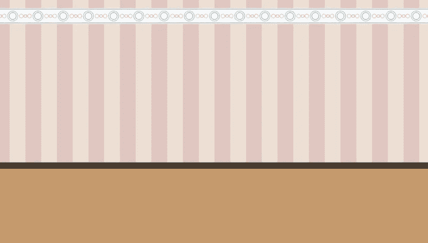

# 绘制一个只有一个 div 没有 JS 的交互式窗口

> 原文：<https://levelup.gitconnected.com/drawing-an-interactive-window-with-a-single-div-ed4981e365bb>

让我们澄清一点:当我们谈论一个窗口时，我们指的是像墙上一样的实际窗口，而不是计算机上的窗口。这篇文章将讲述如何用一个单独的`<div>`来绘制一个窗口，以及如何使它具有交互性，这样你就可以通过拉动绳子来打开/关闭百叶窗。

这是我们将要开发的([在大屏幕上看起来更好](https://codepen.io/alvaromontoro/full/eYvmQoj)，因为有时很难在移动设备上操作):

这个演示的灵感来自于 [@jh3y](https://dev.to/jh3y) 的 3D 窗口演示，它使用了新的`@container`查询，你也可以[在 CodePen 上看到](https://codepen.io/jh3y/pen/qBrEMEe):

我决定在 2D 做一些简单的事情(我应该回去做 3D CSS 演示，这很有趣。)并且作为一个挑战，将元素的数量限制到尽可能少。在这种情况下，这是一个:单一的`div`。我可以用`html`和`body`画出窗户和墙壁，但是不可能给它们制作动画(或者至少我不能)。)最初，我也打算使用`@container`查询，但是后来我想到了一种不需要这个新特性的方法。

将多个渐变应用为`background-image`后，背景/墙壁为`html` / `body`元素(只需要其中一个):



有了 8 种渐变，我们就可以获得这样的背景:

*   一条水平`linear-gradient`用于粉色和奶油色垂直线。
*   一个垂直`linear-gradient`用于栏杆和墙壁底部。
*   一个垂直`linear-gradient`用于装饰顶纸(只有白线和蓝线)
*   五个`radial-gradient`在装饰纸上制作圆形图案。

有两个垂直的`linear-gradient`。为什么不把它们合并成一个呢？很棒的问题！Chrome 和 Firefox 中有一些错误，如果一个`linear-gradient`有太多的停靠点(8 个或更多)，线条会变得模糊或扭曲。出于这个原因，我不得不把一个大的线性梯度分成两个较小的梯度，每个梯度少于 8 站。

窗口是一个单独的`<div>`元素，我们使用不同的`box-shadow`和`linear-gradient`来绘制框架、玻璃和倒影。

使用`::before`伪元素，我们使用`repeating-linear-gradient`添加百叶窗。用`::after`，我们拉窗帘的线。

到目前为止，窗口是静态的。只是一个没有交互的绘图，但是如果我们添加下面的 CSS:

```
div {
  /* ... */
  resize: vertical;
  overflow: auto;
  min-height: 300px; /* same as height */
  max-height: 450px;
}
```

现在窗口可以在指定的值范围内垂直放大和缩小(在大多数浏览器中，`div`的右下角将是调整大小的手柄。)由于我们对线性渐变和阴影使用了绝对值，窗口会给人一种总是相同大小的印象，但 HTML 元素实际上是在改变高度。

这就是`::after`伪元素发挥作用的地方。它将是唯一具有相对大小的容器，因此它的背景(用于窗帘绳)将随着容器一起增长。

最后，百叶窗需要根据容器的大小上升/下降…这听起来像是`@container`查询的一个很好的机会，但是相反，我们可以根据窗口的高度(300px)和容器的高度(`div`本身)来计算高度。

使用`calc()`和`clamp()`，我们可以根据父对象的尺寸确定百叶窗的尺寸:

```
div::before {
  /* ... */
  /* the background width is fixed, the height changes */
  background-size: 196px clamp(30px, calc(900px - 200%), 290px);
}
```

这就是我们如何得到一个只有一个 div 元素的[交互窗口](https://codepen.io/alvaromontoro/full/eYvmQoj):

感谢阅读。如果你有任何问题或者任何事情需要进一步的解释，请告诉我。

*原载于 2021 年 5 月 9 日 https://alvaromontoro.com*[](https://alvaromontoro.com/blog/67978/interactive-window-with-a-single-div)**。**