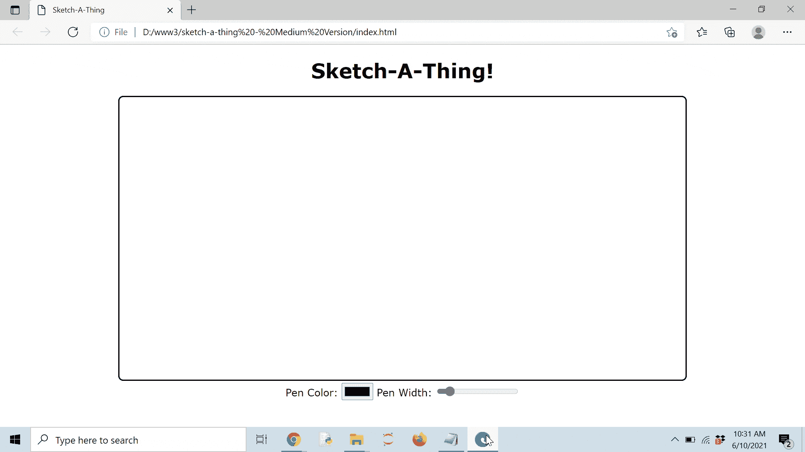

# 用鼠标在 HTML5 画布上绘图

> 原文：<https://levelup.gitconnected.com/drawing-on-the-html5-canvas-with-a-mouse-d92c7d57fb7c>

## 如何使用画布作为艺术工具


Justyn Warner 在 [Unsplash](https://unsplash.com?utm_source=medium&utm_medium=referral) 上拍摄的照片

HTML5 中的 canvas 元素是一个非常棒的多功能工具，允许创建 2D 和 3D 图形。用于从托管[图片](https://developer.mozilla.org/en-US/docs/Web/API/Canvas_API/Tutorial/Using_images)到直接[游戏](https://developer.mozilla.org/en-US/docs/Games/Tutorials/2D_Breakout_game_pure_JavaScript)的一切，其应用中不缺乏创意。

使用一些普通的 JavaScript，可以给出一个真正的空白画布来绘制。设置笔的颜色和宽度的额外控制将允许额外的创作自由

# 设置 HTML

在深入 JavaScript 之前，需要建立 HTML 框架。

```
<!DOCTYPE html>
<html>
    <head>
        <Title>Sketch-A-Thing</Title>
        <link rel="stylesheet" type="text/css" href="sketch.css" media="screen"/>
    </head>
```

需要注意的是，一个单独的 CSS 文件将被链接以给 canvas 元素一个边框。CSS 代码将在下一节中提供。

```
<body> <!-- Create a Header -->
    <div>
        <center>
            <h1>Sketch-A-Thing!</h1>
        </center>
    </div> <!-- Create the Canvas Element -->
    <div>
        <center>
            <canvas id = "sketchCanvas" width = "900" height = "450"></canvas>
        </center>
    </div>
```

在快速创建了一个标题之后，画布就在它自己的 div 元素中创建了。请注意，画布需要一个惟一的 id。此外，宽度和高度是手动设置的。

不要使用相对度量来设置画布的宽度和高度，例如“%”或“vh/vw”单位。这将为画布提供一组不同于页面其余部分的坐标，确保任何鼠标移动都不会与画布不成比例。

```
 <div>
        <center>
            <label for="penColor">Pen Color:</label>
            <input type="color" id="penColor" value="#000000">
            <label for="lineWidth">Pen Width:</label>
            <input type="range" min="1" max="10" value="2" id="lineWidth">
        </center>
    </div>
</body>
```

上面创建了设置钢笔颜色和钢笔宽度的控件。使用“color”类型的输入元素实际上会创建一个健壮的颜色选择工具，它甚至允许输入定制的 RGB 值。value 属性设置默认颜色，在本例中是黑色。

“范围”类型的输入元素将创建一个滑块。最小值和最大值分别设置为 1 到 10。甚至比 10 更大的尺寸也是可能的，但是任何更大的尺寸都不能清晰地绘制。

```
<script src="sketch.js"></script>   
</html>
```

最后，为了结束，链接到 JavaScript 文件。

# CSS 注释

CSS 是严格可选的，但它确实创建了一个更整洁的外观，并且使用边框来描绘画布与背景的分离

```
body {
    font-family: Verdana, sans-serif;
}
canvas {
    border-style: solid;
    border-width: 2px;
    border-radius: 8px;
    margin: 0;
}
```

添加了无衬线字体后，画布上又添加了一个快速的圆形边框。最终结果应该如下所示:


这将是用户交互的主要界面。图由作者制作。

虽然这看起来很好，但它仍然缺乏任何真正的功能。

# 用 JavaScript 绘图

为了在画布上绘图，将使用三种方法创建一个类:startDrawing、drawSketch 和 stopDrawing。第一个方法应该在用户单击鼠标并升起一个标志开始对画布进行更改时触发。第二个方法应该在鼠标移动并在画布上创建一条线时触发。最后，最后一个方法应该在释放鼠标时触发，并产生一个标志来停止对画布的所有更改。

让我们来看看实现:

```
// Create a class for the canvas, including attributes for the id, // draw boolean, and coordinates
class Canvas {
    constructor(canvas_id, draw, coord) {          
        this.canvas_id = canvas_id; 
        this.draw = draw;
        this.coord = coord
    }
```

画布的类由三个属性构成。第一个属性只是画布 ID，如 HTML 文档中定义的那样。draw 属性是指示是否可以对画布进行更改的标志。coord 属性表示鼠标在画布上的当前坐标。

```
 // Sets draw to true and gets the mouse coordinates on the event
    startDrawing(event) {
        this.draw = true;
        let canvas = document.getElementById(this.canvas_id); 
        this.coord.x = (event.clientX - canvas.getBoundingClientRect().left);
        this.coord.y = (event.clientY - canvas.getBoundingClientRect().top);
    }
```

第一个方法，startDrawing，重置 draw 标志，使其为真，表示可能对画布进行了更改。然后，它重置 x 和 y 坐标，以匹配相对于画布元素的当前鼠标位置。

```
 // The actual function that will draw on event (mousemove)
    drawSketch(event) {
        // If the draw boolean isn't true, terminate the function
         early
        if (!this.draw) {
            return 0;
        }
```

下一个方法 drawSketch 首先检查 draw 属性以确保它已经被设置为 true。如果没有，该函数将通过简单地返回 0 而提前终止，并且不对画布进行任何额外的更改。这很重要，因为它会在鼠标移动的任何时候被激活，无论鼠标是否被点击。这一步确保了只有当用户准备好时才会对画布进行更改。

```
 // Select the canvas and get its context
        let canvas = document.getElementById(this.canvas_id);
        let ctx = canvas.getContext('2d');
```

这两行简单地抓住了画布和它的上下文。对画布进行任何更改都需要这些步骤。

```
 // Start the line
        ctx.beginPath();

        // Pull from the color and width from the associated 
        // controls. The line cap is hardcoded to be rounded,
        // because it looks more natural for a drawing application
        ctx.strokeStyle = document.getElementById("penColor").value;
        ctx.lineWidth = document.getElementById("lineWidth").value;
        ctx.lineCap = "rounded";
```

下一组线实际上开始了创建线的过程。线条的颜色称为 strokeStyle，直接取自 HTML 中选择的任何颜色。同样，线宽从滑块中拉出。

另外一个参数 lineCap 是硬编码的。这将使线的末端看起来很圆，比有硬边的看起来更自然。

```
 // Start moving to the coordinates determined by mouse 
        // movement. The position is updated as the cursor moves
        ctx.moveTo(this.coord.x, this.coord.y);
        this.coord.x = (event.clientX - canvas.getBoundingClientRect().left);
        this.coord.y = (event.clientY - canvas.getBoundingClientRect().top);

        // Specify where the line ends
        ctx.lineTo(this.coord.x , this.coord.y);

        // Draw the line
        ctx.stroke();
    }
```

再一次，鼠标相对于画布的坐标被获取并用于确定线条的终点。一旦完成，界限就划定了。随着线条的绘制，该方法结束。

```
 // Sets draw to false on event (mouseup)
    stopDrawing(event) {
        this.draw = false;
    }
}
```

最后一个方法只是将 draw 属性设置回 false。

```
// Write the main function that will execute on load
function main() {
    // Initialize the main object, canvas
    let canvas = new Canvas("sketchCanvas", false, {x:0 , y:0});
```

作为个人偏好，我喜欢将任何在启动时改变 web 应用程序的函数放在主函数中，并单独调用它。这样，创建了一个名为 canvas 的新对象，它使用 canvas ID 并将 draw 属性设置为 false，默认情况下将坐标设置为(0，0)。

```
 // Add event listeners for the mousedown, mouseup, and 
    // mousemove. 
    document.addEventListener('mousedown', function(e){
        canvas.startDrawing(e);
        });
    document.addEventListener('mouseup', function(e){
        canvas.stopDrawing(e);
        });
    document.addEventListener('mousemove', function(e){
        canvas.drawSketch(e);
        });}
```

添加了三个事件处理程序来访问新创建对象的方法:

1.  mousedown:当鼠标被按下时，它激活 startDrawing 方法，该方法允许对画布进行更改。
2.  mouseup:当释放鼠标时，调用 stopDrawing 方法，这将停止画布的所有活动。
3.  mousemove:每当移动鼠标时，都会调用 drawSketch 方法，该方法在画布上绘制线条。

```
// Wait until the page is loaded before applying the main function
window.addEventListener("DOMContentLoaded", ()=>{        
    main();
});
```

尽管 HTML 文档非常简单，但作为最佳实践，只有在 DOM 完全加载后才会调用 main 函数。

# 决赛成绩

如果一切顺利，最终结果将如下所示:


作者制作的视频。

还可以演示笔颜色和笔宽度的进一步验证:



作者制作的视频

# 结论

创建一个绘图工具可以让 web 开发的初学者通过一个有趣的、有创意的项目看到 canvas 元素的直接效用和威力。它的应用超越了简单的虚拟白板，可以用于签名或简单的照片编辑。