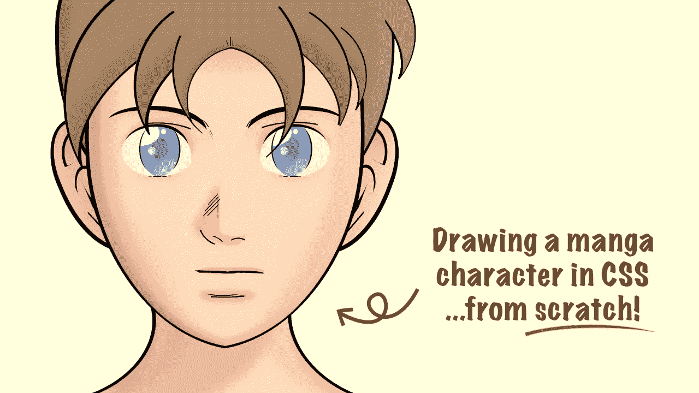

# 用 CSS 绘图:动漫角色

> 原文：<https://levelup.gitconnected.com/drawing-with-css-anime-character-f2c99a573323>



## 如何用 CSS 画一个漫画/动漫人物(附视频！)

在 CSS 中画画很放松(至少对我来说)，是练习 CSS 的绝佳方式。有时尝试一些新功能会很有帮助，但这些新功能并不总能投入生产，因为并非所有的浏览器都支持它们。

在这篇文章中，我将解释我是如何使用 HTML 和 CSS 画出上面的漫画/动画，并深入到创作过程中，进入一些关于我为什么做出一些决定及其利弊的细节。在文章的最后，你会发现一个全程的视频。

# 这幅画

这幅画是从零开始的。没有 HTML，没有 CSS。只是一张白纸。最初，我根本不知道我会画什么！但是我旁边有漫画《冥王星》的第二卷，所以我决定写一些与漫画相关的东西，从封面上获得一些灵感(例如，鼻子和嘴)。

我喜欢这个结果，但我有偏见。这里有一个绘图的现场演示(你可以在 CodePen 上看到[完整版):](https://codepen.io/alvaromontoro/full/ExQbYbw)

让我们来看看这幅图像的不同部分是如何栩栩如生的。

## 帆布

别担心。CSS 艺术中没有`<canvas>`的位置，我喜欢将绘图的根元素设置为“画布”，并在开头添加网格:

```
.canvas {
  width: 80vmin;   /* so it's responsive */
  aspect-ratio: 1; /* so it's a square.  */
  background:
    repeating-linear-gradient(#0003 0 0.125%, #0000 0 0.9875%, #0003 0 10%),
    repeating-linear-gradient(90deg, #0003 0 0.125%, #0000 0 0.9875%, #0003 0 10%);
}
```

这段代码生成一个 10x10 网格的背景。每个方块是 10%，知道这一点有助于我以后放置物品:计算方块的数量并乘以 10，以计算出`top`、`left`、`width`或`height`中所需的百分比。

## 头/脸

面部分为三部分:前额、左侧和右侧。对于他们，我使用了单个元素(前额)，然后是侧面的`::before`(左)和`::after`(右)伪元素。

我可以做一个鸡蛋形状，这在 CSS 中使用`border-radius`和不同的水平和垂直值非常容易做到:

```
.egg-shape {
  width: 80vmin;
  height: 80vmin;
  border-radius: 100% / 80% 80% 120% 120%;
  background: red;
}
```

相反，我把事情复杂化了一点。然而，有三个元素允许*更尖锐的*边缘(例如下巴)，我想尝试这种方法，因为我总是走“蛋形路线”结果看起来不错，但可能不值得。

另一方面，拥有不同的元素允许一些额外的定制(如添加`transform`或嵌入阴影)，如果只有一个元素，这将会更加复杂。所以不是一切都是坏的。

## 口

嘴巴不是一条简单的线。它也由三个部分组成，给人一些“质感”，所以它不仅仅是一个平面的东西。在这种情况下，我是通过调整边框宽度来做到这一点的，但我也可以用裁剪路径(这对于后来的伪元素来说是一种痛苦)或线性渐变(这对于后来的阴影来说是一种痛苦)来做到这一点。浏览器显示可能略有不同，但这是我愿意付出的代价。

这个对象后来被用来提供一些唇影`box-shadow`:一个在上面，另一个在侧面。

## 耳朵

两只耳朵都一样。快速水平翻转元素的技巧是应用`scaleX(-1)`的`transform`和*瞧*！搞定了！

```
.ear {
  /* code to draw the ear: border-radius, backgrounds... */
}/* select the second ear and flip it */
.ear + .ear {
  transform: scaleX(-1);
}
```

完成后，为了让它们看起来稍微不同，我以稍微不同的角度旋转了第二个，并把它推得更远一点(从另一边)。结合双方的各种元素，这给人的印象是有两个不同的耳朵。

## 眼睛

画眼睛总是很棘手。他们成就或破坏了绘画，两者之间的平衡是微妙的。这幅画上的眼睛远非完美，但还可以。

每只眼睛是两个元素:一个`div`(眼睛本身)和一个伪类(瞳孔和虹膜)。眼睛将有一个`overflow:hidden`，所以伪元素不会超出它的范围。

瞳孔和虹膜是径向渐变的，光线反射的径向渐变更多，并且在每只眼睛的侧面用阴影来描绘小线条。然而，在复制第二只眼睛并翻转第二只眼睛后，还有一些不同的事情要做:为了避免不必要的对称看起来很奇怪(来自不同方向的光反射)，第二只眼睛的伪元素也需要翻转:

```
.eye {
  /* eye styles */
}.eye + .eye {
  transform: scaleX(-1); /* flip the eye */
}.eye + .eye::before {
  transform: scaleX(-1); /* flip the iris in the second eye */
}
```

## 脖子

颈部元素将成为其`::before`和`::after`伪元素的容器，这两个伪元素将是颈部的两侧。

使用`box-shadow`，元素的阴影将是脖子的颜色，它将提供一些阴影。使用`transform`旋转和倾斜，形状会更柔和，看起来更像一个卡通的脖子，如果我只是有一个圆角。

## 头发

头发由八次相同的元素组成，略有不同(在位置和大小上，但有时也在背景中)。我最初使用边框和方框阴影来绘制刘海，但当试图让它们看起来不一样时，这是一个问题(另外，在 Chrome 以外的浏览器中看起来很糟糕)。这种方法的另一个问题是头发刘海的顶部在 Chrome 上有一条不希望的黑线(这有时会有一些麻烦。)

所以我选择了方框阴影和渐变来画头发:

```
.bangs {
  width: 30%;
  height: 30%;
  border-radius: 0 0 100% 0;
  /* to draw the external border */
  box-shadow: inset -0.5vmin -0.25vmin; 
  /* the hair and internal border */
  background: radial-gradient(100% 170% at -10% 0, #0000 58.75%, #000 59% 60.25%, var(--hair-dark) 60.5%, var(--hair) 78%); 
}
```

翻转头发(记得`scaleX(-1)`的技巧)并旋转它，使它看起来足够不同，可以重复使用…这就是我做的。

## 线

图中有多条线:眉毛、鼻子、下巴等。“简单”的方法是每一行(或一组行)都有一个元素，但是绘图最终会有许多部分。

相反，我选择将线条的数量减少到最少，减少到可以用背景图片(渐变)复制的形状。然后用一个元素覆盖整张脸，我把这些线条一条一条地添加为`radial-gradient`或`linear-gradient`。

## 易接近

CSS 艺术总体上不是很容易理解，但这并不意味着它不一定是容易理解的。通过添加图像角色和带有绘图描述的`aria-label`,辅助技术用户将更容易访问绘图。

```
<article role="img" aria-label="....">
  ...
</article>
```

我选择使用`<article>`,因为它是一个独立的元素。理想情况下，我应该使用`aria-labelledby`而不是`aria-label`，并在标题/描述中放置一个`<h1>`或`<h2>`。

在 UX 合集的另一篇[文章中，我解释了让 CSS 艺术更容易被每个人接受的方法。](https://uxdesign.cc/creating-accessible-css-art-5366302590a9)

# 现场编码视频

整个过程花了大约三个小时，我将视频速度加快了 2 倍，所以有一个 1.5 小时的视频展示了这是如何一步一步完成的:

如果太长或太慢，还有一个仅持续 20 分钟左右的 [8x 速度视频](https://www.youtube.com/watch?v=kMN-Xd_dcR4)。

如果你喜欢这些视频或 CSS 艺术，请查看[我的 Youtube 频道](https://www.youtube.com/c/AlvaroMontoroCSS)！我发布关于 CSS 和 CSS 艺术现场编码的视频。