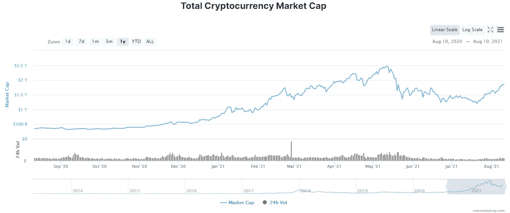
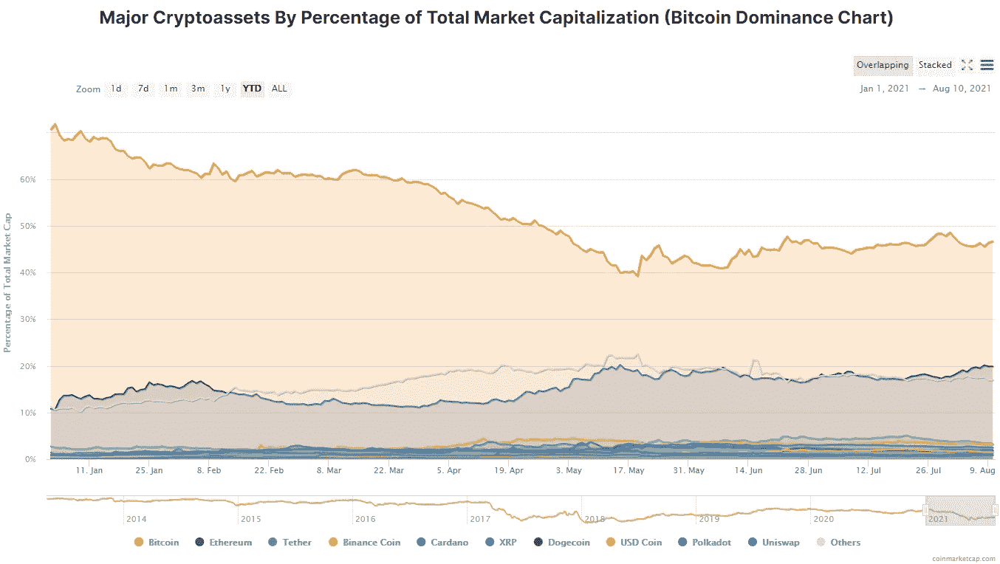

# 推动复苏:比特币的反弹重振了加密货币市场

> 原文：<https://levelup.gitconnected.com/driving-the-resurgence-bitcoins-rally-revives-the-cryptocurrency-market-ad8987469822>

在经历了夏季的熊市开局后，比特币强势回归。在中国监管措施和埃隆·马斯克(Elon Musk)引发的环境担忧之后，这种世界上最古老、最知名的加密货币经历了一段时间的剧烈波动，但自跌破 3 万美元以来，已经上涨了 50%，几乎没有放缓的迹象。

在美国参议院就加密货币的纳税申报要求达成妥协后，更广泛的加密货币市场已进入反弹模式，比特币保持在 45，000 美元以上。结果，华尔街甚至出现了积极的动向，经过几个月的测试后，Riot Blockchain 和[比特币基地](https://en.freedom24.com/ideas/10418-coinbase-investidea)的股价走高。

*(图片:***)**

*正如我们从加密货币的总市值中可以看到的那样，最近 BTC 的飙升帮助了许多其他替代货币的复苏，这些替代货币在 5 月份开始的市场崩溃后出现了低迷。例如，以太坊在八月的第一周上涨了 21%,在新一波乐观情绪中超过了 BTC 本身。*

**

**(图片:*[*CoinMarketCap*](https://coinmarketcap.com/charts/)*)**

*CoinMarketCap 的数据还显示，BTC 最近几周也在忙于夺回部分市场主导地位，这一地位在 5 月份市场崩盘和随后抛售的高峰时期有所下降。*

*自 2020 年比特币价格减半以来，投资者一直兴奋不已，我们正在见证牛市的恢复吗？或者这次反弹之后会有进一步的抛售吗？让我们更深入地看看这种潜在的加密货币市场复苏可能会如何发展:*

# *通往 10 万美元的道路*

*据彭博策略师迈克·麦格隆称，比特币完全有可能在 2021 年底前达到 10 万美元。*

*“今年比特币将进入价格发现阶段的下一步，我们将看到一个焕然一新的牛市，” [McGlone 在彭博 8 月的加密展望中声称](https://www.investing.com/news/cryptocurrency-news/bitcoin-primed-for-a-100k-run-bloombergs-senior-strategist-says-2584166)。这一预测是建立在比特币令人印象深刻的弹性基础上的，尽管有大量关于加密货币的负面消息[。中国对加密开采和交易活动的打击迫使价格在夏季之前大幅下跌，但 BTC 相当稳定地保持了 3 万美元的价格水平。](/what-would-a-ripple-ipo-mean-for-the-world-of-cryptocurrencies-eb50b9c0c4bf)*

*“比特币似乎已经建立了大约 3 万美元的基础，相当于 2019 年初的 4000 美元，我们看到了性能上的相似之处，可能会让基准加密回到 10 万美元的轨道上，”麦克格隆随后就此事写道——强调比特币 3 万美元的基础价格是积累的强大跳板。*

*值得注意的是，麦克格隆发表这番言论之际，比特币的需求正处于数月来的最高水平。[在撰写本文时，社交媒体情绪追踪器比特币贪婪指数](https://alternative.me/crypto/fear-and-greed-index/)已经飙升至 71 分(满分 100 分)，表明“贪婪”，就在上个月，同一追踪器的数据为 20 分(满分 100 分)——表明潜在买家的“极度恐惧”。*

*在这里，值得注意的是，比特币 3 万美元的基数很可能得到了机构和更大规模的零售市场的支持，后者在 2019 年根本不存在。在谈到散户投资者的崛起时，自由金融欧洲(Freedom Finance Europe)投资研究主管马克西姆曼图罗夫(Maxim Manturov)强调，散户投资甚至可能很快变得比加密交易更受欢迎，“因为加密市场缺乏稳定性，随时可能开始受到监管，这种情况在中国实际上已经发生了。今年 6 月，中国政府禁止银行和支付系统使用比特币，这导致旗舰加密技术的价格暂时暴跌。投资 IPO 也是一个更安全的选择，因为加密货币不受监管。例如，投资者可能会购买永远无法在交易所开始交易的 ICO 代币，这意味着他们永远无法卖回。相反，当一家公司开始首次公开募股时，它必须让其股票在交易所上市，这使投资者可以放心地行动”*

*随着投资者热情高涨，我们也有像 MicroStrategy 这样的机构持有人，按今天的估计价值计算，它在 BTC 已经积累了超过 40 亿美元。特斯拉是比特币的另一个关键投资者，持有约 15 亿美元的数字货币，而该公司首席执行官埃隆·马斯克也承认拥有 BTC、ETH 和 Dogecoin。作为世界首富，马斯克在 5 月份批评了比特币糟糕的环境记录，这导致人们猜测，在马斯克[公开发表“我加油，但我不倾倒”的言论之前，他已经卖掉了他在这种加密货币中的股份](https://timesofindia.indiatimes.com/business/cryptocurrency/bitcoin/i-pump-but-dont-dump-bitcoin-says-musk/articleshow/84624209.cms#:~:text=Business-,'I%20pump%20but%20don't,dump'%20bitcoin%2C%20says%20Elon%20Musk&text=Musk%20said%20he%20loses%20money,the%20Crypto%20Council%20for%20Innovation.)*

# *制度影响*

*虽然散户投资者肯定在[保持比特币](/bitcoins-disastrous-few-months-show-that-sustainability-is-the-world-s-most-sought-after-asset-f43e0ba24e40)高于其最重要的 3 万美元阻力线方面发挥了重要作用，但最近表现的好转似乎要归功于机构投资者。*

*韩国区块链分析公司 CryptoQuant 的首席执行官 Ki Young Ju 声称:“比特币基地有购买压力，我认为需求来自机构投资者。”。他还表示，根据“泡菜溢价”和其他连锁指标，比特币当前的挤兑背后几乎没有散户投资者的影响。*

*散户投资者缺乏热情可能是因为加密货币与美国对加密持有者征税的立法之间的紧张关系日益加剧。在八月初，三箭资本的联合创始人凯尔·戴维斯告诉 CoinDesk“到目前为止，法案的结果并不好，但接下来将会是几个月的联合加密游说。美国已经看到杰出的高级政府官员为他们争取加密。我希望我们回过头来看这个过程，它是一个伟大的统一者，激励了整个行业。”*

*尽管对散户投资者和机构来说，通往 10 万美元的道路将充满更多的恐惧、不确定性和怀疑，但比特币 8 月份从深度回调中复苏是一个关键指标，表明加密货币市场在经历挫折后有实力增长，表明价格进一步积累和新的历史高点很可能在 2021 年剩余时间内达到。*