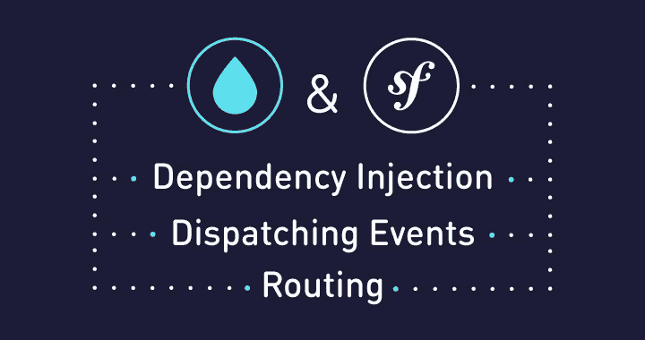

# Drupal 8 核心和 Symfony 组件

> 原文：<https://levelup.gitconnected.com/drupal-8-core-and-symfony-components-e5272561d304>

[由 ADCI 解决](https://www.adcisolutions.com/?utm_source=medium&utm_medium=referral&utm_campaign=medium-Drupal-Smf-adciwebsite&utm_term=-&utm_content=medium-Drupal-Symfony)

自从 **Drupal 8** 发布以来已经过去了很长时间。Drupal 没有仅仅使用面向钩子的范例和过程化编程，而是选择了一种集成流行技术和应用面向对象方法的方式。变更影响了几乎所有的主要部分——从核心功能到模板引擎。

将 **Symfony 组件**添加到 Drupal 8 对其开发影响最大。Drupal 变得比以前更加灵活。开发人员有机会利用现代技术和面向对象的编程风格。

本文重点讨论添加 Symfony 组件导致的公共核心功能的变化。在这里，您可以找到简化的代码示例，帮助您感受“清晰”的 Symfony 和 Drupal 8 解决方案之间的差异。对于你们中的一些人来说，这可能是更好地理解 Drupal 8 内部结构的关键点。

# Drupal 8 中的 Symfony 组件

根据 Symfony 文档，Drupal 8 包含以下组件:

*   类加载器
*   安慰
*   CssSelector
*   依赖性注射
*   事件调度员
*   HttpFoundation
*   HttpKernel
*   过程
*   按指定路线发送
*   串行器
*   翻译
*   验证器
*   Yaml

你应该明白这并不是一个完整的列表，因为 Symfony 社区并没有跟踪自 Drupal 8 发布以来添加到核心中的所有变化。然而，在这里我们可以看到，Drupal 核心的几个基础组件。我将讨论 DependencyInjection、EventDispatcher 和路由。Drupal 8 架构中最大的变化与这些组件的集成有关。

# Symfony 中的依赖注入和服务

在解释 **DependencyInjection 组件**时，不可能不提服务和服务容器主题。一般来说，服务是由服务容器管理的任何对象。服务容器是每个服务所在的特殊对象。这种方法使服务的使用更加标准化和灵活。额外的好处是，您可以获得一种优化的服务处理方法。如果你从不要求一项服务，它就永远不会被构建。服务只创建一次——每次请求时都返回相同的实例。

如果您在 Symfony 中有服务容器，您可以很容易地通过它的 id 获得服务:

要创建一个定制服务，您只需要将必要的代码(通常是您希望在应用程序中重用的代码)添加到一个新的类中。下面是这样一个类的例子。它包含了一个从数组中获取随机用户名的方法。

在 *services.yml* 文件中，您可以指定服务容器如何实例化这个服务类。在这里可以指定大量的参数。如需更多信息，您可以查看[本主题](http://symfony.com/doc/2.8/service_container.html)。

就是这样。您的服务具有唯一的密钥，它在服务容器中可用。在你的控制器中使用这个服务怎么样？

正如您可能看到的，使用定制服务和任何现有的服务没有区别。

现在我们可以讨论 DependencyInjection 组件本身了。它提供了几个有用的类来操作服务及其依赖项。让我们创建一个额外的服务来演示这个功能。

ContainerBuilder 类允许您将刚刚创建的类注册为服务。可以通过以下方式完成:

我们的目标是增加*彩票*和*奖品*服务之间的依赖关系。定义*奖*服务时，*彩票*服务还不存在。你需要使用*引用*类来告诉容器在初始化时注入*彩票*服务。

# Drupal 中的依赖注入和服务

Drupal 稍微扩展了这个方案。为了定义服务和附加参数，它使用了几个 yml 文件。核心服务在 *core.services.yml* 文件中定义。通过在各自的目录中创建*modulename . services . yml*文件，模块可以在容器中注册它们自己的服务。Drupal 使用 *ServiceProvider* 类(*CoreServiceProvider.php*文件)来注册核心服务。

该类包含 *register()* 方法，在该方法中，您可以从 DependencyInjection 组件中找到 *ContainerBuilde* r 类。其他模块应用相同的原则在服务容器中注册它们自己的服务。

# Symfony 中的事件和调度事件

调度事件系统由 **EventDispatcher 组件**提供。它包括三个部分:

*   Dispatcher —允许您注册新侦听器或订户的主要对象。
*   Listener 或 Subscriber —您需要连接到调度程序的对象，以便在调度事件时得到通知。
*   事件-描述事件的事件类。

让我们试着扩展前面的例子。假设您想在随机用户获奖时通知应用程序的其他部分。首先，您需要定义一个 dispatcher 对象，并将一个侦听器与这个 dispatcher 连接起来。

那么它是值得的照顾您的自定义事件。在创建第三方库时，或者如果您只是想使整个系统更具解耦性和灵活性时，会经常使用自定义事件。

现在，每个监听器都可以通过 *getPrize()* 方法访问 *Prize* 对象。在调度过程中，您需要为事件传递一个机器名。因此，*名*常量是在类内部定义的。

因此， *lottery.complete* 事件的任何监听器都将获得 *LotteryCompleteEvent* 对象。

在上面的例子中，我使用了 event listener 对象，但是，实际上，用 subscriber 对象替换它不成问题。侦听器和订阅者之间的主要区别在于订阅者能够将一组订阅事件传递给调度程序。订阅者实现了*EventSubscriberInterface*接口。它需要一个名为 *getSubscribedEvents()* 的静态方法。在此方法中，您应该指定一个事件列表。

# Drupal 中的事件和调度事件

关于调度事件机制，你不会发现在 Symfony 和 Drupal 8 中使用它有什么不同。在这里，我们只需要讨论在定制模块中使用这种方法，以及 Drupal 与调度事件功能相关的可能的未来计划。

要定义事件、调度程序和订户类，您需要执行以下操作:

1.  需要在模块根目录下的 *src/* 文件夹下定义*事件*类。例如，假设它是 *src/CustomEvent.php* 。这个类应该扩展 EventDispatcher 组件的*事件*类。
2.  您需要将该事件分派到某个地方，这取决于模块操作的逻辑。
3.  在 *src/EventSubscriber* 目录下，您需要创建一个事件订阅者类—*src/Event Subscriber/customeventsubscriber . PHP*。这个类必须实现*EventSubscriberInterface*接口。它还必须包含一个名为 *getSubscribedEvents()* 的静态方法，您需要在其中定义一个订阅事件列表。
4.  在*modulename . services . yml*文件中将事件订阅者标记为*‘Event _ Subscriber’*。您可以在 [Symfony 文档](http://symfony.com/doc/current/service_container/tags.html)中找到关于使用标签的必要信息。

这就是调度一些事件并对它们做出反应所需要做的全部工作。

Events 系统可以很好地替代 Drupal 8 从上一版本继承的 hook 范式。尽管许多部分已经使用事件进行了返工，Drupal 8 仍然使用钩子。有一些尝试是关于用事件代替一些众所周知的钩子。[钩子事件分配器](https://www.drupal.org/project/hook_event_dispatcher)模块是这种方法的一个很好的例子。

# Symfony 中的路由

根据 [Symfony 文档](http://symfony.com/doc/current/components/routing.html)，配置路由系统需要三个主要部分:

*   RouteCollection 包含路径定义
*   RequestContext —包含请求的必要参数
*   UrlMatcher —执行请求和单个路由之间的映射

这些都是来自**路由组件**的类。为了更好地理解，我们来看一个简单的例子:

另外一个重要的我没有加到上面列表的是*路由*类。它允许您定义一条路线。然后将每条路线添加到 *RouteCollection* 对象中。这个动作是通过使用 *RouteCollection::add()* 方法来执行的。

*UrlMatcher::match()* 方法返回指定路由的可用参数。如果没有这样的路由，将抛出*ResourceNotFoundException*。

要为某个路由生成 url，您需要使用 UrlGenerator::generate()方法。您可以将路由变量传递给此方法。例如，如果在路线中有一个通配符占位符，它会很有用。

除了使用这种方法来配置路由系统之外，还可以从多个不同的文件中加载路由。这里一切都依赖于 *FileLocator* 类。您可以使用这个类定义一个路径数组来检查所请求的文件。对于每个找到的文件，加载程序返回一个 *RouteCollection* 对象。

# Drupal 中的路由

一般来说，Drupal 8 使用与 Symfony 相同的机制来处理路由。路由组件取代了 Drupal 7 中的 *hook_menu()* 。请注意，路由系统不支持选项卡、操作和上下文链接的创建。因此，之前由 *hook_menu()* 处理的功能被其他子系统接管。

要创建一些路线，您需要在模块的 *modulename.routing.yml* 文件中定义它们。

在这种情况下，系统会检查对指定路径的访问权限。如果一切正常，它从控制器调用*MyRoutesController::content()*方法。

如果需要，您可以在路径参数中为您的路线指定一个通配符(也称为 *slug* )。只可能在斜杠之间或最后一个斜杠之后使用这样的通配符。

在上面的例子中，我们指定了*类别*通配符。让我们看看如何在控制器中应用这一点:

请务必使用与 path 参数中为通配符指定的名称相同的名称。根据变量的名称搜索相应的变量。它不依赖于变量的指定顺序。

除了创建您自己的路线，您还可以更改现有的路线。多亏了 *RoutingEvents::ALTER* 事件，这才成为可能。该事件在构建路线后触发。要使用该功能，您需要扩展 *RouterSubscriberBase* 类并实现该类的*alter routes(route collection $ collection)*方法。

# 结论

我们考虑了与 Drupal 8 中 Symfony 组件的存在相关的几个要点。当然，这并不是一个完整的列表，但是我认为这些组件在决定 Drupal 8 开发的主要方向方面发挥了关键作用。Drupal 变得更加灵活。现在甚至可以重新定义其核心的许多部分的行为。

使用服务和依赖注入可以让您的代码更加灵活，更容易重用。通过应用 DependencyInjection 组件，您有机会为您的类获得所需依赖关系的统一定义。挂钩部分被 EventDispatcher 组件中的事件系统所取代。它允许对应用程序不同部分之间的关系进行更多的控制。路由组件中的路由系统取代了 hook_menu()的功能。它变得更实用、更灵活、可读性更强。

正如你所看到的，Drupal 8 中的大部分解决方案都是基于前面提到的 Symfony 组件。Drupal 只是扩展了一些方法，在某些情况下，使它们更加灵活。所有这些都代表了为什么 Drupal 8 对 Symfony 开发者更有吸引力。基于这些事实，我们有充分的理由相信 Drupal 选择了正确的发展道路。期待看到未来版本的变化！

*原发布于*[*ADCI 解决方案网站*](https://www.adcisolutions.com/knowledge/drupal-8-core-and-symfony-components?utm_source=medium&utm_medium=referral&utm_campaign=medium-Drupal-Smf-knowledge&utm_term=-&utm_content=medium-Drupal-Symfony) *。*

**作者是 ADCI 解决方案团队负责人叶夫根尼·列昂诺夫**

展示项目中不同角色的同等熟练程度:从开发人员到团队领导。尽管 Evgeny 是一个丰富技术堆栈的专家，但他设法在弹吉他、学日语和健身之间保持平衡。

在社交网络上关注我们: [推特](https://twitter.com/ADCISolutions) | [脸书](https://www.facebook.com/adcisolutions/) | [LinkedIn](https://www.linkedin.com/company/adci-solutions/)

 [## Drupal 8 中的 OOP 以及如何使用它来创建自定义模块

### 我只有一年的 web 开发经验，尤其是 Drupal 7 的基础知识

code.likeagirl.io](https://code.likeagirl.io/oop-in-drupal-8-and-how-to-use-it-to-create-a-custom-module-1f371308e981)