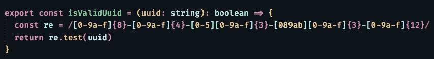
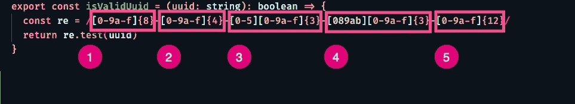
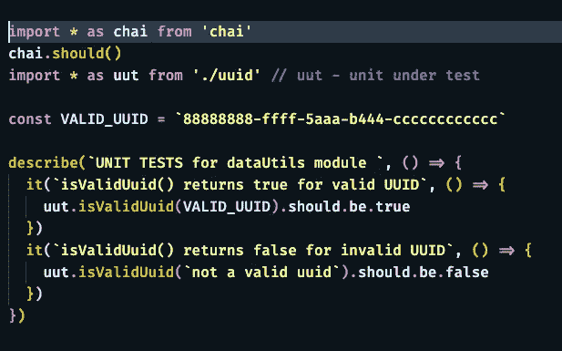
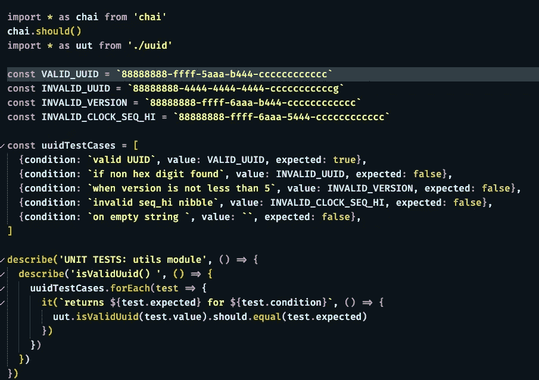
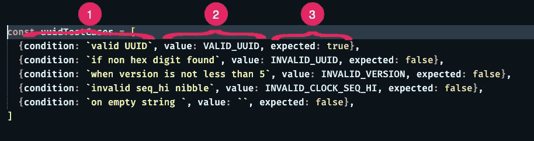
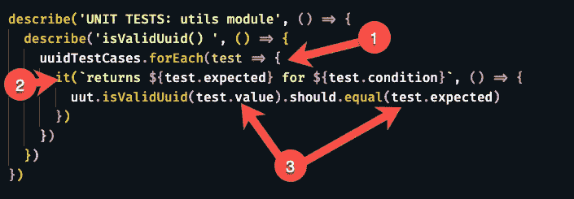
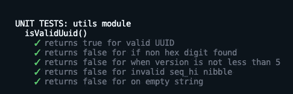

# 用动态测试来干燥你的单元测试

> 原文：<https://levelup.gitconnected.com/dry-your-unit-tests-with-dynamic-testing-d6df8c8bb83a>

## JavaScript 和类型脚本测试

## 动态测试很容易设置和理解，但是更高级的用法经常被忽略。

什么是动态测试？

动态测试很容易设置和理解，但是更高级的用法经常被忽略。在这篇文章中，我们将探索动态测试的基础，然后我们将继续讨论真正的回报；坚持不要在测试和你用于测试的数据中重复你自己(干)的能力。对于代码示例，我将使用 TypeScript 和 Mocha。

# 入门指南

Mocha.js 文档对生成动态测试的基础有一个简洁的概述。这个想法是，您要用简单的数据建立一个 JSON 对象数组，然后编写一个常规的 JavaScript 循环，其中包含一个或多个使用数组中每个对象的测试。这可能是您在正常代码中为避免重复而反复使用的模式。您也可以在几乎所有的单元测试中这样做！当您对一个被测函数进行多次测试时，最常见的就是这样做。您只需要函数输入和结果输出的数据，并且通常可以消除测试。举个例子吧。

# 测试舒适度

写完测试后能够放松

有时你只想确保任何可能出错的东西都经过测试，即使它不太可能出错。当我有测试中的边缘案例时，我开始对我的代码准备好了感到舒服。在这个例子中，我们将使用 UUIDs。UUID 有一个[详细规范](https://tools.ietf.org/html/rfc4122)，当使用 UUID 时，您可能需要确保您传递的值满足那些要求。对于正则表达式来说，这是一个很好的问题。这里有一个[方法，它使用正则表达式来验证 UUID](https://github.com/Rolias/blog-posts/blob/master/src/DRY-tests-pt1/uuid.ts) 。

isValidUuid 方法

## <sidebar title="”dissecting" this="" regular="" expression=""></sidebar>

如果不使用正则表达式，这个函数有点难以理解，所以这里有一个简单的概要。

带注释的正则表达式

下列各组(最后一组除外)后面必须跟一个连字符。

1.  允许 0 和 9(包括 0 和 9)之间的任何数字或 a 和 f(包括 0 和 9)之间的任何字母，也就是任何十六进制数字。它允许八个这样的。
2.  允许多四个十六进制数字。
3.  允许一个介于 0 和 5 之间的数字，后跟 3 个十六进制数字。
4.  允许 0 或 8 和 b 之间的十六进制数字，后跟三个十六进制数字。
5.  允许 12 个十六进制数字。

*如果想要更详细的解释，取正则表达式粘贴到一个* [*在线正则表达式分析器*](https://regex101.com/r/eyN89F/1) *。*

# 典型的湿法

这里有一个湿的  ，但是[完全可以接受的方法](https://github.com/Rolias/blog-posts/blob/master/src/DRY-tests-pt1/uuid-wet.unit.test.ts)，测试一个有效的 UUID，和一个无效的 UUID。

isValidUuid()方法的湿单元测试

这是可行的，但是它只包含两个测试用例:一个用于好的 UUID，另一个用于坏的 UUID，即一个简单的字符串。你或许可以想出更多的测试方法。然而，即使只有这两个测试，你也开始闻到重复的味道。有时候，在气味真正渗入你的代码之前，除臭更容易。这就是动态测试可以发挥作用的地方。

# 干法

这个版本的测试探索了 5 个条件，而不是 2 个，测试代码的长度只增加了一行，尽管我不得不添加测试数据。让我们从测试数据开始浏览这个例子。

isValidUuid 的单元测试的干版本

## 测试数据

带注释的测试数据

1.  属性允许我们给每个`it()`一个自定义名称
2.  `value`属性是被测单元的输入。
3.  从被测单元返回的`expected`值。

甚至在不理解测试代码的情况下，我怀疑你们中的许多人现在可以通过向这个数组添加额外的对象来编写更多的测试用例。但是，要成功实现动态测试，您确实需要理解代码，所以让我们来探索一下。

## 测试代码

干单元测试的代码部分

1.  测试代码现在在`it()`周围包装了一个标准的 JavaScript `foreach`语句，并使用变量名`test`传入我们测试数据的每一行
2.  `it()`的描述使用来自传递的`test`变量的`condition`字段和`expected`字段，给测试一个有意义的名称。
3.  被测试的方法从我们的测试数据中被传递给`value`字段，并且`should`断言针对数据中的`expected`值进行测试。

## 测试结果

干单元测试结果

动态测试结果同样具有表现力，只需要很少的输入。

# 摘要

一旦你理解并适应了这个习语测试，理解五个(或二十个)测试的认知负荷和理解一个测试的代价是一样的。复制和粘贴错误仅限于数据数组，在这里它们更容易被发现。为边缘情况和异常值添加更多的测试变得不那么痛苦了。没有编写代码的团队成员可以快速轻松地添加新的测试，而没有风险。

# 后续步骤

动态测试可以做的不仅仅是自动调用单个函数。你可以用单个测试阵列测试:

*   多重功能
*   带有匹配器的 expect 子句
*   解析函数特定结果的存根

*更有*[*JavaScript/TypeScript 测试*](https://gentille.us/b3601fb73472?sk=0dc73c81df810c0f181c432c9db3e085) *提示文章。*

平静地编码。

## 脚注

本文中显示的所有代码都可以在 GitHub 上的[公共存储库中获得。`npm run test:unit`将执行单元测试。](https://github.com/Rolias/blog-posts/tree/master/src/DRY-tests-pt1) [*回条*](https://www.medium.com/p/d6df8c8bb83a#208e)

湿:与无关的测试——因为世界需要更多的缩写。😎 [*回条*](https://www.medium.com/p/d6df8c8bb83a#030d)