# 使用 Ubuntu 双启动 Windows 10-Mission MSI

> 原文：<https://levelup.gitconnected.com/dual-booting-windows-10-with-ubuntu-16-04-mission-msi-1efd3e131dc>

## 拥有两种操作系统的最佳性能的完整指南。


L inux 是首选(也是我的最爱！)机器学习的操作系统。我决定在我的全新 MSI P65 Creator 8RE 上安装 Ubuntu 16.04 和 Windows 10，该产品配有 Nvidia GeForce GTX1060 图形处理器、16GB RAM 和 512GB SSD，以此开始我在数据科学领域的职业生涯。

我的目标是在享受 Windows 娱乐的同时利用 GPU 的能力。我一点也不知道我不得不花两个不眠之夜，再加上一些焦虑来完成这个。这并不像我想的那样容易。一路上，我不断出错，不得不在万维网上寻找解决方案。我希望有一个完整的博客记录整个过程。所以，在这里！

**第一部分:准备**

1.  准备回退(可选，但推荐):

*在硬盘上对 windows 10* 进行一次 [*完整备份，其中包括你的 windows 操作系统、应用、文件和你的设置。如果出了什么差错，但愿不会如此，这会拯救你的一天。*](https://www.windowscentral.com/how-make-full-backup-windows-10)

2.可引导 USB:

[*在笔记本电脑上下载 Ubuntu* 桌面](https://ubuntu.com/download/desktop) iso。你需要一个 4GB 的 u 盘来存储 Ubuntu iso 镜像。插入可启动的 USB 并将 iso 映像刻录到其中。

如果你希望使用 Pendrive，我建议使用能够创建可引导 USB 驱动器的 [*Rufus*](https://rufus.ie/) *，*开源软件。这里有一个快速的 [*指南*](https://tutorials.ubuntu.com/tutorial/tutorial-create-a-usb-stick-on-windows#8) 帮助你度过难关。

3.磁盘分区:

你应该为 Ubuntu 分配的硬盘大小取决于你的需求。如果你的笔记本电脑有额外的硬盘空间，你可以选择其中任何一个来安装 Ubuntu。如果没有，你可以继续使用 c 盘。

在 search charm 中输入**Create and Format Hard Disk Partitions**并跟随显示的结果。右键单击要使用的驱动器，然后单击[**s*h 链接卷***](https://smallbusiness.chron.com/hard-drive-shrinking-70583.html) 。这为 Ubuntu 安装创建了所需的*和*的*可用空间。*

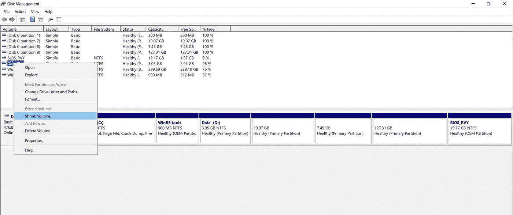

收缩卷以在磁盘上为 Ubuntu 安装创建可用空间

4.禁用 UEFI 安全引导:

安全引导防止引导未签名的操作系统。它只允许引导使用 UEFI 中存储的密钥签名的系统。但是，现代版本的 Ubuntu 将在启用安全引导的情况下正常引导和安装。禁用它比在安装过程中遇到问题更安全。

从搜索符进入**高级启动选项**，在**更改** **高级启动选项**部分，点击**立即重启**。

你会看到一个特殊的菜单，选择**故障排除>** **高级选项** > **UEFI 固件设置**。这将重新启动您的笔记本电脑，并带您到 UEFI 设置。

进入 UEFI 实用程序屏幕后，移动到顶部菜单的**安全**选项卡，使用箭头键进入**安全启动**选项，然后使用 **+** 或-将安全启动的值更改为**禁用**。如果在“安全”选项卡中没有找到，请在“启动”选项卡中查找。

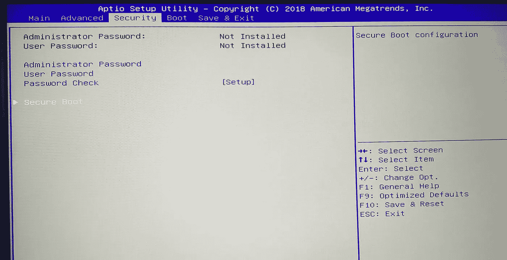

移动到安全选项卡，向下移动到安全引导，然后按 Enter 键

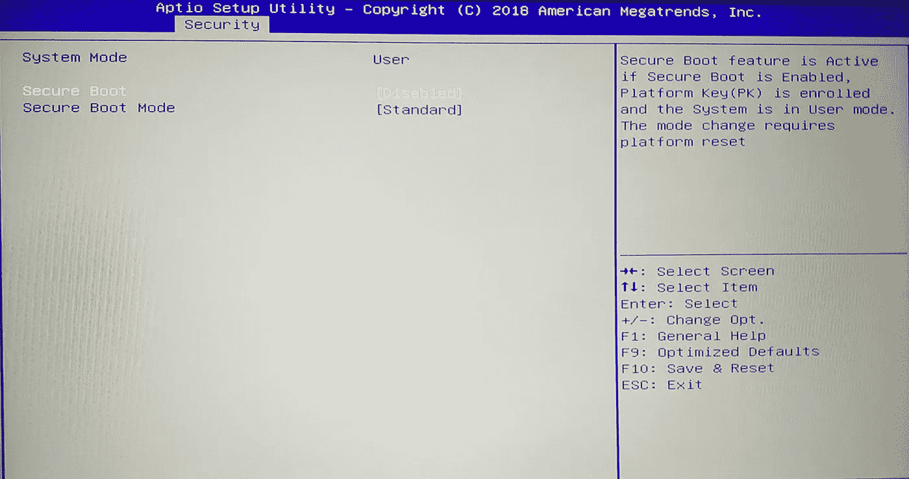

转到安全启动选项，按-禁用

5.禁用快速启动:

要禁用快速启动，在搜索符中键入**电源和睡眠设置**，并根据结果进行操作。选择屏幕右侧的**附加电源设置**链接。应该会出现“电源选项”窗口。点击**从左边的栏中选择电源按钮的功能**。向下滚动到**关机设置**和*取消勾选* **开启快速启动**。

**第二部分:安装**

现在您已经为安装做好了一切准备，**插入您在第 1 部分的步骤 2 中创建的 USB 引导棒**。

1.  从 Windows 中启动:

确保设备在启动时自动连接到互联网。从搜索符进入**高级启动选项**并选择**立即重启**。你会看到一个特殊的菜单，选择**使用一个设备。**

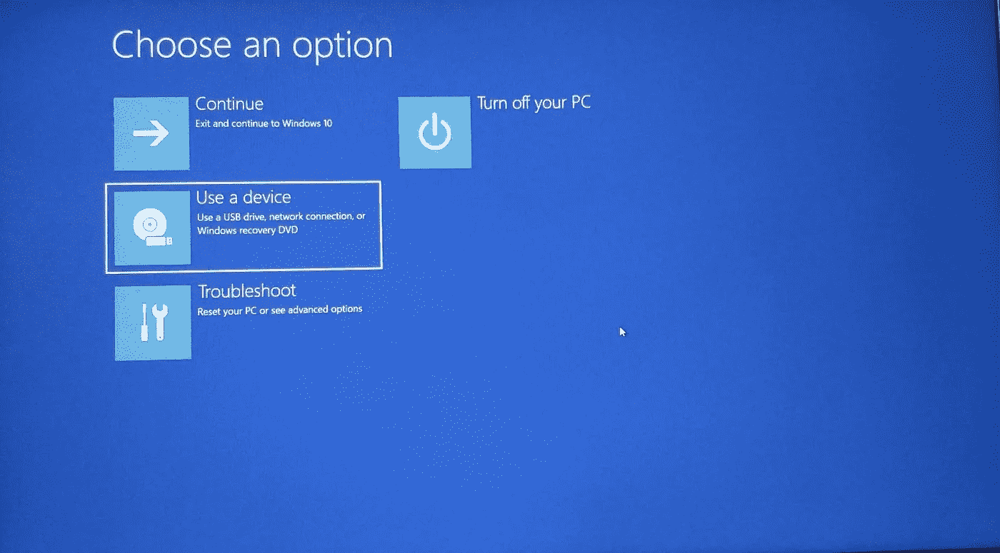

在启动菜单中选择使用设备

您的系统将重新引导并显示 grub 引导菜单。

2.避免可能的屏幕冻结:

在 grub 启动菜单中，向下移动到**安装 Ubuntu** 并按下**e****(不要按下*进入*，这可能会导致屏幕冻结)**

**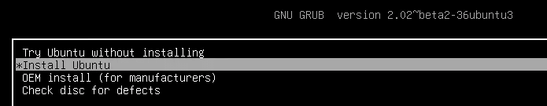**

**向下移动安装 Ubuntu，然后按 e**

**现在，找到以 *Linux* 开头的行，并在*安静飞溅*后添加 **nouveau.modeset=0** 。按下 **F10** 开机。这将禁用 Ubuntu 上 Nvidia GPU 的新驱动程序。**

**3.安装:**

**I)您将看到选择语言的选项。选择语言并点击**继续**。**

**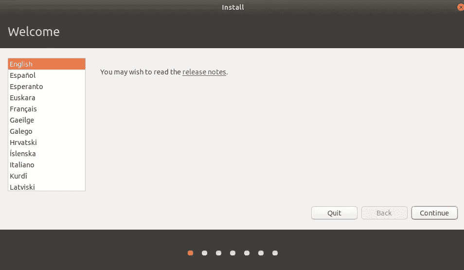**

**选择首选语言**

**ii)选择您喜欢的安装选项，点击**继续**。**

**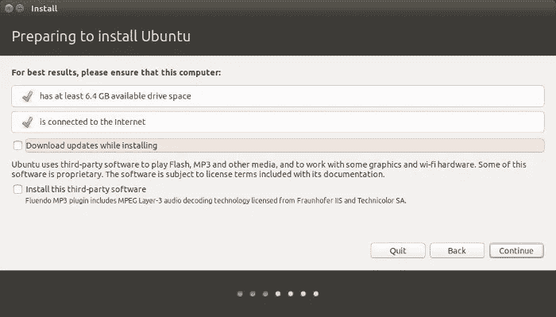**

**iii)现在您将看到一个**安装类型**的菜单。要在你的 Ubuntu 上手动分配磁盘分区，选择**其他**和**继续。****

**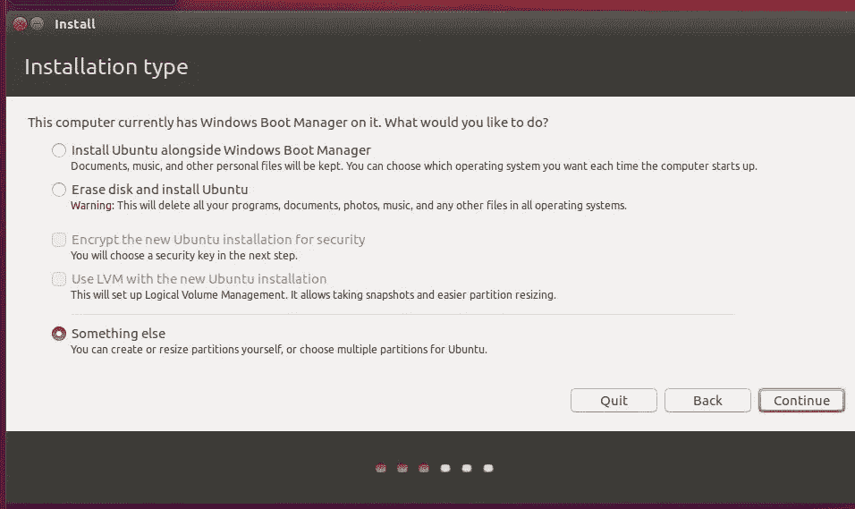**

**iv)现在，您需要为根目录(/)、主目录(/home)和交换内存分配空间。我们在第 1 部分的第 3 步中创建的空闲空间将会出现在这里。选择 **空闲空间**并点击`+`按钮。**

**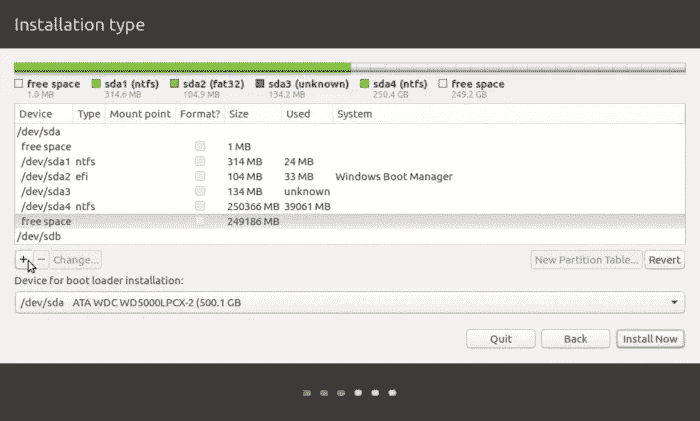**

****Root ("/")** :这是 Ubuntu 操作系统所在的位置。Nvidia 驱动软件很重，我更喜欢给操作系统分配至少 40GB 的空间来容纳安装后的驱动程序。尺寸以 MB((x)GB*1024)为单位**

**—新分区的类型:**主分区****

**—新分区的位置:**该空间的开头****

**—用作: **Ext4 日志文件系统****

****—** 挂载点 **:** **/****

**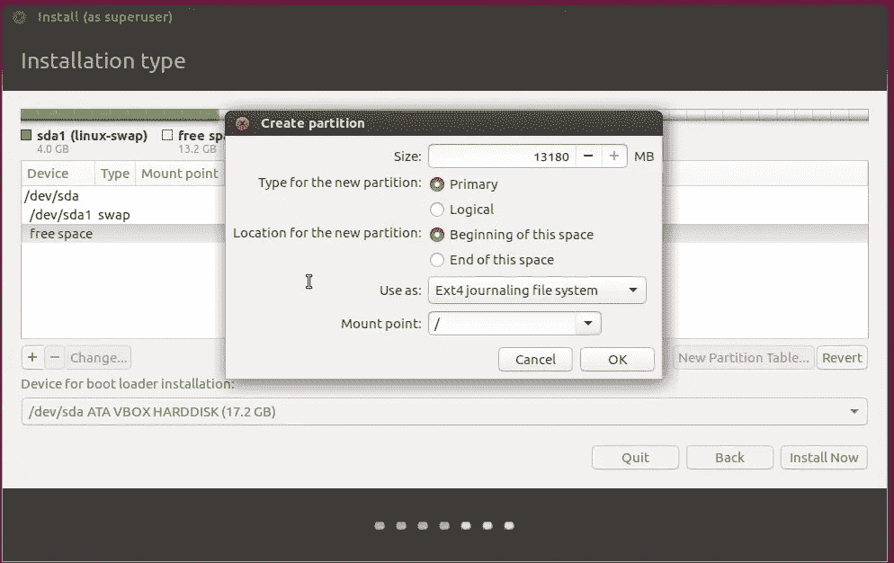**

****交换内存**:一个很好的老经验是分配两倍大小的 RAM 给交换内存。但这似乎不再适用，因为对于 16GB 的 RAM，分配 32GB 用于交换是对空间的浪费。为交换分配 4 到 8GB 的内存应该足够了。**

**再次选择空闲空间并点击`+`按钮。现在，键入交换区的大小并选择挂载点作为**交换区**。**

**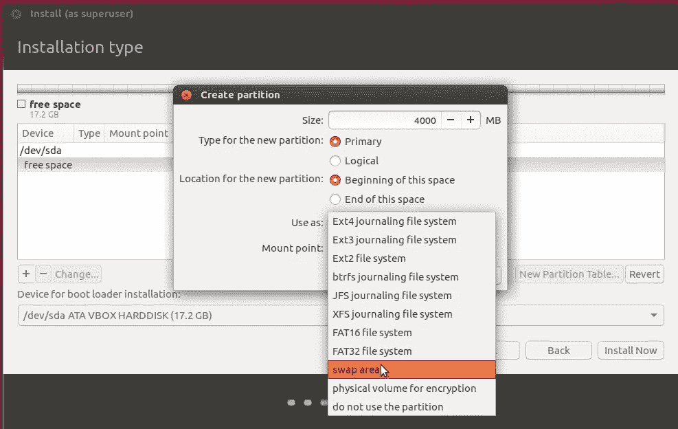**

**这里是你所有个人文件、文档、图片、视频的存放地。按照上述步骤将整个*空闲空间*的剩余部分分配到这个目录，挂载点为 **/home** 。**

**设置好三个分区后，点击**立即安装**。**

**v)将要求您设置用户名和密码。安装完成后，拔下可启动 USB 并**重启**您的设备。**

****第 3 部分:安装后****

**为了让 Ubuntu 使用你的 Nvidia 显卡，我们需要安装相关的驱动程序。如果没有这些驱动程序，Ubuntu 将继续使用 CPU 包中的英特尔处理器，而不是 Nvidia GPU。要安装它们，请打开终端(Ctrl+Alt+T)并按顺序运行以下命令。**

```
sudo apt update
sudo apt search nvidia-* <check which Nvidia version “xxx” is supported>
sudo apt install nvidia-xxx <Ex: “sudo apt install nvidia-384”
```

**安装 Nvidia 驱动程序后，通过在屏幕右上角的设置符号中选择**关于这台计算机**来确认 Ubuntu 是否正在您的设备上使用 Nvidia 显卡，它应该会更新到您设备上的显卡。**

**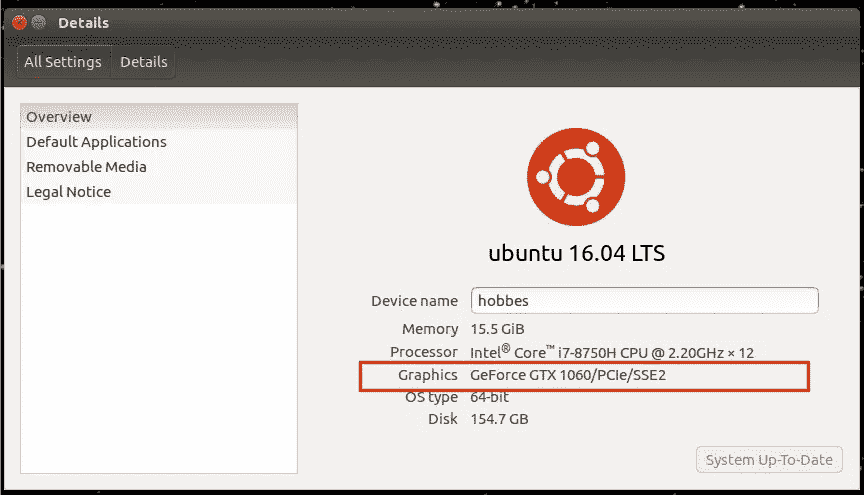**

**问题 1:**

**如果 grub 引导加载程序没有向您打招呼，而是直接进入 Windows，请在 UEFI 设置中设置引导顺序。在 Windows 上，进入**故障排除>** **高级选项** > **UEFI 固件设置**。这将重新启动您的笔记本电脑，并带您到 UEFI 设置。移至**引导**选项卡，在**引导选项优先级**下，将 Ubuntu OS 移至引导选项#1。**

**希望这有助于某人顺利安装。随时欢迎反馈。感谢阅读！**

**如果你想过来打个招呼，请在 LinkedIn 上联系我。**